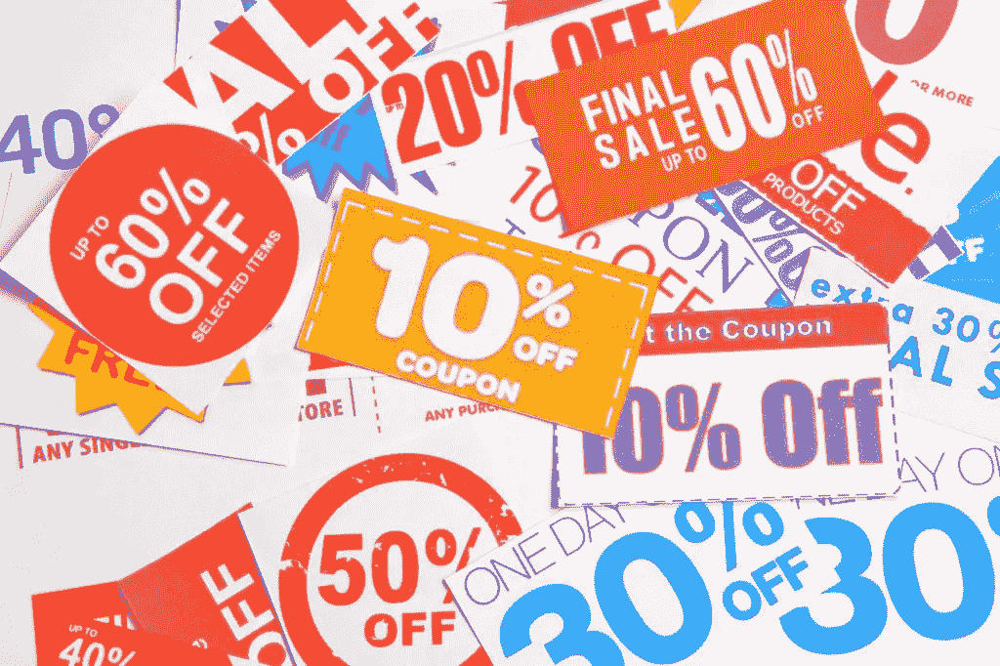
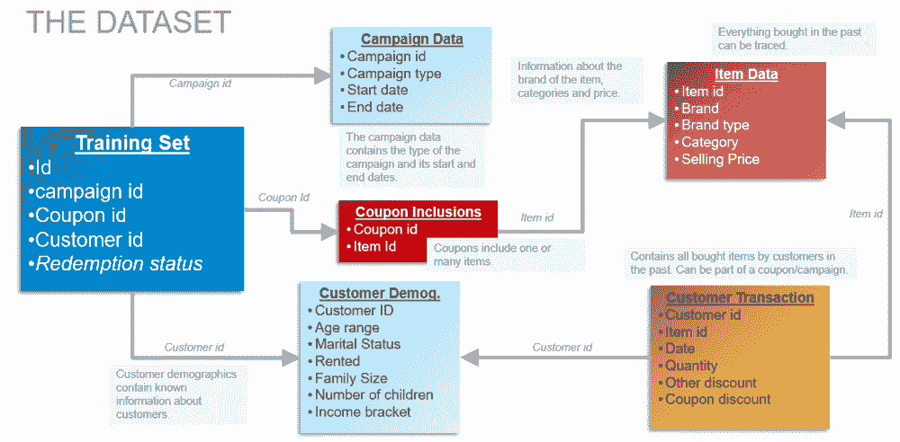
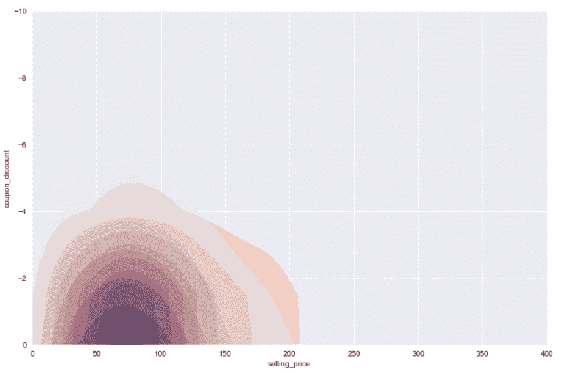
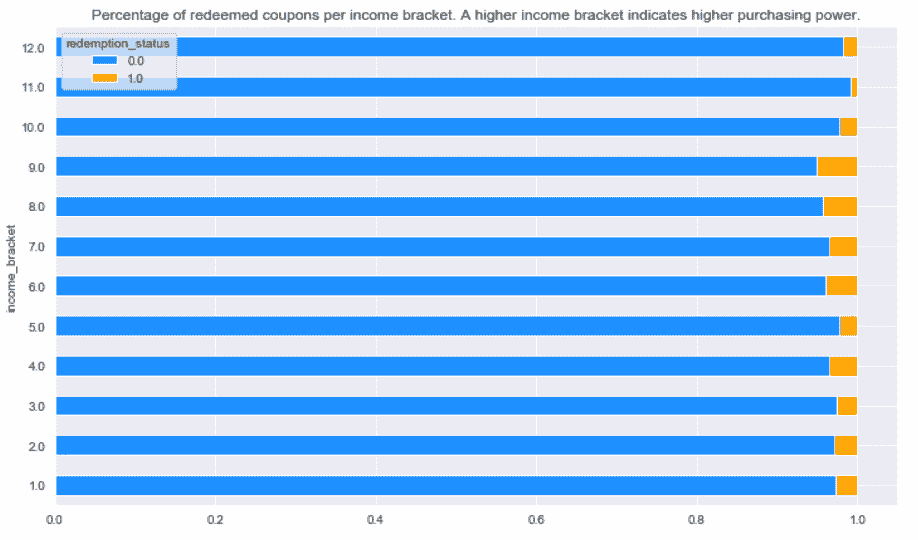
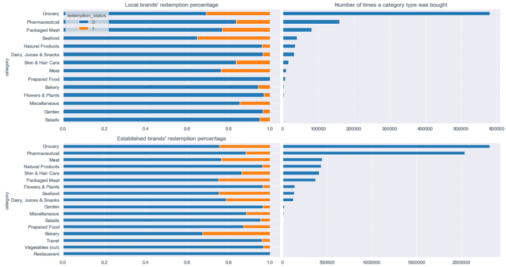
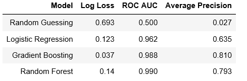
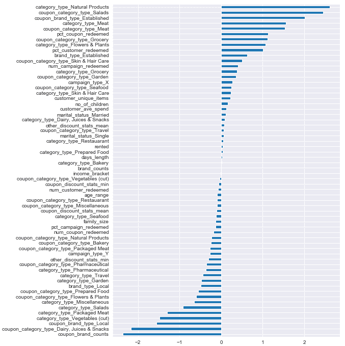
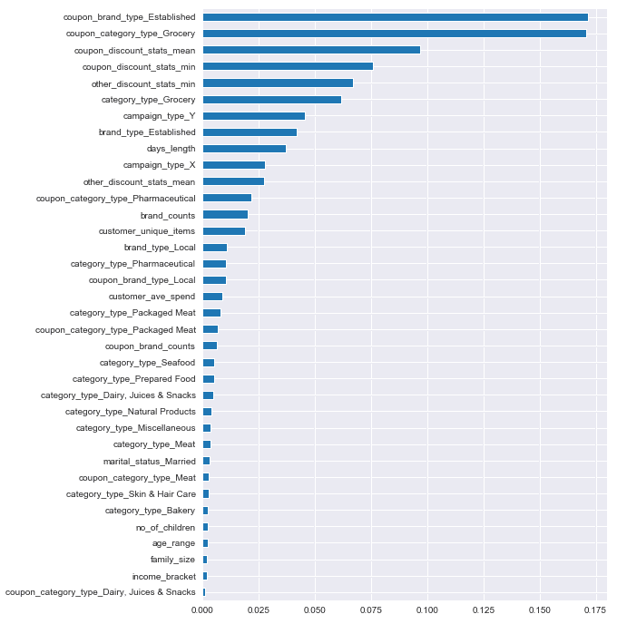

# 模拟我自己的竞争:优惠券兑换

> 原文：<https://towardsdatascience.com/simulating-my-own-competition-coupon-redemption-4282c28d6036?source=collection_archive---------29----------------------->

## 作为游戏大师，我把问题设定为:预测哪些顾客会在特定活动下兑换优惠券。

我的雇主举办了一次数据科学黑客马拉松，我是游戏大师。这是我和同一所学校组织的第二次黑客马拉松，和第一次一样，这是一次班级内的竞赛。赛克斯·ADMU 数据科学黑客马拉松第二届于去年 2 月 1 日至 2 日在 Rizal 图书馆结束。

作为这次活动的游戏大师，我有幸创建并主持了 Kaggle 竞赛，这将是学生们的习题集。一个引导板会让学生们的答案相互竞争，当时间流逝时(第二天)，就是数据讲述时间了。这是机器学习和商业领域知识的结合。我设定的任务是:预测哪些顾客会在特定的活动中兑换优惠券。这在电子商务中非常重要，因为可以使用特定的活动方法和优惠券促销为客户群重新注入营销活力。这三个 id，我们的客户，优惠券和活动组成了我们的*三胞胎*。这篇文章是关于我的解决方案的。

会买哪个券？谁会买？图片来源:[https://digitalmediathougts . com/89624-the-complete-guide-to-master-coupon-marketing/](https://digitalmediathoughts.com/89624-the-complete-guide-to-master-coupon-marketing/)

[和往常一样，如果你只是想跳到我的解决方案](https://github.com/krsnewwave/coupon-redemption)，这里有 Github 的链接。我们开始吧！

# 数据和初步想法

该数据集包含所有客户的商品交易，无论优惠券是否已被兑换。令人兴奋，所以我可以做一个推荐引擎。然而，我开始看到我推荐的这个正在进行的事情就像在每一个钉子上施加一个锤子。因此，让我们从特征工程的角度来看这个问题。我们应该从几个角度对数据的行为有一个细致入微的理解。开始一些探索吧！

# 探索性数据分析

少数优惠券主宰了这些数据，这是许多电子商务应用程序的标准。在 200 多张优惠券中，只有 5 张优惠券的兑现率超过了 50%。作为游戏大师，我创造了“仅流行优惠券”作为基线非 ML 解决方案。仅将前 10 张优惠券标为“总是兑现”就能让参与者净赚 0.87 AUC。然而，这里有一个明显的抽样问题。如果发现了一个新的优惠券，它不在训练数据中，那么我们就完全被难倒了。在现实世界中，高管们期待新的东西——他们不太可能被包含相同的旧促销优惠券的演示所购买！“给我一些新的东西”是许多专业人士害怕的…

我想找到可概括的特征。我想把优惠券的特点，如活动，客户，交易和项目的特点。例如，这里有一些有趣的事情:

# 不同类别之间的折扣和售价比较

折扣和售价本身当然很重要。这很难进行简单的分析，因为一张优惠券适用于几种商品。所以我不知道，从这个图来看，赎回的和未赎回的三胞胎看起来没有区别。橙子是赎回的三胞胎，而紫色(蓝色和红色混合在同一空间)在中间。但是，平均折扣和最低折扣在统计上有所不同。赎回的三胞胎的最低折扣更高，因为这是一个很低的底线。低折扣，耶！非直觉地，未赎回的三胞胎的平均折扣略高，可能是因为一些客户发现其中的一些项目令人生畏。

# 每个收入等级的兑现优惠券

这里有一个简单的。更高的收入等级表明更倾向于为我们的三胞胎兑换优惠券。然而，最高的两个括号似乎是最不感兴趣的。优惠券？多平民啊！

# 品牌和类别兑换百分比

当我们转向类别和品牌时，我们看到无论是本地品牌还是老牌品牌，食品杂货和药品都是最受欢迎的。对于本土品牌，顾客会寻找包装好的肉类和海鲜，因为前者容易买到，而后者可能比进口的更新鲜。老牌品牌，几乎所有的东西都依赖于食品杂货和药品，这两者在所有商品组合中所占的比重更大。

我们放大已建立的品牌。如果优惠券上有一个知名品牌，而顾客以前也买过这个知名品牌，那么这就是天作之合。如果是食品杂货/药品，还有额外的奖励。这很难想象，但是原则应该是有的。

结论:非线性模型效果最好。根据我们对类别和品牌类型的发现，顾客和商品应该对同一件东西有兴趣。

# 建模运行

当然，不要太关注模型的运行，因为它们应该很简单。要记住的唯一明智的事情是，由于这是一个非常倾斜的数据集，因此类权重或损失函数、度量和训练方法应该考虑这种倾斜。

*   为了速度，我跳过了超参数优化。
*   此外，在我们的测试中，阴性样本与阳性样本的比例非常不均衡(15009 个阴性样本— 423 个阳性样本)。

# 逻辑回归系数

这里是线性分类器的系数。它受到可实现的数据分离超平面的限制，这就是为什么它分别关注天然产品、沙拉、知名品牌、乳制品等。

# 随机森林要素重要性

然而，非线性集合模型才是王道。这里我们看到了随机森林分类器的特征重要性。在顶部的特性中，我们看到了预期的 coupon _ category _ type _ 杂货(优惠券中适用的杂货项目的数量)和 category _ type _ 杂货(客户过去购买的杂货项目的数量)。优惠券、类别功能和一堆我们在 EDA 中没有发现的其他东西之间存在联系，例如活动类型和优惠券中包含的品牌数量。

# 总结词

在这方面还有更多事情要做。用于压缩用户项目矩阵的 PCA 应该工作得很好。因此，这是推荐引擎之路，所以不妨再次提及。向用户推荐商品是一回事，所以我们推荐对该商品有最大折扣的优惠券是个好主意。

如果你已经走到这一步了，我想为获胜者欢呼。那是 Hakuna Matata，随机森林和团队。适合()。**我应该说我自己的解决方案在私人排行榜上被团队超越了。根据 AUC 拟合()。** GGWP。数据科学社区再见！

[归功于我在 Kaggle](https://www.kaggle.com/bharath901/amexpert-2019) 找到的原始数据集。当我看到缺少正面的例子时，我将创建的伪标签带到测试集来扩展训练集。这些伪标签来自超参数优化的随机森林模型的第 90 个百分位数的概率。

【http://itstherealdyl.wordpress.com】原载于 2020 年 2 月 9 日**。**