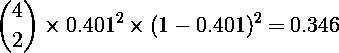

# 在策略游戏中模拟瘟疫感染

> 原文：<https://towardsdatascience.com/simulating-plague-infection-in-a-strategy-game-8e81030abf86?source=collection_archive---------59----------------------->

## 用二项分布逼近回合制策略游戏的概率

[疾控中心](https://unsplash.com/@cdc?utm_source=unsplash&utm_medium=referral&utm_content=creditCopyText)在 [Unsplash](https://unsplash.com/s/photos/infection?utm_source=unsplash&utm_medium=referral&utm_content=creditCopyText) 拍摄的照片

概率可能很难计算，尤其是在复杂的情况下。解决这个问题的一个方法是将概率情况转化为代码。通过多次运行这个代码，我们可以近似地计算出某个结果的概率，而不必直接推导出来。这是一个**模拟**，在处理大量问题时非常有用。

最近一个朋友来找我，提出了这样一个问题。受到禁闭的启发，他正在为一款回合制策略游戏设计一个 mod，该游戏将疾病作为游戏机制引入。前提是沿着固定路线旅行的商人(游戏中的角色)有很小的几率在每次旅行中感染瘟疫。一旦被感染，他们会将疾病传播到他们到达的下一个城市。之后，他们恢复健康，再次踏上旅程。

如果你曾经玩过《文明》系列的游戏，或者类似的游戏，你可能会在脑海中想象出这个游戏的样子。

在这个场景中的每个回合，交易者都会遇到两种情况中的一种；他们要么被感染，要么保持健康。如果感染的概率在交易者的旅程中保持不变，那么感染变量就是**二项式**。二项式随机变量包含在二元结果的情况下，在 *n* 次试验(交易者旅程中的回合)中成功的次数(在我们的例子中是感染)。

# 简单的问题

鉴于上述情况，我朋友的问题如下。如果去一个城市的旅程持续 10 回合，并且每回合有 5%的机会让一个单位感染瘟疫，那么这个城市被感染的概率是多少？

有一个简单的答案。如果每个回合感染瘟疫的几率是独立的，那么上面的概率是 1 - (1 - 0.05) ⁰ = 0.401。

也就是说，我认为他描述的情况也可以模拟。为此，我想出了以下 R 代码:

我的方法很简单。我从二项分布 *B* ( *n* ， *p* )中抽取每一轮的结果，其中 *p* 是每一轮被感染的概率。我在 R 中使用`rbinom(10, 1, 0.05)`对此进行了编码，它返回一个 1 和 0 的向量。将每个 1 解释为感染，将每个 0 解释为避免感染，我们可以模拟交易者在交易过程中的感染状态。

这让我们来回答我们的问题。我们可以编写一个函数`journeysim`来调用`rbinom`并评估在 10 个模拟回合中是否有“1”出现。如果是这种情况，那么我们可以假设我们模拟的贸易路线末端的城市被感染了，然后返回`TRUE`。如果没有，函数返回`FALSE`。

然后我们运行`journeysim`很多次。我选择了 100000，以可接受的精度水平来结束概率估计。然后，我们对 100000 次运行中的`TRUE`元素的数量求和，并除以 100000。这将给我们一个非常接近的答案，0.401。

# 更复杂的问题

上面的问题可能看起来微不足道，但它是对模拟逻辑的介绍。为了更进一步，我们可以看一下前面问题的一个稍微复杂一点的扩展。

让我们假设这一次，这些单元做了一个多站的旅程。他们在四个城市停留，从一个城市到另一个城市转 10 圈。每回合感染概率保持在 0.05。假设同一个交易者可能不止一次感染鼠疫，那么在这段旅程中的任何一点上，两个城市同时被感染的概率是多少？

这仍然可以用手算出。首先，我们用 1 - (1 - 0.05) ⁰ = 0.401 来计算交易者将瘟疫传播到某个城市的可能性。接下来，我们可以将旅途中任何两个城市被感染的概率表示为

但是再一次，我们可以模拟这个问题。这一次的 R 代码如下。

为了获得这个新旅程的值，我们编写了新的函数`long_journeysim`。这使用 10 作为旅程长度参数调用了`journeysim`四次(对应于问题中的四个城市)。然后它检查这些城市中是否有两个被感染，并返回`TRUE`或`FALSE`来表示这个结果。像以前一样，我们用`map_dbl`运行`long_journeysim` 100000 次，然后将返回`TRUE`的运行次数除以总运行次数。这接近正确概率 0.346。

# 计算量大的问题

虽然上面的例子比第一个要复杂一点，但是手工计算还是很容易的。那么有没有这样的情况，模拟是一种更必要的方法，而不仅仅是一种获得近似答案的替代方法？让我们举下面的例子。

假设你的交易者不得不走任意长的路。假设现在每个城市的旅行时间是 112、73、187 和 144 转，而不是 10 转。每回合感染的概率现在是 0.01，你要找出沿途 1 到 3 个(含)城市中任何地方被感染的概率。

这个问题的答案涉及到大量繁琐的组合学和额外的计算。然而，它只涉及修改我们先前模拟的一些细节，以接近正确的答案。

模拟到每个城市的旅程的函数`adv_journeysim`对决定其输出的条件语句做了一点修改。这一修改意味着，如果沿途总共有 1、2 或 3 个城市被感染，则函数返回`TRUE`，如果没有，则返回`FALSE`。现在剩下的就是使用`map_dbl`运行函数，调整`journeylengths`参数来表示我们到每个城市的新旅程。在运行这个并将`allsims`中的`TRUE` 元素的总和除以`allsims`的长度后，我们得到一个近似的答案 0.766。

这是一个问题的例子，它变得比手工解决问题更直观。与其在纸上计算如何处理问题的多个新变化，不如用功能代码来近似解决方案更容易。

二项式概率随处可见。当你抛硬币，玩回合制策略游戏，或参与任何数量的其他活动时，二元结果是预期的。因此，当计算出一个精确的概率很复杂时，能够快速简单地模拟这些结果是非常有用的。

只要你能在代码中重现一种情况，近似概率就变得直观了。

想阅读我所有关于统计学、数据科学等方面的文章吗？在[这个链接](https://medium.com/@roryspanton/membership)注册一个媒体会员，就可以完全访问我所有的作品和媒体上的所有其他故事。这也直接帮助了我，因为我从你的会员费中得到一小部分，而不需要你额外付费。

每当我通过[订阅这里](https://roryspanton.medium.com/subscribe)发帖，你也可以将我所有的新文章直接发送到你的收件箱。感谢阅读！