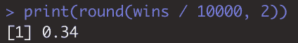
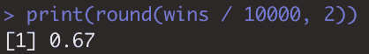

# 模拟概率|解决经典的蒙蒂霍尔问题

> 原文：<https://towardsdatascience.com/simulating-probabilities-solving-the-classic-monty-hall-problem-98454565b9bc?source=collection_archive---------34----------------------->

## Monty Hall 提出了一个概念上令人困惑的问题，使用模拟我们可以实时验证这一现象


图片来自[皮克斯拜](https://pixabay.com/?utm_source=link-attribution&utm_medium=referral&utm_campaign=image&utm_content=1587329)

# 介绍

在本帖的过程中，我们将学习如何使用模拟来理解概率，我们将使用 Monty Hall gameshow 问题的经典示例。

Monty Hall 有一个游戏展示，他展示了下面的问题。如果你不熟悉他或他们的游戏，它在 2008 年的 21。无论如何，如果你不熟悉这里的问题。

# 蒙蒂·霍尔问题

他会给他的参赛者三扇门来选择。两扇门后是山羊…但其中一扇门后是一辆跑车。

假设节目里的人是你。蒙蒂让你选择一扇门，如果你是正确的，你就可以得到这辆车。

现在你问自己，任何一扇门后面有车的可能性有多大？

你我都知道，不管你选哪个门，你都有 33.3%的几率拿到车。

因为没关系，假设你选 1 号门。但是在他揭示后面是什么之前，他阻止了你，并且揭示了一只山羊坐在剩下的两扇门的后面。(如果他们中的一个真的有车，他总是知道谁有羊)

他现在问你，你是坚持原来的选择，还是换到另一扇没打开的门？

典型的想法是，这仍然无关紧要，因为你现在有 50%的机会选择后面有车的门；然而，现实情况是，实际上有 66.7%的可能性汽车在另一扇门后。分配给其他两个门的概率现在浓缩为一个门，因为您知道汽车不在其中一个门的后面。

从概念上讲，这是一件很难理解的事情，我们不会花更多的时间试图从概念上说服你为什么。从这里开始，我们将模拟这个游戏，观察不同场景下的概率。

让我们把这个游戏转换成一些代码，我们可以重复运行数千次，以确定可能性。

# 让我们开始编码吧

重要的事情先来。让我们考虑一下系统地解决这个问题所需的不同变量或占位符。

我们需要包括以下内容:

*   门
*   获胜之门
*   首选
*   显露的门
*   最终选择

## 门

好了，让我们开始创建一个矢量来代表门。

```
doors <- c(1,2,3)
```

很容易..向量有三种不同的选择。

## 获胜之门

现在让我们随机选择哪个门有车。sample 函数将获取你传递给它的任何向量的 n(大小)。在这种情况下，它将从 doors 中提取 1、2、3。

```
winning_door <- sample(x = doors, size = 1)
```

## 首选

正如我刚才提到的，现在是你选择哪扇门的时候了。如果你真的想玩这个游戏，你可以这样设置，问你想要三扇门中的哪一扇门。

```
which_door <- function(){
  door <- readline("1, 2, or 3?")  
  return(as.numeric(door))
}
first_choice <- which_door()
```

但是我们会在 for 循环中一遍又一遍地重复这些步骤。因此，我们不会每次都强制手动输入，而是将第一选择声明为 1 号门。

```
first_choice <- 1
```

## 显露的门

我们现在需要确定我们的程序将揭示剩下的两扇门中的哪一扇门。我们知道蒙蒂会选择剩下的两扇门中的一扇。

让我们想想这些案例:

*   在你选择了汽车的情况下，剩下的两扇门后面都有山羊——所以没关系
*   如果你选择了一只山羊，你只需要确保你选择的门不等于你刚才取样的获胜门。

我们将把它写成 if 语句。

因此，正如我们刚刚讨论的，如果获胜的门是第一选择，则在移除 first_choice 后对门向量进行采样。如果不是这样，那么从 doors 向量中删除 winning_door 和 first_choice，剩下的唯一选项将是剩余的山羊。

```
if (winning_door == first_choice){
    revealed_door <- sample(x = doors[-c(first_choice)], size = 1)
  } else {
    revealed_door <- doors[-c(first_choice, winning_door)]
  }
```

## 最终选择

类似于我们刚刚做的，让我们假设在任何情况下，我们都将固执地坚持我们的门。我们要抵制智慧，追求智慧。

```
final_choice <- first_choice
```

如果你想在我们采纳明智的建议时看到结果，你可以使用这段代码。

```
final_choice <- doors[-c(first_choice, revealed_door)]
```

# 把所有的放在一起

让我们来看看目前为止我们设置的所有内容。

我们会声明刚刚经历过的变量。我包含了 final_choice 的两个版本，但是注释掉了第一个版本。

我在这里添加的最后一部分是一个条件输出，如果你赢了就说万岁，否则就享受你的山羊。

```
winning_door <- sample(doors,1)
first_choice <- 1
if (winning_door == first_choice){
  revealed_door <- sample(x = doors[-c(first_choice)], size = 1)
} else {
  revealed_door <- doors[-c(first_choice, winning_door)]
}
#final_choice <- doors[-c(first_choice, revealed_door)]
final_choice <- first_choice
if(final_choice == winning_door){
  print('brand new car')
} else {
  print('have a goat')
}
```

# 模拟时间

这是一个坚实的开端，但实际上，我们不会一遍又一遍地记录结果。技术上我们可以，但我们肯定没有必要。

我们只需要做一些编辑。

首先，让我们将代码嵌套在一个 for 循环中，这样我们就可以按顺序一遍又一遍地运行它。

```
for(i in 1:10000){
}
```

这将瞬间重复这个过程 10000 次，但是我们真的想打印结果吗？我们真正想做的是记录结果，将它们存储在某个地方，以便我们可以收集我们正在创建的信息。

我们需要一个计数器。

```
wins <- 0
```

这不会嵌套在 for 循环中，因为我们不希望计数器在每次运行下一条记录时都回到 0。

我们将在 for 循环中包含每次运行结束时的考虑，“我们赢了吗？”如果是这样，我们将 win 计数器加 1。

```
wins <- wins + 1
```

这是全部组装好的。

```
wins <- 0for(i in 1:10000){
  winning_door <- sample(doors,1)
  first_choice <- 1
  if (winning_door == first_choice){
    revealed_door <- sample(x = doors[-c(first_choice)], size = 1)
  } else {
    revealed_door <- doors[-c(first_choice, winning_door)]
  }
  # final_choice <- doors[-c(first_choice, revealed_door)]
  final_choice <- first_choice
  if(final_choice == winning_door){
    wins <- wins + 1
  }
}
```

现在我们已经有了获胜的次数，是时候看看如果你拒绝改变选择，你会赢的几率有多大了。

```
print(round(wins / 10000, 2))
```



因此，最初分配给三个选项中的一个选项的概率是 34%,而不是你最初认为的 50%。

如果我们再次转换我们的决策，我们可以看到概率是 67%，不是 50%，不是 33%。



# 结论

我希望你发现这个关于 Monty Hall 游戏的快速课程很有见地。当我们使用这些原则来为一个游戏建模时，我希望你能识别出可供选择的场景，让你以有意义的方式为概率建模。

欢迎访问我的 Twitter @ data _ lessons。

祝数据科学快乐！