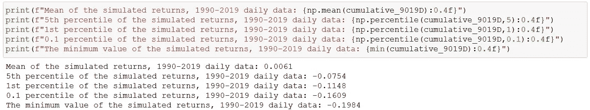
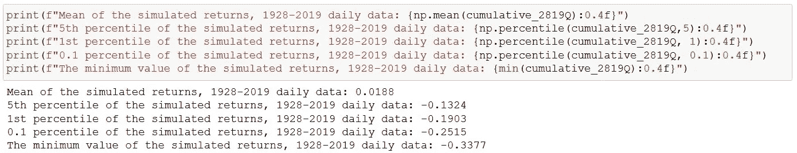

# 模拟股票市场回报和崩盘风险

> 原文：<https://towardsdatascience.com/simulating-stock-market-crash-risk-85aae5abb197?source=collection_archive---------36----------------------->

## 在数据世界里争吵

## 依赖历史每日回报统计数据可能会对标准普尔 500 指数中的提款风险做出错误的推断

对于数据科学家来说，金融市场是一个快乐的聚宝盆，源源不断的数据源源不断。然而，这种诱惑对于不谨慎的人来说可能是一首警笛，因为金融市场的统计数据是不稳定的，不可靠的。通常它们看起来几乎是正常的(就像在分布中一样)，但是看起来坚固的地面可能会迅速溶解成流沙，就像今年早些时候看到的那样。

世界上最重要的**股市指数**是 ***S & P 500 指数*** (SPX)，它被广泛认为是整个美国股票市场，甚至是美国经济状况的晴雨表。在截至 2020 年 3 月 23 日的 23 个交易日里，随着世界陷入新冠肺炎疫情的掌控，SPX 遭遇了灾难性的暴跌**-33.9%**。

**在 1928 年至 2020 年的 23 个交易日中，排名前 10 位的 SPX 指数暴跌**

这一-34%的跌幅是 1926 年推出的 SPX 历史上十大 23 天跌幅之一，仅次于预示大萧条的波动性。对许多交易者来说，这种经历就像遇到了只存在于古代民间故事中的神秘怪物。但即使在更近的时代，这种崩溃也确实是一种持续的风险，2020 年的经历在规模上并不落后于 1987 年 10 月经历的衰退。

我将尝试使用 SPX 从 1928 年到 2019 年的长期历史数据，模拟 SPX 中大约 30%的下跌的 ***事前*概率** **。为了确保这是真正的*事前*，不会使用 2020 年的数据。在整个练习中，我交替使用术语“股票市场”和 SPX。为了简单起见，我将使用**简单的百分比回报**，而不是学术文献中典型的对数回报。**

在做这个练习的时候，我还会演示股票市场收益是**非正态分布的**，而且大部分是用图片来演示的。此外，我将展示如何使用历史每日回报数据提供关于潜在股票市场回报的方差或范围的误导性推论。一个日历月平均有 **21 个交易日**，我将比较不同月份(和季度)的模拟回报与模拟每日回报的汇总回报有何不同。

# 波动聚类

尽管 SPX 在 1957 年才扩大到涵盖 500 只股票，但它已有近一个世纪的历史。从 1927 年末开始，通过*彭博*订阅，可以获得每日回报数据。我在这项研究中使用的历史价格和回报数据来自【1928 年 1 月 1 日至 2019 年 12 月 31 日。

**退货折线图**

上面的图表显示了 1928 年至 2019 年期间的**日回报率**(左)和**日历月回报率**(右)。当你仔细阅读这些图表时，有三个重要的特征需要注意。**首先是**，它们显示日收益率和月收益率都围绕一个均值波动(日收益率约为零)，因此收益率数据乍一看似乎是稳定的或均值回复的。**其次**，它们显示了**波动聚集**的证据，即较大的绝对收益往往被聚集在一起，较平静的时期也是如此。

伟大的伯努瓦·曼德尔布罗在 1963 年首次注意到了这种波动聚集现象，当时他指出，“大的(价格)变化往往会伴随着大的变化，无论是哪种符号，小的变化往往会伴随着小的变化，”尽管这一现象随后被研究人员忽视了 20 年。

**第三点**，与每日序列相比，月度回报数据中的波动聚集现象似乎不太明显。稍后我将回到这个非常重要的波动聚集现象。

# 总体常态

从 1928 年至 2019 年样本期的**平均日收益率**为+0.0294%，而**平均日历月收益率**为+0.6172%。这与一个月平均(大约)21 个交易日的平均日回报率相一致。因此，从每天到每月的合计是正确的。

**返回直方图图表**

以上是**日回报**(左)和**日历月回报**(右)的直方图。如果你仔细观察，日线回报直方图相对于月线回报直方图有一个更尖锐的峰值和更长的左尾巴。这就是**总体正态性**(或总体高斯性)现象，收益的分布随着收益时间尺度的延长而变得更加正态分布。换句话说，**不同时间尺度的收益分布是不一样的**。

**股市收益中的“肥尾”**

日收益率和月收益率序列的**过度峰度**和**偏斜度**的正式度量结果如上。正态分布的过度峰度和偏斜度为零。当过度峰度介于+2 和-2 之间时，通常可以假设经验数据分布的正态性，而偏斜度应该在+1 到-1 的范围内。

在这种情况下，我们有两个偏度接近于零的分布的对称数据，但峰度是有问题的。峰度是尾部相对于分布其他部分大小的度量。这两种分布都呈现出臭名昭著的“**厚尾**，这是金融市场回报数据的典型特征。用统计学术语来说，回报分布是**极端的**。此外，日收益率显示出比月序列更厚的尾部(即 17.40 比 8.16 的过度峰度)。这又是在起作用的**总体常态**现象。

通过图表检验正态性的一个更好的方法是查看分位数-分位数图。在 qq 图中，历史收益的分布是相对于理论正态分布绘制的。如果历史收益完全沿着理论线，那么收益可以说是正态分布的。与理论线的偏差表示样本分布偏离正态分布的程度。

**标准化收益 Q-Q 图**

**标准化**日收益率和月收益率序列具有可比性，均值为零，标准差为 1。以上是**标准化日收益率**(左)和**日历月收益率**(右)的 qq 图，它们突出了股票市场收益率分布相对于红线代表的正态分布的厚尾。同样需要注意的是，与每日数据相比，月度回报数据与正态性的偏差明显较小。

**标准化收益箱线图**

最后，让我们比较一下**标准化**日收益和月收益的**箱线图**。左边的方框图是日收益率，右边是月收益率。我们马上注意到日收益率序列比月收益率序列有更多的异常值。与标准化月度数据相比，标准化日序列也有更多极端异常值。这证实了上述其他图表中的一些观察结果，其中最重要的一点是，日序列和日历月序列之间的收益率分布是不同的。

因此，我们可以得出这样的结论:日序列**、月序列**的股票市场收益都是**非正态分布**。特别是，历史收益率的分布比正态分布有更厚的尾部和更多的极值。还有一个左偏，特别是在每日序列中显示更多的负异常值。此外，回报率的分布在不同的时间尺度上有所不同。然而，月度数据似乎**更接近理想的正态分布**。

# 非线性自相关

我将尝试通过模拟历史回报数据来量化长期提款风险。然而，对历史数据进行概率解释需要我们处理一系列随机变量**。统计随机性反过来要求样本由**独立且同分布的** (IID)数据点组成。**

****独立性假设**意味着从样本中提取的数据点的值不应与该样本中的另一个数据点相关联或受其影响。在时间序列数据中检查这一点的一种方法是寻找数据点之间的**自相关**或**序列相关**。当时间序列数据点与其滞后的对应数据点表现出某种相关性或相似性时，就会出现自相关。**

****

****每日线性 ACF & PACF 图表，1928–2019****

**以上是**日收益率**系列的自相关(ACF)和偏自相关(PACF)图。正如可以观察到的，并且证实了本文开始时讨论的折线图的直觉，每日回报似乎是(弱)平稳的，几乎没有或没有自相关。**

****

****日历月线性 ACF & PACF 图表，1928–2019****

**上述**日历月收益**系列的 ACF 和 PACF 也是如此。基于这些图表，我们可以假设收益序列中很少或没有线性自相关。**

**也就是说，让我们回顾一下我们之前看到的**波动聚集**现象。聚类现象表明，尽管每日或每月回报的线性自相关可能不成问题，但**非线性自相关**仍然是一种可能性。为了检查这一点，我们需要检查绝对回报或平方回报时间序列数据。**

****

****每日非线性 ACF & PACF 图表，1928–2019****

**上面**日均收益**的 ACF 和 PACF 图证明了**持续非线性自相关**的存在。基本上，巨大的绝对价格变化往往会伴随着巨大的变化，无论是上涨还是下跌，而相对而言，温和的价格波动往往也会持续下去。**

****

****历月非线性 ACF & PACF 图表，1928–2019****

**上面的**日历月平方收益**序列的等效图表显示，与日序列相比，非线性自相关性较弱且不持久。换句话说，如果一个人必须假设数据点是 IID，那么使用月度回报数据比每日数据更可取。IID 假设与正态性是分开的，但它再次表明，从统计角度来看，月度股市回报比日回报“表现更好”。**

# **月度回报模拟**

**我们现在转向模拟未来股票市场回报，通过**随机抽样和替换**利用历史回报数据。下面的第一个函数从历史数据中抽取大小为“ *period_fwd* ”的随机样本。该函数嵌套在第二个运行采样“ *n_iterations* ”次的函数中，以生成模拟 *period_fwd* 返回的 ***n_iterations* 数组。****

****

****嵌套模拟功能****

**第一组 **10，000 个 21 天的模拟**使用 1928 年至 2019 年的每日回报数据，而第二组则从更近的 1990 年至 2019 年期间的有限样本中抽取。根据上面的代码，它将是 *period_fwd* =21 和*n _ interactions*= 10000。然后，将模拟的每日回报汇总，得出模拟的每月回报。**

****

**具体来说，通过取 21 个**模拟日收益率的百分比变化**的**累积积**，并对模拟收益率的所有 *n 个*数组进行累加来完成。产生的输出是从模拟的 21 个每日回报构建的两个月回报分布，它们的一些统计如下所示。**

****

****基于历史日收益率的模拟月收益率分布，1928–2019****

****

****基于历史日收益率的模拟月收益率分布，1990–2019****

**更近的 1990-2019 年数据似乎显示，与从更广泛的 1928-2019 年时间序列中得出的模拟回报率相比，平均月回报率略高(0.61%比 0.54%)，分布中的极端负值较少。**

**然后，我们使用 1928–2019 日历月返回数据运行另一个模拟。在这种情况下，我们只需要向前模拟**一个周期**，因为它已经基于月观测值，并且这样做**5000 次**。整个时期只有一千多个不同的月份，所以我不想做过多的随机抽样。基于历史日历月数据的模拟月度回报的结果分布的类似统计数据如下所示。**

****

****基于历史月收益率的模拟月收益率分布，1928–2019****

**所有三个模拟都产生了**相似的均值估计值**。事实上，每日历史数据(1928 年至 2019 年)和月度数据的月平均收益率几乎相同(0.54%比 0.57%)。甚至模拟的第五百分位**观察值在三个分布中也是相似的，大约为-8%。这意味着平均每 20 个月**就有一个**可能出现至少 8%的下降。****

**然而，当我们沿着采样分布的左尾继续深入时，会有明显的差异。第**百分位数**(或 100 个月中的 1 个月)和第 **0.1 百分位数**观察值(或 1000 个月中的 1 个月)在模拟的累计日回报率和模拟的日历月回报率之间存在显著差异。**

****使用历史月度数据进行的模拟显示，在这些左尾分布的极端情况下，预期提款要高得多**。基于从 2019 年的历史月度数据中提取的抽样分布，在一个月的时间内有 0.1%的概率**出现 **~30%或更多的下降**。从概率的角度来看，这相当于一个人一生中溺水的几率，远远高于窒息的几率。这是一个非常低的概率，但不是一个可以忽略的。否则，救生员就会失业。****

**相比之下，基于历史每日数据的合计月度回报产生了明显较低的提款风险估计。从更近的 1990 年至 2019 年数据集汇总的采样分布中的最低月回报率仅为-19.8%，这意味着它完全没有预见到相当于 2020 年 2 月至 3 月崩盘的长期抛售。**

**因此，**对每日回报统计数据的天真使用可能会导致对股票市场下跌风险的严重低估**，如果将样本限制为过去 30 年的数据，这种错误将会加剧。**

# **季度回报模拟**

**在我们结束之前，让我们快速看一下**模拟季度回报**，同样使用汇总的模拟历史日回报(超过 63 天)和历史日历季度回报。两个模拟都使用了完整的 1928-2019 年时间序列。**

**于是又进行了 10000 组日收益模拟，这次用 *period_fwd* =63。历史季度回报依次被抽样 2000 次。请注意，采样周期中的不同季度少于 400 个。下面是从这两个练习中选择的统计数据。**

****

****基于历史日收益率的模拟季度收益率分布，1928–2019****

****

****基于 1928–2019 年历史季度收益的模拟季度收益分布****

**模拟的平均季度回报率是相似的(1.88%对 2.16%)，但随着我们向极端移动，左尾百分位数再次急剧偏离。基于**历史每日数据的合计季度回报产生了明显较低的提款预期**，强调了上述月度模拟的结果。**

# **结论**

**金融市场是可量化数据的源泉，但数据生成过程仍是一个谜。在一个由恐惧和贪婪的相互作用所主导的舞台上，股票价格的波动源于人类不断互动的净效应。在艾萨克·牛顿(Isaac Newton)在南海泡沫中损失一大笔财富后，他发表了一句著名的评论，称自己可以“计算天体的运动，但无法计算人类的疯狂。”**

**在这篇文章中，我使用 SPX 从 1928 年到 2019 年的回报数据，强调了金融市场统计中一些众所周知的陷阱。股票市场的回报不是正态分布的，尾部的可变性要大得多。不同时间尺度的收益分布也不一样(**聚合正态性**)。此外，由于**波动聚集**，收益表现出**非线性自相关**，并且在日收益中比月序列中表现得更为明显。**

**与使用历史每日回报数据相比，1928 年至 2019 年的月度历史数据可能会提供更高的类似于 2020 年 2 月至 3 月崩盘的可能性。1990 年至 2019 年期间更近的每日数据完全无法预见这种可能性。因此，对每日回报数据的天真使用会导致对股票市场极度缩水的风险的严重低估。**

**(这个练习的完整 Python 代码可以在我的 [GitHub 页面](https://github.com/at-tan/Simulating-Stock-Market-Crash-Risk)上找到。)**

**如果你看到了阅读这些文章的价值，你可以在这里订阅 Medium**来阅读我和无数其他作家的其他文章。谢谢你。****

*** [## 新兴市场债券的投资组合多样化

### 用贝叶斯概率模型测试均值-方差优化

towardsdatascience.com](/portfolio-diversification-with-emerging-market-bonds-ef1ec966531a)  [## 面向金融的顶级 Python 黑客

### 用比特币时间序列数据

medium.datadriveninvestor.com](https://medium.datadriveninvestor.com/top-python-hacks-for-finance-f9ea900a686c)  [## 揭开股票价格背后的潜在因素

### 美国大盘股的动态因素模型

medium.datadriveninvestor.com](https://medium.datadriveninvestor.com/uncovering-the-hidden-factors-driving-stock-prices-2891a1b99024)***