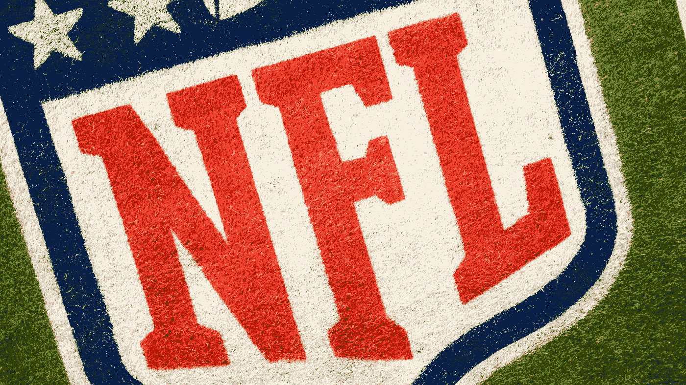
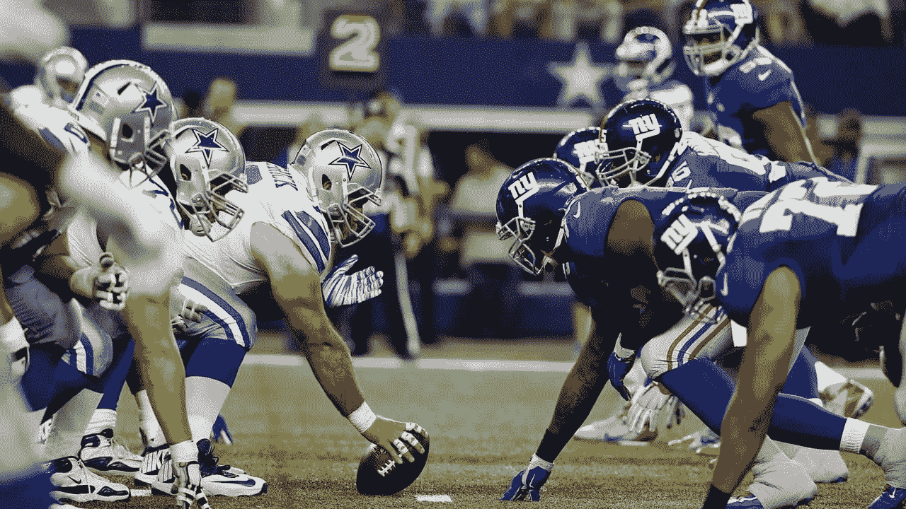
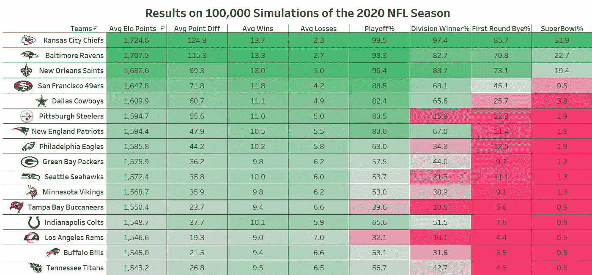
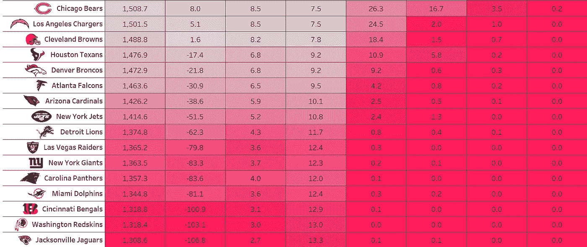

# 模拟 2020 年 NFL 赛季 10 万次

> 原文：<https://towardsdatascience.com/simulating-the-2020-nfl-season-100-000-times-6f82644b67af?source=collection_archive---------44----------------------->

## 通过跟踪每个模拟宇宙为每个球队产生给定结果的频率，预测整个 2020 年 NFL 赛季的结果

照片由于是吊杆从[的 Unsplash](https://unsplash.com/photos/0ndQ1W0w99Q)

这是官方的！周四晚上，NFL 回归，卫冕冠军堪萨斯城酋长队迎战休斯顿德克萨斯队。这是一个赛季的开始，鉴于今年的表现，许多人认为我们不会看到这个赛季。然而，足球又回来了，我们将尝试模拟和预测整个 2020 年 NFL 赛季的结果。

# Elo 模型

如果你熟悉国际象棋中玩家的排名，那么你就熟悉 Elo 评级。Elo rating 是一个简单的系统，根据人头结果来判断球队或球员，是我们用来模拟 2020 赛季 NFL 比赛的模型。这些 Elo 评级能够预测每场比赛的结果，并生成每支球队的获胜概率。

Elo 模型的工作原理是，它为每个团队分配一个权力等级。这些评级用于根据两个团队的 Elo 评级之间的差异生成获胜概率。球队通过赢得比赛来增加他们的 Elo 等级，通过输掉比赛来减少，但是增加多少取决于比赛的预期结果。

例如，让我们取两个团队，给他们每个人一个 Elo 评级。让我们说达拉斯牛仔队对纽约巨人队。达拉斯牛仔队的 Elo 评分为 1650，纽约巨人队的评分为 1400。由于达拉斯的收视率更高，我们知道他们比纽约赢得了更多的比赛，应该在这场比赛中受到青睐。事实上，我可以告诉你，Elo 模型给了他们 80%的胜算。

达拉斯牛仔队主场迎战纽约巨人队，2019 赛季第一周。由[拍摄的照片](https://depositphotos.com/stock-photos/dallas-cowboys.html)

由于达拉斯有望以较大优势获胜，如果他们真的获胜，他们的 Elo 评分只会增加约 5 分。然而，如果纽约赢了，他们的 Elo 评分将增加约 17 个点。Elo 考虑到了对手的水平，对失败者奖励更多，对受欢迎者奖励更少。这是为了确保 Elo 评级高的团队能够战胜实力相当的团队，而不仅仅是低于平均水平的团队。

如果你想了解更多关于 Elo 模型的细节，请查看我的另一篇文章，在这篇文章中，我实际上改进了这个由 FiveThirtyEight 团队开发的模型。

 [## 改进一个著名的 NFL 预测模型

### 深入研究 NFL 的统计数据，以改进一个有潜力与拉斯维加斯竞争的著名模型

medium.com](https://medium.com/the-sports-scientist/improving-a-famous-nfl-prediction-model-1295a7022859) 

# 季节模拟

有了 Elo 评级，很容易判断任何给定团队的实力并预测赢家。Elo 模型还进行了调整，通过处理直接游戏内外的情况，帮助这些预测变得更加准确。这些特定情况可能包括:一支球队是在主场还是客场比赛，他们是不是一周一次，他们走了多远，或者首发四分卫有变化。由于 2020 赛季的时间表已经出来了，我们有了所有我们需要的信息来预测整个赛季将会发生什么。

NFL 赛季并不总是确定的，通常应该击败其他球队的球队有时会输。这意味着 NFL 赛季存在随机性。为了将这种随机性整合到 Elo 模型中，我们使用蒙特卡罗方法模拟 2020 年 NFL 赛季 10 万次，跟踪每个模拟宇宙为每个球队产生给定结果的频率。

最后，模拟将显示一支球队的预期 Elo 评级、积分差异、整个赛季的记录以及赢得分区冠军、进入季后赛、获得第一轮比赛甚至赢得超级碗的几率。

在下面找到你最喜欢的球队，看看 Elo 模型预测你的球队下赛季会发生什么。

# 评论一下，让我知道！

在你最喜欢的球队下面发表评论，让我知道你是否认为 Elo 模型正确地实现了你的球队预期的 2020 年记录。