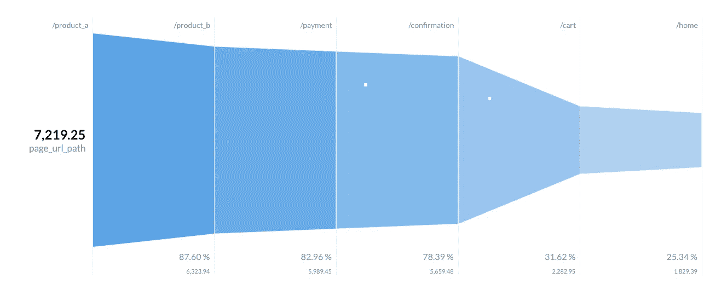
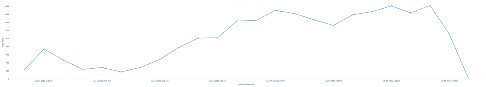
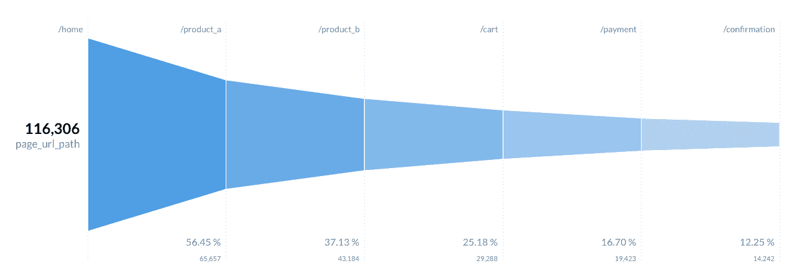
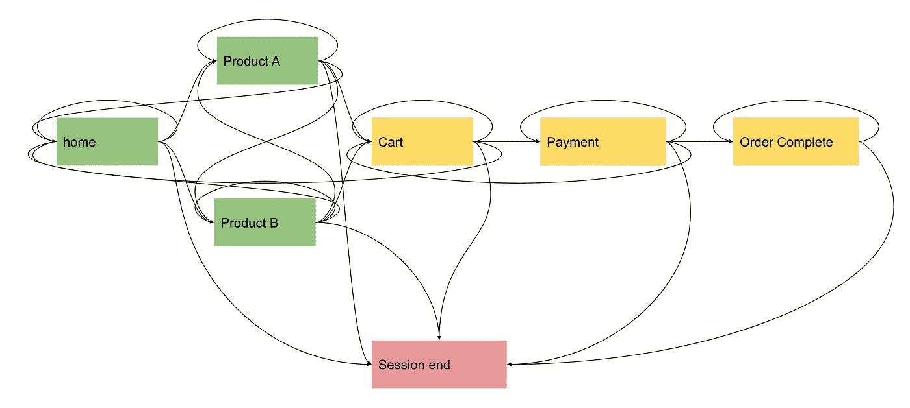

# 模拟 Web 事件

> 原文：<https://towardsdatascience.com/simulating-web-events-7199bf8afcfd?source=collection_archive---------36----------------------->

## 有时我们想要生成假事件来测试我们的管道和仪表板。随机事件做不了这个工作。这就是我构建这个 Python 包的原因。

您希望在工作场所实施新的流式管道，并需要向您的经理展示概念证明。此 POC 应允许您演示一些功能，在这种情况下，生成实时指标。但是，有一个限制:您不能在 POC 上使用生产数据。你如何解决这个问题？

如果你的答案是制造假事件，那么你是对的。这可能是最好的解决方案。然后，您创建一些随机事件，并将其推送到管道。你很快就会意识到随机和假不一样。你肯定不想给你的经理看这样的图表:


随着时间的推移产生的随机事件的网页浏览量。它们只是随机的。作者图表。

随机事件没有意义；他们不卖任何东西。让我们来了解一下在随机事件基础上创建的另一个指标:



随机浏览量没有任何意义。没有人指望一个网站在付费页面的访问量会超过首页。作者图表。

现在，让我们说，你想建立一个分析工程师职位的投资组合。你可能需要表明，你有能力创建网络会话，衡量转化率和分裂活动或来源的指标。如果没有数据，你怎么建立你那该死的投资组合？同样，生成随机数据不会让你测量任何东西。

# 创建半随机事件

考虑到这些问题，我决定创建一个 python 包来生成不完全随机的假事件。它们遵循一套约束，允许你用看起来像真的假数据创造美丽的东西。再次查看一段时间内的页面浏览量图表:



虚假网络事件。现在，随着时间的推移，我们有了更真实的页面浏览量。作者图表。

如果我们看看页面浏览量漏斗，我们会看到更多的主页访问，而付费和确认的访问要少得多，对吗？让我们看看这是不是真的。



虚假网络事件。有道理的漏斗！作者图表。

# 如何自己创建假的 web 事件？

很简单！PyPI 上有[包，GitHub](https://pypi.org/project/fake-web-events/) 上有[源代码。要安装你做 **pip 安装**，就像你对任何其他软件包做的那样:](https://github.com/andresionek91/fake-web-events)

```
pip install fake_web_events
```

使用起来也很简单。请参见下面将事件打印到 stdout 的示例。

```
from fake_web_events import Simulationsimulation = Simulation(user_pool_size=100, sessions_per_day=10000)
events = simulation.run(duration_seconds=10)for event in events:
    print(event)
```

你可以在循环里做任何你想做的事情。发给卡夫卡或者 Kinesis。用 Spark 流处理它，并创建一些指标。保存到 Postgres 并使用元数据库构建一些仪表板。炫耀你的投资组合的 SQL 技能。或者让 POC 获得批准。

由此包创建的事件将如下所示:

```
{
  "event_timestamp": "2020-07-05 14:32:45.407110",
  "event_type": "pageview",
  "page_url": "http://www.dummywebsite.com/home",
  "page_url_path": "/home",
  "referer_url": "www.instagram.com",
  "referer_url_scheme": "http",
  "referer_url_port": "80",
  "referer_medium": "internal",
  "utm_medium": "organic",
  "utm_source": "instagram",
  "utm_content": "ad_2",
  "utm_campaign": "campaign_2",
  "click_id": "b6b1a8ad-88ca-4fc7-b269-6c9efbbdad55",
  "geo_latitude": "41.75338",
  "geo_longitude": "-86.11084",
  "geo_country": "US",
  "geo_timezone": "America/Indiana/Indianapolis",
  "geo_region_name": "Granger",
  "ip_address": "209.139.207.244",
  "browser_name": "Firefox",
  "browser_user_agent": "Mozilla/5.0 (Macintosh; U; PPC Mac OS X 10_5_5; rv:1.9.6.20) Gecko/2012-06-06 09:24:19 Firefox/3.6.20",
  "browser_language": "tn_ZA",
  "os": "Android 2.0.1",
  "os_name": "Android",
  "os_timezone": "America/Indiana/Indianapolis",
  "device_type": "Mobile",
  "device_is_mobile": true,
  "user_custom_id": "vsnyder@hotmail.com",
  "user_domain_id": "3d648067-9088-4d7e-ad32-45d009e8246a"
}
```

假的网络事件正在使用 [Faker](https://faker.readthedocs.io/) 来创建一些数据；其他字段是根据预定义的权重(可以在 YAML 文件中自定义)随机生成的。

# 幕后的虚假网络事件

我假设您可能有兴趣了解这些事件是如何创建的，以及其背后的逻辑是什么。我可以直截了当的告诉你，不是外星科技:)。

虚假网络事件不是外星技术。Gif 信用 [u/Huesh](https://www.reddit.com/user/Huesh/) 在 [Reddit](https://www.reddit.com/r/HighQualityGifs/comments/5kqyvo/when_you_come_to_hqg_and_see_the_aliens/) 上。

## 用户

我们首先创建一个用户池。一些字段完全是随机的(来自 Faker)，其他字段遵循一组预定义的权重。例如，用户将获得使用以下权重分配的浏览器:

```
browsers:
  Chrome: 0.5
  Firefox: 0.25
  InternetExplorer: 0.05
  Safari: 0.1
  Opera: 0.1
```

这意味着大约 50%的用户将使用 Chrome，25%的用户将使用 Firefox。

用户与事件具有本质上相同的 JSON 结构，除了它不包含时间戳或页面信息。当我们运行模拟时，将从池中随机挑选用户开始“浏览网站”。用户以后可能会回到这个网站，这就是为什么他们选择了重新定位。

## 事件

为了创建事件，我们模拟会话。在模拟中创建了一些“页面”。用户将从主页、产品 A 或产品 B 页面开始。在每次迭代中，用户可以停留在同一个页面，移动到另一个页面，或者结束会话。以下是当前在家的用户的概率:

```
home:
  home: 0.45
  product_a: 0.17
  product_b: 0.12
  session_end: 0.26
```

该模拟跟踪所有用户，并在每次到达新页面时生成一个事件。一旦用户到达会话末尾，他的会话就会被丢弃。遵循模拟过程中可能的用户事件图表:



虚假 web 事件模拟的站点地图。绿页是用户在会话开始时可以进入的页面。黄页只对已经在浏览的用户开放。作者配图。

## 模拟

模拟将分批运行，其内部时钟通常会比标准时间快得多。例外情况是，如果您正在使用**非常大的**user _ pool _ size 和 *sessions_per_day 运行它。*

模拟将创建一个发电机对象。它不会运行或使用资源，直到你开始迭代它。

# 接下来是什么？

我确实对这个项目下一步做什么有一些想法。有些是简单的错误修复，或者是对如何生成和跟踪事件的改进实现。但是有一个广泛的想法我想深入探讨:

**在 web 事件之上产生微服务事件。**

我的想法是向模拟中添加另一个模块，该模块将基于微服务架构创建不同的事件。我能想到这样的事件:

*   用户 _ 创建的
*   订单 _ 已创建
*   付款 _ 已完成
*   支付 _ 失败
*   订单 _ 已发送
*   订单 _ 完成

微服务事件将有助于创建绑定到 web 事件的假事务数据库。我认为这对很多人来说是有用的，因为它允许更多的用例。

如果你喜欢这个项目，请在 GitHub 上主演来表达你的爱[。](https://github.com/andresionek91/fake-web-events)

**每个人也可以贡献**:创建一些问题、特性请求，甚至是拉式请求，如果你对接触代码感到舒服的话！