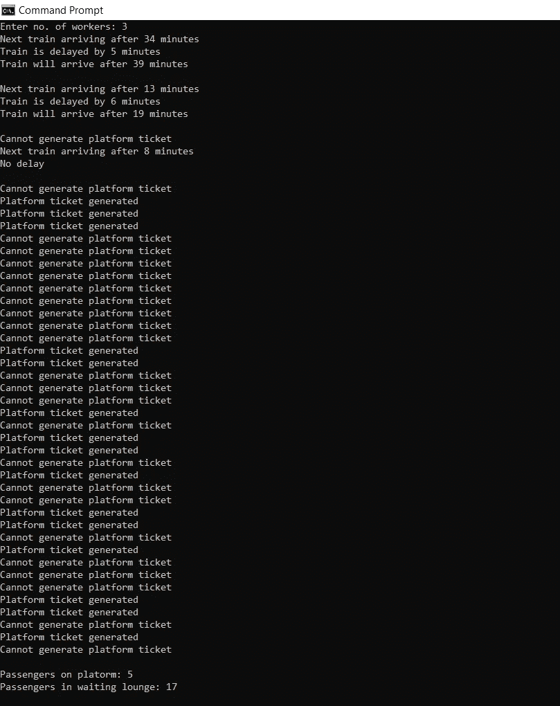

# SimPy 中的模拟结构和建模

> 原文：<https://towardsdatascience.com/simulation-structures-and-modelling-in-simpy-6503833b79f6?source=collection_archive---------30----------------------->

## 思考、创造和模拟—一切尽在 SimPy

Python 以其简单的语法和众多的库而闻名，这使得这种语言几乎可以做任何事情。Python 的操作范围从开发 web 和桌面应用程序等中等简单的任务到构建机器学习和人工智能项目等复杂任务不等。


肖恩·林在 [Unsplash](https://unsplash.com?utm_source=medium&utm_medium=referral) 上的照片

我们随处可见系统，从数字闹钟中的嵌入式系统到像机场和火车站这样的大型系统。为了高效和最佳地运行这些系统，我们需要模拟，因为它们为我们提供了可依赖的读数。参与环境和随机性是系统和模拟的两个关键因素。本文将关注 python 库的这些功能，这样我们就可以根据我们的需求模拟一个场景。为了实现这一目标并创建算法，我们将使用 Python 的以下两个内置库:

*   简单
*   随意

**场景:**为了遵循社交距离，作为站长，你必须设计一个计划，使站台上的人数最少，并让尽可能多的人呆在他们的车辆或候车室里(让我们假设这些房间有适当的措施来保证旅客的安全)。

计划:我们将从分配火车的到达和离开时间开始。应该设立一个售票亭，向登上下一趟到站列车的乘客分发站台票。

# 我们开始吧

我假设你已经安装了 Python，并且有基本的知识。如果你以前没有使用过 Python，你可能想看看这个[教程](/a-beginners-guide-to-python-for-data-science-60ef022b7b67)。

我更喜欢在 shell 中运行程序。你也可以使用 Jupyter 笔记本。**第一步**是安装并导入所需的库。打开命令提示符，写下:

```
pip install SimPy
pip install random
```

成功安装后，使用*导入*功能导入库:

```
import SimPy
import random
```

在开始编写主要算法之前，有必要对您的模拟应该是什么样子有一个清晰的印象。这一步对于制作一个好的仿真模型是最重要的。在这一步，人们应该花最多的时间进行头脑风暴、构建和收集数据。从可靠的来源收集模拟中每个不确定时刻的统计数据非常重要。如果这受到损害，一个或多个事件的发生频率会增加或减少。这可能导致生成错误的值。根据我们的计划，模拟必须以下列方式运行:

1.  乘客到达火车站，走向站台售票柜台。如果他登上了下一趟到站的火车，他会得到一张站台票。
    —否则，请他在休息室等候。

**2。**列车到达站台，乘客上车，10 分钟后发车。火车也有可能晚点几分钟。

**3。**在候机室等候的乘客前往售票柜台，符合条件的乘客前往站台。同时，更多的乘客到达车站。这样，我们可以最大限度地减少站台上的乘客数量。

# 编码程序

我们将从定义主**类**开始，该类将包含模拟蓝图和在**火车站**执行的程序。这个类将包含一些生成所需环境的函数。该班命名为*站。*

```
class Station(object):
    def __init__(self, env, num_worker):
        self.env = env
        self.worker = simpy.Resource(env, num_worker)
```

在这段代码中，__init__()是 python 类中的一个保留方法。当从类创建对象时，会调用它。这个方法允许我们定义一个类的属性。我们继续创建一些对我们的模拟至关重要的简单资源。变量“env”是预定义的，它帮助我们生成一个用于模拟的虚拟环境。现在这样想，有一些**资源**是车站提供给乘客的。在这种情况下，是售票柜台的工作人员。工人数量将由变量 *num_worker* 表示。

在继续之前，我们需要了解 SimPy 和 Random 库的更多功能。第一个是:

```
random.randint(a,b)
```

这个函数帮助我们在两个整数 **a** 和 **b** 之间生成一个随机整数(两者都包括在内)。这将帮助我们模拟过程中的随机事件。通过为事件指定触发条件，可以将它与条件语句一起使用。

```
p = random.randint(1,8)
if p == 3 :
    print('Event Triggered')    #Probability = 0.125
```

第二个功能是:

```
yield self.env.timeout(a)
```

这用于在*一*分钟的持续时间内运行一个进程(本例中为 *env* )。我们可以进一步使用 *randint* 函数来运行环境，运行在 **a** 和 **b** 之间的任意时间整数值。

```
yield self.env.timeout(random.randint(a,b))
```

现在，您已经准备好编写将对乘客进行分类并据此出售站台票的函数了。它还将生成列车时刻表，延迟列车(如果需要)，并打印站台和休息室的乘客人数。该任务将通过使用上述函数以及条件语句和循环来完成。SimPy 将帮助生成和运行环境。

第一步是定义函数及其参数。之后，所有控制列车到达、离开(到达 10 分钟后)和延迟的必要变量将被声明。

```
def ticket(self, passenger):
    sch_train = random.randint(0,45) 
    dep_train = sch_train + 10 
    print('Next train arriving after',sch_train,'minutes')
```

**注:**函数*车票*以自身和乘客为属性。*乘客*属性将在*运行站*功能中定义。

接下来的任务是设定一个条件，让火车晚点。在这种情况下，火车将在 0 点至 10 点之间延迟。

```
del_ = random.randint(0,10)
del_f = del_%2
if del_f == 0:
            del_t = random.randint(5,20)
            print('Train is delayed by',del_t,'minutes')
            sch_train = sch_train + del_t
            dep_train = sch_train + 10
            print('Train will arrive after',sch_train,'minutes\n')
        else:
            print('No delay\n')
```

变量 *del_* 生成所需的案例，而 *del_f* 是这些案例值除以 2 后的余数。要成为偶数， *del_f* 的值必须为零。当它等于零时，火车被延迟 *del_t* 分钟，这也是 5 到 20 分钟之间的随机时间量。因此，到达和离开时间的价值增加了。如果当前时间与延迟到达时间(宣布延迟后的新到达时间)之差小于 10，则不会生成站台票(这将在下一步中进行编码)。

```
num_pass = 0    
        for i in range(passenger):
            time = random.randint(5,60) #time after which passenger's train is scheduled
            if time<=dep_train:
                yield self.env.timeout(random.randint(1,3))
                print('Platform ticket generated')
                num_pass +=1
            else:
                print('Cannot generate platform ticket')
print('\nPassengers on platorm:', num_pass)
        p = passenger - num_pass
        print('Passengers in waiting lounge:', p,'\n')
```

最初， *num_pass* (站台乘客数)等于 0。变量 *time* 以分钟为单位存储时间的随机值，在此之后列车被调度。有条件的“如果”语句检查乘客是否有资格购买站台票。工人完成这一过程的时间在 1 到 3 分钟之间。随后，生成站台票， *num_pass* 加 1，并打印 *num_pass* 的值。
票证生成过程完成。现在我们将编写一个函数来安排乘客到达车站的时间。

```
def station_arrival(env, passenger, station):
    arrival_time = env.now
    with station.worker.request() as req:
        yield req
        yield env.process(station.ticket(passenger))
```

**注意:**这个函数调用主类中的另一个函数。这给出了一个提示，它将在某个地方被再次调用作为替代，以避免一次调用太多的函数。

变量 *arrival_time* 存储由 *env.now* 命令生成的环境的当前时间值。下一行请求主类(工作站)让模拟使用它的资源( *num_worker* )。该请求的最后一行将触发主类中定义的车票生成功能(*env . process(station . ticket(passenger)*)。我们需要的最后一件事是一个函数，它按顺序调用所有其他函数，并在“for”循环中为*乘客*变量生成值，因为它是上面定义的两个函数的属性。

```
def run_station(env, num_worker):
    station = Station(env, num_worker)
    a = 5
    for passenger in range(20,40):
        env.process(station_arrival(env, passenger, station))while a > 0:
        yield env.timeout(0.7)
        passenger += 1
        env.process(station_arrival(env, passenger, station))
```

在“for”循环中调用 *station_arrival* 函数，该循环向环境请求资源，然后在条件满足后启动票据生成过程。最后，一个“while”循环执行整个过程，并在每一步增加乘客。为了运行模拟，我们只需要调用 *run_station* 函数。

这样，模拟结构就可以在 *main* 函数中执行了，该函数会将 *env* 变量指定为一个简单环境，并定义模拟时间( *env.run(until=200)* )。

```
def main():
    random.seed(30)
    n = input('Enter no. of workers: ')
    num_worker = int(n)
    env = simpy.Environment()
    env.process(run_station(env, num_worker))
    env.run(until=200)if __name__ == "__main__":
    main()
```

模拟的有效性取决于程序的结构和概率决定因素的准确性。这需要大量的头脑风暴。在这种情况下，使用 *randint* 生成的所有数字给出了一个粗略的估计。我们可以根据对同一主题进行的研究/调查来准确地构建它们，然后确定某个事件的正确概率。这个领域很有潜力成为一个研究课题。

如需更多帮助，**从**[**GitHub**](https://github.com/Shamsheer-hub/SimPy-Simulation-Model-for-Railway-Platform-Ticket)**下载源代码。**

## 输出



一个模拟周期(图片由作者提供)

# 结论

这是一个在平台上维持社交距离的自制场景。为该问题提供的解决方案可能不是最好的，但设计这种情况的主要动机是描述 *SimPy* 库的基本功能、模拟需求以及演示简单模拟案例背后的编码过程。


[𝗔𝗹𝗲𝘅 𝘙𝘢𝘪𝘯𝘦𝘳](https://unsplash.com/@alex_rainer?utm_source=medium&utm_medium=referral) 在 [Unsplash](https://unsplash.com?utm_source=medium&utm_medium=referral) 上的照片

借助于 *SimPy* 框架，我们可以了解很多关于构建程序和过程的知识。我们现在可以通过**在一个环境中定义和调度**各种功能来模拟各种系统及其子流程。这有助于我们理解日常生活过程中的随机性。现在我们对**系统**以及基本概率如何控制模拟的复杂性和准确性有了清晰的理解。

## 模拟范围

这些模拟可以通过计算成本和其他因素来帮助个人做出各种决定。如果结构正确，模拟是生成有用和准确数据的有效方法。此外，它们还可以在数据分析的帮助下用于数据预测。