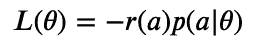

# 具有策略梯度的同步连续/离散超参数调整

> 原文：<https://towardsdatascience.com/simultaneous-continuous-discrete-hyperparameter-tuning-with-policy-gradients-4531d226d6e2?source=collection_archive---------62----------------------->

## 我们演示了一种使用策略梯度同时调整机器学习模型的离散和连续超参数的有效方法。


菲尔道斯·罗斯兰在 [Unsplash](https://unsplash.com?utm_source=medium&utm_medium=referral) 拍摄的照片

## 概观

在我的上一篇文章中，我展示了如何用 Python 从零开始构建策略梯度[，我们用它来调整机器学习模型的*离散*超参数。(如果你还没有读过，我建议你从那里开始。)现在，我们将在这一进展的基础上，扩展策略梯度以优化连续参数。到本文结束时，我们将有一个同时调优离散和连续超参数的成熟方法。](/hyperparameter-tuning-with-policy-gradients-from-scratch-a3f9f0bd7369)

## 政策梯度审查

从上次[的](/hyperparameter-tuning-with-policy-gradients-from-scratch-a3f9f0bd7369)中，回想一下策略梯度优化了以下用于调整超参数的成本函数:



其中 *a* 是为特定实验选择的一组超参数，而*θ*代表我们的 PG 模型的所有可训练参数。然后， *p* 表示选择动作 *a* 的概率， *r* 是该动作获得的“奖励”。我们随后表明:


上面的等式告诉我们，给定一组*动作*和他们观察到的*奖励，如何更新我们的 PG 模型。*对于离散超参数，我们直接更新了每个可能动作的相对对数概率( *logits* ):

这种方法不适用于连续超参数，因为我们不可能存储每个可能结果的对数概率！我们需要一种新的方法来生成连续的随机变量及其相对对数概率。

## 扩展到连续超参数

在强化学习领域，连续变量通常使用*高斯过程*建模。这个想法非常简单:我们的模型预测高斯分布的均值和标准差，我们使用随机数生成器收集动作/预测。

同样，我们选择了最简单的模型——只存储每个参数的平均值和对数标准偏差。为了理解上面`self.mu`和`self.log_sigma`的更新规则，让我们计算一些梯度。高斯分布的概率密度函数为:


或者换句话说，用*对数标准偏差*来表示:


要获得对数概率，只需取自然对数，


我们使用以下数学恒等式来帮助简化表达式:


在所有这些工作之后，从这里计算梯度并不太困难。对 *mu* 和 *log-sigma* 求偏导数(或者只用 [WolframAlpha](https://www.wolframalpha.com/) )，我们发现:


这解释了如何在`GaussianActor`中更新参数…几乎如此。尽管有很好的数学计算，我们的公式还是有一个实际问题:与标准偏差相比，我们的平均值变化非常缓慢。本质上，这是因为`self.log_sigma`在对数空间中，并且对`self.log_sigma`的更新导致标准差的指数级更大变化。我们可以手动增加`self.mu`的学习率，鼓励它跟上。在实践中，乘以 1000 往往效果很好。

在我看来，这是一个丑陋的创可贴，而不是一个优雅的解决方案。但是真的有用。我不建议对大多数策略梯度应用使用这种方法，因为它会降低我们模型在训练过程中的稳定性。在我们的例子中，效率比稳定性重要得多，因为我们受限于固定数量的实验。与大多数应用程序不同，我们不会在任何事情上重复使用训练好的模型——我们只是用它来估计超参数，然后完全丢弃该模型。

## 玩具问题:连续超参数

让我们应用我们所学的。我们可以建立一组超参数、基础真值和目标函数。这次，我们将使用*均方误差*作为目标，而不是*平均绝对误差*。目标函数的选择并不重要，任何明智的选择都应该可行。不过，有些选择比其他选择更有效。MSE 和 MAE 通常是相当安全的选择。根据经验，均方差给出了这些实验的最佳结果。

注意，我们向每个参数字典添加了“type”键。稍后，当我们引入离散超参数时，这将证明是有帮助的。让我们还设置一个函数来为每个参数类型创建参与者。

最后，我们可以展示完整的策略梯度代码。考虑到连续的参数，只需要很小的改变。

为了衡量我们算法的性能，让我们运行 1000 个左右的独特实验，并观察我们的预测有多准确。同样，我们将使用 250 的*预算*——这是新的超参数可以被评估的最大次数。这将允许与我们之前仅针对离散超参数的实现进行比较。

```
Average MAE: 2.155
```

这与随机搜索相比如何？为了达到相同的 MAE，您需要在每个基础真值的 4.31 范围内进行猜测。随机选择这样一组参数的概率大致为 *0.0862 = 6.41E-4* 。平均而言，在匹配政策梯度的准确性之前，需要进行 *1561* 次随机实验！在这种情况下，PG 大概比随机搜索高效 *6.25x* 。这比我们看到的离散参数( *> 10x* )的效率要低，但仍然相当可观。

## 另一个玩具问题:混合超参数

在这一点上，我们已经确认了策略梯度分别用于调整连续和离散超参数*。让我们把这些放在一起，看看*同步*参数调谐是如何工作的。不需要额外的更改，只需更新超参数并重新运行实验。我们还将把*预算*增加到 1000，因为我们正在优化一组更大的参数。*

```
*Average MAE: 2.088*
```

*暂停片刻，体会这个结果的意义。仅使用 *1000 个*实验，策略梯度在 *6 个*单独的超参数之间仅实现了 *2.1%* 的平均误差。大概有一个 *0.0835⁶ = 3.39E-7* 的概率来随机抽取一组相似的参数，这意味着 PG 现在比随机搜索几乎要高效***3000 倍***！*

*随着搜索空间的扩大，使用策略梯度的好处会急剧增加。这是因为我们正在*同时*(不是顺序)调整我们的超参数。如果我们简单地先调整离散参数，然后调整连续参数，PG 会比随机搜索高效 60 倍。(只需将离散搜索和连续搜索的相对效率相乘。)相反，我们能够在预算中使用每个实验的*来同时优化*所有*超参数，效率飙升。**

## *外卖食品*

*我一直对政策梯度的力量和灵活性感到惊讶。在数百行 Python 代码中，我们为离散和连续超参数创建了一个高效的、可用于生产的优化器。它与*任何*机器学习算法(神经网络、决策树、k-最近邻等)一样好用。)，因为优化不需要外部渐变。如果您需要更快的性能，还可以使用内置的 Python 模块(如`multiprocessing`或`concurrent.futures`)来并行化每一批实验。为了简单起见，我避免在这里这样做。*

*在这个演示之后，我希望你和我一样迷恋政策梯度。要了解更多关于 PG 的信息，我强烈推荐 [OpenAI Spinning Up](https://spinningup.openai.com/en/latest/index.html) ，它包含了大量的背景材料、研究论文和与强化学习相关的开源软件。*