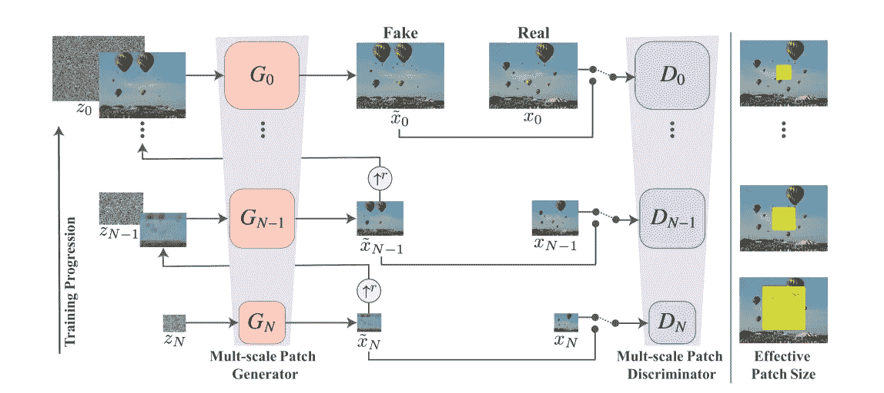
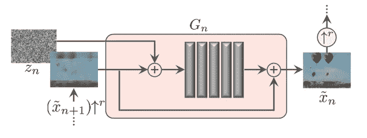
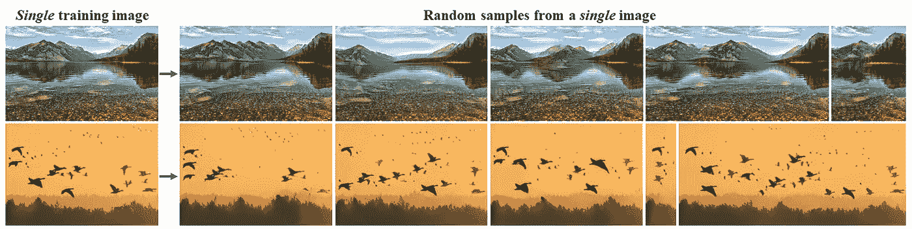
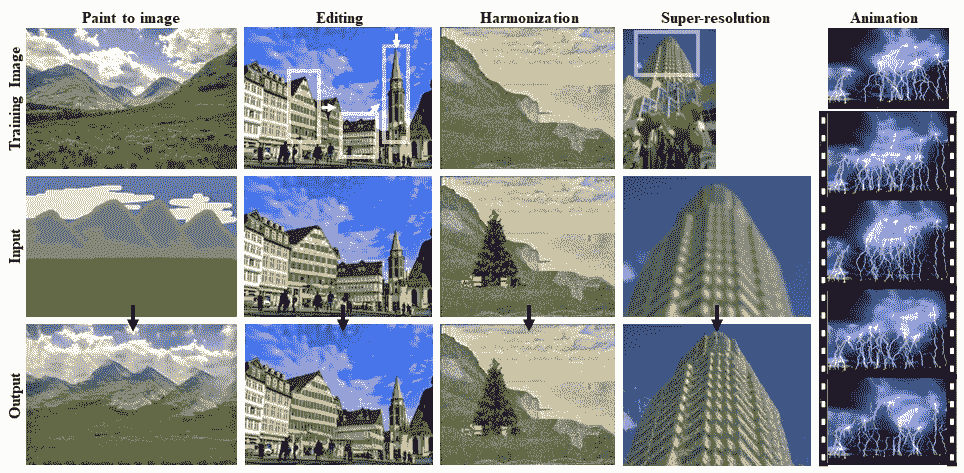

# SinGAN:从单个图像训练 GAN。

> 原文：<https://towardsdatascience.com/singan-training-gan-from-a-single-image-cdd965af4406?source=collection_archive---------26----------------------->

## 生成网络解释

## 没有足够的数据来训练你的生成网络？辛甘是来帮忙的。

# 介绍

**GANs** 是一种生成网络，可以从潜在向量(“或分布”)中生成逼真的图像。通常，GAN 由两个网络组成:生成器(G ),其目的是将潜在代码映射到图像；鉴别器(D ),其任务是评估图像是来自原始数据集(真实图像)还是由其他网络生成(虚假图像)。与鉴别器对抗，生成器试图愚弄它，从潜在向量生成新图像，因此鉴别器认为它们是真实图像。

而 **SinGAN** 是 GAN 的变体，其中网络必须从单个自然图像中学习，这与以前版本的 GAN 形成对比，因为它们有多个真实图像来学习表示。SinGAN 是一个无条件的生成模型，它可以学习单个图像中面片的内部统计信息。正如本文的**结果**部分所示，SinGAN 在各种图像处理任务上显示了令人印象深刻的结果。

# 体系结构

SinGAN 架构由多尺度流水线组成，其中存在一对生成器和鉴别器，学习不同尺度的表示。它们可以以由粗到细的方式进行训练，其中最低尺度的生成器和鉴别器学习背景和材料等粗糙特征，而在高尺度下，它们学习边缘和拐角等非常精细的细节。

新加坡建筑

源图像被缩减采样到相应的大小，并与发生器的输出一起输入鉴别器。并且随机噪声连同从它们下面的发生器生成的图像一起被馈送到发生器(除了最后一个，它仅被馈送随机噪声)。

因为我们只处理一个源图像，所以我们将来自下采样源图像的一组补片视为我们的真实图像数据集。“您可以将 patch 视为一个滑动窗口，它悬停在图像上方并收集样本”。通常，所有大小的补丁区域保持不变，但是对于更高的网络，随着图像变得越来越大，有效的补丁大小会减小。

如果我们仔细观察发生器，随机噪声向量与从下面生成的图像(向上采样为噪声形状)连接在一起，并馈入 5 个后续卷积层，卷积层的输出再次与从下面生成的图像连接。这将输出一个新的图像，与真实图像(下采样)一起进一步发送到鉴别器进行评估。

辛甘的典型发电机

辛甘的典型发电机，每个区块:

**噪点+g _ image->5x(conv)+g _ image->输出**。

其中 g_image 是从先前的生成器生成的图像，Conv 是**conv(3x 3)->batch norm->LeakyReLU。**

对于鉴别器，生成的图像和源图像(下采样)被馈送用于评估。鉴别器由五个卷积层组成，与发生器一样，但没有级联。

# 训练和损失函数

**网络**按顺序训练，从最低级别开始，上升到最高级别。首先训练最小尺寸的发生器和鉴别器得到粗特征，然后训练下一个尺寸的网络，依此类推。一旦每个 GAN 被训练，它就保持固定，并且所有子网 GAN 以传统(对抗)方式被训练。

训练包括两个损失函数的组合。

1.  **对抗性损失:**对抗性损失用于惩罚网络，通过计算真实数据分布与生成器预测数据分布之间的距离，使预测样本分布与原始样本分布相匹配。最初的实现使用 WGAN-GP 丢失，他们发现这可以增加稳定性。这个损失在这里得到了很好的解释[。](https://machinelearningmastery.com/how-to-implement-wasserstein-loss-for-generative-adversarial-networks/)
2.  **重构损失:**顾名思义，重构损失是用来惩罚网络生成看起来像原始样本的样本。这种损失很重要，因为噪声矢量被输入发电机。最初的实现使用 RMSE(均方根误差)损失。

# 结果

如下图所示，第一列作为网络的输入，所有后续图像都是网络的输出。所有生成的样本都具有相同的高层次特征，如第一行是山脉、湖泊和沙子，第二行是橙色背景、鸟类和树木。尽管仅使用一幅图像作为输入，但样本显示了非常精细的细节，并且所有样本彼此之间非常不同。

[资料来源:https://github.com/tamarott/SinGAN/blob/master/imgs/teaser.巴布亚新几内亚](https://github.com/tamarott/SinGAN/blob/master/imgs/teaser.PNG)

下图显示了一些图像处理任务的结果。第一列示出了风格转移，其中图像的属性可以被转移到视觉上不同但上下文相同的另一个图像，放大或缩小图像内的对象而不引起像素内的抖动，在背景前面添加对象，减少像素失真(超分辨率)等。

[来源:https://github . com/Tamar ott/SinGAN/blob/master/imgs/manipulation。巴布亚新几内亚](https://github.com/tamarott/SinGAN/blob/master/imgs/manipulation.PNG)

结果表明，一个图像足以学习属性。所有的实验表明，SinGAN 确实是一个强大的生成网络，即使给定一幅图像作为输入，它也能够很好地进行泛化。

# 结论

这是对最近推出的 SinGAN 的快速而完整的介绍。我发现这个网络特别有趣，因为它能够仅使用一个源图像进行很好的归纳。如上所示，这个网络在各种图像相关的任务中表现良好，你可以看看 Github 上的实验。这个网络是用 PyTorch 实现的，可以在 GitHub 上进行实验。

## 参考

[1]https://github.com/tamarott/SinGAN

[2]https://arxiv.org/abs/1905.01164