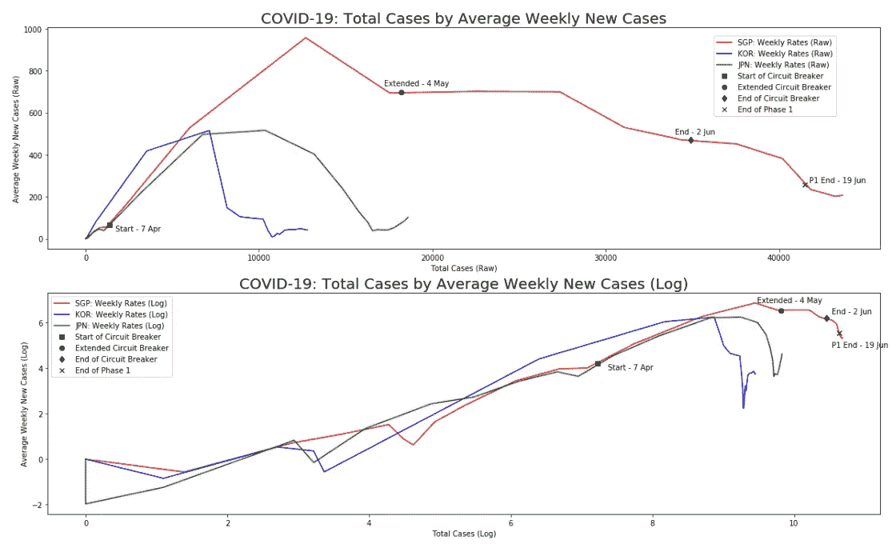
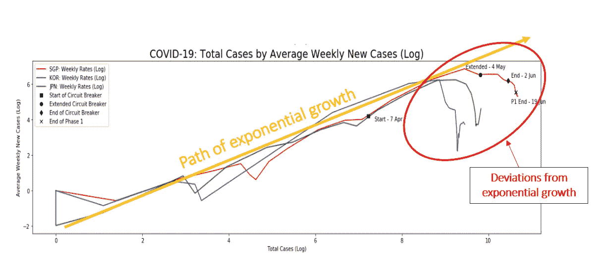
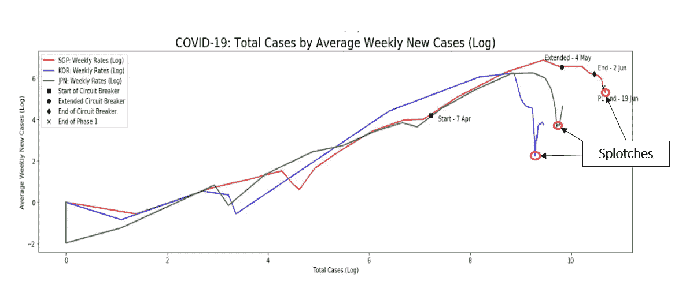
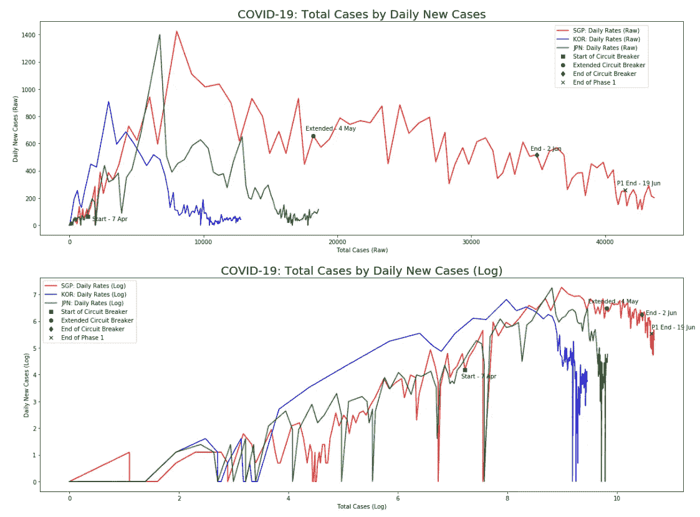
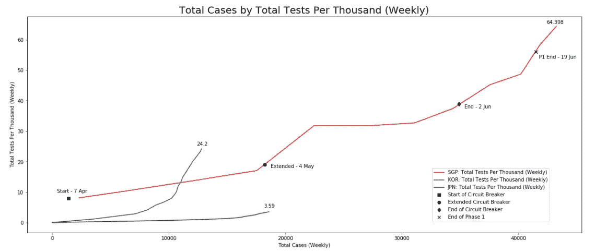

# 新加坡的新冠肺炎曲线变平了

> 原文：<https://towardsdatascience.com/singapores-covid-19-curve-has-flattened-1b8a15d5184f?source=collection_archive---------51----------------------->

马丁·桑切斯在 [Unsplash](https://unsplash.com?utm_source=medium&utm_medium=referral) 上的照片

## 新加坡新冠肺炎局势的最新情况

***编者按:*** [*走向数据科学*](http://towardsdatascience.com/) *是一份以数据科学和机器学习研究为主的中型刊物。我们不是健康专家或流行病学家，本文的观点不应被解释为专业建议。想了解更多关于疫情冠状病毒的信息，可以点击* [*这里*](https://www.who.int/emergencies/diseases/novel-coronavirus-2019/situation-reports) *。*

随着新加坡大选的临近，大多数媒体的注意力都集中在不同的政党候选人、他们的演讲，甚至他们的性格上。

但我们不要忘记，我们仍然处于疫情的中心。

大约一个月前，我写了一篇关于新加坡的新冠肺炎曲线是否变平的文章。

 [## 新加坡的新冠肺炎曲线变平了吗？

### 新冠肺炎曲线真的变平了吗？大多数新闻图表只显示了部分情况。这里有一个更好的…

towardsdatascience.com](/is-the-covid-19-curve-flattening-in-singapore-857219f72f1) 

从那以后，我一直在积极跟踪新加坡的每周进展，我可以有把握地说，根据数据…

> 新加坡的新冠肺炎曲线变平了！

我将保持这篇文章的简短，直接进入更新。

如果你想知道这篇《新冠肺炎邮报》的动机以及我从哪里得到的数据，我建议你读一下之前的[帖子](/is-the-covid-19-curve-flattening-in-singapore-857219f72f1)。

# 平坦的新冠肺炎曲线

平均每周新病例

上图描述了平均每周案例数和平均每周案例数的对数转换。

> 注:红线表示来自新加坡的病例。蓝线代表韩国，绿线代表日本。

为什么要对数变换？

简而言之，对数变换让我们能够更好地判断新冠肺炎曲线是否变平。

它向我们展示了**与指数增长**的背离。

偏离指数增长的例子

这个想法很简单。

每个国家的新冠肺炎局势都呈指数增长。

当且仅当我们看到明显偏离这条路径时，曲线才会变平。

就新加坡、韩国和日本而言。

我们实现了这种扁平化效果。

## 第一阶段的效果如何？

> 对于非新加坡读者来说，新加坡分三个阶段开放经济。第一阶段于 2020 年 6 月 19 日结束，我们目前处于第二阶段。

单从数据来看，第一阶段确实有助于抑制病毒的传播。

从《断路器》结束(2020 年 6 月 2 日)到第一阶段结束(2020 年 6 月 19 日)，我们可以清楚地看到对指数增长的较大偏离。即平均每周病例的急剧下降

因此，看起来新加坡缓慢重新开放的计划确实是有效的。

为此向政府致敬！

# 警示故事

照片由 [Goh Rhy Yan](https://unsplash.com/@gohrhyyan?utm_source=medium&utm_medium=referral) 在 [Unsplash](https://unsplash.com?utm_source=medium&utm_medium=referral) 上拍摄

截至 2020 年 7 月 1 日，新加坡似乎很好地处理了病毒的传播。

但是我们必须小心谨慎。

以韩日为例，它们显然处于疫情的第二波。很像现在的中国或新西兰。

新加坡承受不起再次陷入封锁。

作为公民，我们必须继续发挥我们的作用。

待在家里，在家工作，尽可能减少社交聚会，直到找到疫苗。

我相信世界即将找到疫苗，但在此之前，我们需要记住这种病毒传播*很快*。

走错一步，我们就要开始准备第二波了。

## 可怕的污点

我分别在韩国和日本的曲线中注意到了这一点。

在第二波袭击他们之前，他们的曲线上都有一个小小的污点。

我在新加坡曲线上也看到了这个污点。

曲线上可怕的斑点

这是什么意思？

基于 2 的样本量，曲线*中的(我知道这很荒谬)斑点可能表明病毒开始再次传播的潜在信号。*

*也就是第二波迫在眉睫。*

# *其他可视化*

*以下是我在这篇文章中跳过的其他可视化效果。*

**

*每日新病例*

**

*新加坡考试费率*

# *结尾注释*

*虽然数据显示曲线已经变平，但我们不要放松警惕。*

*如果新加坡做出错误的举动，第二波病毒可能会出现。即过早地进入阶段 3。*

*在开放经济和遏制病毒传播之间需要有一个平衡。*

*没有一个国家是完美的。*

*但到目前为止，新加坡似乎走在了正确的道路上。也就是说，慢慢开放经济，同时控制病毒。*

*让我们都只希望疫苗很快出现，这样生活就能回到过去的样子。*

*这里有我的代码供你自己分析。*

> *注意:对于我的非新加坡读者，您可以通过简单地在我的脚本中过滤到您自己国家的代码来跟踪您自己国家的进展。*

* [## 廷坦-吉图布/新冠肺炎-新加波

### 此时您不能执行该操作。您已使用另一个标签页或窗口登录。您已在另一个选项卡中注销，或者…

github.com](https://github.com/timtan-github/COVID-19-Singapore) 

就这样，我们在邮局见！😃

永别了！

LinkedIn 简介:[蒂莫西·谭](https://www.linkedin.com/in/timothy-tan-97587190/)*