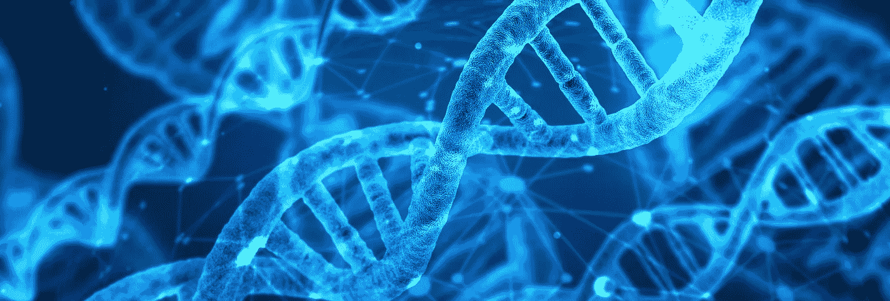
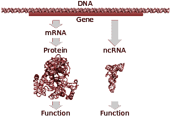
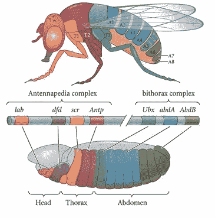
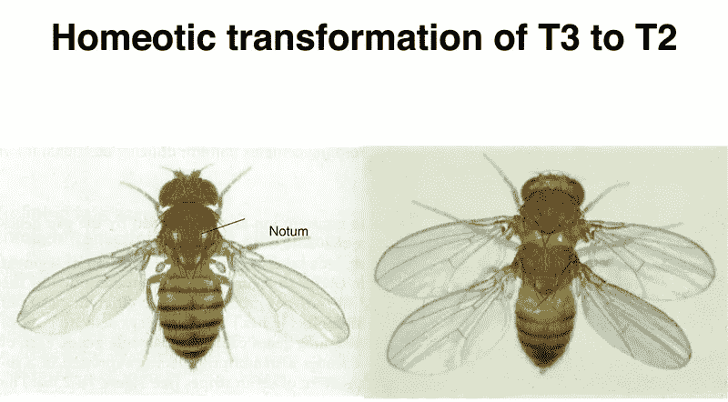
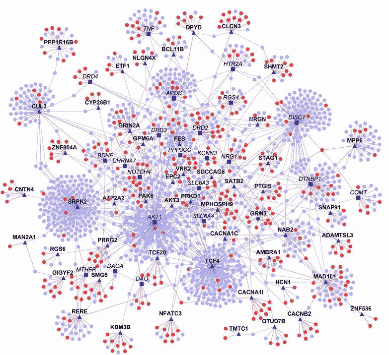
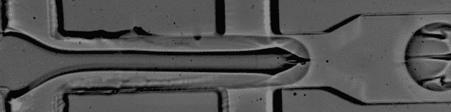
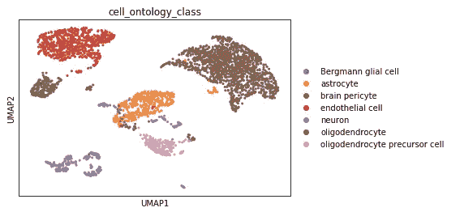

# 单细胞 RNA 测序:生物学家的 A/B 测试工具

> 原文：<https://towardsdatascience.com/single-cell-rna-sequencing-an-a-b-testing-tool-for-biologists-ddf0dc22526b?source=collection_archive---------30----------------------->

## 用 scRNA-seq 和人工智能改造生物医学研究

信用:Pixabay.com

> “我对遗传学是数字化的这个想法很感兴趣。基因是一长串编码字母，就像计算机信息一样。现代生物学正在成为信息技术的一个分支。”—理查德·道金斯

[A/B 测试](https://en.wikipedia.org/wiki/A/B_testing)是科技行业的常见做法。每次构建新功能时，产品经理和数据科学家都会对其进行最终的性能测试——A/B 测试。由此产生的度量标准将告诉我们该特性是否符合提议的业务成果。第一步是找出要收集的数据。对于脸书和 Twitter 等平台，衡量标准包括在网站上停留的时间、点赞数、每日活跃用户(DAU)的增加、分享数等等。接下来，对用户群体进行细分以进行控制和测试来运行实验——群体的大小由功效分析决定。最后，收集数据。一旦有了足够的数据，现在就该对测试总体进行建模，进行参数估计，并执行统计显著性测试，以检查测试分布是否明显偏离控制。如果有意义，该特性将被添加到产品堆栈中。

> 在生物学中，整个过程正好相反。我们已经有了产品——一个有机体；因此，我们处理一组不同的问题。

产品是怎么做出来的？用什么标准来衡量一个特性的成功？为什么要合并冗余？是什么导致了模块化？问题很多。这些都是很难回答的问题，因为我们不能回到过去，我们能做的最好的事情就是基于现有数据的最大似然估计。

# scRNA-seq 背后的大思想是什么？

scRNA-seq 是一种高通量测序技术，用于平行分析数十万个细胞的[转录组](https://en.wikipedia.org/wiki/Transcriptome)(细胞中存在的总 RNA)。根据**分子生物学的中心法则**，基因表达是遗传信息从 DNA(基因)→RNA→蛋白质的单向流动。scRNA-seq 在 RNA 水平上捕获每个相关细胞的信息流。

鸣谢:维基百科

为了理解 scRNA-seq 背后的逻辑，让我们看看果蝇中的同源盒基因或 Hox 基因。术语同源盒来源于*同源异形*——意思是用一个身体部分替换另一个。

鸣谢:维基百科

在果蝇中，身体模式由同源基因复合体*触角足*和*双胸*控制。这些基因在幼虫特定区域的[表达](https://en.wikipedia.org/wiki/Gene_expression)决定了成蝇的节段身份。

例如，*Ultrabithorax*—*Ubx*—基因**阻止第三胸段(T3 —见上图)翅膀**的形成；因此，翅膀被限制在苍蝇的 T2 部分。

在一个 *ubx* 突变体中，它缺少一个 *ubx* 基因的功能副本——T3 转化为 T2，给突变体苍蝇多了一对**翅膀**！点击阅读更多关于果蝇发育的有趣方面的内容。

鸣谢:维基百科

一般来说，细胞身份由该细胞中特定基因的**表达决定，这可能在另一个细胞中不存在(皮肤细胞与神经元)。基因相互作用网络是复杂的非线性网络(**相互作用组**)，其中一个特定基因的表达可能导致另一个基因完全停止表达，或者可能激活不同基因的表达，等等。基因的这种上下文相互作用决定了细胞的发育轨迹。**

精神分裂症相互作用组——一个相互作用的基因网络。鸣谢:维基百科

在我们的 *ubx* 突变体中，我们可以将来自 *ubx* **突变体**的 T3 片段的 RNA 与一只**正常苍蝇**的 T3 片段进行比较，以找出形成翅膀的因素。因为我们观察到的一种物理变化——额外的翅膀——必定有其基因表达的基础。通过计算从每个基因转录的 RNA 的拷贝数(就像我们在 A/B 测试设置中收集点击和页面访问一样)，我们可以精确地测量特定突变带来的基因表达的细微差异——这项研究被称为差异基因表达分析。**差异基因表达构成了 scRNA-seq 的基础。**同样，癌细胞与正常对应物的比较可能会发现独特的药物靶点，否则不容易识别。

# 是怎么做到的？

在数据科学中，**垃圾输入，垃圾输出** (GIGO)是一个众所周知的概念，如果您将有缺陷的数据输入到您的分析管道中，您得到的将是垃圾。处理这个问题的唯一方法是，首先，适当的随机实验设计并收集有意义的数据。

**以下是 scRNA-seq 管道的步骤:
1)样品收集:**收集组织样品进行分析。像周一所有肿瘤标本，周二所有正常标本这样批量采集标本是不明智的。这种做法将导致批量效应和混淆。随机化是这里的关键。让正常样本和肿瘤样本在同一天采集，由相同的人员和相同的方案进行适当的控制，以避免不必要的变化。

**2)从组织中分离单细胞:**这是最具挑战性的部分。组织是细胞的集合，非常脆弱，因此需要小心处理。
有关高通量方法的更多详情，请参见 [*郑。等人(2017)*](https://www.ncbi.nlm.nih.gov/pubmed/28091601) 论文*。*

单细胞 RNA 分离程序的时间推移。信用:[*dropseq.org*](https://www.dropseq.org)

**3)从单个细胞中提取 RNA。**

**4)将 RNA 转化为 DNA:** DNA 测序对于确定 RNA 的基因组来源是必要的。因此，在测序之前，我们需要通过[逆转录](https://en.wikipedia.org/wiki/Reverse_transcriptase#Process_of_reverse_transcription) PCR 将 RNA 转化为 DNA。RNA 是一种单链核酸分子，因此，高度不稳定的 RTPCR 将 RNA 转化为更稳定的 DNA，适用于下游测序实验。

**4)DNA 测序**

**5)序列分析:**
→质量控制:检查测序数据的质量(fastQC、multiQC、rse QC)
→接头修剪:移除测序接头(cutadapt、flex bar)
→与参考基因组的比对:确定序列的身份(最好使用 HISAT/HISAT2 等剪接感知映射器)。
→比对可视化:可视化比对文件(IGV)
→比对后 QC:检查比对后的序列质量(samtools，fast QC)
→制备计数矩阵:计数并记录测序分析检测到的独特 RNA 的数量。

**一个优秀的教程可以在** [**这里**](https://github.com/griffithlab/rnaseq_tutorial) 找到

**6)数据分析**
→基因质量控制&过滤。
→主成分分析、tSNE、UMAP 降维:RNAseq 数据是高维数据。在分析中尽早处理“维数灾难”是至关重要的。这也有助于消除协变基因。
→使用 DBSCAN、K-means 和 Louvain 算法进行聚类和社区检测

**教程可以在** [**这里找到**](https://chanzuckerberg.github.io/scRNA-python-workshop/preprocessing/00-tabula-muris.html) **和** [**这里找到**](https://krishnaswamylab.github.io/tutorial/what_is_single_cell/)

# 有什么影响？

当我还是研究生的时候，我们依靠 [Northern 印迹](https://en.wikipedia.org/wiki/Northern_blot)来检测 RNA 表达。然后是[微阵列、](https://en.wikipedia.org/wiki/DNA_microarray) [qPCR](https://en.wikipedia.org/wiki/Real-time_polymerase_chain_reaction) ，接着是 [RNAseq](https://en.wikipedia.org/wiki/RNA-Seq) 。最新进入这一领域的是 scRNA-seq，它将改变生物医学研究。

例如，最近在旧金山举行的一场[黑客马拉松](https://www.triconference.com/hackathon)使用对 RNAseq 数据的深度学习来识别一种罕见形式的肾癌特有的基因网络。这个想法是要找到一个基因调控网络，类似于一个名为 TSPG ( [转录组状态扰动发生器](https://github.com/ctargon/TSPG))的 GAN(生殖对抗网络)所做的预测，这样我们就可以重新利用现有的药物来治疗肾癌。使用更传统的临床试验方法来开发新的药物配方既昂贵又耗时，患者通常需要快速的临床干预(你可以在这里和[阅读莱拉·贾纳](https://www.cnn.com/2020/02/02/health/leila-janah-epithelioid-sarcoma/index.html)[的悲惨故事。因此，深度学习方法更有吸引力。](https://www.researchtothepeople.org/epithelioid-sarcoma)

你可能还会读到发生在 2017 年的首届[基因组学黑客马拉松](https://www.ucsf.edu/news/2017/07/407661/ucsf-cancer-researcher-leads-team-win-first-ever-ai-genomics-hackathon)，它解决了一个类似的问题。

> **我是 Aneesh，我热衷于将人工智能应用于生物医学研究。我希望这篇文章能提供信息。下次再聊！**