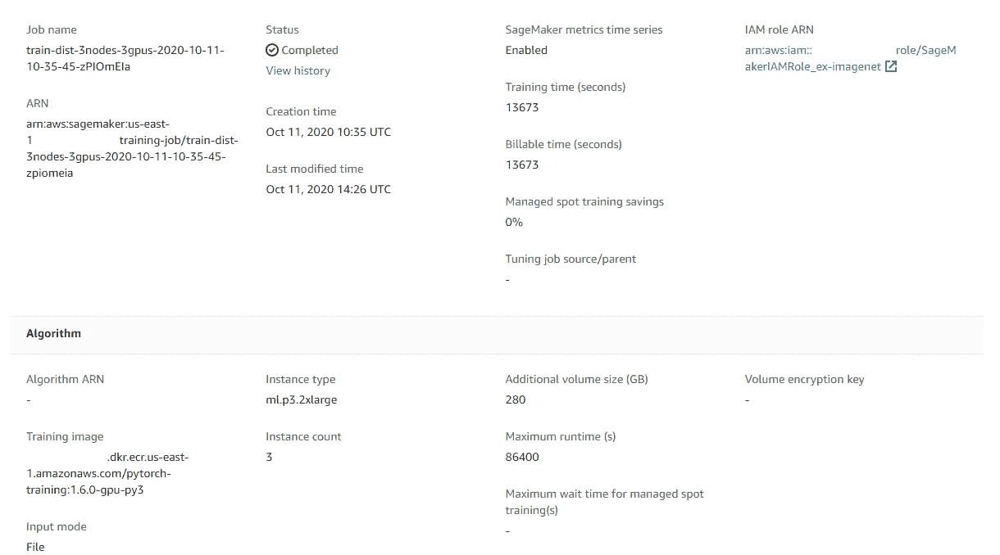
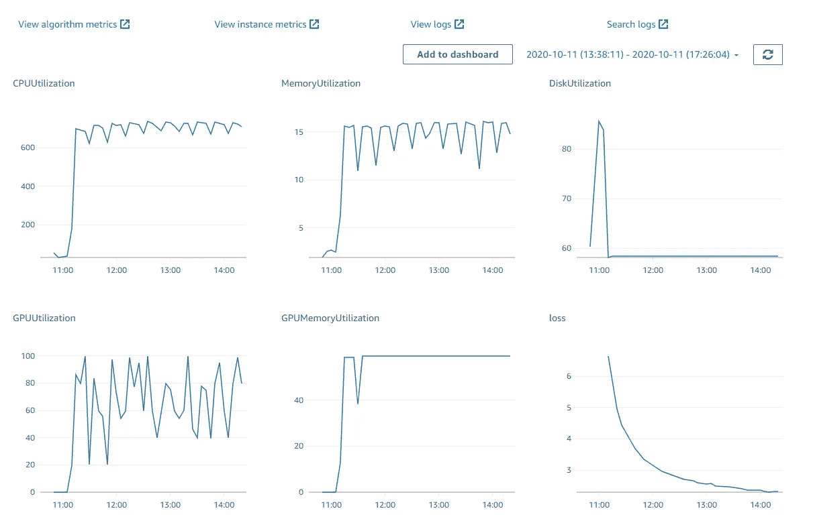
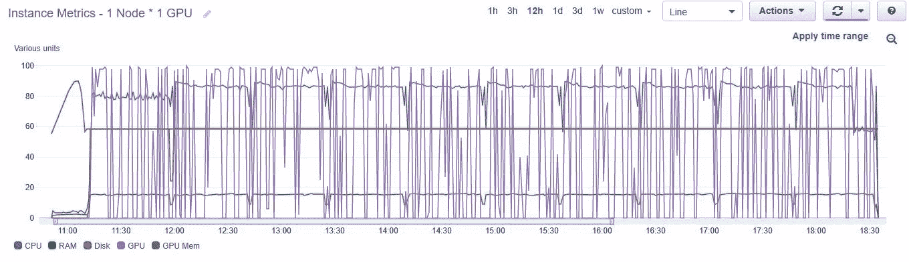
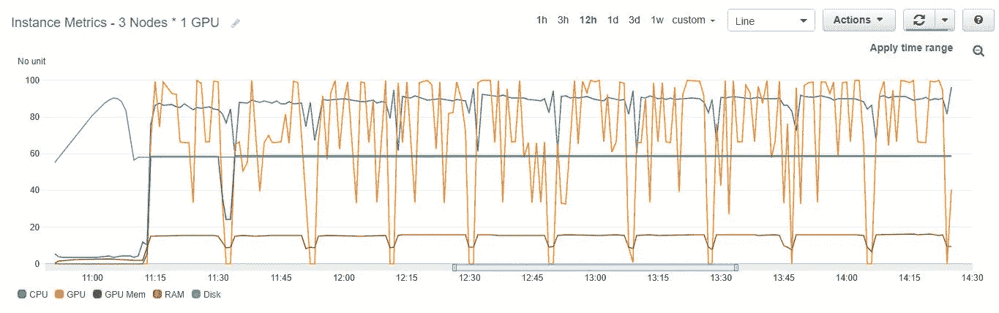
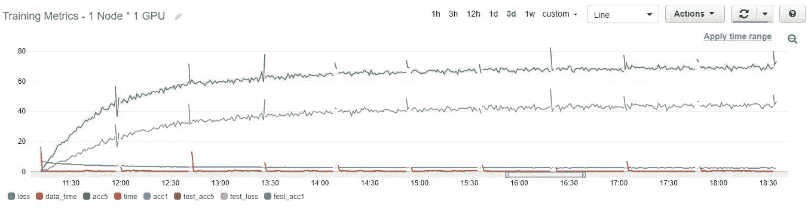
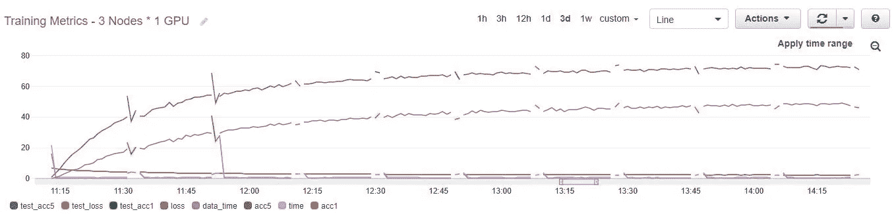

# AWS SageMaker 上的单线分布式 PyTorch 培训

> 原文：<https://towardsdatascience.com/single-line-distributed-pytorch-training-on-aws-sagemaker-813df77530d8?source=collection_archive---------63----------------------->

## 如何更快地迭代您的数据科学项目，让您的绝妙想法得以实现


作者图片

不管我在做什么研究项目，拥有合适的基础设施总是成功的关键部分。很简单:假设所有其他“参数”都相同，迭代越快/越便宜，在同样的时间/成本预算下，可以获得更好的结果。由于这些总是有限的，良好的基础设施通常是取得突破的关键。

说到数据科学，特别是深度学习，在强大的硬件上轻松分布训练过程的能力是实现快速迭代的关键。即使是最聪明的想法也需要几次迭代才能得到完善和验证，例如检查不同的预处理选项、网络架构，以及批量大小和学习速率等标准超参数。

在这篇文章中，我将向您展示在 AWS SageMaker 上使用[*simple-sage maker*](https://github.com/shiftan/simple_sagemaker)*分发现有的准备分发的 PyTorch 培训代码是多么容易(如果您愿意的话，还很便宜)(假设分发是在[支持的 gloo 或 nccl 后端](https://sagemaker.readthedocs.io/en/stable/frameworks/pytorch/using_pytorch.html#distributed-pytorch-training) ) *之上完成的)。*此外，您将了解如何在培训期间轻松地实时监控和分析资源利用率和关键培训指标。*

## *简单的 sagemaker*

*[*简单——SageMaker*](https://github.com/shiftan/simple_sagemaker)是围绕 [AWS SageMaker](https://aws.amazon.com/sagemaker/) 的薄包装器，这使得在[任何支持的实例类型](https://aws.amazon.com/sagemaker/pricing/) **上的工作分配非常简单**并且**便宜**。快速介绍可以在[这篇博文](/a-very-simple-and-cheap-way-to-run-your-processing-job-on-the-cloud-c76af579f9e9)中找到。*

# *在单行中分发 PyTorch 模型培训*

*我将基于 PyTorch 的官方 ImageNet 示例进行演示。事实上，我将只使用一个命令在 AWS 上运行它！*

*更准确地说，我假设:*

1.  *您已经安装了[*simple-sagemaker*](https://github.com/shiftan/simple_sagemaker):
    `pip install simple-sagemaker`*
2.  *您的 AWS 帐户凭证和默认区域是为 boto3 配置的，如 [Boto3 文档](https://boto3.amazonaws.com/v1/documentation/api/latest/guide/credentials.html)中所述。*
3.  *ImageNet 数据已经存储(和提取，稍后将详细介绍)在 S3 存储桶中，例如`s3://bucket/imagenet-data.`*
4.  *您已经将训练代码`[main.py](https://raw.githubusercontent.com/pytorch/examples/master/imagenet/main.py)`下载到当前工作目录。*

*现在，要在单个 p3.2xlarge 实例上运行训练代码，只需运行以下命令:*

*就这样，在培训作业运行时坐下来。实际上，您可能需要休息一下，因为在整个数据集(总共约 120 万张图像)上，10 个时期需要约 8 小时。别急，训练好的模特到最后会在`output/state`下等你。*

*对`ssm`命令的一些解释:*

1.  *`shell` —运行一个 shell 任务。*
2.  *`-p imagenet -t 1-node` —命名项目和任务。*
3.  *`-o ./output1 --download_state` —在训练结束时下载输出的本地路径+下载状态目录的请求(默认情况下也会下载日志)。*
4.  *`--iis` —使用来自`s3://bucket/imagenet-data`的 imagenet 数据作为映射到`$SM_CHANNEL_IMAGENET`路径的输入通道。*
5.  *`--it ml.p3.2xlarge` —将实例类型设置为`ml.p3.2xlarge.`*
6.  *`-d main.py` —添加 main.py 作为依赖项。*
7.  *`-v 280` —将 EBS 卷大小设置为 280 GB。*
8.  *`--no_spot` —使用按需实例而不是定点实例(默认)。更贵，但是时间是我们在努力节省的。*
9.  *`--cmd_line`—执行培训脚本。*

*一些注意事项:*

*   *在`[Bucket name]/[Project name]/[Task name]`下，每个任务被分配一个专用的 S3 路径。[路径](https://github.com/shiftan/simple_sagemaker#data-maintenance-on-s3)下有几个目录，但是现在与我们相关的是`state`，它不断地与 S3 同步，并且在连续执行相同的任务时保持不变。*
*   *由于脚本在当前工作目录中保留了检查点，我们首先将它更改为 state 目录— `$SSM_INSTANCE_STATE`*
*   *世界大小和节点等级是基于工作代码可访问的环境变量设置的。完整的列表可以在[这里](https://github.com/shiftan/simple_sagemaker#worker-environment)找到。*
*   *`--resume` —在训练停止的情况下，根据状态目录中保存的检查点恢复训练。*
*   *如果数据已经在您的本地机器上，您可以使用`-i`参数(而不是`--iis`)让它自动上传到 S3，并用作“数据”输入通道。*

*有关更多信息和选项，例如，如果您需要定制 docker 映像或使用本地数据集进行培训，请阅读[文档](https://github.com/shiftan/simple_sagemaker)，运行`ssm shell -h`以获得命令行参数的帮助，和/或查看简介[博客文章](/a-very-simple-and-cheap-way-to-run-your-processing-job-on-the-cloud-c76af579f9e9)。*

*让我们看看`./output1/logs/log0`处输出日志的结尾:*

```
** Acc@1 46.340 Acc@5 72.484
Total time: 26614 seconds*
```

*我们取得了 46.3 的前 1 名准确率和 72.484 的前 5 名准确率，总训练时间为 26，614 秒= ~7:23 小时。总共 8 个小时的运行时间是由于开销，主要是由于下载(和提取)输入数据(~150 BG)。其中大约 3-4 分钟是由于“标准 SageMaker 开销”——启动和准备实例、下载输入数据和训练图像。在 spot 实例上训练时，这可能会变得有点长。*

## *分发培训*

*回到你的时间预算，8 个小时对你来说可能太长了。如上所述，在某些情况下，这甚至意味着你的绝妙想法不会被公之于众。*

*幸运的是， [ImageNet 示例](https://github.com/pytorch/examples/tree/master/imagenet)代码写得很好，并且可以通过在几个实例上分配培训来轻松加速。此外，这将只是一个额外的参数！*

*又来了。将实例计数设置为 3( `--ic 3`)就可以在 3:51 小时内完成同样的工作！*

*查看输出日志`./output2/logs/log0`,我们看到在不到一半的训练时间内达到了相同的精度——11，605 秒= ~3:13 小时！*

```
** Acc@1 46.516 Acc@5 72.688
Total time: 11605 seconds*
```

# *监控和优化培训过程*

*所以，你节省了时间，你的绝妙想法也更接近现实了。但是，如何轻松地观察和监控进展，使机会更高呢？*

*首先，在 [SageMaker 培训工作控制台](https://console.aws.amazon.com/sagemaker/home#/jobs)上查看，并选择`3-nodes`工作。这里应该可以得到关于它的所有可用信息:*

**

*培训工作信息*

*那里有更多可用的信息，包括例如到州(检查站)的链接和 S3 的输出，请随意探索。*

*我们现在最感兴趣的部分是“Monitor”部分，在这里您可以获得实例利用率(CPU、RAM、GPU、GPU 内存、磁盘)和算法指标的图表(稍后将详细介绍)。*

*实例和算法指标的完整日志和动态 CloudWatch 图形系统的链接位于该部分的顶部，是进行分析的途径。*

**

*以下是两个培训周期的实例指标:*

****

*这些图表会实时更新，可以让您确保一切按预期进行，以及是否有任何关键的瓶颈需要解决。*

*经验法则是确保 GPU 负载大部分时间接近 100%。以上图中的 3 个节点为例，可以看到 GPU 的负载仅为 70%,这意味着我们可以从硬件中获得更多。一个好的猜测可能是有更多的数据加载工作线程，以更快地将数据推送到 GPU。*

## *算法度量*

*为了进一步简化对培训过程的监控，我们可以使用 [SageMaker metrics](https://docs.aws.amazon.com/sagemaker/latest/dg/training-metrics.html) 来实时获取特定于培训的指标。同样，我们只需要更新几个参数:*

*`--md`用于定义指标，其中第一个参数是名称，例如`"loss"`，第二个参数是从输出日志中提取数值的正则表达式。*

*快进一下，这是两个训练周期的算法指标:*

****

# *完整的分布式 ImageNet 培训管道*

*可以从[image-net.org](http://image-net.org/)网站下载 [LSVRC2012 ImageNet](http://image-net.org/challenges/LSVRC/2012/ilsvrc2012.pdf) 数据。这里 Google [描述的简单步骤](https://cloud.google.com/tpu/docs/imagenet-setup#download_the_imagenet_dataset)很有帮助。*

*由于完整的数据集大约有 120 万张图片，总大小约为 150GB，将其下载到本地，然后上传到 S3 水桶会花费很多时间。此外，在培训前将这么多文件从 S3 同步到培训实例也会非常慢。以下策略用于克服这些问题:*

1.  *使用专用的*处理*任务下载数据，配备更快的 S3 连接。*
2.  *S3 的数据保持在 1000 年左右。tar 文件，并在训练实例上提取，就在训练之前。*

*使用下面的`ssm`命令可以轻松启动*处理*任务:*

*其中`download.sh`是一个 bash 脚本，它下载数据并把数据排列到它在第一个参数(`$SSM_OUTPUT/data`)上获得的路径。一旦该任务完成，带有`train`和`val`子文件夹的`data`目录被放置在任务专用 S3 路径`[Bucket name]/[Project name]/[Task name]`的`output`目录下。训练命令现在也应该更新了:*

*这里引入了两个变化:*

1.  *为了“链接”这两个任务，使处理任务的输出成为训练任务的输入，现在使用参数`--iit`代替`--iis`。这将`train`和`val`子文件夹映射到具有相同名称的输入通道，可通过`SSM_CHANNEL_TRAIN`和`SSM_CHANNEL_VAL`环境变量访问。*
2.  *shell 脚本`extract.sh`用于在训练之前提取数据。*

*在 [*simple-sagemaker* 仓库](https://github.com/shiftan/simple_sagemaker/blob/master/examples/imagenet/run_remote.sh)中可以找到下载数据和执行一些训练选项的完整管道。*

# *摘要*

*简单的分布式模型培训设置是数据科学项目的必备工具。它现在触手可及，比您想象的更简单、更容易。利用它！*