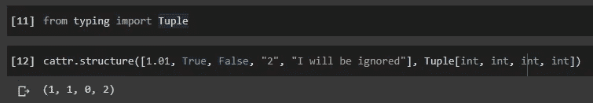
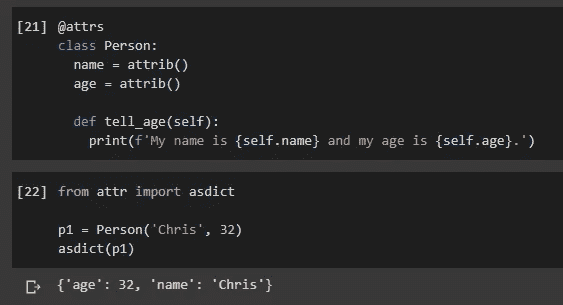
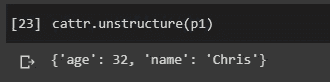
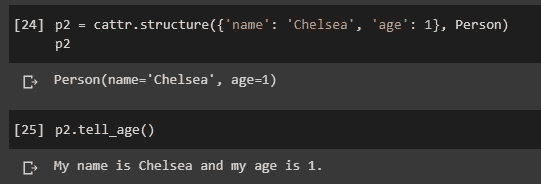
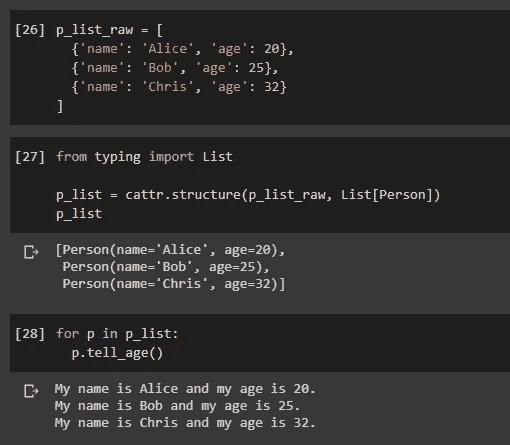
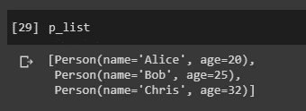
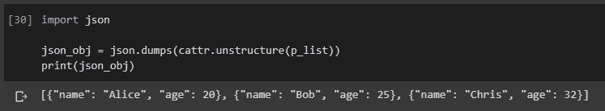
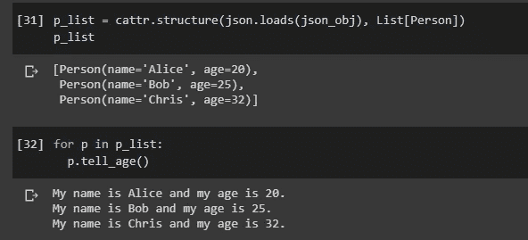

# 在 Python 对象和 JSON 之间交换的单行代码

> 原文：<https://towardsdatascience.com/single-line-of-code-to-interchange-between-python-objects-and-json-b0f23fbaaa65?source=collection_archive---------41----------------------->


照片由 [geralt](https://pixabay.com/users/geralt-9301/) 在 [Pixabay](https://pixabay.com/illustrations/binary-code-binary-binary-system-475664/) 上拍摄

## Python 编程技巧

## 在 Python 对象和 JSON 之间序列化/反序列化的最简单方法是`Attr`和`Cattr`

在我以前的一篇文章中，我介绍了 Python 中面向对象编程(OOP)的最佳实践，即使用“Attrs”库。

[](/probably-the-best-practice-of-object-oriented-python-attr-d8c26c0e8a4) [## 可能是面向对象 Python 的最佳实践— Attr

### 让 Python 面向对象编程变得更加容易

towardsdatascience.com](/probably-the-best-practice-of-object-oriented-python-attr-d8c26c0e8a4) 

然而，在大多数情况下，我们使用 OOP 可能是因为它可以序列化为字符串，如 JSON 字符串。更方便的是，我们还应该能够将它反序列化回类实例以用于其他目的。

例如，其中最流行的用法之一是数据访问对象(DAO)。因此，我们可以用对象实现 CRUD 函数，以便与持久层无缝集成。

因此，大多数时候，我们可能希望将 Python 对象序列化到 JSON 中，以便进行传输。相反，如果我们使用 Python 接收 JSON 类型的数据，我们也希望将 JSON 字符串反序列化为 Python 对象。

在本文中，我将介绍另一个库——“Cattr”，它可以与“attr”一起使用。我将把重点放在“Cattr”上，所以如果你对“attr”的功能感兴趣，请查看上面提到的文章。

# 安装和导入


照片由 [JoshuaWoroniecki](https://pixabay.com/users/JoshuaWoroniecki-12734309/) 在 [Pixabay](https://pixabay.com/photos/keyboard-computer-technology-light-5017973/) 上拍摄

首先，我们需要使用`pip`安装这两个库。

```
pip install attrs
pip install cattrs
```

在本文中，我们从`attr`中需要的只是类和属性函数的注释，所以让我们将它们和库`cattr`一起导入。

```
from attr import attrs, attrib
import cattr
```

# Cattr 的基本用法


由[在](https://pixabay.com/users/Free-Photos-242387/) [Pixabay](https://pixabay.com/photos/desk-table-simple-mockup-1081708/) 上的自由照片拍摄的照片

基本上，`cattr`用于在结构化和非结构化状态之间转换数据对象。例如，来自类的实例被认为是结构化数据，而 Python 字典和 JSON 对象被认为是非结构化数据。

假设我们要用不确定来规范一个列表中的数据，我们可以用`cattr`如下。

```
from typing import Tuplecattr.structure([1.01, True, False, "2", "I will be ignored"], Tuple[int, int, int, int])
```



请注意，我们使用的是来自`typing`库中的类型别名“Tuple ”,这是 Python 3 内置的。如果你不确定它是什么，这里是官方文档。

 [## 类型-支持类型提示- Python 3.8.3 文档

### 源代码:Lib/typing.py 注意 Python 运行时不强制函数和变量类型注释。他们可以是…

docs.python.org](https://docs.python.org/3/library/typing.html) 

在本例中，float、boolean 和 string 对象被调整为模板中指定的整数。此外，列表中的第 5 个对象被忽略，因为模板中只有 4 个元素。

# Cattr 与 attr 合作


由 [PublicDomainPictures](https://pixabay.com/users/PublicDomainPictures-14/) 在 [Pixabay](https://pixabay.com/photos/connect-connection-cooperation-20333/) 上拍摄的照片

`cattr`和`attr`一起处理班级的时候效果最好。

假设我们如下定义这个类。

```
[@attrs](http://twitter.com/attrs)
class Person:
  name = attrib()
  age = attrib()def tell_age(self):
    print(f'My name is {self.name} and my age is {self.age}.')
```

当然，正如我在上一篇文章中介绍的，`attr`可以用于将实例序列化到字典中。

```
from attr import asdictp1 = Person('Chris', 32)
asdict(p1)
```



当然，`cattr`也可以这样做。

```
cattr.unstructure(p1)
```



看起来来自`attr`的`asdict()`函数更直观。然而，这只是序列化。如果我们得到了一个字典，并想将它反序列化为一个`Person` 对象，该怎么办？这次`attr`帮不上忙，但是我们可以用`cattr`。

```
p2 = cattr.structure({'name': 'Chelsea', 'age': 1}, Person)
```



# Cattr 使用字典列表


由[约瑟夫菲尔德](https://pixabay.com/users/josephredfield-8385382/)在 [Pixabay](https://pixabay.com/photos/people-friends-together-happy-4050698/) 上拍摄的照片

上面的例子只是对单个字典的反序列化。实际上，这并不理想。如果我们想将字典列表反序列化为 Python 对象，该怎么办？在下面的例子中，我们有三个字典要在列表中描述。

```
p_list_raw = [
  {'name': 'Alice', 'age': 20},
  {'name': 'Bob', 'age': 25},
  {'name': 'Chris', 'age': 32}
]
```

要实现这一点，我们还需要定义一个“模板”。请注意，我们传入的参数不再是“人”，而是“人”对象的列表。因此，我们需要再次使用输入别名。

```
from typing import Listp_list = cattr.structure(p_list_raw, List[Person])
```



因此，我们从 person 字典列表中得到一个 person 对象列表。

# Cattr 使用 JSON


照片由 [SCY](https://pixabay.com/users/SCY-1147075/) 在 [Pixabay](https://pixabay.com/photos/laptop-book-information-online-819285/) 上拍摄

当然，我们并不满足于仅仅序列化/去序列化 Python 字典。我们希望它是一个 JSON 对象！这也很容易。事实上，我们唯一需要做的就是导入`json`库，它也是一个 Python 内置模块。

回想一下，在前面的例子中，我们有一个 Python 对象列表`p_list`。



要将其序列化为 JSON 数组，只需将`cattr`与`json.dumps()`函数一起使用，如下所示。

```
import jsonjson_obj = json.dumps(cattr.unstructure(p_list))
print(json_obj)
```



将 JSON 数组反序列化为 Python 对象列表也非常容易。简单地将`json.loads()`功能与`cattr`结合使用。

```
p_list = cattr.structure(json.loads(json_obj), List[Person])
```



只是不要忘记我们需要输入别名“列表”作为模板。

当然，上面的例子也显示了去序列化的对象可以用它们的类函数来调用:)

# 摘要


由 [geralt](https://pixabay.com/users/geralt-9301/) 在 [Pixabay](https://pixabay.com/photos/learn-note-sign-directory-64058/) 上拍摄的照片

在这篇文章中，我介绍了如何使用`cattr`和`attr`库来实现将 Python 对象序列化为 dictionary/JSON，以及以一种极其简单的方式将 dictionary 和 JSON 对象反序列化为 Python 对象。

考虑到这在大多数其他编程语言中通常不是一件容易的事情，至少实现起来没有那么快，我想说这从一个方面反映了为什么人们喜欢 Python。

本文中的所有代码都可以在这里找到:

[](https://colab.research.google.com/drive/1fm8PWLVp2vHEhkArmUcDp6VdNqLSG-O1?usp=sharing) [## Attrs+Cattrs.ipynb

### Google Colab

colab.research.google.com](https://colab.research.google.com/drive/1fm8PWLVp2vHEhkArmUcDp6VdNqLSG-O1?usp=sharing) [](https://medium.com/@qiuyujx/membership) [## 通过我的推荐链接加入 Medium 克里斯托弗·陶

### 作为一个媒体会员，你的会员费的一部分会给你阅读的作家，你可以完全接触到每一个故事…

medium.com](https://medium.com/@qiuyujx/membership) 

如果你觉得我的文章有帮助，请考虑加入 Medium 会员来支持我和成千上万的其他作者！(点击上面的链接)