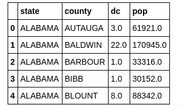
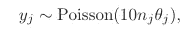
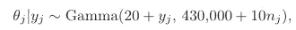
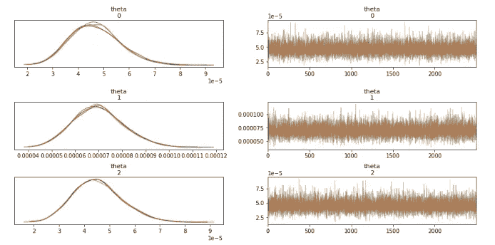
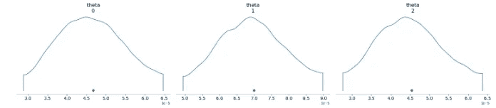
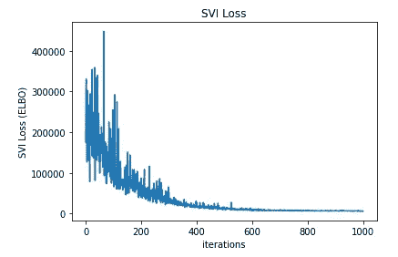
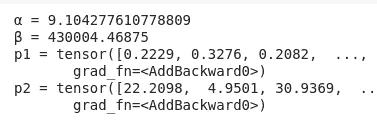

# 单参数模型| Pyro 与 STAN

> 原文：<https://towardsdatascience.com/single-parameter-models-pyro-vs-stan-e7e69b45d95c?source=collection_archive---------32----------------------->

## 用两种贝叶斯方法模拟美国癌症死亡率:斯坦的 MCMC 和 T2 的 SVI。


模拟美国各县的死亡率——照片由 Joey Csunyo 在 Unsplash 上拍摄

单参数模型是开始概率建模主题的极好方法。这些模型包括一个影响我们观察的参数，我们可以从给定的数据中推断出来。在本文中，我们着眼于性能并比较两个成熟的框架——统计语言 STAN 和 Pyro 概率编程语言(PPL)。

# 肾癌数据

一个古老而确定的数据集是美国 1980-1989 年的肾癌病例，可在[这里](http://www.stat.columbia.edu/~gelman/book/data/cancer/)获得(见【1】)。给出了美国各县、其总人口和报告的癌症死亡病例。我们的任务是用贝叶斯方法从给定的数据中推断出死亡率。
*任务的详细走查可以在“贝叶斯数据分析 3”【1】的 2.8 节中找到。*
我们的数据帧看起来像这样:



我们有数据点总数 **N** (数据框中的所有行)，每个县有观察到的死亡数(dc)，我们称之为 **y** 和人口数(pop)，我们稍后称之为 **n** 。
鉴于我们有流行病学数据，我们认为泊松分布为估计我们想要计算的比率提供了良好的基础。因此，我们的观察值 **y** 是从**泊松分布**中采样的。有趣的参数是泊松的λ，我们称之为速率。这个死亡率来自伽马分布(见第 2 章[1]的解释)。一个非常简短的解释，为什么我们在这里使用γ，是因为它是关于泊松的共轭先验。
尽管这些分布有更多的特殊关系。

把它放在一起，我们得出死亡病例的观察公式:



而对于想要的*单参数*速率:



现在我们已经看到了任务，让我们启动工具开始工作。

# STAN——经典统计模型

统计学家公认的工作语言是统计语言。
你把你的问题写成模型代码，斯坦会在幕后编译一个高效的 C++模型。从一个编译的模型中，你可以取样并执行推理。该框架提供了不同的[接口](https://mc-stan.org/users/interfaces/)，例如 Python (PyStan)、R (RStan)、Julia 等。对于本文，我们将使用 **PyStan** ，这样我们就可以将两种模型整齐地并排放在一个笔记本中。
我们开始定义我们在 STAN 中给出的数据。这意味着整数 **N** 表示数据集的总大小， **y** 表示观察到的死亡人数， **n** 表示每个县的人口数。这样我们每个人都有 N 次。

```
kidney_cancer_code="""
data {
   int N; // total observations
   int y[N]; // observed death-count
   vector[N] n; // population
}
...
```

我们已经知道，像死亡率θ这样的速率参数有界在[0，1]内。这意味着利率不能小于 0 或大于 1。
该θ参数是实际比率的基础，即一个县的人口数。因此，由于我们转换了我们的参数，我们将其放入*转换参数*括号中。：

```
...
parameters {
   vector<lower=0,upper=1>[N] theta; // bounded deathrate estimate
}transformed parameters {
   vector[N] rate=n .* theta;
}
...
```

现在到了神奇的推理部分，这就是后验概率的意义所在。我们从伽玛分布中对θ进行采样。α (=20)和β (=430000)在[1]中给出，但人们可以很容易地从基础数据集计算出它们。请注意，模型实际上采用了转换后的参数，而不仅仅是θ。这将在稍后的输出中变得明显。

```
...
model {
   theta ~ gamma(20,430000);
   y ~ poisson(rate);
}
"""
```

现在我们有了一个字符串形式的 STAN 模型，我们需要正确格式的数据。这意味着数据中的整数数组，就像这样:

```
dc = data["dc"].to_numpy().astype(int)
pop = data['pop'].to_numpy().astype(int)
kidney_cancer_dat = {'N': N,
                    'y': dc[0:N],
                    'n': pop[0:N]}
```

由于一切都已设置好，我们可以使用 PyStan 将我们的模型转换成 C++代码，并使用采样来执行推理。推理过程是马尔可夫链蒙特卡罗或 MCMC。必要的参数是我们采集的样本量(迭代)和我们绘制样本的链的数量。每条链都是有序的抽奖序列。

```
sm = pystan.StanModel(model_code=kidney_cancer_code)
fit = sm.sampling(data=kidney_cancer_dat, iter=5000, chains=4)
```

拟合完成后，首先要检查的是模型是否收敛。这意味着 R(-hat)> = 1，或者我们可以直接询问诊断工具:

```
stan_utility.check_all_diagnostics(fit)### the below lines are output:
n_eff / iter looks reasonable for all parameters
Rhat looks reasonable for all parameters
0.0 of 10000 iterations ended with a divergence (0.0%)
0 of 10000 iterations saturated the maximum tree depth of 10 (0.0%)
E-BFMI indicated no pathological behavior
```

我们还可以从执行的推理的轨迹中看到链已经收敛(右图):

```
az.plot_trace(fit,var_names=['theta'])
```



*图 1——θ后验计算的轨迹图。右侧的采样链显示收敛。每条链都有一个 theta 的密度函数(左侧)，显示了数值的一致性。*

链条(图 1 右侧)应该看起来像“疯狂相爱的毛毛虫”，诊断看起来也不错。这意味着我们的模型已经收敛。我们现在可以看看推断的θ值和个体密度:

```
az.plot_density(fit, var_names=["theta"])
```



*图 2——推断后拟合单参数θ的后验密度。*

```
Warning: Do not use the complete dataset as input! This will lead to errors,
we went with N=25 samples for testing purposes. Feel free to test how many samples it takes to break PyStan (or STAN).
```

为了完成贝叶斯回归任务，也有不同的模块让你跳过“写一个精心制作的统计模型”的部分。[*【BRMS】*](https://github.com/paul-buerkner/brms)*在 R 就是那些优秀的工具之一。*

# 概率规划方法

提供一个完全不同的范例是 Pyro。我们不是通过采样来执行 MCMC，而是将我们的任务视为优化问题。
为此，我们制定了一个模型，它计算我们的后验概率( **p** )。此外，我们还制定了一个所谓的指南，为我们提供了一个参数化分布( **q** )，用于模型拟合过程。
*在之前的故事中，我们已经了解了这种优化的工作原理，并推荐一个简短的回顾。*

[](/compute-the-incomputable-how-svi-and-elbo-work-505ce0868fdd) [## 计算无法计算的| SVI 和艾尔波是如何工作的

### 贝叶斯建模与真实世界数据一起工作的一个原因。随机海洋中的近似灯塔。

towardsdatascience.com](/compute-the-incomputable-how-svi-and-elbo-work-505ce0868fdd) 

我们的模型不太直观的部分是，我们不是简单地拟合一个参数，而是由四个 Pyro 参数组成。：

1.  首先，α和β是常数，它们赋予我们的伽马分布形状，就像我们在 STAN 部分所做的那样，
2.  我们添加了两个钻孔可训练参数 p1 和 p2，这允许在 SVI 步骤中进行优化。两个参数都是正的，因此约束=约束。
3.  当浏览数据时，观察本身是独立的事件。
    这是通过 Pyro 的平板建模完成的，它也支持从我们的数据集中进行二次采样。在[2]中可以找到对此的很好的介绍。

```
ϵ = 10e-3
def model(population, deathcount):
    α = pyro.param('α', torch.tensor(20.))
    β = pyro.param('β', torch.tensor(430000.))
    p1= pyro.param('p1', torch.ones(data.shape[0]), constraint=constraints.positive)
    p2 = pyro.param('p2', torch.ones(data.shape[0]), constraint=constraints.positive)
    with pyro.plate('data', data.shape[0], subsample_size=32) as idx:
        n_j = population[idx]
        y_j = deathcount[idx]
        α_j = α + p1[idx]*y_j
        β_j = β + p2[idx]*n_j
        θ_j = pyro.sample("θ", Gamma(α_j, β_j))
        λ_j = 10*n_j*θ_j + ϵ
        pyro.sample('obs', Poisson(λ_j), obs=y_j)
```

该模型对给定泊松分布的观测值进行采样。这与 STAN 所做的工作相当，不同之处在于构成λ和底层分布的参数现在是可训练的 Pyro 参数。
为了使我们的模型不被烧毁，我们必须在速率中加入一个小数值ϵ，否则泊松对象在后面的计算中将会不稳定:

```
λ_j = 10*n_j*θ_j + ϵThis is not the best way to model this task, but it is closest to the STAN model. One can find a model and guide that do not rely on **y** and **n** for computing α and β.
```

现在，指南为我们提供了一个参数化分布 **q** ，我们可以使用它来执行优化，以最小化证据下限或 ELBO。参数是可训练的烟火参数，我们已经在模型中看到了。

```
def guide(population, deathcount):
    α = pyro.param('α', torch.tensor(20.))
    β = pyro.param('β', torch.tensor(430000.))
    p1 = pyro.param('p1', torch.ones(data.shape[0]), constraint=constraints.positive)
    p2 = pyro.param('p2', torch.ones(data.shape[0]), constraint=constraints.positive)
    with pyro.plate('data', data.shape[0], subsample_size=32) as idx:
        n_j = population[idx]
        y_j = deathcount[idx]
        α_j = α + p1[idx]*y_j
        β_j = β + p2[idx]*n_j
        θ_j = pyro.sample("θ", Gamma(α_j, β_j))
```

我们可以像这样继续运行我们的随机变分推理:

```
svi = SVI(model, guide, Adam({'lr': 0.025}), JitTrace_ELBO(3))
for i in tqdm(range(1000)):
    loss = svi.step(population, deathcount)
    print(f"Loss: {loss}")
```

当我们绘制损失图时(见图 3)，我们可以看到模型随着时间的推移而改进。界限越低越好。损失是迭代过程中的 ELBO 轨迹。



*图 3——迭代过程中的 SVI 损失。Loss 是经过 1000 次迭代后从 SVI 步骤返回的 ELBO。*

现在进行最后的检查，我们可以看到我们已经安装了合适的参数。我们的模型发现的α和β变量为我们的后验推断提供了一个很好的基础伽马分布。



优化步骤后拟合的 Pyro 参数

# 结论——什么方法是最好的？

斯坦有一种简单明了的方式来推理这个模型。如果后验概率的数学公式是已知的，那么实现一个模型是非常简单的。然而，STAN 及其 MCMC 采样有其局限性。在*默认配置*下，不可能在所有数据上运行我们的模型。
Pyro 在高效处理大型数据集和执行变分推理方面表现出色。作为一种概率编程语言，它可以像任何其他 Python 代码一样编写。模型和指南也提供了丰富的信息，很好地概括了问题。通过这种方法，我们将后验计算转化为优化任务，并得到合理的输出。

既然您已经熟悉了单参数模型，那么就享受处理更大、更复杂任务的乐趣吧。[烟火示例](https://pyro.ai/examples/)是一个很好的起点。

快乐推断！

# 参考

[1] A .盖尔曼、J.B .卡林等人。艾尔。、 [*贝叶斯数据分析*](http://www.stat.columbia.edu/~gelman/book/) 。第三版。
【2】Pyro 文档 [*SVI 第二部*](https://pyro.ai/examples/svi_part_ii.html)