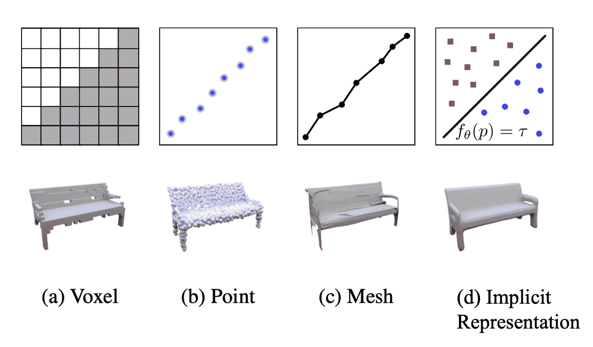

# 单阶段实例分割——综述

> 原文：<https://towardsdatascience.com/single-stage-instance-segmentation-a-review-1eeb66e0cc49?source=collection_archive---------3----------------------->

## 实时实例分割的未来一瞥

更新:

*   2020/07/17:添加空间嵌入(ICCV 2019)的简要描述，一种自下而上的方法

实例分割是一项具有挑战性的计算机视觉任务，需要预测对象实例及其每像素分割掩模。这使得它成为语义分割和对象检测的混合。

自从 [Mask R-CNN](https://arxiv.org/abs/1703.06870) 发明以来，用于实例分割的最先进方法主要是 Mask RCNN 及其变体( [PANet](https://arxiv.org/abs/1803.01534) 、 [Mask Score RCNN](https://arxiv.org/abs/1903.00241) 等)。它采用先检测后分割的方法，首先进行对象检测，提取每个对象实例周围的包围盒，然后在每个包围盒内进行二值分割，以分离前景(对象)和背景。

> 除了自顶向下的先检测后分割(或逐检测分割)方法之外，还有其他一些实例分割方法。一个这样的例子是通过将实例分割公式化为自下而上的像素分配问题来关注像素，正如在**(ICCV 2019)中所做的那样。但是这种方法通常比先检测后分割的 SOTA 方法性能差，在这篇文章中我们就不详述了。**

**然而，Mask RCNN 非常慢，并且排除了许多实时应用的使用。此外，由掩模 RCNN 预测的掩模具有固定的分辨率，因此对于具有复杂形状的大对象不够精细。在无锚点对象检测方法的进步(如 [CenterNet](https://arxiv.org/abs/1904.07850) 和 [FCOS](https://arxiv.org/abs/1904.01355) )的推动下，出现了一波对单阶段实例分割的研究。参见我的[幻灯片](https://docs.google.com/presentation/d/1_dUfxv63108bZXUnVYPIOAdEIkRZw5BR9-rOp-Ni0X0/edit?usp=sharing)快速介绍无锚点对象检测)。这些方法中有许多比掩膜 RCNN 更快、更准确，如下图所示。**

****

**最近在 Tesla V100 GPU 上测试的一阶段方法的推理时间([来源](https://arxiv.org/abs/2003.10152)**

**这篇博客将回顾单阶段实例分割的最新进展，重点是掩码表示——实例分割的一个关键方面。**

# **局部掩码和全局掩码**

**在实例分割中要问的一个核心问题是实例掩码的表示或参数化——1)是使用局部掩码还是全局掩码，以及 2)如何表示/参数化掩码。**

****

**遮罩表示:局部遮罩和全局遮罩**

**主要有两种方法来表示实例掩码:局部掩码和全局掩码。一个**全局遮罩**是我们最终想要的，它具有与输入图像相同的空间范围，尽管分辨率可能更小，例如原始图像的 1/4 或 1/8。它有一个天然的优势，即对于大物体和小物体具有相同的分辨率(因此具有固定长度的特征)。这不会牺牲较大对象的分辨率，固定分辨率有助于执行批处理以进行优化。一个**局部遮罩**通常比一个全局遮罩更紧凑，因为它没有过多的边界。它必须与遮罩位置一起使用才能恢复到全局遮罩，而局部遮罩的大小将取决于对象的大小。但是为了执行有效的批处理，实例掩码需要固定长度的参数化。最简单的解决方案是将实例遮罩的大小调整为固定的图像分辨率，如遮罩 RCNN 所采用的。正如我们在下面看到的，还有更有效的方法来参数化局部掩码。**

**根据是使用局部还是全局掩码，单阶段实例分割可以大致分为基于**局部掩码的**和基于**全局掩码的**方法。**

# ****基于局部掩模的方法****

**基于局部掩码的方法直接输出每个局部区域的实例掩码。**

## **具有显式编码的轮廓**

**包围盒在某种意义上是一个粗糙的遮罩，它用最小的包围矩形来近似遮罩的轮廓。 [ExtremeNet](https://arxiv.org/abs/1901.08043) (通过对极值点和中心点进行分组的自下而上的对象检测，CVPR 2019)通过使用四个极值点(因此是具有 8 个自由度的边界框，而不是传统的 4 个 DoF)来执行检测，并且这种更丰富的参数化可以通过在其相应边缘上的两个方向上将极值点延伸到整个边缘长度的 1/4 的片段来自然地延伸到八边形遮罩。**

****

**此后，有一系列的工作试图将实例掩模的轮廓编码/参数化成固定长度的系数，给出不同的分解基础。这些方法回归每个实例的中心(不一定是 bbox 中心)和相对于该中心的轮廓。 [ESE-Seg](https://arxiv.org/abs/1908.04067) (实时实例分割的显式形状编码，ICCV 2019)为每个实例设计了一个内中心半径形状签名，并用切比雪夫多项式进行拟合。 [PolarMask](https://arxiv.org/abs/1909.13226) (PolarMask:使用极坐标表示的单次拍摄实例分割，CVPR 2020)利用从中心开始的恒定角度间隔的射线来描述轮廓。 [FourierNet](https://arxiv.org/abs/2002.02709) (FourierNet:使用可微分形状解码器进行分割的紧凑掩模表示)引入了使用傅立叶变换的轮廓形状解码器，比 PolarMask 实现了更平滑的边界。**

****

**各种基于轮廓的方法**

**这些方法通常使用 **20 到 40** 系数来参数化掩模轮廓。它们推理速度快，易于优化。然而，它们的缺点也是显而易见的。首先，从视觉上看，它们看起来——说实话——都很糟糕。他们不能精确地描绘面具，也不能描述中间有洞的物体。**

> **我个人认为这一行很可爱，但没什么前途。实例遮罩或其轮廓的复杂拓扑的显式编码是难以处理的。**

## **结构化 4D 张量**

**[TensorMask](https://arxiv.org/abs/1903.12174) (TensorMask:稠密对象分割的基础，ICCV 2019)是通过预测每个特征图位置的掩膜来展示稠密掩膜预测思想的首批作品之一。张量掩模仍然预测感兴趣区域的掩模而不是全局掩模，并且它能够运行实例分割而不运行对象检测。**

**张量掩模利用结构化的 4D 张量来表示空间域上的掩模(2D 在输入图像中的所有可能位置上迭代，2D 在每个位置上表示掩模)，它还引入了*对齐表示*和*张量双锥*来恢复空间细节，但是这些对齐操作使得网络甚至比两级掩模 R-CNN 更慢。此外，为了获得良好的性能，需要使用比标准 COCO 对象检测流水线长六倍的调度(6x 调度)来训练它。**

****

## **紧凑掩码编码**

**自然对象遮罩不是随机的，它类似于自然图像，实例遮罩驻留在比像素空间低得多的固有维度中。[MEInst](https://arxiv.org/abs/2003.11712)(CVPR 2020 年单镜头实例分割的掩模编码)将掩模提取为紧凑和固定的维度表示。通过 PCA 的简单线性变换，MEInst 能够将 28x28 的局部掩模压缩成一个 **60** 维的特征向量。本文还尝试了在一级目标检测器()上直接回归 28x28=784 维特征向量，在 1 到 2 个 AP 点下降的情况下也能得到合理的结果。这意味着直接预测高维掩码(在每个张量掩码的自然表示中)并非完全不可能，但是很难优化。掩码的紧凑表示使得优化更容易，并且在推理时运行更快。它最类似于掩模 RCNN，并且可以直接与大多数其他对象检测算法一起使用。**

****

# **基于全局掩码的方法**

****基于全局遮罩的**方法首先基于整个图像生成中间的和共享的特征图，然后组合提取的特征以形成每个实例的最终遮罩。这是目前一阶段实例分割方法中的主流方法。**

## **原型和系数**

**[YOLACT](https://arxiv.org/abs/1904.02689) (YOLACT:实时实例分割，ICCV 2019)是最早尝试**实时**实例分割的方法之一。YOLACT 将实例分割分成两个并行任务，生成一组**原型**掩码，并预测每个实例的掩码系数。原型掩码是用 FCN 生成的，可以直接受益于语义分割的进步。系数被预测为边界框的额外特征。这两个并行步骤之后是组装步骤:通过矩阵乘法实现简单的线性组合，并对每个实例的预测边界框进行裁剪操作。裁剪操作减少了网络抑制边界框之外的噪声的负担，但是如果边界框包括同一类的另一个实例的一部分，仍然会看到一些*泄漏*。**

****

**原型掩码的预测对于确保最终实例掩码的高分辨率是至关重要的，这可与语义分割相媲美。原型遮罩仅依赖于输入图像，而与类别和具体实例无关。这种分布式表示是紧凑的，因为原型掩码的数量独立于实例的数量，这使得 YOLACT 的掩码计算成本恒定(不像掩码 RCNN，其计算成本与实例的数量成线性)。**

**回顾 MSRA 的 [**InstanceFCN**](https://arxiv.org/abs/1603.08678) (实例敏感全卷积网络，ECCV 2016)和后续研究[**【FCIS】**](https://arxiv.org/abs/1611.07709)(全卷积实例感知语义分割，CVPR 2017)，它们似乎是 YOLACT 的一个特例。InstanceFCN 和 FCIS 都利用 FCN 生成多个包含对象实例相对位置的实例敏感得分图，然后应用组装模块输出对象实例。位置敏感的得分图可以被视为原型掩模，但代替学习的线性系数，IntanceFCN 和 FCIS 使用一组固定的空间池操作来组合位置敏感的原型掩模。**

****

**InstanceFCN [b]和 FCIS [c]使用固定池操作进行实例分段([源](https://arxiv.org/pdf/1611.07709.pdf))**

**[**BlendMask**](https://arxiv.org/abs/2001.00309)(blend mask:自上而下遇到自下而上进行实例分割，CVPR 2020)建立在 YOLACT 的基础上，但 blend mask 不是为每个原型遮罩预测一个标量系数，而是预测一个低分辨率(7x7)注意力图来混合边界框内的遮罩。这个注意力地图被预测为附着于每个边界框的高维特征(7×7 = 49-d)。有趣的是，BlendMask 使用的原型遮罩是 4 个，但它甚至只用 1 个原型遮罩就能工作。 [**中心遮罩**](https://arxiv.org/abs/2004.04446) (中心遮罩:用点表示的单镜头实例分割，CVPR 2020)几乎以完全相同的方式工作，并显式使用 1 个原型遮罩(名为全局显著图)。CenterMask 使用 CenterNet 作为主干，而 BlendMask 使用类似的无锚点单级 FCOS 作为主干。**

****

**中心遮罩的架构。BlendMask 也有极其相似的管道。**

> **注意，BlendMask 和 CenterMask 都进一步依赖于检测到的边界框。在与裁剪的原型遮罩混合之前，注意力图或形状遮罩必须缩放到与边界框相同的大小。**

****(例如分割的条件卷积)更进一步，完全去除了对边界框的任何依赖。它没有组装裁剪过的原型面具，而是借用了**动态过滤器**的想法，预测一个轻量级 FCN 头部的参数。FCN 磁头有三层，共有 169 个参数。令人惊讶的是，作者表明，即使原型面具是单独的 2-ch coord conv，网络也可以预测 COCO 上 31 AP 的良好结果。我们将在下面的**隐式表示**部分讨论这一点。****

********

****BlendMask /CenterMask 和 CondInst 都是 YOLACT 的扩展。****

*   ****BlendMask/CenterMask 尝试在每个 bbox 中将裁剪的原型遮罩与更细粒度的遮罩混合。YOLACT 是 BlendMask 或 CenterMask 的一个特例，其中注意力图的分辨率是 1×1。****
*   ****CondInst 正在尝试将裁剪过的原型遮罩与由动态预测滤镜组成的更深层次的转换融合在一起。YOLACT 是 FCN 是 1×1 conv 层的一个特例。****

****使用分支来预测原型掩码允许这些方法受益于使用语义分割的辅助任务(通常在 AP 中提升 1 到 2 个点)。它也可以自然地扩展到执行全景分割。****

****关于表示每个实例掩码所需的参数，下面列出了一些技术细节。这些具有全局遮罩和系数的方法对每个实例遮罩使用 **32，196，169** 个参数。****

*   ****YOLACT 采用 32 原型蒙版+ 32-dim 蒙版 coeff +方框裁剪；****
*   ****BlendMask 使用 4 个原型遮罩+ 4 张 7x7 注意力图+方框裁剪；****
*   ****CondInst 使用 coordConv + 3 1x1 动态 conv (169 个参数)****

# ****SOLO 和 SOLOv2:按位置分割对象****

****SOLO 是独一无二的，值得拥有自己的部分。这些论文见解深刻，写得非常好。它们对我来说是一件艺术品(就像我最喜欢的另一个 CenterNet 一样)。****

********

****SOLOv1 的架构****

****The first author of the paper posted his reply on the motivation of SOLO on [Zhihu (知乎)](https://www.zhihu.com/question/360594484/answer/936591301), which I quote below:****

> ****语义分割预测图像中每个像素的语义类别。类似地，对于实例分割，我们建议预测每个像素的**“实例类别”**。现在的关键问题是，我们如何定义实例类别？****
> 
> ****如果输入图像中的两个对象实例具有完全相同的形状和位置，则它们是同一个实例。任何两个不同的实例都有不同的位置或形状。由于形状一般很难描述，我们用大小来近似形状。****

****因此，“实例类别”是由位置和大小定义的。**位置**按其中心位置分类。SOLO 通过将输入图像划分为 S x S 个像元的网格并由此划分 S 个类来近似中心位置。**大小**通过将不同大小的对象分配到特征金字塔的不同级别(FPN)来处理。因此，对于每个像素，SOLO 只需要决定将像素(和相应的实例类别)分配给哪个 SxS 网格单元和哪个 FPN 级别。所以 SOLO 只需要执行两个像素级的分类问题，类似于语义分割。另一个关键问题是面具是如何表现的？****

****实例遮罩由堆叠在 S 通道中的**全局遮罩**直接表示。这是一个同时解决许多问题的巧妙设计。首先，许多先前的研究将 2D 掩模存储为展平向量，当掩模分辨率增加导致通道数量激增时，这很快变得难以处理。全局遮罩自然会保留遮罩像素内的空间关系。第二，全局掩模生成可以保持掩模的高分辨率。第三，预测掩模的数量是固定的，与图像中的对象无关。这类似于原型遮罩的工作线，我们将在 SOLOv2 中看到这两个流是如何合并的。****

****SOLO 将实例分割公式化为仅分类问题，并消除了任何对回归的依赖。这使得 SOLO 自然独立于对象检测。SOLO 和 CondInst 是两个直接作用于全局遮罩的作品，是真正的无边界框方法。****

********

****索罗预言的全球面具。掩模是冗余的、稀疏的，并且对目标定位误差是鲁棒的。****

## ****分辨率权衡****

****从 SOLO 预测的全局掩模中，我们可以看到，由于相邻通道预测的掩模非常相似，所以掩模对定位误差相对不敏感。这带来了对象定位的分辨率(以及精度)和实例遮罩之间的折衷。****

****4D 结构张量的想法在理论上很有意义，但在 NHWC 张量格式的当前框架下很难在实践中实现。将具有空间语义的 2D 张量展平为 1D 向量将不可避免地丢失一些空间细节(类似于使用全连接网络进行语义分割)，甚至在表示 128x128 的低分辨率图像时也有其局限性。位置的 2D 或掩模的 2D 必须牺牲分辨率。大多数先前的研究理所当然地认为位置分辨率更重要，并且下采样/压缩蒙版尺寸，损害了蒙版的表现力和质量。TensorMask 试图取得平衡，但繁琐的操作导致训练和推理速度缓慢。SOLO 意识到我们不需要高分辨率的位置信息，并借鉴了 YOLO 的方法，将位置信息压缩到一个粗略的 S 网格中。这样，SOLO 保持了全局遮罩的高分辨率。****

> ****我天真地认为 SOLO 也许可以预测 S x W x H 全局遮罩，作为附加到 YOLO 每个 S 网格的扁平 WH 维特征。我错了——全分辨率的全局蒙版公式而不是扁平矢量实际上是 SOLO 成功的关键。****

## ****解耦独奏和动态独奏****

****如上所述，在 S 通道中由 SOLO 预测的全局掩码是相当冗余和稀疏的。即使在 S=20 的粗略分辨率下，也有 400 个通道，并且图片中不太可能有如此多的对象以至于每个通道都包含有效的实例遮罩。****

****在解耦 SOLO 中，形状为 H x W x S 的原始 m 张量被形状为 H x W x S 的两个张量 x 和 y 代替。对于位于网格位置(I，j)的对象，M_ij 通过逐元素乘法 X_i ⊗ Y_j 来近似。这将 400 个通道减少到 40 个通道，并且实验表明性能没有下降。****

********

****SOLO vs 去耦 SOLO vs SOLOv2****

****现在很自然地会问，我们是否可以借鉴 YOLACT 的原型遮罩思想，通过预测更少的遮罩并预测每个网格单元的系数来组合它们？SOLOv2 正是这样做的。****

****在 SOLOv2 中，有两个分支，一个特性分支和一个内核分支。特征分支预测 E 个原型遮罩，而核分支预测 S 个网格单元位置中的每一个处的大小为 D 的核。这种**动态过滤器**方法是最灵活的，正如我们在上面的 YOLACT 部分中看到的。当 D=E 时，是原型遮罩(或 1x1 conv)的简单线性组合，与 YOLACT 相同。本文还尝试了 3x3 conv 核(D=9E)。这可以通过预测轻质多层 FCN 的重量和偏差而更进一步。****

********

****现在，由于全局掩码分支与其专用位置分离，我们可以观察到新兴的原型掩码显示出比 SOLO 中更复杂的模式。它们仍然是位置敏感的，更类似于 YOLACT。****

# ****掩码的隐式表示****

****在 CondInst 和 SOLOv2 中使用的**动态滤波器**的想法起初听起来很棒，但实际上非常简单，如果你认为它是用于线性组合的系数列表的自然扩展。****

****你也可以认为我们用系数或注意力图参数化了面具，或者最终，变成了一个小神经网络头的动态过滤器。最近在 3D 学习中也探索了使用神经网络来动态编码几何实体的想法。传统上，3D 形状或者用体素、点云或者网格编码。[占位网络](https://arxiv.org/abs/1812.03828)(占位网络:在功能空间中学习 3D 重建，CVPR 2019)提出将形状编码到神经网络中，通过将深度神经网络的连续决策边界视为 3D 表面。网络接收 3D 中的一个点，并判断它是否在编码的 3D 形状的边界上。**这种方法允许在推理过程中以任何分辨率提取 3D 网格。******

********

****占用网络中提出的隐式表示****

****我们是否可以学习一个神经网络，该网络由每个对象实例的动态过滤器组成，以便网络接受 2D 中的一个点，并输出该点是否属于该对象遮罩？这自然会输出全局遮罩，并且可以具有任何所需的分辨率。回顾 CondInst 的消融研究，证明了即使没有原型掩模，但只有 CoordConv 输入(其用作执行均匀空间采样)。由于该操作与原型蒙版的分辨率无关，因此在更高分辨率下单独输入 CoordConv 来获得更高分辨率的全局蒙版会很有意思，可以看看这是否能提高性能。**我坚信实例掩码的隐式编码是未来的趋势。******

********

****在没有原型屏蔽的情况下，仅使用 CoordConv 输入，CondInst 也可以预测良好的性能([来源](https://arxiv.org/abs/2003.05664)****

# ****最后一句话****

****大多数单阶段实例分割工作都是基于无锚对象检测，如 CenterNet 和 FCOS。也许并不奇怪，上面的许多论文来自创造了 FCOS 的阿德莱德大学的同一个实验室。他们最近在 https://github.com/aim-uofa/AdelaiDet/[开源了他们的平台。](https://github.com/aim-uofa/AdelaiDet/)****

****许多最新的方法速度很快，可以达到实时或接近实时的性能(30+ FPS)。NMS 通常是实时实例分割的瓶颈。为了实现真正的实时性能，YOLACT 使用快速 NMS，SOLOv2 使用矩阵 NMS。我将在另一篇文章中谈论各种 NMS 方法。****

# ****外卖****

*   ****预测高维特征向量例如掩模是困难的。几乎所有的方法都集中在如何将掩模压缩成更低维的表示。这些方法通常使用 20 到 200 个参数来描述一个掩模，具有不同程度的成功。我认为这是表示掩模形状的最小参数数量的基本限制。****
*   ****手工制作的参数轮廓不是很有前途。****
*   ****局部遮罩本质上依赖于对象检测。我期待看到更多直接生成全局遮罩的研究。****
*   ****掩模的隐式表示是表达性的、紧凑的，并且可以以任何分辨率生成掩模。通过利用隐式表示的能力，CondInst 有可能生成更高分辨率的全局遮罩。****
*   ******SOLO** 简单 **SOLOv2** 快速准确。我希望未来能看到更多这方面的研究。****

# ****参考****

*   ****[**SOLO:** 按位置分割对象](https://arxiv.org/abs/1912.04488)，Arxiv 12/2019****
*   ****[**SOLOv2** :动态、更快、更强](https://arxiv.org/abs/2003.10152)，Arxiv 03/2020****
*   ****[**YOLACT** :实时实例分割](https://arxiv.org/abs/1904.02689)，ICCV 2019****
*   ****[**PolarMask** :用极坐标表示的单镜头实例分割](https://arxiv.org/abs/1909.13226)，CVPR 2020 口述****
*   ****[**ESE-Seg** :实时实例分割的显式形状编码](https://arxiv.org/abs/1908.04067)，ICCV 2019****
*   ****[**point render**:图像分割为渲染](https://arxiv.org/abs/1912.08193)，CVPR 2020 口述****
*   ****[**:密集对象分割的基础**](https://arxiv.org/abs/1903.12174)**，ICCV 2019******
*   ******[**BlendMask** :自顶向下遇到自底向上进行实例分割](https://arxiv.org/abs/2001.00309)，CVPR 2020******
*   ****[**中心遮罩**:用点表示的单镜头实例分割](https://arxiv.org/abs/2004.04446)，CVPR 2020****
*   ****[**MEInst** :单镜头实例分割的掩膜编码](https://arxiv.org/abs/2003.11712)，CVPR 2020)****
*   ****[**条件:用于实例分割的条件卷积**](https://arxiv.org/abs/2003.05664)，Arxiv 03/2020****
*   ****[**占位网络**:在功能空间学习三维重建](https://arxiv.org/abs/1812.03828)，CVPR 2019****
*   ****[**FCOS** :全卷积一级目标检测](https://arxiv.org/abs/1904.01355)，ICCV 2019****
*   ****[**面具 R-CNN**](https://arxiv.org/abs/1703.06870) ，ICCV 2017 最佳论文****
*   ******PANet** : [路径聚合网络实例分割](https://arxiv.org/abs/1803.01534)，CVPR 2018****
*   ****[**面具评分 R-CNN**](https://arxiv.org/abs/1903.00241) ，CVPR 2019****
*   ******实例敏感全卷积网络，ECCV 2016)******
*   ******FCIS** : [全卷积实例感知语义分割](https://arxiv.org/abs/1611.07709)，CVPR 2017****
*   ****[**FCN** :面向语义分割的全卷积网络](https://arxiv.org/abs/1411.4038)，CVPR 2015****
*   ******CoordConv:** [卷积神经网络的一个耐人寻味的失败和 CoordConv 解决方案](https://arxiv.org/abs/1807.03247)，NeurIPS 2018****
*   ****[**关联嵌入**:用于联合检测和分组的端到端学习](https://arxiv.org/abs/1611.05424)，NeuRIPS 2017****
*   ****[**空间嵌入:**联合优化空间嵌入和聚类带宽的实例分割](https://arxiv.org/abs/1906.11109)，ICCV 2019****