# 奇异值分解及其在主成分分析中的应用

> 原文：<https://towardsdatascience.com/singular-value-decomposition-and-its-applications-in-principal-component-analysis-5b7a5f08d0bd?source=collection_archive---------5----------------------->

## 主成分分析稳健计算的数学工具

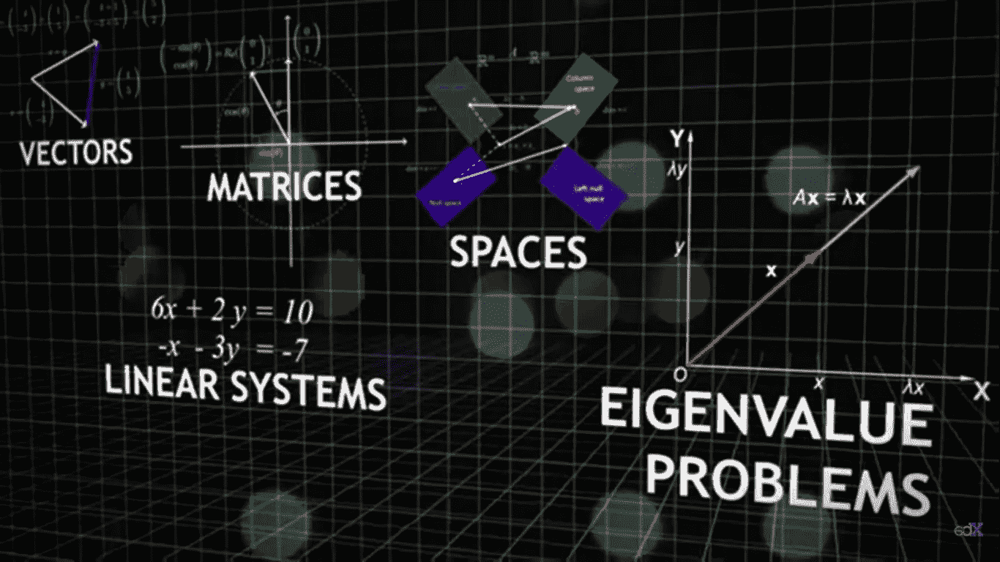

图片来源:[https://www.youtube.com/watch?v=c0fy5V7hA4g](https://www.youtube.com/watch?v=c0fy5V7hA4g)

> “学习所有的训练数据与实际学习没有任何关系。你所做的基本上是记忆数据”

线性代数为从简单的线性回归到深度神经网络的机器学习算法奠定了核心基础。主要原因是数据集可以用二维矩阵表示，其中列表示特征，行表示不同的样本数据点。话虽如此，使用矩阵中所有值的矩阵计算有时是多余的，或者在计算上相当昂贵。我们需要用一种形式来表示矩阵，使得进一步计算所需的矩阵的最重要部分可以容易地提取出来。这就是**奇异值分解(SVD)** 发挥作用的地方。

SVD 基本上是一种矩阵分解技术，它将任何矩阵分解成 3 个常见的矩阵。它在机器学习和图像处理方面有一些很酷的应用。为了理解奇异值分解的概念，关于**特征值**和**特征向量**的知识是必不可少的。如果你对特征值和特征向量有很好的理解，向下滚动一点来体验奇异值分解。

## 特征值和特征向量

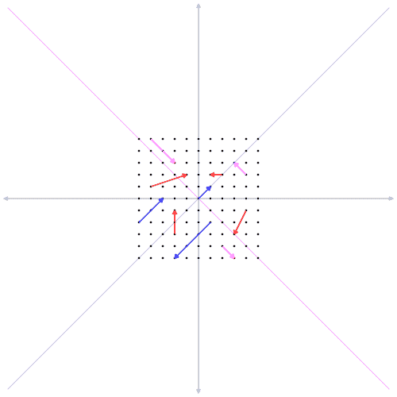

图片来源:[https://commons.wikimedia.org/wiki/File:Eigenvectors.gif](https://commons.wikimedia.org/wiki/File:Eigenvectors.gif)

矩阵和向量的乘法产生另一个向量，该向量被定义为该向量相对于给定向量空间中的特定矩阵发生的**变换**。然而，对于某些给定的矩阵，存在一些向量，使得即使在应用了变换之后，它们的方向也不会改变(类似于上面 GIF 中的蓝色向量)。这样的向量称为给定矩阵的**特征向量**，而向量变换后的标度值定义为该特征向量对应的**特征值**。这可以用下面的例子来说明:

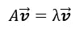

λ是特征向量 **v** 对应的特征值

特征向量的概念只适用于方阵。有许多方法可以找到特征值和相应的特征向量，我们不打算在这篇文章中讨论。我找到了下面这个来自 [3blue1brown](https://www.3blue1brown.com/) 的视频，它以一种更生动的方式解释了特征值和特征向量。随便看看。

一个特征向量所跨越的向量空间被称为**特征空间。**一个方阵称为**可对角化矩阵**，如果它可以写成如下格式:

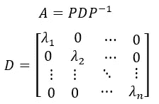

**D** 是由作为对角元素的特征值组成的对角矩阵

矩阵 **P** 无非是特征向量叠加在一起的矩阵。还有另一种特殊的矩阵称为**对称矩阵**，其中矩阵等于其自身的转置矩阵，如果矩阵的转置矩阵是该矩阵的逆矩阵，则该矩阵称为**正交矩阵**。

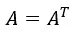

对称矩阵

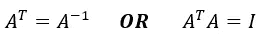

正交矩阵

以下是对称矩阵关于特征值和特征向量的一些特殊性质。

*   只有**个实特征值**
*   总是**可对角化**
*   具有**正交特征向量**

由于对称矩阵的特征向量彼此**正交**，所以对角化矩阵 **A** 中的矩阵 **P** 是**正交矩阵**。所以我们说任何**对称矩阵**都是**正交可对角化的:**

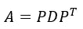

对称矩阵 A 是正交对角化的

现在我们已经介绍了奇异值分解的基础知识。矩阵对角化通常被称为矩阵的**特征分解。**然而，这种特征分解仅限于某一组矩阵。奇异值分解的实际动机源于特征分解的缺点:

*   特征值的概念只适用于平方矩阵。
*   对于方阵，复特征值的存在限制了实特征空间的数量。

## 奇异值分解

为了克服矩阵特征分解带来的挑战，需要对任何矩阵进行更一般的表示，这就是奇异值分解发挥作用的地方。设 **A** 为**任意形状的矩形矩阵(m×n)。我们可以证明 **AᵀA** 和 **AAᵀ** 分别是形状为(n×n)和(m×m)的对称方阵。**

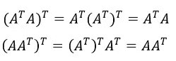

**AᵀA** 和 **AAᵀ** 对称性的证明

此外，还可以证明 **AᵀA** 和 **AAᵀ** 共享相同的非零特征值。如果一个比另一个有更多的特征值，所有多余的特征值应该为零。

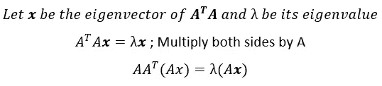

两个矩阵共享相同的特征值λ，而特征向量不同

根据对称矩阵的正交可对角化性质，矩阵 **AᵀA** 和 **AAᵀ** 可以分解如下:

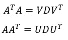

d 是对角矩阵的特征值，V，U 是正交矩阵

假设 ***v*** 是 **AᵀA** 的任意特征向量，大小为(n×1)。乘法 A ***v*** 将产生大小为(m×1)的向量，因为 **A** 是形状为(m×n)的矩形矩阵。为了节省时间，我们假设 A***v*=**σ***k***其中 ***k*** 是一个大小为(m×1)的向量，σ是一个标量值。如果矩阵 ***D*** 的秩为 *r，*则矩阵 **AᵀA** 和 **AAᵀ.有 *r* 个非零特征值**

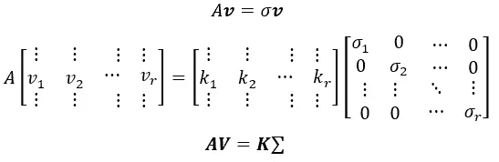

既然我们知道 **V** 是正交矩阵，

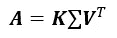

这里σ是σ值的对角矩阵

现在让我们做一些简单的数学运算来看看关于 ***K.*** 的一些令人兴奋的结果

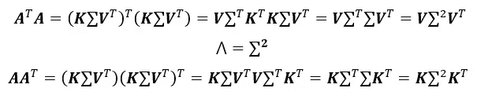

现在很明显 ***K*** 不过是*aaᵀ.的特征向量矩阵现在用***k***by*我们可以写成***a = u***σ***v****ᵀ.*矩阵的这种通用表示形式称为 ***奇异值分解。*** 在此分解中，我们将*中的向量称为**左奇异向量**，而将 **V** 中的向量称为**右奇异向量**。***

> ***奇异值分解背后的主要直觉是，矩阵*将一组正交向量 **(v)** 转换为另一组正交向量 **(u)** ，缩放因子为σ。所以 **σ** 称为对应于各自奇异向量 ***u*** 和*的奇异值*****

*******矩阵方法的 Eckat-Young-Mirsky 定理**描述了低秩近似。简单来说，它提供了给定数据矩阵中最重要的部分。我们可以把我们分解的矩阵 ***A*** 写成:*****

***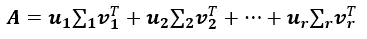***

***上面的等式描述了矩阵加法。**埃克哈特-杨-米尔斯基**定理所陈述的是， ***Aₖ*** 这是奇异矩阵的加法直到 *k* ᵗʰ最大奇异值是矩阵*a 的秩 *k* 的最近矩阵，它可以说明如下:****

***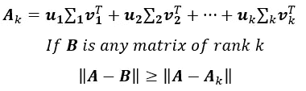***

***这个结果被证明适用于许多著名的矩阵范数，如 L2 范数、弗罗贝纽斯范数等。矩阵 **X** 的协方差矩阵 **S** 定义为:***

***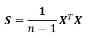***

***现在我们已经学习了奇异值分解的理论。让我们深入研究 SVD 发挥作用的应用程序。***

******

## ***主成分分析***

*****主成分分析**是一种降维技术，用于许多机器学习应用，包括特征工程和特征提取。PCA 的目标是为给定的数据矩阵找到一组**向量**的**正交基**，使得投影到由向量确定的方向上的数据集的方差**最大化。**通过一组证明，已经确定那些向量(俗称**主成分**)不过是按照对应的**特征值的顺序排列的**协方差矩阵**的**特征向量**。**本文不讨论主成分的详细推导。***

***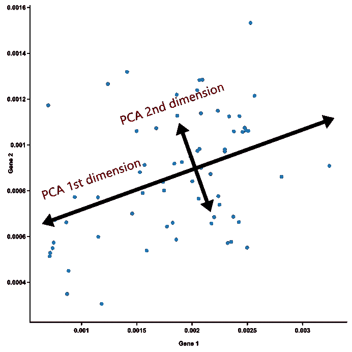***

***二维数据矩阵的第一和第二主分量***

> ***对于一个矩阵 **X** ， *k* ᵗʰ主分量是 **X** 的协方差矩阵对应的 *k* ᵗʰ最大特征值的特征向量。***

***虽然这可以用协方差矩阵的传统特征分解来处理，但缺点是计算复杂性。由于我们的数据矩阵将是一个巨大的矩阵，包含成千上万的数据，这真的很难计算协方差矩阵的特征值，这有时会导致误差，如**舍入误差。*****

***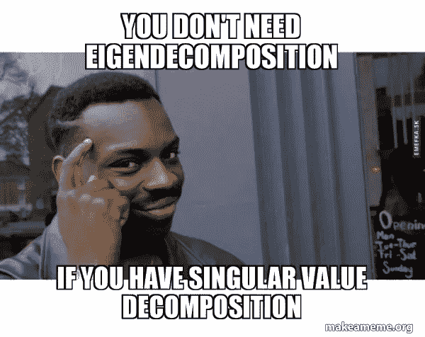***

## ***主成分分析中的奇异值分解***

***然而，数学家们已经找到了计算奇异值分解的稳定而精确的方法。其中一种方法可以在这里找到[。在 SVD(***a = u***σ***v****中我们知道 ***V*** 是协方差矩阵的特征向量而它的特征值 **(λ)** 隐藏在奇异值**【σ】**中。*](http://www.math.iit.edu/~fass/477577_Chapter_12.pdf)***

***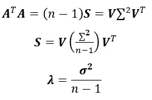***

***A 的奇异值与 A 的协方差矩阵的特征值之间的关系。***

***由于 *n* 在两种情况下都是常数，因此数据矩阵的主分量是给定矩阵的右奇异向量 **( *V* )** ，按照奇异值的顺序。***

> ***对于一个矩阵 **X** ， *k* ᵗʰ主分量是 **X** 协方差矩阵的右奇异向量对应于 *k* ᵗʰ最大奇异值。***

***因此，我们遇到了一种表示任何矩阵的更通用的方法，**奇异值分解**及其在建模**主成分分析**中的贡献，这是一种在机器学习中提取数据矩阵重要特征的复杂方法。我希望你喜欢这篇文章🙂。请随时让我知道关于这方面的任何意见和建议。***