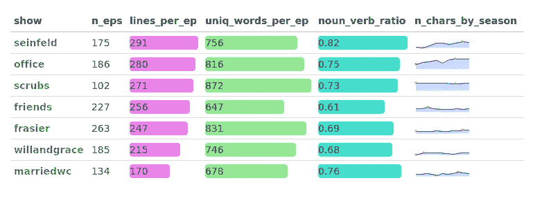
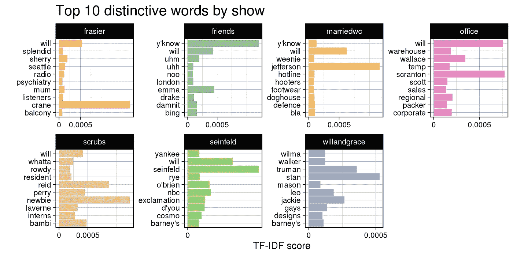
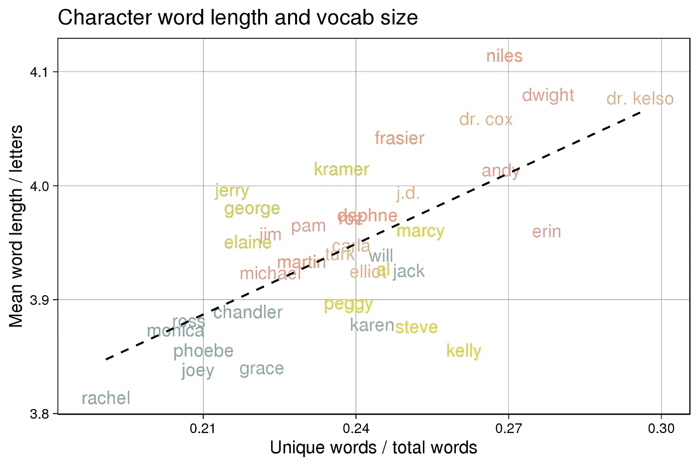
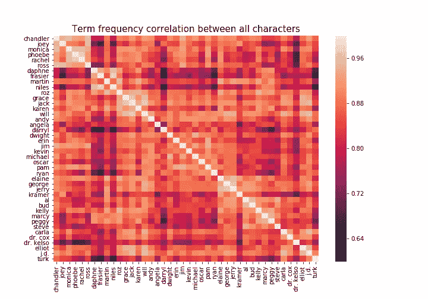
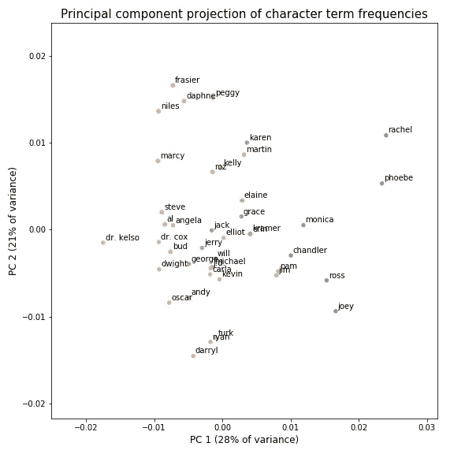
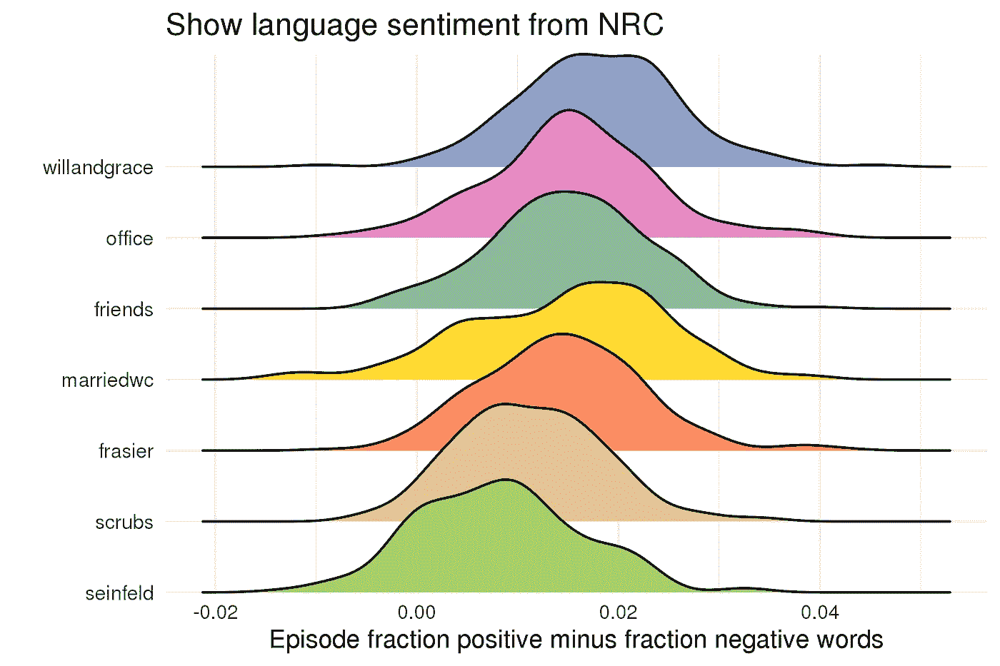
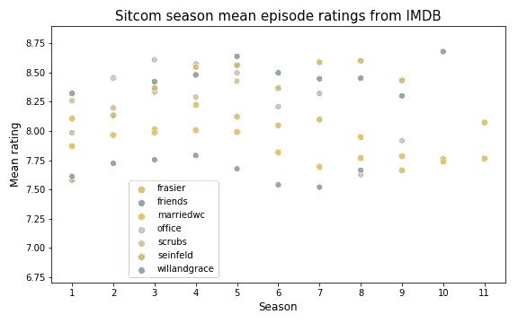
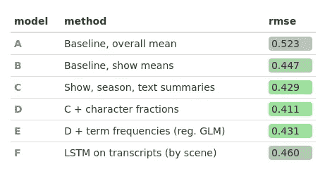

# 情景喜剧自然语言对比

> 原文：<https://towardsdatascience.com/sitcoms-natural-language-comparison-e36f8dae2c7e?source=collection_archive---------46----------------------->

## 视觉化和模型化在电视喜剧中的应用

这是没人要求的分析。我们能通过使用自然语言处理来比较当代一些最大的美国情景喜剧的剧本学到什么吗？

我尽可能多地收集了我能找到的大型情景喜剧的剧本:[老友记](https://fangj.github.io/friends/)、[弗雷泽](http://www.kacl780.net/frasier/transcripts)、[威尔和格蕾丝](http://willandgrace.tv/episodes.htm)(第 1 至第 8 季)、[办公室](https://www.officequotes.net/)、[宋飞](http://www.seinfeldscripts.com/)、[已婚并有子女](http://albundy.net/marriedaniac/ate/script.html)(部分季)、以及 [Scrubs](https://scrubs.fandom.com/wiki/Category:Scrubs_Episodes) (第 1 至第 5 季)。感谢所有粉丝网站如此彻底地抄录了这几集。经过一些处理，舞台和语调方向被删除，留下了每行一行的格式的每集剧本，其中有人物说话和口语文本。我在这上面花的时间远远超过了合理的时间。

## 行统计和最有特色的词

这里显示了一些表演级别的统计数据。Medium 不做 HTML 表格，但是用 **R** 的 [formattable](https://www.rdocumentation.org/packages/formattable) 生成这个导出版本，至少让我看到了[这篇文章](https://www.displayr.com/formattable/)展示了[迷你图](https://omnipotent.net/jquery.sparkline/#s-docs)是如何包含在其中的。

《Scrubs》和《Frasier》每集包含了最大的词汇量；前者可能得益于医学术语的使用。与其他剧集相比，《宋飞正传》涉及了相对更多的名词和更少的动词(使用 [spaCy](https://spacy.io/) 的词性标签识别)。这与《老友记》、《威尔》和《格蕾丝》是“无所事事的表演”相符吗:《老友记》、《威尔》和《格蕾丝》更受叙事驱动，包含更多描述角色做某事的动词，而在《宋飞正传》中，他们谈论的是抽象的东西，而不是做事情。迷你图按剧集和季节显示每集出现的人物数量的中位数。《办公室》和《丛林》每集都有比其他剧集更多的角色，而且《办公室》在以后的几季中也有所增加。

使用词频逆文档频率(TF-IDF ),在排除了角色的名字(这些名字很常见，但只在一个节目中出现)之后，我们可以看看每个节目中所说的一些更“独特”的词。这些词在一个节目中经常出现，但在其他节目中却不常见:

许多得分最高的术语都是次要人物的名字或其他没有被删除的名字，这并不奇怪，但该方法也挑选出一些真正代表一部电视剧的术语，如“地区”、“雪利酒”和“外科手术”。单词“will”在几部剧中出现，因为它不被[、《滚雪球》词典](http://snowball.tartarus.org/algorithms/english/stop.txt)视为停用词(但不会出现在 Will 和 Grace 中，因为它是主要角色的名字)。

## 字符语音模式

为了对每个字符的词汇有所了解，下面我显示了字母的平均单词长度，以及使用的独特单词数与总单词数的比率(都包括停用词)。两者都是按季节计算的，只使用每个角色说出的前 5000 个单词，并进行(加权)平均，以避免将唯一单词与总单词的比率偏向某些季节中剧集数量较少的剧集，或者每季台词数量较少的角色(因为说出的单词越多，就越难避免重复单词)。只有平均每季至少 3000 字的人物才纳入剧情。

倾向于使用最长单词的人物是凯尔索医生和考克斯医生(可能是因为他们使用了医学术语)、德怀特和奈尔斯，而雷切尔、乔伊和格雷斯倾向于使用最短的单词。单词长度和词汇量呈正相关，但也有一些偏离，主要是通过显示，Frasier 和 Seinfeld 显示了相对于他们的词汇量更长的单词(名字位于虚线上方)，Will 和 Grace 以及已婚并有子女的情况相反(名字位于虚线下方)。

显而易见，每部剧中的角色都非常集中，尤其是《老友记》、《宋飞正传》和《已婚并有子女》中的角色。如果上面情节中的人物是真实的人，我们可能会认为他们的说话方式是随机分布在各个节目中的，也许会有一些*聚集在一起，这是因为他们自己选择了一群教育水平相似的朋友。这里看到的聚类可能反映了编剧的偏见，他们同时为剧中的所有角色写作。这也可能是因为每部剧的风格不同，比如《纽约二十多岁的年轻人》或《在医院里》。公平地说，Frasier 和 Scrubs 展示了沿着主对角线分布的人物，展示了一系列的说话风格或教育水平。*

我计算了一个文档术语矩阵，计算的方法是计算每个角色使用所有七部电视剧中最常见的 300 个单词的次数。上面的网格显示了矩阵中每对行之间的相关性。每个节目中使用的语言的相似性可以被看作是沿着对角线的高度相关的方框。成对人物之间的相关性最高的是弗雷泽和奈尔斯、菲比和瑞秋、威尔和杰克，而相关性最低的是弗雷泽和达里尔、奈尔斯和达里尔。最独特的声音(与所有其他角色的平均相关性最低)是凯尔索博士、弗雷泽和达里尔。

当在主成分(PC)轴上绘制该文档-术语矩阵时，字符按节目分组在一起，并且朋友以某种方式不同于其他节目而突出(在 PC 空间中更孤立)。从上面的表格中也可以看出，马西和佩吉与弗雷泽的角色有着惊人的相似之处。吉姆和帕姆实际上是一样的:)在这里的人物语言中没有发现明显的男性/女性模式。从我们之前看到的，我们可以推断第一个 PC 轴(左右)大致对应于较长单词的使用频率。

## 性格情绪

每一部剧中人物语言的情感都是用 [NRC 词典](https://saifmohammad.com/WebPages/NRC-Emotion-Lexicon.htm)通过区分标记为“积极”和“消极”的单词分数来评分的。《漂亮的包裹》[让我们看到《威尔和格蕾丝》平均来说是最“积极”的剧集，而《宋飞正传》和《实习医生格兹》(也许令人惊讶)则是最消极的:](https://wilkelab.org/ggridges/articles/introduction.html)

使用 [VADER](https://github.com/cjhutto/vaderSentiment) 复合极性分数(未显示)重新计算得到了相当相似的结果，只是节目排名有一些变化。

NRC 还为我们提供了几种特定情绪的得分:实习医生，已婚有子女，威尔和格蕾丝在“厌恶”上得分最高；《欢乐》上宋飞远远低于其他人；在“悲伤”方面，Scrubs 得分最高，Friends 得分最低。这可能在某种程度上受到每个节目中使用某些喜爱的和/或俚语的影响。一些字符似乎比其他字符更一致地“击中”NRC 词典中的单词:例如，Turk 出现在前三个字符中的“喜悦”单词的分数*和*中的“悲伤”单词的分数。

## 质量指标

最后，是否可以用剧本文本信息来推断一集的好坏？对于剧集质量的最客观指标(事实上，这似乎是唯一可用的)，我使用方便的 [IMDbPY](https://imdbpy.readthedocs.io/en/latest/) 包提取了每集的 [IMDB](https://www.imdb.com) 评分。

这些评级准确吗？它们至少抓住了一部剧的质量从第一季到第二季逐渐提高，到第五季左右逐渐下降的总体感觉:

然而，收视率中有一个很强的——可能太强的——“作秀”成分。《老友记》(8.46)和《宋飞正传》(8.44)的平均评分最高，而弗雷泽(8.01)在七部影片中排名第五，这很难证明。值得注意的是，我们的预测模型发现的“好”集可能会倾向于《老友记》或《宋飞正传》中的内容，而不是《弗雷泽》中的内容；虽然我们也将努力控制平均收视率之间的差异。

我为每集推导了几个统计数据:行数、每行平均字数、平均字数、至少三行的字符数、独特字数；其中一些已在上面显示。名词与动词和名词与形容词的比例，每个主要角色说的台词的比例，以及最终的术语频率(100 个常用词和二元模型)，也作为特征包括在内。我将剧集随机分为训练和测试，并使用 [scikit-learn](http://scikit-learn.org/) 拟合简单的广义线性模型(GLMs )(因为我的兴趣是解释系数)。

从前面的图中我们可以看出，按显示(模型 B)而不是整体(A)预测训练集均值给出了更好的基线(较低的 RMSE)。与此相比，文本摘要术语，连同节目和季节(作为数字)，确实显示了少量的预测技能。模型 C 包括每行平均单词和平均单词长度的显著负系数，这意味着这些术语越大，剧集的平均评级越低。它还适用于季节的负系数，以及每集独特字数的弱正系数。

名词和动词的比率大约是 0.6-0.8；《宋飞正传》最高，《老友记》最低。该模型发现，在控制了该剧之后，这个词的值越高越好，平均而言，《宋飞正传》比《老友记》高出约 0.1 个评分点。这是否揭示了“优秀写作”的一个基本要素？我不确定。名词-形容词的比例并不能预测疾病发作的等级。

字符线分数提供了进一步提升，当添加到显示条款(模型 D)。从理论上讲，这些系数告诉我们，在每部剧集中，哪些角色在被认为是更好的剧集中出现得更多或更少；换句话说，观众喜欢或不喜欢的角色。迈克尔、达芙妮、奈尔斯、莫妮卡、罗斯(！)，乔治，还有克莱默。Pam，Erin，Jerry 的系数显著为负，Cox 和 Marcy 的系数略有下降。显然，在其他条件相同的情况下，更好的《宋飞正传》中有更多的乔治或克莱默，而更少的杰瑞。

包括词袋术语频率并没有改善模型，这可能并不奇怪，因为这可能意味着有一些“神奇”的词仅仅通过出现在抄本中就可以提高剧集评级。仅使用这些术语的模型*确实击败了基线 A，但没有击败基线 B，这可能是因为它选择了将一个节目与另一个节目区分开来的词(例如，“办公室”、“同性恋”、“博士”)。*

*从一开始，我就希望神经网络模型(an [LSTM](http://www.cs.cmu.edu/~bhiksha/courses/deeplearning/Fall.2016/pdfs/Hochreiter97_lstm.pdf) )能够“阅读”剧集脚本，并学习根据单词序列预测剧集评级:本质上，学习什么是好的和坏的情景喜剧写作。当我只在的脚本上训练这样一个模型来预测评级，将剧集分成场景，并为每个场景分配总的剧集评级(给出 8000 个训练行)，它*确实展示了一些技能(模型 F)，这可能会通过改变模型架构来改进。但是，当我试图做同样的事情来预测模型 C 的*残差*(预测误差)时，LSTM 无法提取任何进一步的信号。这可能意味着，F 型机器人通过提取关键词来区分不同的节目，使它的表现达到了 B 型机器人的水平，但除此之外，它并没有从文字记录的句子中学到任何有意义的东西。**

**这些对我们写一集好的情景喜剧有帮助吗？大概不会。但是模型中的一些术语可能会被用作作家的指南，如果它们可以在节目还在进行的时候被计算出来的话；特别是角色片段，尽管可能有比从几十集的收视率中提取信息更直接的方法来衡量观众对角色的看法。名动比的发现很有意思:我不知道这是不是以前在语言学中研究过的概念；这只是我认为要计算的一个简单的显示级文本指标。**