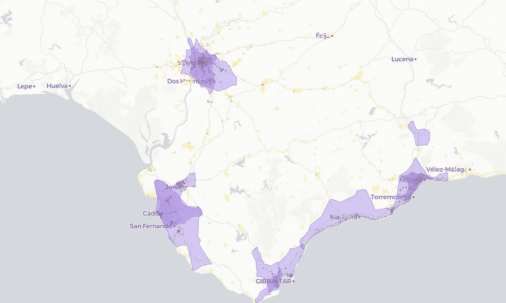
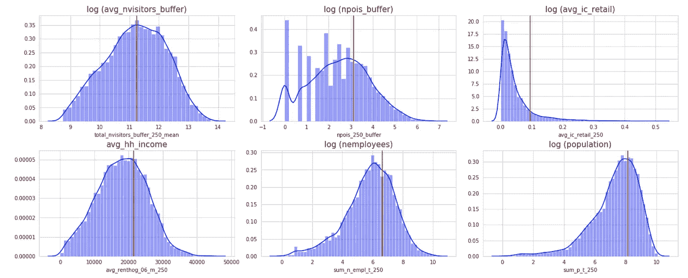
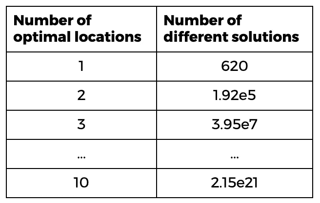
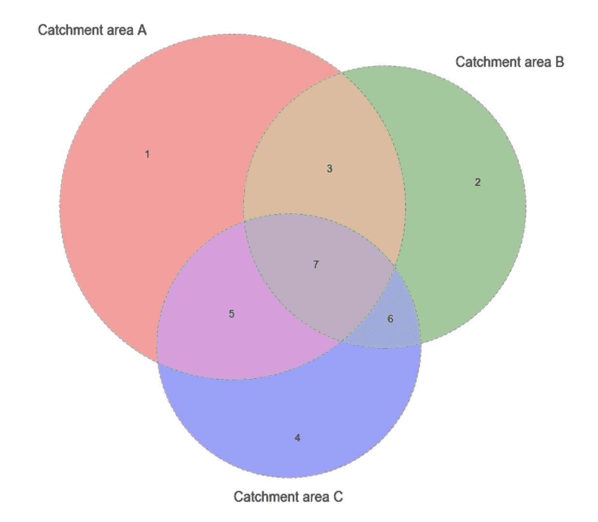
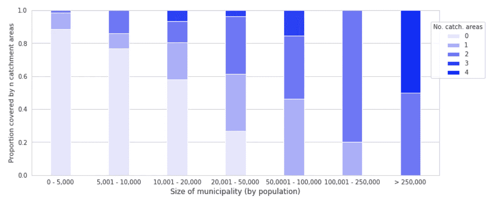
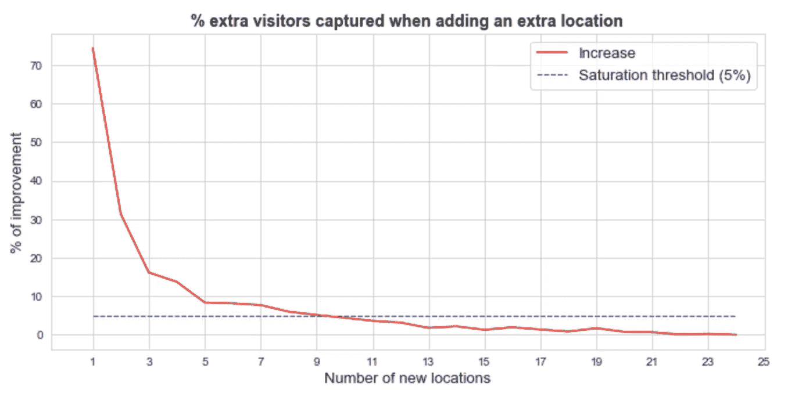
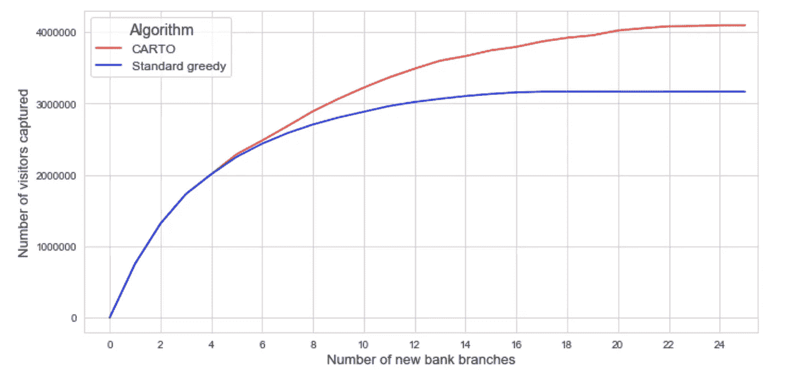
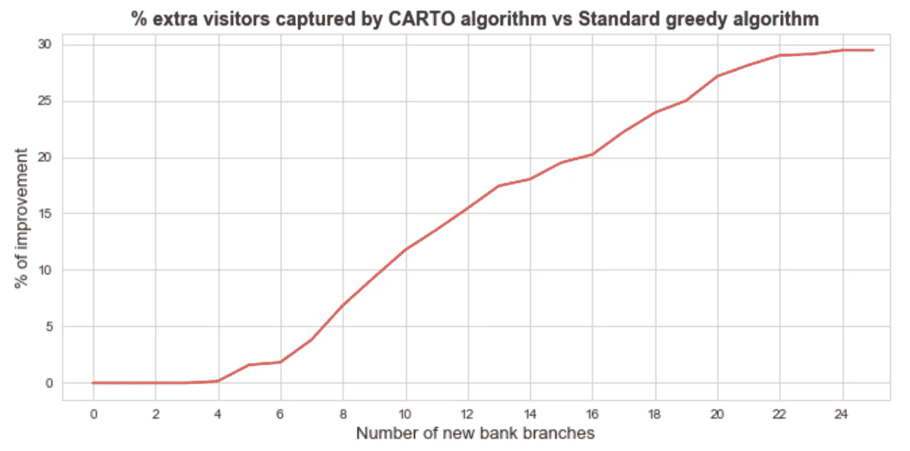

# 利用移动性数据优化市场覆盖的站点规划

> 原文：<https://towardsdatascience.com/site-planning-for-market-coverage-optimization-with-mobility-data-b78c73fb05b1?source=collection_archive---------32----------------------->

## 利用人员流动数据确定最佳位置

近年来，面临倒闭的实体店数量激增。在零售领域，这种现象被称为[零售末日](https://www.businessinsider.es/stores-closing-in-2019-list-2019-3)，但银行等其他行业也受到了影响。然而，这种零售业的末日并没有影响到所有的零售商和[，一些在线零售商甚至宣布计划开设他们的第一家实体店](https://www.cnbc.com/2018/07/31/digital-retailers-and-foreign-brands-fill-empty-us-malls.html)。在这种背景下，在决定保留或关闭哪些商店以及决定在哪里开设新店时，考虑这两种情况下的自相残杀比以往任何时候都更重要。空间数据科学技术是应对这一挑战的关键。

在这篇博客文章中，介绍了一个案例研究，其中一家银行有兴趣在西班牙南部的塞维利亚省、加的斯省和马拉加省进行扩张。考虑到他们的经济和商业环境，他们只计划开设 10 个分支机构，他们希望找到尽可能多的人可以接触到这些分支机构的位置。因此，我们的工作重点将是确定吸引最多游客的 10 个地点，同时尽量减少分店之间的相互蚕食。人员流动数据是我们方法的核心组成部分。

这个案例研究提出了两个主要困难:

*   计算缺少历史客户数据的位置的集水区。拥有这些集水区对于模拟分支之间的潜在自相残杀是必不可少的。
*   确定最佳位置。这是一个组合优化问题，这意味着即使对于小的实例，计算上也很难解决。

确定 10 个最佳位置的方法将在接下来的章节中详细介绍。遵循的主要步骤是:

1.  **数据发现**确定本案例研究的相关数据。
2.  **支持(网格)选择和细胞富集**在发现阶段识别的数据，主要是人员流动、社会人口统计和商业数据。
3.  **选定单元子集的集水区计算**。通过应用用于识别具有高商业潜力的细胞的过滤器来获得该细胞子集。对于这一步，我们将使用在[之前的博客文章](https://carto.com/blog/calculating-catchment-human-mobility-data/)中解释的基于人类移动数据的方法。
4.  **优化算法**确定 10 个最佳位置。在算法的每一步使用贪婪方法和线性规划来开发近似算法。

# 1.数据发现

对于数据发现，我们利用 [CARTO 的数据观测站](https://carto.com/platform/location-data-streams/)中可用的位置数据流和 [CARTOframes](https://carto.com/cartoframes/) 中可用的丰富工具包，以便我们可以轻松引入来自人员流动、社会人口统计、金融和其他数据类别的功能。

由于银行分支机构在人流量较大的地方利用率较高，并且商业活动频繁，因此我们确定了以下相关数据:

*   人员流动:客流量和起点-终点矩阵(来源:沃达丰分析)
*   兴趣点(来源:Pitney Bowes)
*   商业密度指数(资料来源:Unica360)
*   社会人口统计和社会经济数据(资料来源:Unica360)

下面的仪表板显示了使用的一些数据。

# 2.支持选择和细胞富集

我们方法的基础是使用沃达丰分析公司的人员流动数据。因此，我们选择沃达丰的 250m x 250m 单元网格作为参考网格来投影所有其他功能。

在下面的地图上，您可以看到网格和重点区域(塞维利亚、马拉加和加的斯)。

图一。该图显示了焦点区域和候选细胞

我们丰富了网格，如以下部分所述:

## 人类移动数据

[沃达丰分析](https://carto.com/solutions/vodafone-analytics/)数据提供了对访问覆盖整个研究区域的任何 250m x 250m 网格单元的人数的洞察。沃达丰对网络中测量的数据进行匿名化、聚合和外推，以提供代表整个国家和国际人口的见解。此外，该数据还提供了根据到目标像元的距离在不同级别聚集的访问者的来源。单元格中包含来自该来源的以下数据:

*   访客总数
*   按来源和活动分列的访客总数
*   缓冲区内距离像元质心的像元中访问者的平均数量

图二。这张 choropleth 地图显示了塞维利亚市从每个起点到一个目的地的标准化游客数量。

## 商业活动数据:兴趣点(poi)

该数据集提供了相关兴趣点的信息。单元格中包含来自该来源的以下数据:

*   距离小区质心 250 米缓冲区内的竞争者数量。
*   距离单元质心 250 米缓冲区内的 poi 数量。这里我们使用兴趣点作为商业活动的代理。

## 商业活动数据:商业指数

该数据集提供了一些商业指数(综合、零售、医疗保健等。)由范围从 0 到 1 的标准化商业活动值组成；0 表示商业活动非常低，1 表示商业活动非常高。

单元格中包含来自该来源的以下数据:

*   普通商业指数
*   酒店商业指数
*   零售指数
*   公共交通指数
*   保健指数

## 社会人口和社会经济数据

该信息在 100 米 x 100m 米的网格上提供。数据聚合被放大以适应 250m x 250m 单元网格，应用面积插值。单元格中包含来自该来源的以下数据:

*   人口
*   平均家庭收入
*   在目标单元工作的人数

# 3.过滤和构建集水区

一旦丰富了网格，在计算集水区之前，我们通过应用过滤步骤来缩小搜索空间，以便仅考虑具有高商业和经济潜力的单元来开设分支。

过滤使用以下标准，每个标准都有预定义的阈值:

*   距离单元质心 250 米缓冲区内的访问者数量。在同一缓冲区内存在竞争对手时，该最小值会增加。
*   250 米缓冲区内的 poi 数量。
*   零售强度指数。
*   平均家庭收入。
*   在目标单元中工作的人数
*   人口

在分析了具有不同阈值的不同场景，并可视化它们以检查基于我们对焦点区域的了解的一切是否有意义之后，我们在这六个标准上设置了以下切割。

*图 3。应用于过滤的阈值。这些图显示了标准变量的分布以及为每个标准变量选择的阈值。注对数转换已应用于某些发行版。*

因此，我们将搜索空间从超过 18，000 个初始单元格减少到 620 个。下图左侧显示了塞维利亚市周围区域的所有网格单元，右侧显示了过滤后剩余的单元。

*图 4。左边是塞维利亚周围地区的参考坐标。右边是过滤后同一区域的剩余单元格。*

最后，使用人类移动数据并遵循[在之前的博客文章](https://carto.com/blog/calculating-catchment-human-mobility-data/)中介绍的方法，构建集水区。

# 4.位置-分配。最佳化

位置分配是一组优化算法的名称，这些算法侧重于确定设施点的最佳位置，以服务于一组需求位置。它们已被广泛用于各种行业，如物流部门寻找配送中心的最佳位置，零售部门寻找开设新店的最佳位置，电信部门寻找安装天线的最佳位置。

这里介绍的案例研究也是一个很好的位置分配问题的例子，其中一家银行希望找到 10 个位置来开设新的分支机构，从那里他们可以接触到尽可能多的人。这意味着找到游客数量最多的位置，同时尽量减少其集水区之间的交集，因为游客将只计入其中一个位置。集水区之间的这些交叉点将被视为成对位置之间的潜在自相残杀。

位置分配问题的这种特殊情况被称为[最大覆盖问题](https://en.wikipedia.org/wiki/Maximum_coverage_problem) (MCP)。但是，我们与标准 MCP 有一个重要的区别，因为在我们的例子中，一个特定的起点可以有(大多数时候确实有)不同数量的访问者去不同的目的地单元。

位置分配问题是[组合优化](https://en.wikipedia.org/wiki/Combinatorial_optimization)问题，众所周知，即使对于小实例也很难解决。这是因为可能的解决方案的数量随着要考虑的候选位置的数量和要识别的最佳位置的数量而呈指数增长。

*表 1。针对 620 名候选人的位置分配问题的不同解决方案的数量，取决于待选位置的数量。*

左边的表格显示了可能的解决方案的数量，这取决于我们有兴趣在 620 个候选位置中找到的最佳位置的数量。

由于 MCP 问题的高度组合复杂性，通常使用[近似算法](https://en.wikipedia.org/wiki/Approximation_algorithm)，而[精确算法](https://en.wikipedia.org/wiki/Exact_algorithm)仅用于问题简化版本的小实例。

文献中最常见的方法是贪婪算法，有时会跟随一些[局部搜索](https://en.wikipedia.org/wiki/Local_search_(optimization))启发式算法，以确保达到最近的局部最优。一些更高级的元启发式算法被设计成能够避开局部最优，但是它们的复杂性随着每次迭代中允许的并发交换数量而增加。因此，大多数情况下，这些更高级的方法只允许每次迭代进行一次交换，这使得探索解决方案空间中的遥远区域变得更加困难。

## 该算法

我们设计的解决这个问题的算法遵循一种贪婪的方法，在每次迭代中使用[线性规划](https://en.wikipedia.org/wiki/Linear_programming)，以增加找到更好的局部最优解的机会。单交换局部搜索试探法被应用于找到的解决方案，以确保我们处于局部最优。

你可以在[的上一篇文章](/on-demand-last-mile-transportation-ea4a3b725b31)中读到更多关于线性编程的内容。

## 初步考虑

基于以下事实，使用对问题的简化来设计算法，即在所选位置的三个汇水区内具有原点比在两个汇水区内具有原点更糟糕(即，更有可能发生自相残杀)。更一般地说，原点在所选位置的 *n* 集水区内比原点在 *n-1* 或更少的集水区内更糟糕。

这个事实允许我们仅考虑成对的交集来解决问题，这显著地降低了复杂性。10 个选定位置所覆盖的潜在客户总数是这样计算的:将每个集水区的游客独立相加，然后减去每个两两交叉路口重复计算的游客。这种计算会根据包含多边形的集水区的数量，为位于多个集水区内的原始多边形指定一个递增的惩罚。

*图 5。代表三个集水区之间不同可能交叉点的文氏图。*

左侧的示例旨在显示在计算有无上述属性时，潜在客户的计算差异。在本例中，我们有三个选定的位置、它们的集水区以及它们之间的交叉点。

潜在客户的数量计算如下:

*   未使用遗产:来自三个集水区的游客人数，减去来自 5、6 和 3 的游客人数(因为他们只应被计算一次)，减去来自 7 的游客人数的两倍(2x)(因为他们位于三个集水区的交叉点，但只应被计算一次)。
*   使用属性:来自三个集水区中每个集水区的访问者数量减去来自 5、6 和 3 集水区的访问者数量(因为它们在一个成对的交叉点内)，减去来自 7 集水区的访问者数量的三倍(3x)(因为它们在三个成对的交叉点内)。

## 算法描述

如上所述，我们遵循贪婪的方法，在每次迭代中应用线性规划。贪婪算法包括在每次迭代中选择 3 个新位置，允许在先前迭代中选择的位置之一被改变(即，允许一次交换)。下面你可以找到这个贪婪算法的伪代码:

每次迭代求解的线性规划模型如下所示。

使用 [Google 或-Tools](https://developers.google.com/optimization) 求解线性规划模型，这是一个强大的优化求解器包装器，允许连接到各种商业和免费求解器。

为了提高算法的效率，我们将变量 Xjk 定义为连续的，并且我们只惩罚那些其交集包含来自两个位置的超过 10%的访问者的位置对。可以通过以下方式实现进一步的改进:

*   计算一个初始解(例如，用一种纯粹贪婪的方法)和:
    (a)用它作为一个热的开始。
    (b)使用具有最低游客数量的位置的游客数量作为线性规划模型的下限。
*   在贪婪算法的每次迭代之后应用一些局部搜索试探法。

## 结果

在对不同的 f(增加因子)和 k(自由度)值运行优化算法后，我们获得了下图所示的解决方案。我们获得的最佳解决方案的潜在客户总数为 **3，223，552** 。

下图显示了所选位置及其集水区。

图 6。在地图上标出为开设新银行分行而选择的 10 个地点及其各自的服务区。

如果我们分析 CA 所选位置的集水区覆盖了哪些城市(见下图 7)，我们可以看到所有人口超过 50，000 的城市至少都在该位置的一个集水区内。此外，可以观察到，一个城市的人口越多，覆盖他们的集水区的数量就越多。

*图 7。按 0、1、…、4 集水区覆盖的人口范围划分的城市比例*

为了评估 CARTO (CA)开发的算法的质量，我们将使用我们的算法与通常用于解决位置分配问题的标准贪婪算法(SGA)获得的结果进行比较。SGA 在每次迭代中找到一个新位置，并考虑与已选择位置的交集来更新未选择位置的潜在访问者的数量。该算法不允许交换。

SGA 所选地点的集水区覆盖的潜在游客人数为**2884347**。这意味着 CA 可以通过增加大约 **340，000 访客**来改善这个结果，这代表了**额外 11.75%的访客**。

下图显示了两种算法所选位置的集水区。这些区域标绘在参考网格上，每个单元格中的访问者数量用颜色表示。可以观察到的主要区别是，SGA 所选地点的一些集水区较大，覆盖了人口密度较低的地区，这意味着地点质量较低。这是因为在确定了最初的 5-7 个位置后，需要进行一些交换，以便找到新的高质量位置。但是，SGA 不会执行任何交换。

*图 8。地图显示了使用 CARTO(左)开发的算法选择的 10 个位置的集水区，以及另一个图层上的标准贪婪算法(右),其中候选像元按游客数量着色。*

# 进一步的步骤:计算位置的最佳数量

在这篇博文中，我们展示了一个选址案例研究，其中要开设的新银行分行的数量是事先知道的。通常，公司发现很难得出这个数字。这里介绍的方法也可以用来回答这个问题，只需对开发的优化算法稍作修改。

在这种情况下，必须知道将使用什么标准来确定最佳位置数量。一个可能的标准是市场饱和。市场饱和可以被定义为一个阈值，使得如果当增加一个新位置时覆盖的新的潜在客户的数量低于该阈值，则达到市场饱和。

例如，对于 5%的阈值，我们知道最佳位置数是 10，如下图所示。

*图 9。通过增加新地点来增加潜在客户的数量。市场饱和的阈值为 5%。*

CARTO (CA)开发的算法在这个问题上也表现出比 SGA 更好的性能。根据所选位置的数量，我们可以在下面看到潜在客户的数量。我们可以看到，对于少量的位置，两种算法具有非常相似的性能，随着位置数量的增加(因此问题变得更难解决)，CA 的性能优于 SGA。这意味着 SGA 将在 CA 之前达到饱和点，失去市场潜力。

*图 10。两种算法覆盖的访客数量取决于新位置的数量。*

具体来说，我们可以看到 CA 的表现比 SGA 高出 30%,具体取决于为市场饱和度设置的阈值。

*图 11。CA 与 SGA 的性能改进。*

# 结论

今天，影响零售和其他行业的挑战性环境使得他们必须使用技术和工具，使他们能够做出明智的决策，并从竞争对手中脱颖而出。

通过其他数据流丰富的人员流动数据，以及优化和其他空间技术的使用，将在应对这些部门目前和未来面临的挑战时发挥重要作用。

*本文原载于* [*CARTO 博客*](https://carto.com/blog/site-planning-coverage-optimization-mobility-data/) 。

*特别感谢*[*Mamata Akella*](https://twitter.com/mamataakella?lang=en)*，CARTO 的制图主管，对她在本帖地图创作中的支持。*