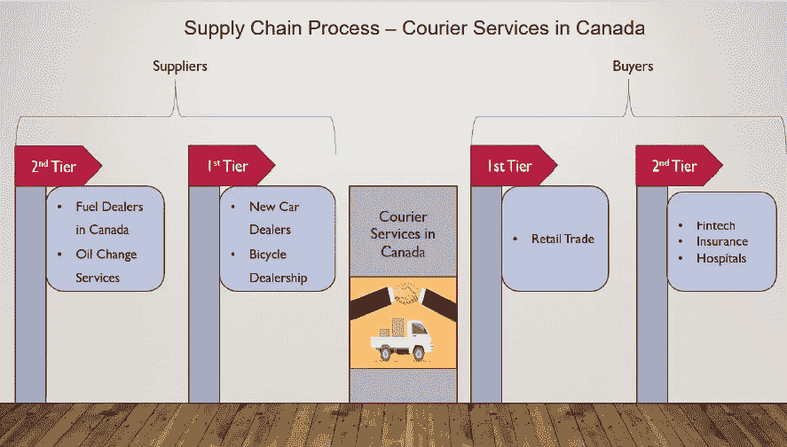

# 使用优化技术选择站点和最佳路径——加拿大邮政示例

> 原文：<https://towardsdatascience.com/site-selection-and-best-path-using-optimization-techniques-canada-post-example-f0868d641bf7?source=collection_archive---------27----------------------->

来源—[https://developers . Google . com/maps/solutions/images/store locator _ clothing . png](https://developers.google.com/maps/solutions/images/storelocator_clothing.png)

在本文中，我们将关注快递服务行业(加拿大)。这个行业总是需要降低运营成本。要做到这一点，公司在选择新站点的位置和寻找送货车的最佳路径以降低与燃料和时间相关的成本时经常面临挑战。

# 关于行业

快递服务行业包括两大部分，即大型快递公司和小型快递公司。加拿大 2019 年的总收入为 128 亿美元，5 年年增长率为 3.5%。该行业预计将在未来五年内增长，因为可支配收入的提高使消费者越来越愿意购买商业商品，其中大部分与电子商务相关。原油价格的预期上涨也将使这些公司通过优化其交付绩效来获得更多利润。

# 供应链和主要参与者

在市场生态系统中，加拿大的快递公司构成了一级买家和供应商之间的桥梁。请参见下图，了解供应链。

图 1:加拿大快递服务的供应链流程

下表 1 显示了加拿大的主要参与者(2019 年)。尽管通过合并和收购扩大了经营范围，但行业内的总体市场份额集中度有所下降。

表 1:快递服务主要参与者的市场份额(加拿大——2019 年)

加拿大邮政和联合包裹服务公司(UPS)是该行业最大的两家公司。加拿大邮政拥有 33.5%的市场份额，与加拿大边境服务局和中国邮政等其他实体有着强大的合作关系，这使得该公司的包裹收入和数量显著增长。由于劳动力中断，该公司经历了增长下滑，因此需要提出高效的成本规划模型来降低运营成本。

另一方面，UPS 依靠机群长距离运输包裹。航空运输确实加快了这一过程，但反过来也导致客户支付高额费用。UPS 在加拿大拥有超过 14%的市场份额，由于新设施和新技术的上线成本，预计运营利润将会下降，因此也需要优化 UPS 的运营成本。

# 快递业供应链面临的挑战

从现在开始，我将缩小范围，专注于行业内的交付性能优化。

**运营挑战**

快递公司面临的共同挑战是递送包裹的站点之间的时间窗口、车辆的存储容量、燃料容量和充电要求、车道驾驶规则、司机的午休时间和客户对订单接收时间的偏好。还有其他约束，如劳动法和周末送货，但这些都超出了本文的范围。

**使用线性规划的约束公式**

配送性能问题是车辆路径问题族的一部分。为了清楚地解释这个问题，我使用了一个线性规划模型，这些问题的简单版本包括公司减少燃料费用/行驶距离的目标。在实际场景中，目标还包括最小化使用的车辆数量和平衡工作量。为了简化模型，我只考虑了加拿大邮政在蒙特利尔的一辆送货车。

**目标函数为:**

最小值(σ行驶距离/燃油成本)

**受约束:**

1.  货车的起点和终点位置是相同的
2.  货车只行驶一次

**注意:**有时，约束条件不允许问题形成凸空间让优化算法收敛到一点。因此，我们应该根据问题陈述使用强制约束。像进化这样的求解方法比 *GRG 非线性*和*单纯形*表现更好。

# 加拿大邮政问题图解

我选择了蒙特利尔市的 10 个地点，考虑到他们有很高的需求。下面的表 2 列出了位置名称以及地址和其他位置信息。

表 2:为说明问题而选择的位置

您可以在下面的地图上看到这些位置:

图 2:地图上为问题图示选择的位置(来源——谷歌地图)

# 问题 1:找到最佳位置

有关问题，请参考表*‘最佳位置’*(最后的下载链接)。

在这个问题中，目标(目标函数)是最小化运输的燃料成本。给定的 9 个客户位置是高需求的位置。位置数据(也提供了纬度和经度)。任务是找到开店的最佳地点，使货车的行程(每个地点两次——去商店和回来商店)对企业来说成本最低。请注意，这个问题不考虑到一个位置的道路路径。这个问题的最佳解决方案是基于地球弧度距离的几何计算距离。
在 Excel 规划求解器中使用 *GRG 非线性*方法找到最佳位置，使用强制约束允许算法收敛到最小值。针对此问题找到的最佳解决方案如下所示:

图 3:根据红色给出的位置，开新店的最佳位置(来源——谷歌地图)

# **问题 2:旅行商问题——寻找最佳路径**

这个问题参考*【最佳路线】*表(最后下载链接)。

在这个问题中，目标(目标函数)是最小化行进的总距离(以米为单位)。表 3 显示了来自谷歌地图的数据，给出了四舍五入到最近的百分之一米的距离。请注意，这个问题考虑的是使用谷歌地图测量的最短道路路径。由于车道限制，这些数字在数学上没有关系。这个问题有两种情况:第一，送货车可以从任何地方出发，第二，送货车应该从加拿大邮局出发。对于这个问题，我获取了加拿大邮政在蒙特利尔的一个现有商店的位置数据。图 4 和图 5 显示了两种场景的结果

表 3:位置代码

表 4:位置之间的距离(以米为单位)

**场景 1 结果:**

图 4:场景 1 的最佳路径——货车可以从任何地方出发(来源——谷歌地图)

**场景 2 结果:**

图 5:场景 2 的最佳路径——货车从加拿大邮政出发(来源——谷歌地图)

从这个分析中一个有趣的发现是，如果货车必须从加拿大邮政出发，算法表明它应该首先去德绍特尔管理学院，而不是 La Marq。事实上，La Marq 距离加拿大邮政只有 700 米，但由于我们考虑了车道驾驶法，该算法会建议最佳路线，否则会显得荒谬。

# 我对快递业的看法

快递公司需要专注于降低运营成本，因为他们的利润与政府政策等超出他们能力的因素有关。他们唯一能控制的就是优化他们的成本。在激烈的行业竞争中，越来越需要找到更好的算法来实施最佳实践以降低成本。这些问题陈述中的大多数属于车辆路线问题(VRP)和带时间窗的车辆路线问题(VRPTW)。这些问题有时会变成 NP-Hard，需要大量的计算来达到最优解。数据驱动的公司将在未来几年主导市场。

# 离别笔记

有一些高级的算法，如带有贪婪插入的平衡聚类算法和通过扩展插入算法的路线改进，有时在凸形问题中使用启发式算法来达到最优最小值。然而，这类问题在计算和技能集方面都需要大量资源。没有公开可用的基准，有时解决方案并不理想。有时，我们还会寻求“视觉上有吸引力”的解决方案，即考虑如何将站点分组到路线中。多辆车路线重叠的解决方案通常被认为在视觉上不如其他方案吸引人。

# 参考

1.  宜必思世界报告| 49222 加拿大快递和本地递送服务| 2019 年 10 月
2.  废物管理的路线优化:Surya Sahoo，Seongbae Kim，Byung-In Kim，Bob Kraas 和小亚历山大·波波夫。
3.  加拿大邮政包裹电子商务发展战略分析

# 参考文件(下载 excel 文件)

 [## chandravenky/优化

### 此时您不能执行该操作。您已使用另一个标签页或窗口登录。您已在另一个选项卡中注销，或者…

github.com](https://github.com/chandravenky/Optimization/blob/master/Canada%20Post%20location%20problems.xlsx) 

**在**[**LinkedIn**](https://www.linkedin.com/in/venkateshchandra/)**/**[**GitHub**](https://github.com/chandravenky)上与我联系