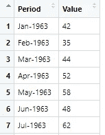
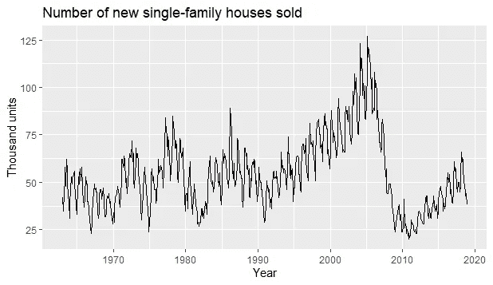
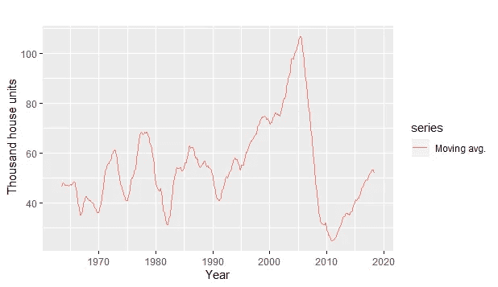
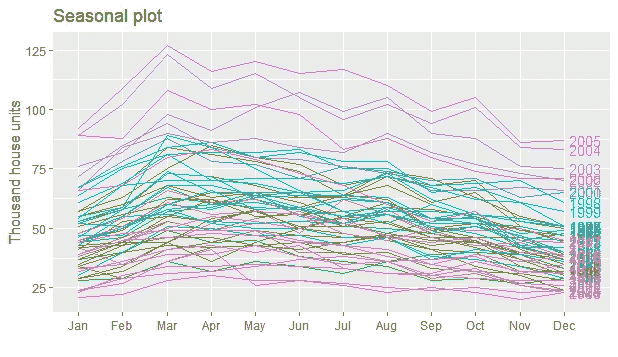
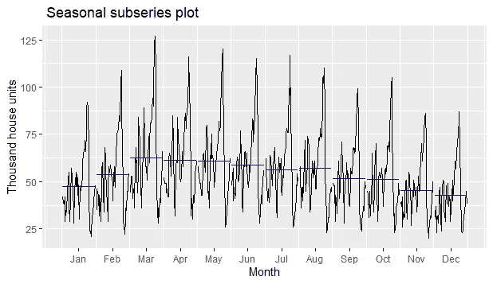
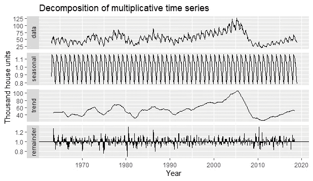
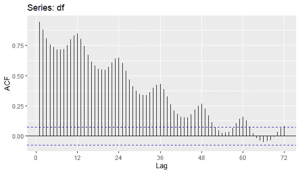

# 时间序列数据分析中的六个关键点

> 原文：<https://towardsdatascience.com/six-essential-plots-for-time-series-data-analysis-477bd7e778ac?source=collection_archive---------18----------------------->

## 季节性图、滚动窗口、时间序列分解等


由[活动创作者](https://unsplash.com/@campaign_creators?utm_source=medium&utm_medium=referral)在 [Unsplash](https://unsplash.com?utm_source=medium&utm_medium=referral) 上拍摄的照片

> 一幅画胜过千言万语

对，没错，一图胜千言；在数据科学中，一张图片可能胜过千言万语！

数据可视化是数据科学的基础，无论是用于探索性数据分析、构建更好的模型，还是用于可视化[讲故事](/storytelling-with-data-a-data-visualization-guide-for-business-professionals-97d50512b407)。仅仅通过目测箱线图或散点图，一双有经验的眼睛可以瞬间获得比阅读表格中的描述性统计数据更多的信息。

时间序列数据更是如此。很难想象没有时间序列图的时间序列分析。

下面我将展示六个这样的基本情节，并介绍如何创建每一个情节，解释并从中提取信息。我将在这个练习中使用 R，因为它是一个特别为时间序列分析设计的超级有用的库`fpp2`,你只需要几行代码就可以完成大多数绘图。

这是我们将要探索的情节:

1.  一个简单的时间序列图
2.  滚动窗
3.  季节性绘图
4.  亚季节图
5.  时间序列分解
6.  自相关(ACF)图

让我们卷起袖子吧。

## 图书馆和数据

做下面的视觉效果你所需要的就是`fpp2`库。它附带了必要的依赖项，所以一开始只使用一个库应该没问题。

要了解这个库的更多信息，这里有 Rob J Hyndman 和 George Athanasopoulos 的[包文档](https://cran.r-project.org/web/packages/fpp2/fpp2.pdf)和一本开放访问的书[预测:原则和实践](https://otexts.com/fpp2/)。

```
library("fpp2")
```

本练习的数据来自[人口普查局存储库](https://www.census.gov/econ/currentdata/dbsearch?program=RESSALES&startYear=1963&endYear=2018&categories=SOLD&dataType=TOTAL&geoLevel=US&notAdjusted=1&submit=GET+DATA&releaseScheduleId=)。该数据集包含从 1963 年 1 月到 2018 年 12 月每月售出的新独栋房屋数量。这些数据是以千套住房为单位报告的，没有经过季节调整。

读入后，需要进行一些格式化，以便`fpp2`包将它识别为一个时间序列对象。

```
# read in data 
data = read.csv("../NewSingleFamilyHousesSold.csv", skip = 6)# drop "Period" column
data$Period <- NULL# rename column
names(data) <- c("value")# convert dataframe to a ts object
df = ts(data, start = 1963, frequency = 12)
```



从人口普查局检索的原始数据

## **情节#1:简单时间序列情节**

一旦读入数据并将其转换成一个`ts`对象，第一个图通常是一个简单的可视化图，以获得数据的“感觉”。

```
autoplot(df[, "value"])+
  ggtitle("Number of new single-family houses sold") +
  xlab("Year") + ylab("Thousand units")
```



时间序列图的简单可视化

仅仅通过目测这幅图，你就可以得到很多提示——比如售出的房屋数量、季节性、趋势、周期、市场崩溃等等。我们将放大每一个以进一步了解。

## **剧情#2:卷窗**

图 1 信息太多，有点嘈杂，所以我们需要简化它。只要用 12 个月移动平均线去除季节性因素，我们就能看到数据中的关键信号。

```
autoplot(ma(df, 12), series = "Moving avg.") +
    xlab("Year") + ylab(" Thousand house units")
```



具有 12 个滞后滚动窗口的移动平均线

因此，通过牺牲季节性，我们可以更好地看到趋势和其他特征。

例如，在整个 70 年代和 80 年代，年销售量徘徊在每年 4-5 万台左右，大约有 5-6 年的商业周期。但是没有发现明显的趋势。

自 20 世纪 90 年代以来，市场呈上升趋势。这种情况一直持续到 2005 年，年销量超过 10 万台。

然后就发生了车祸。

自 2011 年以来，市场正在复苏。但截至 2018 年，仍处于 70 年代水平左右。

## **曲线#3:季节性曲线**

在前面的图中，我们去除了季节性来检测关键信号。现在，让我们通过对全年每个月的销售额进行平均来专门放大季节性。

```
ggseasonplot(df, year.labels = TRUE) +
  ggtitle("Seasonal plot")+ xlab(" ")+ ylab("Thousand house units")
```

我知道这看起来真的很丑，当然有办法用更多的代码来美化这个情节，但这不是我们所追求的。



显示每年月度趋势的季节性曲线图

再一次，通过目测，你可以看到三月是独户住宅市场的最佳月份。夏季市场还不错，但从秋季开始就开始下滑。

## **地块#4:亚季节地块**

现在让我们做与图 3 相反的事情，将所有年份的平均值挤进每个月。

```
ggsubseriesplot(df) +
  ggtitle(" Seasonal subseries plot") + ylab("Thousand house units")
```



显示全年每月销售额变化的分季节曲线图

它显示的是——在连续几年的平均值之后，新房销售每月是如何变化的。横条代表一年中每个月的平均值。

例如，3 月份的平均销量约为 6 万台，峰值为 12.5 万台。

## **地块#5:时间序列分解**

正如我们已经看到的，时间序列数据有很多属性——趋势、季节性和随机(噪声)成分。

如果我们想看到所有的组件呢？我们可以通过所谓的“[时间序列分解](https://online.stat.psu.edu/stat510/lesson/5/5.1)”来做到这一点。

```
df %>% decompose(type="multiplicative") %>%
  autoplot() + xlab("Year") + ylab("Thousand house units")
```



时间序列分解有四个组成部分:数据、季节性、趋势和噪声

因此分解的输出有 4 层:顶层——原始数据；第二——季节性；第三——趋势；第四，余数/噪声。

时间序列分解通常有助于在一个地方一览无余。

## **曲线#6:自相关曲线**

“Auto”表示自身——因此自相关是一个序列与其自身的相关性。在时间序列分析中，自相关意味着数据点对其过去值的依赖性。

例如，12 月份的房屋销售量并不是随机的，而是与 11 月、10 月及以后的销售量相关。

```
# auto-correlation plot
ggAcf(df, lag = 72)
```



显示不同滞后中自相关的 ACF 图

所以自相关图的目的是确定“自相关”可以追溯到多远。例如，在该图中，自相关直到任何数据点的前 51 个值都是显著的。

自相关图在高级时间序列分析和预测中是一种有用的技术——尤其是确定在 [ARIMA 家族](/time-series-forecasting-from-naive-to-arima-and-beyond-ef133c485f94)中用作参数的滞后数。

## **期末笔记**

我们探索了六种不同的情节，每一种都表达了不同的信息。数据可视化是数据科学工具箱中必不可少的工具。不仅仅是为了讲故事，而是为了理解数据，理解关键组件，甚至调整模型参数。

希望这对 R 用户是一个有用的练习。Python 用户需要心灰意冷，盯紧了，来了。