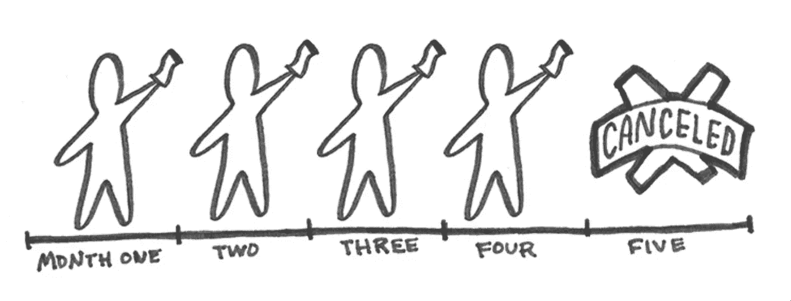
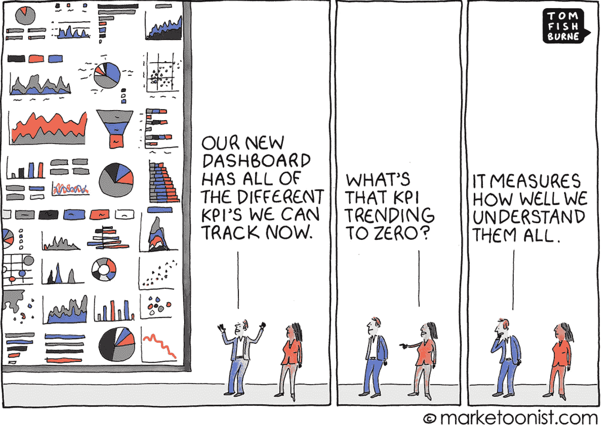
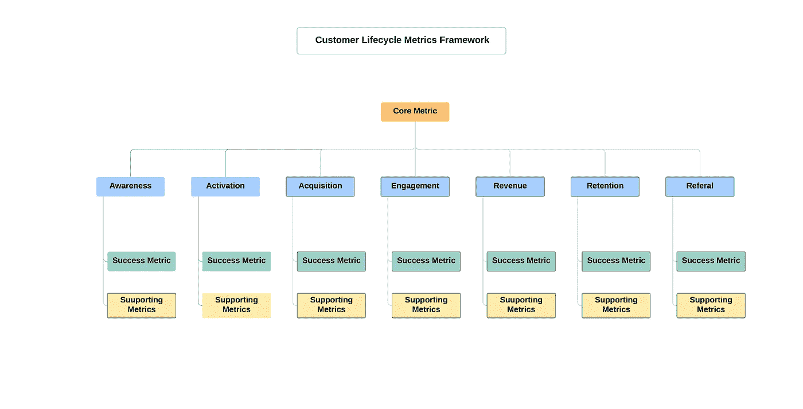

# 从客户生命周期分析中获得的六大经验

> 原文：<https://towardsdatascience.com/six-key-learnings-from-customer-lifecycle-analytics-3d2fa335f3d6?source=collection_archive---------17----------------------->

照片由诺亚·帕森斯拍摄

在与各种业务团队合作后，他们中的许多人都试图加深对如何更好地锁定客户旅程中关键点的受众的理解。例如，营销人员需要决定如何调整信息传递和优化目标策略。保留团队需要知道如何主动重新吸引那些倾向于流失的客户，以及如何赢回那些已经流失的客户。产量优化团队想知道他们如何在降低服务总成本等的同时提高收入。

客户生命周期分析是一种数据驱动的方法，用于识别您的客户与公司产品和服务的关键接触点，并了解目标受众如何在整体上以及在其端到端客户生命周期的关键点采取某些行动。了解客户旅程中每个阶段的客户行为模式可以帮助业务团队及时制定明智的获取和保留策略，以优化收入和减少客户流失，并为内容和产品开发设定方向，以改善整体客户体验。在本文中，我想分享从客户生命周期分析中获得的六个关键经验。

> **确定客户生命周期中的核心指标**

在分析领域工作时，你几乎找不到一个适用于所有垂直行业组织的单一分析框架。每个公司都有其独特的业务和运营模式。对于客户生命周期分析，第一步是对业务如何运作有一个坚实的理解。你应该与高管团队和商业领袖会面，了解什么对公司和他们的各个部门最重要。客户生命周期中的核心指标需要反映公司希望从客户那里获得的最大价值。改善核心业务指标将使整体业务实现可持续增长，同时观察该指标的下降趋势表明业务可能没有朝着正确的方向发展。

> **描绘客户生命周期的关键阶段**

为了体验贵公司产品和服务的核心价值，您需要确定客户和潜在客户在其端到端旅程中经历的关键阶段。例如， [Salesforce 营销云](https://www.salesforce.com/products/marketing-cloud/overview/)概述了典型客户旅程中的六个关键阶段，包括认知、获取、入职、参与、保留和宣传。[盗版指标](https://500hats.typepad.com/500blogs/2007/09/startup-metrics.html)将客户生命周期分为五个关键阶段，包括获取、激活、收入、保留和推荐。请记住，您公司客户的客户生命周期阶段可能看起来与其他客户非常不同，简单地应用现有的方法可能不适合您的业务。

> **确定客户生命周期关键阶段的成功指标**

在您确定了核心指标和客户在端到端旅程中经历的关键阶段后，您需要计算出客户生命周期中每个关键阶段的成功指标。由于客户行为可能非常复杂，并且您的客户和潜在客户产生的接触点数量和数据量可能非常大，因此您的业务团队可能会提出许多指标，他们希望数据科学或分析团队来衡量这些指标。有时，业务团队可能会要求您在他们希望花费更多时间或深入研究的非常精细的级别上查看客户的指标和属性。使用少量指标来总结客户生命周期绩效需要分析人员开发适当的指标框架来设置成功指标。度量框架需要确保更细粒度的度量能够支持业务团队，并帮助他们改进他们的关键成功度量。此外，跨关键客户生命周期阶段的成功指标应该相互补充，以帮助公司更接近整体业务目标。

胡玮炜摄

> **制定客户数据策略，实现实时数据采集**

虽然您已经概述了客户生命周期的核心指标和一组成功指标，但您还需要制定适当的数据策略来整合和运营客户数据。与您的工程和商业智能团队一起构建客户数据字段，以确保客户数据在交易系统中准确可靠地流动。您还可以选择开发实时客户数据平台，将客户数据从交易系统整合到统一的数据库中。您需要与有能力的数据工程师合作，他们了解业务需求，并在此基础上准确设计和应用定义良好的业务逻辑，以计算客户生命周期成功指标，用于定期报告和分析。制定适当的数据策略将有助于团队利用数据系统地监控和跟踪客户生命周期成功指标的表现，评估现有计划的有效性，并为未来的营销和保留策略提供信息。

> **让跨职能团队在成功指标上保持一致**

跨业务领域的不同团队需要有明确定义的角色和共同的责任，以实现公司的首要任务，从而改善协调并最大限度地减少重复工作。虽然您的公司可能有一系列指标，但数据科学和分析需要确保应用于成功指标的定义和业务逻辑清晰、记录良好，并在业务团队中保持一致。在业务团队中采用一套通用的成功指标，并定期会面以评估结果，使跨职能团队保持一致并对其指标负责，这一点至关重要。

> 揭示影响成功指标的主要因素

数据科学家和分析师需要将客户与公司产品和服务的互动以及业务成果联系起来。例如，分析团队需要能够定期解决以下问题:影响客户订阅或购买决策的主要因素是什么？客户流失的主要原因是什么？如果营销人员需要为客户提供更个性化的体验，他们还需要了解客户在其生命周期的每个关键阶段因不同角色段而异的行为，以便他们能够发现与这些客户互动的机会。他们还需要了解哪些营销渠道、活动、内容供应和设备类型可以在客户生命周期的不同阶段推动更多流量，以便他们可以通过更复杂、更有针对性和更数据驱动的战略来推动改进和效率。

客户生命周期分析对于企业实现可扩展增长以及成功分配产品和服务的核心价值至关重要。沿着客户生命周期的关键阶段系统地跟踪和监控核心和成功指标，将使您的业务团队能够在正确的时间利用有针对性的信息与正确的客户接触。这将允许你的团队为改善客户体验做出适当的调整，并从你的产品和服务中获得核心价值。

**阅读更多:**

*   [了解和预测客户终身价值(CLTV)](/understanding-and-forecasting-customer-lifetime-value-cltv-634fe34f522b)
*   [衡量客户生命周期成功指标](https://medium.com/@weiwei.hu/measuring-customer-lifecycle-success-metrics-5c8264d711ba)
*   [预测性销售线索评分](/predictive-lead-scoring-cefd8240778c)