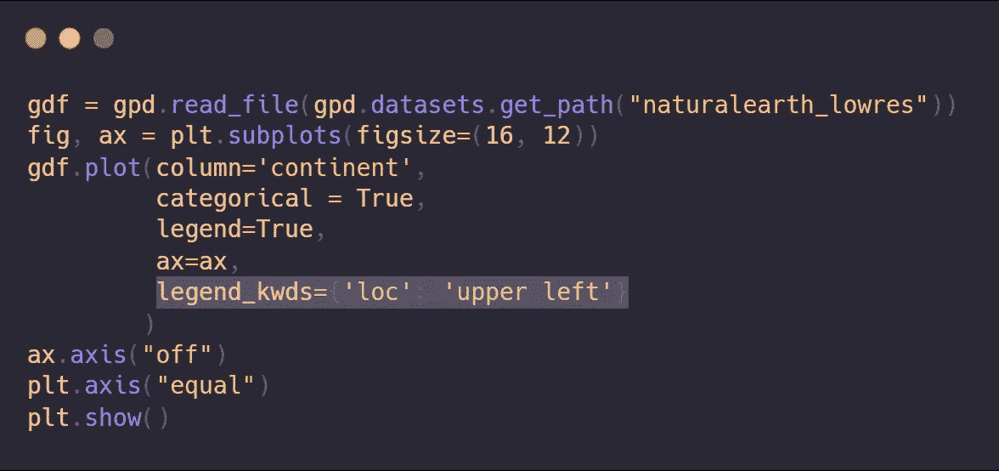
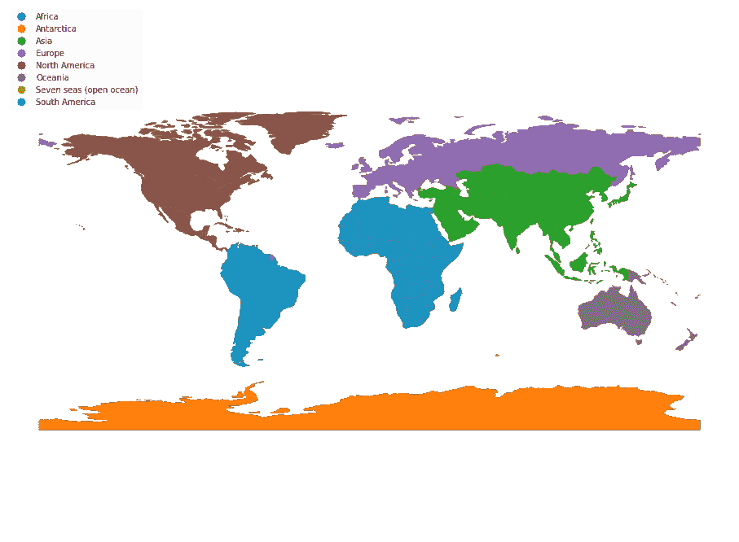
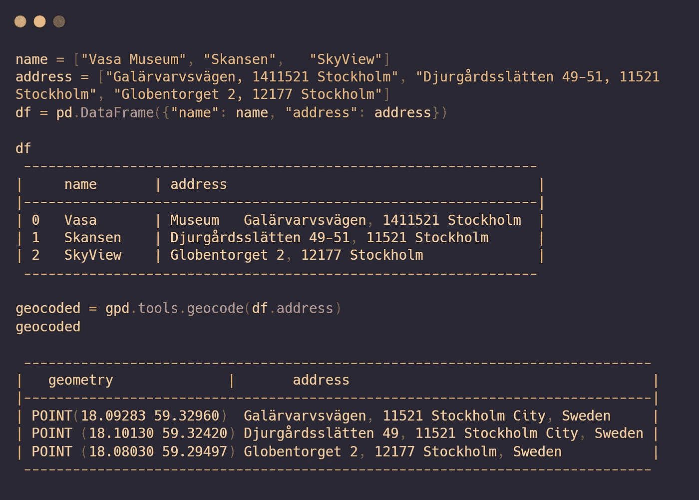
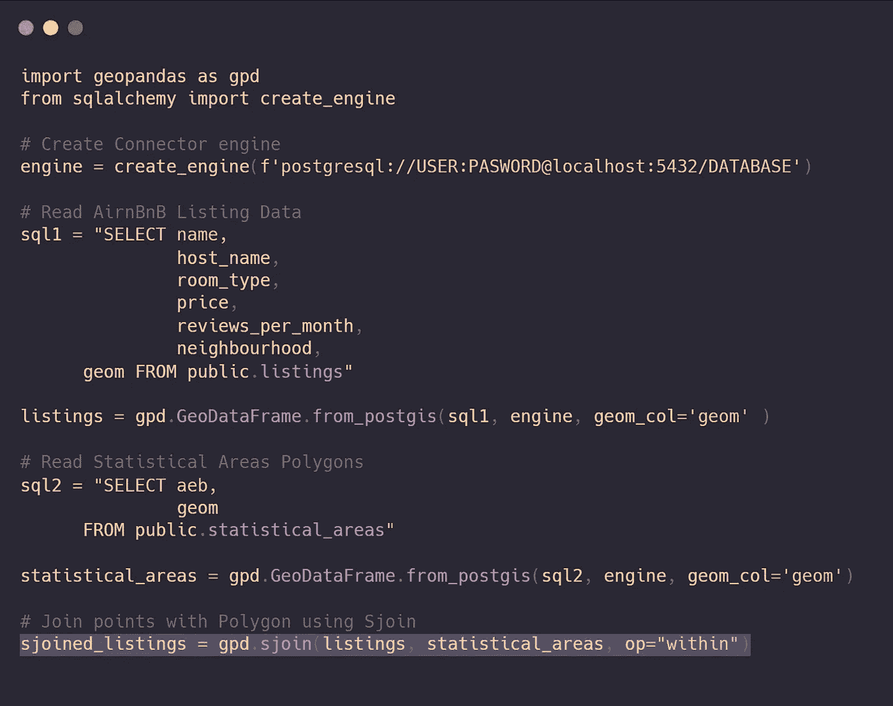
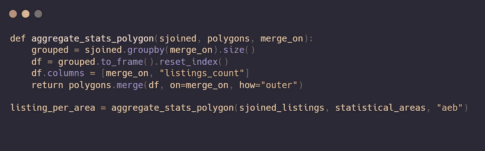
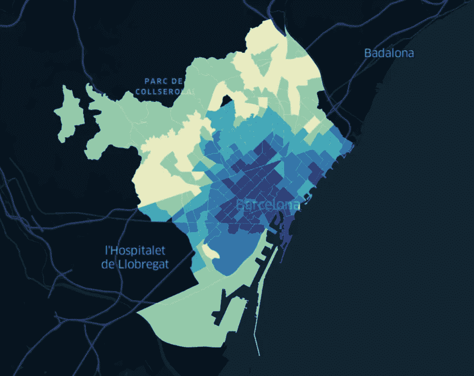
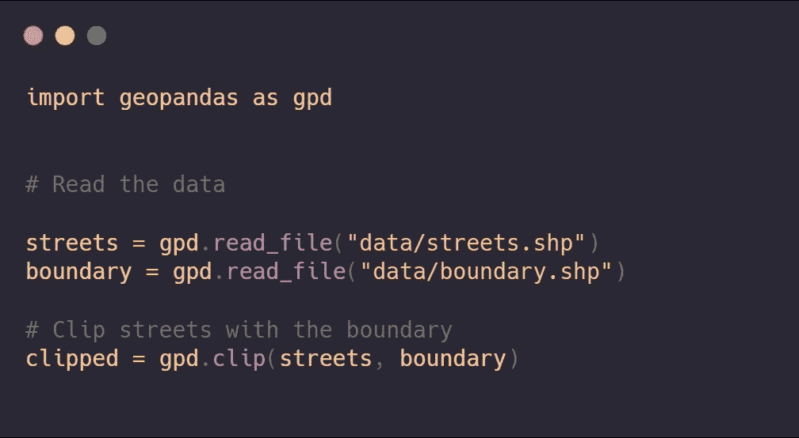
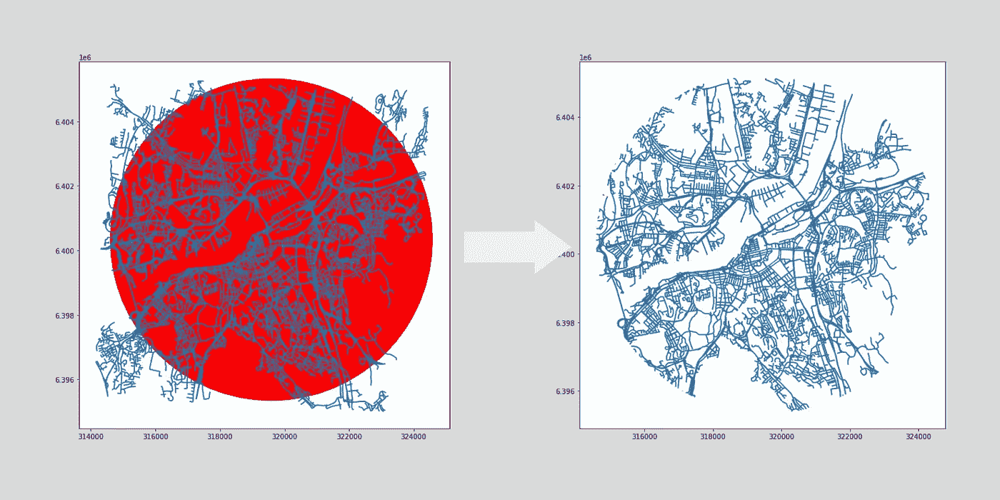
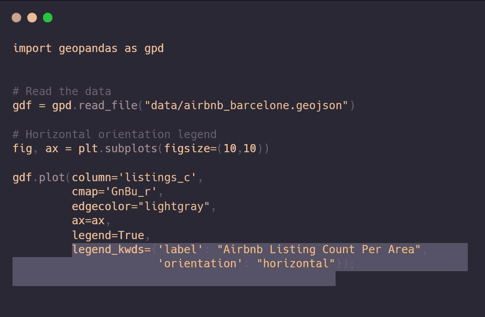
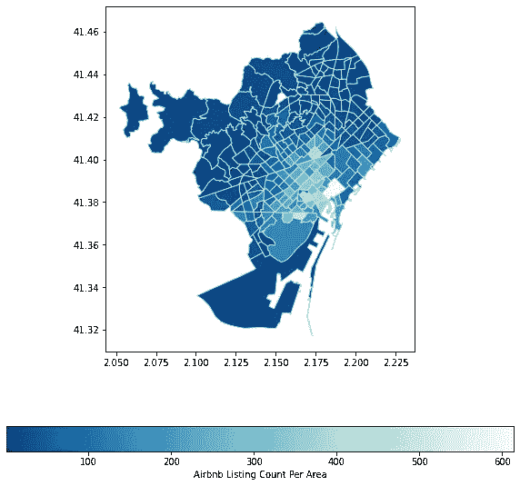

# 地理空间数据科学的六个 Python 技巧

> 原文：<https://towardsdatascience.com/six-python-tips-for-geospatial-data-science-4438a531b0bf?source=collection_archive---------32----------------------->

## 如何使用 Geopandas 在 Python 中轻松有效地整合空间要素

由[拍摄的奥斯卡·雪佛兰](https://unsplash.com/@osac?utm_source=medium&utm_medium=referral)在 [Unsplash](https://unsplash.com?utm_source=medium&utm_medium=referral)

在这一轮关于 Python 的地理空间技巧中，我通过六个关键方面来使用 Geopandas 有效地处理和制作 Python 中的漂亮地图。

如果您想访问地理空间数据处理的最新提示和技巧，可以访问:

 [## Python 中的 5 个地理空间提示和技巧

### 第 1 部分:如何使用 Geopandas 在 Python 中轻松有效地集成空间要素。

towardsdatascience.com](/5-geospatial-tips-and-tricks-in-python-eef86aec5110)  [## Python 中的 7 个地理空间数据处理技巧

### 第 2 部分:如何使用 Geopandas 在 Python 中轻松有效地集成空间要素。

towardsdatascience.com](/7-geospatial-data-processing-tips-in-python-dac5e4d28439) 

以下是我们在本文中包含的技巧列表。

*   [图例位置](#025c)
*   [轻松地理编码](#9ac7)
*   [空间连接](#cca8)
*   [行过滤器](#223c)
*   [夹子](#4041)
*   [单独的图例](#530b)

## 提示 1 —图例位置

传说是地图制作的重要组成部分。使用 GIS 软件，您可以拖放图例的位置以适应您的整体设计并避开障碍物。在 Geopadnas 中，您可以更改图例的位置。

默认情况下，图例显示在地图的右上角。在本例中，我们使用`legend_kwd`和`loc`参数将图例的位置更改到左上方。

图例位置-作者的图像。

下面是用上面的代码生成的地图。如您所见，图例位置现在位于地图的左上角。

左上角带有图例的大陆地图-图片由作者提供。

## 提示 2-简单的地理编码

地理编码是将物理地址描述转换为地球表面位置(以数字坐标表示的空间)的计算过程— [维基百科](https://en.wikipedia.org/wiki/Geocoding)。

在 Python 中使用 OpenStreetMap 免费进行地理编码很容易。在本例中，我们将对三个地址进行地理编码。首先，我们创建一个包含三个地址的数据帧。一旦我们有了数据帧，我们就可以在数据帧上快速调用. tools.geocode 方法。

一旦我们进行地理编码，我们就会得到一个额外的列，即几何列，它帮助我们执行地理功能，如缓冲、计算距离和最近点等。

## 提示 3-空间连接

作为基本的地理空间功能之一，空间连接几乎占了所有地理空间处理的一半。我们可以使用 Geopandas 通过位置快速连接空间数据。在本例中，我们使用 SQL 语法和 Geopandas `read_file`方法从 PostgreSQL 中读取数据。

一旦我们读取了数据，就很容易通过位置来连接数据。在上面代码的最后一行，我们使用 Geopandas 的`sjoin` sjoin 方法将列表点连接到静态区域多边形。我们以两个数据集的连接结束，表明每个点属于哪一个。

我们可以使用 Pandas 的 group by 和 aggregation 函数进一步处理数据，以获得统计数据。在本例中，我将对每个多边形或统计区域中的列表进行聚合和计数。

空间连接数据的聚合函数-图片由作者提供。

最终的数据框仅包含统计代码和每个多边形中 Airbnb 房源的数量。这是一张地图，显示了每个地区的列表数量。

Airbnb 房源 Choropleth 地图——作者图片

## 提示#4 —行过滤器

就像 pandas 数据帧一样，Geopandas 允许您限制或过滤出想要读取的行数。当您有一个大的数据集，并且您只想试验数据集的某一部分时，行筛选器非常有用。

按行过滤数据-按作者过滤图像。

我们可以通过传递 rows 参数来实现这一点。在上述代码的第一个实例中，我们将获得从零到一千的行。然而，通过切片，我们可以得到起始和结束数字之间的任意范围的行。

## 技巧 5——夹子

我们很少获得具有适当界限的正确数据。有时，我们需要将数据裁剪到我们感兴趣的边界。使用 Geopandas 裁剪地理空间数据就像调用。裁剪方法并提供两个地理数据框架。在本例中，我们将把街道裁剪为预定义的边界多边形。

在 Geopandas 中裁剪。—图片由作者提供。

现在，让我们比较这两个数据集。下图显示了裁剪后的数据与原始边界和街道数据集的对比。

裁剪数据集-作者提供的图像。

## 提示#6 —单独的图例

在第一篇技巧文章中，我们从图例位置开始，最后以图例方向结束。默认情况下，我们有一个垂直方向的图例。但是，出于任何原因，如果您希望有水平图例，您也可以使用 legend_kwds 和方向参数。让我们看一个水平图例方向的例子。

横向图例—作者图片。

输出是带有水平图例的地图。水平图例可以是美观的，并且可以帮助读者比垂直默认图例更好地阅读图例数字。

横向图例图—图片由作者提供。

## 结论

我希望您喜欢这一轮 Python 中的地理空间数据技巧。在本文中，我们看到了有效使用 Geopandas 进行地理空间数据分析的六个技巧。

其中一些技巧是直接的几何操作，对于处理地理空间数据至关重要:空间连接、裁剪和地理编码。其他三个提示与地图制作和图例样式有关。

如果你喜欢我在 Twitter 上发布的这些提示和技巧，你可以在 [@spatialML](https://twitter.com/SpatialML) 找到它们