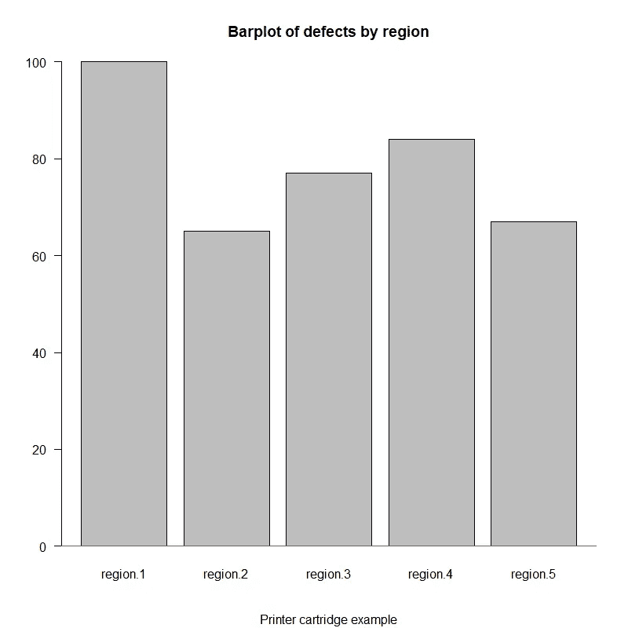
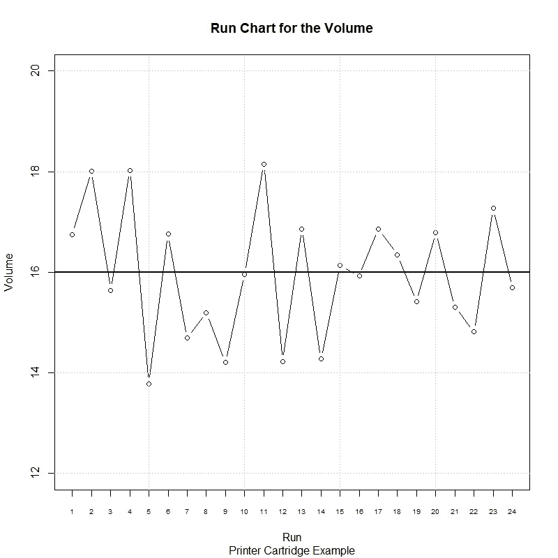
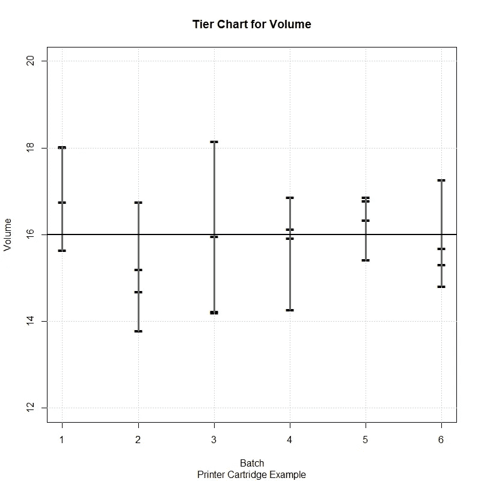
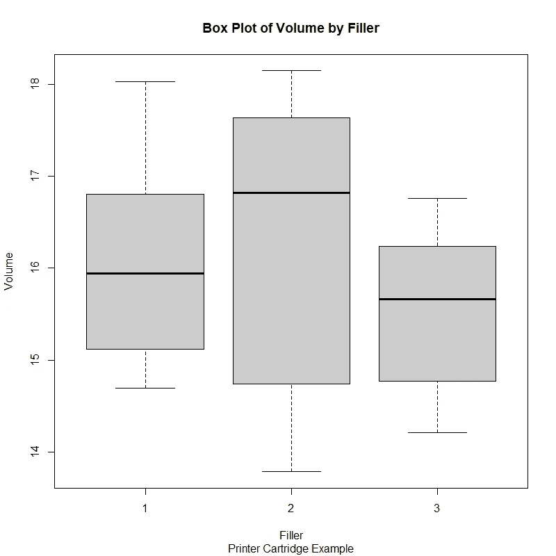
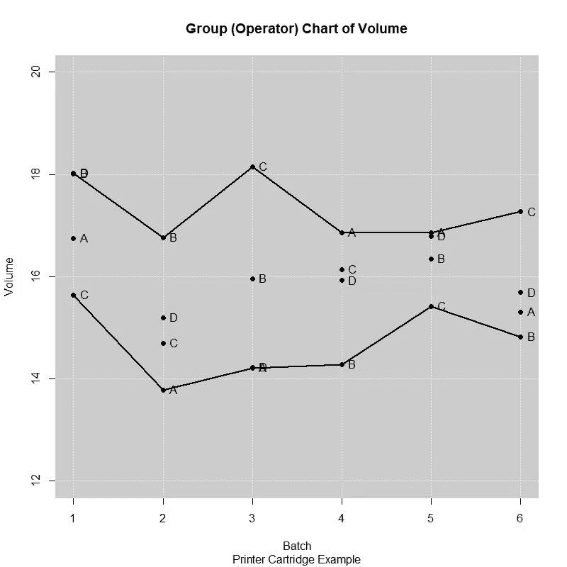
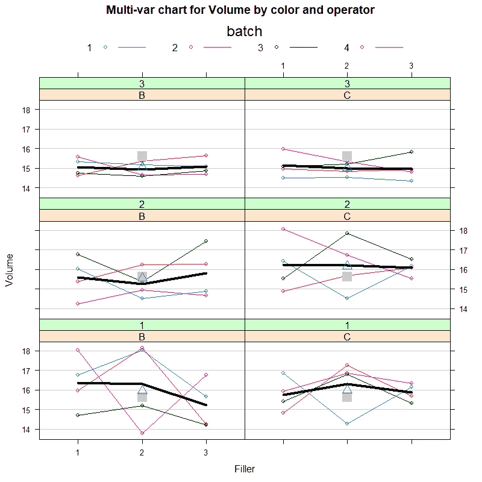

# 六个适马工程师使用 R 进行数据分析的必备工具

> 原文：<https://towardsdatascience.com/six-sigma-engineers-essential-tools-for-data-analysis-with-r-cd9fe61882df?source=collection_archive---------34----------------------->

## r 代表工业工程师

## 探索“六西格玛”R 包

在 [Unsplash](https://unsplash.com/photos/t5YUoHW6zRo) 可用的谷仓图像

# 数据分析图表

图表的开发是 DMAIC(定义、测量、分析、改进、控制)周期每个阶段的六个适马项目的重要组成部分。他们的主要目标是通过描述性分析支持数据的解释。虽然二维图表可以用作更复杂表示的基础，但多维数据可以通过这些图表的扩展来显示。

数据的图形表示有助于更好地理解给定的过程。在分析的早期阶段，当工程师需要进行推测、找出关系和计划进一步的研究时，它们是很有帮助的。因此，选择适当类型的图表是有效交流进展和建议的关键任务；糟糕的图表可能会毁掉项目期间完成的重要的好工作。

在本文中，我们将通过一个简单的案例研究来解释和说明六个适马项目中一些最重要的数据分析图表。有关在六个适马和质量保证项目中使用的附加工具的更多信息，请参考 [7 质量基本工具](/7-basic-tools-of-quality-using-r-49fef5481e07)。

# 条形图

条形图是最简单的图表类型。每个条形代表一个正在测量研究变量的因子。条形的高度代表给定数量或度量(如缺陷、项目、产品)的频率。条形图是计数的最佳图形表示。

对于这个例子和下面的例子， *ss.data.pc* 数据集(一个用于打印机墨盒例子的数据集，随 *SixSigma* 包提供)将用于生成一个特定的图表。

我们来看看 R 代码生成柱状图！

# 运行图表

运行图是二维图表，其中 *x* 轴代表时间线，而在 *y* 轴上绘制了被监控的变量。通常在运行图中画一条中线，它可以代表目标值、数据平均值或任何其他值。

当在 *x* 轴上有时间刻度时，这些图表也被称为时序图。运行图对于检测可以指示过程中的变化(即可变性)的模式是有用的。周期、趋势或转变的发现应触发过程评审，以采取进一步的措施来提高质量。

我们来看看 R 代码生成运行图！

# 分层图表

当每次运行有一个以上的观察值时，使用分层图。它们有助于在单个图表中同时显示短期变化和长期变化。短期变化由每个亚组内的变化表示，而长期变化由所有组之间的变化表示。

要创建分层图，在从较高值到较低值的每个游程的位置绘制垂直线。然后，将单个值绘制成点或水平线段。

让我们来看看生成层图的 R 代码！

# 盒须图

也称为盒图，盒须图用于以图形方式总结连续变量的分布。方框的两边是第一和第三个四分位数(分别是第 25 和第 75 个百分位数)。50%的数据位于盒子内部。穿过方框的线对应于中间值，极端晶须值可以是数据的最大值和最小值，或者是数据被认为是异常值的其他界限。极限值通常取为:

其中 *Q* 1 和 *Q* 3 分别是第一和第三个四分位，IQR 是四分位区间( *Q* 3 — *Q* 1)。

箱线图有助于直观显示分布是否居中或有偏差(即相对于其余数据的中间值的位置)，是否存在异常值(即触须之外的点)，或者数据是否接近中心值(即小触须或盒子)。此图表在比较各组和检查它们之间是否有差异时非常有用。

让我们来看看生成盒须图的 R 代码！

# 团体图表

分组图主要用于图形化显示多个点所属的分组。在六适马环境中，当测量的特性由不同的过程流产生或在不同的位置测量时，它们很有用。每组的最大值和最小值通常由线连接。

我们来看看 R 代码生成组图！

# 多元图表

多元图表主要用于以图形方式识别影响特定结果的因素(即质量关键(CTQ)特征)。一旦确定了这些因素，就可以提出并执行变更，以实现期望的目标。

对于以下示例，将使用扩展版本的 *ss.data.pc.big 数据集*来生成多元图表。数据集包含 72 个观察值，对应于 4 个不同因素的所有可能组合:颜色(2)、操作者(3)、填充剂(3)和批次(4)。我们来看看 R 代码生成多元图表！

# 总结想法

过程改进、质量保证和六西格玛工程师必须能够使用贯穿本文的概念来构建最合适的图表来表示数据。同样，发展和强化图形分析技能将带来更好的解释(即更容易识别周期、变化或趋势)，这将有助于制定更有效的行动计划，以提高业务交付成果的质量。

正确选择图表将简化结果交流和对所传达信息的理解。本文并不打算说服读者在开发这些图表时严格使用 R for，而是介绍如何用几行代码在免费的开源软件中开发这些图表。

*—*

*如果你觉得这篇文章有用，欢迎在* [*GitHub*](https://github.com/rsalaza4/R-for-Industrial-Engineering/tree/master/Miscellaneous) *上下载我的个人代码。你也可以直接在 rsalaza4@binghamton.edu 给我发邮件，在*[*LinkedIn*](https://www.linkedin.com/in/roberto-salazar-reyna/)*上找到我。有兴趣了解工程领域的数据分析、数据科学和机器学习应用的更多信息吗？通过访问我的媒体* [*简介*](https://robertosalazarr.medium.com/) *来探索我以前的文章。感谢阅读。*

*——罗伯特*