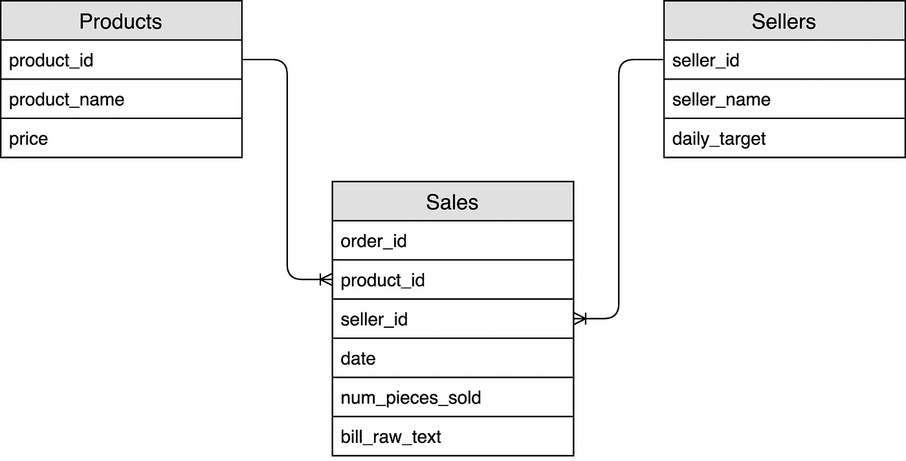
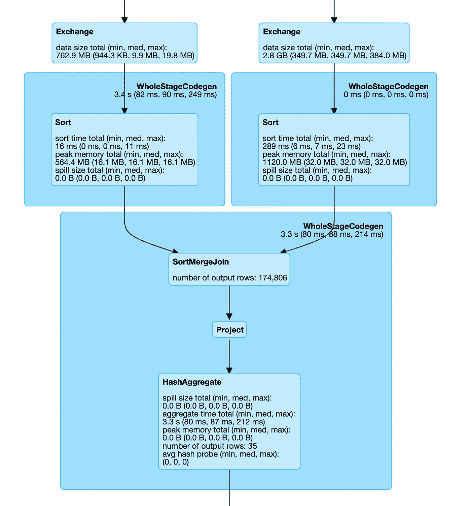
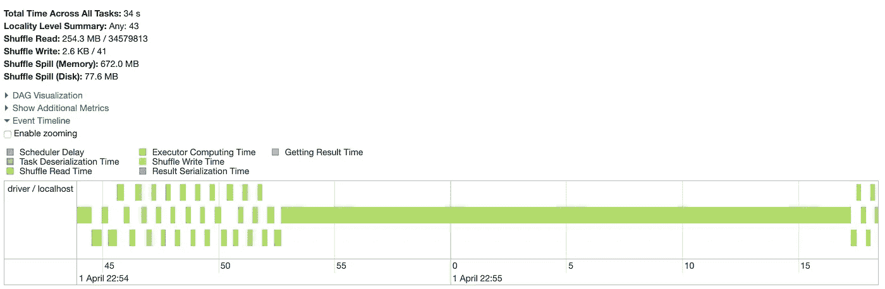
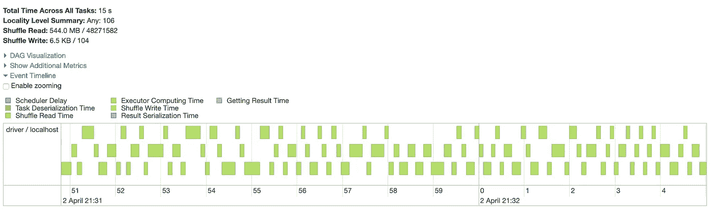

# 六个星火练习来统治他们

> 原文：<https://towardsdatascience.com/six-spark-exercises-to-rule-them-all-242445b24565?source=collection_archive---------0----------------------->

## 一些具有挑战性的 Spark SQL 问题，易于在许多现实世界的问题上提升和转移(带解决方案)


照片由 [Xan Griffin](https://unsplash.com/@xangriffin?utm_source=unsplash&utm_medium=referral&utm_content=creditCopyText) 在 [Unsplash](https://unsplash.com/s/photos/victory?utm_source=unsplash&utm_medium=referral&utm_content=creditCopyText) 上拍摄

Spark SQL 非常容易使用，句号。你可能已经知道这也是**很难掌握的** **。**

要精通 Spark，必须具备三项基本技能:

1.  操作和理解数据的能力
2.  **关于**如何根据程序员的需求弯曲工具**的知识**
3.  **在影响 Spark 工作执行的因素中寻找平衡的艺术**

****我精心制作了以下六个练习，这些练习类似于 Spark 开发人员在构建他们的管道时每天面临的一些典型情况:这些将有助于评估上述技能。****

****你可以在文章末尾找到建议的解决方案！****

# ****数据集****

****让我们简单描述一下我们将要使用的数据集:i **t 由来自商店数据库的三个表组成，分别是产品、销售和卖家。您可以通过下面的链接下载拼花文件中的数据。请注意，要 100%利用这些练习，你需要阅读提供的文件！(.zip、~6GB、** [**如果无法下载数据，可以点击这里**](https://gist.github.com/aialenti/cfd4e213ebf2ef6e20b195c8fb45382c) **)** 找到生成器脚本****

 ****[## datasettocomplettethesixsparkexercises . zip

### 包含做六个练习的三个表的数据集

drive.google.com](https://drive.google.com/file/d/1kCXnIeoPT6p9kS_ANJ0mmpxlfDwK1yio/view?usp=sharing)**** 

****下图显示了如何连接这些表:****

********

## ******销售表******

****该表中的每一行都是一个订单，每个订单只能包含一种产品。每行存储以下字段:****

*   ****`order_id`:订单编号****
*   ******`product_id`:订单中销售的单个产品。**所有订单只有一种产品********
*   ****`seller_id`:销售产品的销售员工 ID****
*   ****`num_pieces_sold`:订单中特定产品的**销售数量******
*   ****`bill_raw_text`:一个字符串，表示与订单关联的账单的**原始文本******
*   ****`date` : **订单的日期**。****

****下面是表格的一个示例:****

## ****产品表****

****每行代表一种**独特的产品**。这些字段是:****

*   ****`product_id`:产品 ID****
*   ****`product_name`:产品名称****
*   ****`price`:产品价格****

## ****卖方表****

****该表包含所有卖家的列表:****

*   ****`seller_id`:卖家 ID****
*   ****`seller_name`:卖家名称****
*   ****`daily_target`:卖家完成其配额所需的商品数量(**与产品类型**无关)。例如，如果每日目标是 100，000，员工需要销售 100，000 件产品，他可以通过销售 100，000 件 product_0 以及 30，000 件 product_1 和 70，000 件 product_2 来达到定额****

# ****练习****

****利用下面的练习的最好方法是**下载数据并实现一个工作代码来解决提出的问题**，最好是在分布式环境中！我建议在阅读本页末尾的解决方案之前先这样做！****

****提示:我构建数据集是为了允许在单台机器上工作:**在编写代码时，想象一下数据集大 100 倍会发生什么。******

****即使你知道如何解决这些问题，我的建议是不要跳过热身问题！(如果你知道火花，他们需要几秒钟)。****

****如果要用 Python 做这个练习，需要以下包:****

```
**# Pyspark
pip install pyspark# Pyspark stubs
pip install pyspark-stubs**
```

## ****热身#1****

```
**Find out how many orders, how many products and how many sellers are in the data.How many products have been sold at least once? Which is the product contained in more orders?===========**Create the Spark session using the following code**spark = SparkSession.builder \
    .master("local") \
    .config("spark.sql.autoBroadcastJoinThreshold", -1) \
    .config("spark.executor.memory", "500mb") \
    .appName("Exercise1") \
    .getOrCreate()**
```

## ****热身#2****

```
**How many distinct products have been sold in each day?===========**Create the Spark session using the following code**spark = SparkSession.builder \
    .master("local") \
    .config("spark.sql.autoBroadcastJoinThreshold", -1) \
    .config("spark.executor.memory", "500mb") \
    .appName("Exercise1") \
    .getOrCreate()**
```

## ****练习#1****

```
**What is the average revenue of the orders?===========**Create the Spark session using the following code**spark = SparkSession.builder \
    .master("local") \
    .config("spark.sql.autoBroadcastJoinThreshold", -1) \
    .config("spark.executor.memory", "500mb") \
    .appName("Exercise1") \
    .getOrCreate()**
```

## ****练习#2****

```
**For each seller, what is the average % contribution of an order to the seller's daily quota?**# Example** If Seller_0 with `quota=250` has 3 orders:Order 1: 10 products sold
Order 2: 8 products sold
Order 3: 7 products soldThe average % contribution of orders to the seller's quota would be:
Order 1: 10/105 = 0.04
Order 2: 8/105 = 0.032
Order 3: 7/105 = 0.028Average % Contribution = (0.04+0.032+0.028)/3 = 0.03333===========**Create the Spark session using the following code**spark = SparkSession.builder \
    .master("local") \
    .config("spark.sql.autoBroadcastJoinThreshold", -1) \
    .config("spark.executor.memory", "500mb") \
    .appName("Exercise1") \
    .getOrCreate()**
```

## ****练习#3****

```
**Who are the **second most selling and the least selling** persons (sellers) for each product?Who are those for product with `product_id = 0`===========**Create the Spark session using the following code**spark = SparkSession.builder \
    .master("local") \
    .config("spark.sql.autoBroadcastJoinThreshold", -1) \
    .config("spark.executor.memory", "3gb") \
    .appName("Exercise1") \
    .getOrCreate()**
```

## ****练习#4****

```
**Create a new column called "hashed_bill" defined as follows:- **if the order_id is even**: apply MD5 hashing iteratively to the bill_raw_text field, once for each 'A' (capital 'A') present in the text. E.g. if the bill text is 'nbAAnllA', you would apply hashing three times iteratively (***only if the order number is even***)- **if the order_id is odd**: apply SHA256 hashing to the bill textFinally, check if there are any duplicate on the new column===========**Create the Spark session using the following code**spark = SparkSession.builder \
    .master("local") \
    .config("spark.sql.autoBroadcastJoinThreshold", -1) \
    .config("spark.executor.memory", "3gb") \
    .appName("Exercise1") \
    .getOrCreate()**
```

# ****解决方法****

****让我们深入研究解决方案。首先，你应该注意到**热身问题对解决练习**很方便:****

## ****热身#1****

****这个练习的答案很简单。首先，我们只需要`count`每个数据集中有多少行:****

****我们得到以下输出:****

```
**Number of Orders: 20000040
Number of sellers: 10
Number of products: 75000000**
```

****如您所见，我们的数据集中有 **75，000，000 个产品**和 2 **0，000，040 个订单**:由于每个订单只能有一个产品，其中一些从未售出。让我们找出有多少产品至少出现一次，哪个产品包含在更多订单中:****

****第一个查询计算 sales 表中有多少不同的产品，而第二个块提取 sales 表中计数最高的`product_id`。****

****输出如下所示:****

```
**Number of products sold at least once
+--------------------------+
|count(DISTINCT product_id)|
+--------------------------+
|                    993429|
+--------------------------+Product present in more orders
+----------+--------+
|product_id|     cnt|
+----------+--------+
|         0|19000000|
+----------+--------+**
```

****让我们仔细看看第二个结果:20 M 中的 19，000，000 个订单正在销售带有`product_id = 0` : **的产品这是一个我们以后应该使用的强大信息！******

## ****热身#2****

****对 Spark 有所了解，这应该很简单:我们只需要找出*“在每一天卖出了多少不同的产品”*:****

****这里不多说了，输出如下:****

```
**+----------+----------------------+
|      date|distinct_products_sold|
+----------+----------------------+
|2020-07-06|                100765|
|2020-07-09|                100501|
|2020-07-01|                100337|
|2020-07-03|                100017|
|2020-07-02|                 99807|
|2020-07-05|                 99796|
|2020-07-04|                 99791|
|2020-07-07|                 99756|
|2020-07-08|                 99662|
|2020-07-10|                 98973|
+----------+----------------------+**
```

## ****练习#1****

****让我们解决难题吧！第一个练习是简单地询问"*订单的平均收入是多少？*****

******理论上，这很简单:我们首先需要计算每个订单的收入，然后得到平均值**。记得那个`revenue = price * quantity`。零用易:`product_price`在`products`表中，金额在`sales`表中。****

****第一种方法是简单地连接两个表，创建一个新列，然后求平均值:****

****以上是正确的，并且它可能工作得相当好(**特别是如果您正在本地环境中工作**)。但是让我们看一下执行计划 DAG:在某个时候，我们将有一个重新分区(在`product_id`字段上)和一个连接:****

********

****让我们看看当 Spark 执行 join 时会发生什么(在 Spark UI 上的**):******

********

****哎呀！一项任务比其他任务花费更多的时间！****

******这是一个典型的倾斜连接的例子，其中一个任务需要很长时间来执行，因为连接只倾斜在很少的键上**(在这个例子中是`product_id = 0`)。[我在我的媒体文章《星火加盟的艺术》中提到过星火加盟，如果你想了解更多，可以去那里看看！](/the-art-of-joining-in-spark-dcbd33d693c)****

****[](/the-art-of-joining-in-spark-dcbd33d693c) [## 火花中加入的艺术

### Spark 中加速连接的实用技巧

towardsdatascience.com](/the-art-of-joining-in-spark-dcbd33d693c) 

请注意，如果您在本地系统上运行 Spark，这不是一个大问题。在分布式环境中(有更多的数据)，这个连接可能会花费**难以置信的时间来完成**(也许根本不会完成！).

让我们用一种叫做“密钥加盐”的技术来解决这个问题。我不会详细描述，因为我已经在上面链接的文章中涉及了这个主题。总结一下，我们要做的是:

1.  **为最常见的产品**复制维度表中的条目，例如，将复制 product_0，创建 id:`product_0–1`、`product_0–2`、`product_0–3`等。
2.  **在销售表上，我们将把“** `**product_0**` **”替换为随机复制的**(例如，其中一些将替换为`product_0–1`，其他替换为`product_0–2`，等等。)**使用新的“salted”键将消除连接的倾斜:**

这里要注意的重要一点是**我们并没有对所有的产品加盐，只是对那些驱动偏斜度的产品加盐**(在这个例子中，我们得到了 100 个最频繁出现的产品)。**对整个数据集加盐会有问题，因为行数会根据“加盐因子”线性增长**:

查看我们执行上述操作时的各个阶段:



查询的结果应该如下所示

```
+------------------------------+
|avg((price * num_pieces_sold))|
+------------------------------+
|            1246.1338560822878|
+------------------------------+
```

在本地环境中使用这种技术可能会导致执行时间的增加；然而，在现实世界中，这个技巧可以决定完成还是不完成连接。

## 练习#2

第二个问题是:*“对于每个卖家，订单对卖家每日配额的平均贡献百分比是多少？".*

**这与第一个练习**类似:我们可以将我们的表与 sellers 表连接起来，我们计算特定订单的配额命中率，然后计算平均值，按`seller_id`分组。

同样，这可能会产生一个偏斜的连接，因为即使是卖家也不是均匀分布的。不过，在这种情况下，解决方案要简单得多！因为卖家的表格很小，**我们可以广播它，使得操作快得多**！

**“广播”仅仅意味着将表的副本发送给每个执行者，允许“本地化”任务**。我们需要小心地使用这个操作符:当我们广播一个表时，**我们需要确保这个表不会变得太大而不能在将来广播**，否则我们将会在以后出现内存不足的错误(随着广播数据集变得越来越大)。

## 练习#3

问题:*“每种产品的* ***销量第二多和销量最少的*** *人员(卖家)是谁？那些带有* `*product_id = 0*` *的产品是谁。*

这听起来像窗口函数！让我们来分析一下这个问题:对于每种产品，我们需要**销量第二多和销量最少的员工(销售人员)**:我们可能需要两个排名，一个是销售图表中的第二名，另一个是最后一名。我们还需要处理一些边缘情况:

*   **如果一个产品只被一个卖家**卖出，我们会把它放入一个特殊的类别(类别:`Only seller or multiple sellers with the same quantity`)。
*   **如果一个产品由多个卖家出售，但所有卖家都出售了相同的数量**，我们将把他们放在同一个类别中，就好像他们只是该产品的一个卖家一样(类别:`Only seller or multiple sellers with the same quantity`)。
*   **如果“最少销售”也是“第二次销售”**，我们将仅将其计为“第二次销售”

让我们起草一个策略:

1.  **我们得到每对产品和卖家的销售总额。**
2.  **我们增加了两个新的排名列**:一个按**降序排列产品的销售额，另一个按升序排列。**
3.  **我们将获得的数据集分成三份**:我们要处理的每个案例一份(第二大销售、最少销售、单一销售)。
4.  **在计算“最少销售”时，我们排除了只有一个销售人员的产品，以及销售最少的员工也是第二多销售人员的产品**
5.  我们把碎片重新组合在一起。

问题第二部分的结果如下:

```
+----------+---------+--------------------+
|product_id|seller_id|                type|
+----------+---------+--------------------+
|         0|        0|Only seller or mu...|
+----------+---------+--------------------+
```

## 练习#4

对于这个最后的练习，**我们只需要应用一个奇特的算法**。我们可以通过**UDF(用户定义函数)**来实现。UDF 是一个**自定义函数，可以在数据帧列**上调用；作为一条经验法则，我们通常应该尽量避免 UDF，因为 Spark 并不能真正优化它们:UDF 代码通常比非 UDF 代码运行得慢。**不幸的是，我们不能仅使用 Spark SQL 函数**来应用所描述的算法。

解决方案如下所示:

首先，我们需要定义 UDF 函数 : `def algo(order_id, bill_text)`。`algo`功能接收`order_id`和`bill_text`作为输入。

UDF 函数实现算法:

1.  检查`order_id`是偶数还是奇数。
2.  如果`order_id`是偶数，计算钞票文本中大写字母“A”的数量，并迭代应用 MD5
3.  如果`order_id`是奇数，应用 SHA256
4.  返回哈希后的字符串

之后，这个函数需要通过`algo_udf = spark.udf.register(“algo”, algo)`行注册到 Spark 会话中。第一个参数是 Spark 上下文中的函数名，而第二个参数是将要执行的实际函数。

我们在下面一行应用 UDF:

```
sales_table.withColumn("hashed_bill", algo_udf(col("order_id"), col("bill_raw_text")))
```

如您所见，该函数将两列作为输入，并将对每一行执行(即每对`order_id`和`bill_raw_text`)。

**在最终的数据集中，所有的散列应该是不同的，所以查询应该返回一个空的数据集**

# 拿走

如果你完成了所有的练习，恭喜你！这些内容涵盖了关于 Spark SQL 开发的一些非常重要的主题:

1.  **连接偏斜**:这通常是 Spark 管道中的主要痛点；有时很难解决，因为在这些操作中涉及的所有因素之间找到平衡并不容易。
2.  **窗口函数**:超级有用，唯一要记住的就是先定义开窗。
3.  虽然 UDF 非常有用，但是我们在开始开发这样的函数之前应该三思，因为它们的执行可能会降低我们代码的速度。

当然，上面的练习可以用许多不同的方法来解决，我很乐意接受建议！我希望你喜欢！**让我知道你的想法**，如果你愿意，**看看这些其他的文章！**

[](/effortless-hyperparameters-tuning-with-apache-spark-20ff93019ef2) [## 使用 Apache Spark 轻松调整超参数

### 如何在 Spark 上运行随机搜索而不用编写 Spark 代码？

towardsdatascience.com](/effortless-hyperparameters-tuning-with-apache-spark-20ff93019ef2) [](/clustering-pollock-1ec24c9cf447) [## 聚类波洛克

### 杰森·布拉克绘画的聚类分析——如何利用 k-means 进行色彩分组

towardsdatascience.com](/clustering-pollock-1ec24c9cf447)****