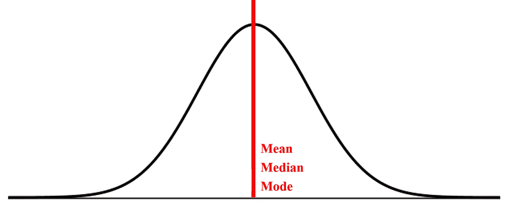
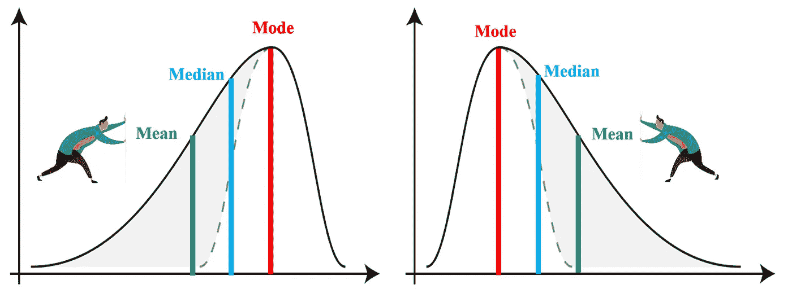
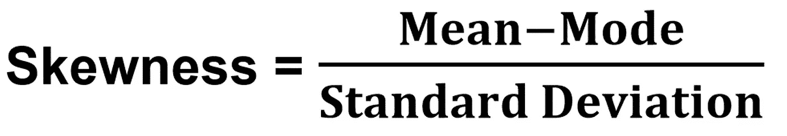
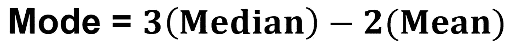
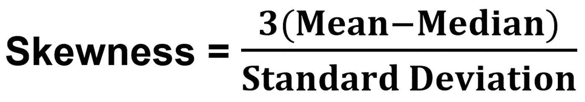
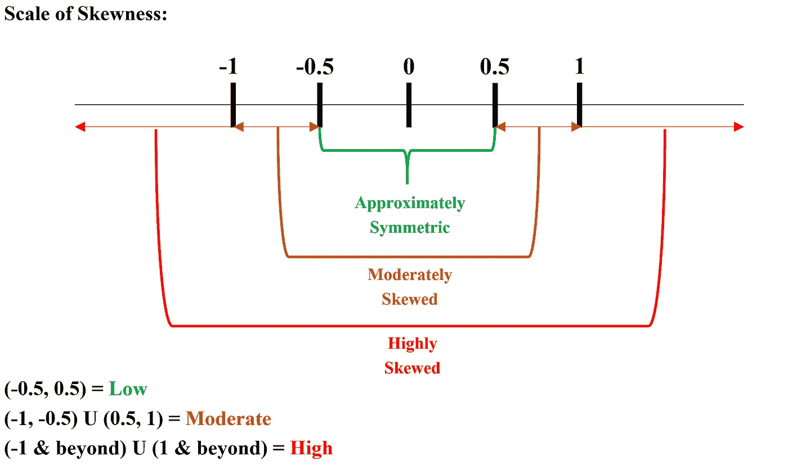
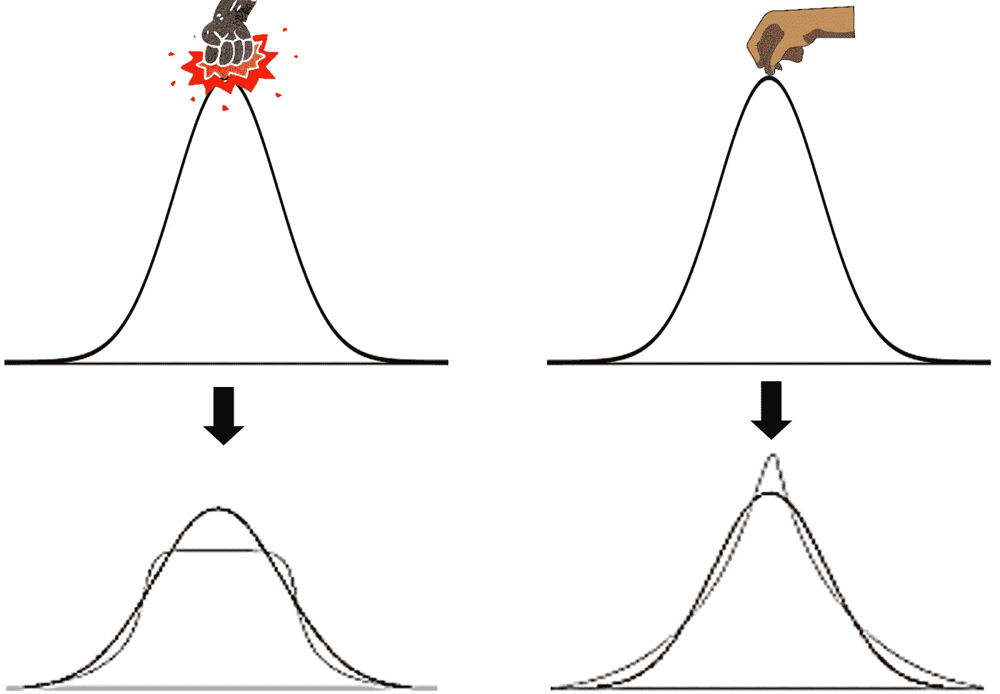
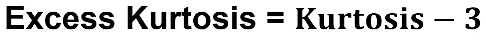
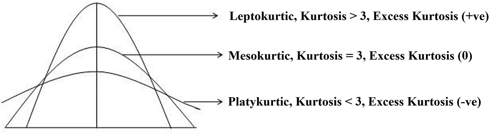

# 简化的偏度和峰度

> 原文：<https://towardsdatascience.com/skewness-kurtosis-simplified-1338e094fc85?source=collection_archive---------0----------------------->

## 什么是偏斜度，我们如何检测它？

*如果你问大自然母亲——她最喜欢的概率分布是什么？*

答案将是——“正常”，其背后的原因是影响地球上每一个已知变量的机会/随机原因的存在。如果一个过程也受到可分配/重要原因的影响呢？这肯定会改变分布的形状(扭曲),这时我们需要像偏斜度这样的度量来捕捉它。下面是一个正态分布图，也称为钟形曲线。这是一个对称的图形，所有集中趋势的量度都在中间。

(图片由作者提供)

但是，如果我们遇到不对称分布，我们如何检测不对称的程度呢？让我们直观地看看当我们遇到这样的图形时，集中趋势的度量会发生什么。

(图片由作者提供)

请注意，当正态分布被扭曲时，这些集中趋势度量会如何传播。对于命名法，只需遵循尾部的方向即可——对于左图，因为尾部在左侧，所以它是左偏斜的(负偏斜),而右图的尾部在右侧，所以它是右偏斜的(正偏斜)。

如何推导出一个衡量标准来捕捉分布的众数和平均数之间的水平距离？很直观地认为，偏斜度越高，这些度量就会越分开。现在让我们跳到偏斜度的公式:

除以标准差可以在相同的标准标度上进行分布的相对比较。由于不建议将众数计算作为小数据集的集中趋势，因此为了得到更可靠的偏度公式，我们将使用从中值和平均值导出的计算结果来代替众数。

**近似为偏态分布*

替换偏度公式中的众数值，我们得到:

(图片由作者提供)

> 什么是峰度，我们如何捕捉它？

想想从顶部打孔或者拉正态分布曲线，会对分布的形状产生什么影响？让我们想象一下:

(图片由作者提供)

因此，有两件事需要注意——曲线的峰值和尾部，峰度测量负责捕捉这一现象。峰度计算的公式很复杂(在基于矩的计算中是第 4 阶矩),所以我们将坚持这个概念及其直观的清晰性。正态分布的峰度为 3，称为中峰度。大于 3 的分布称为薄分布，小于 3 的分布称为宽分布。所以值越大，峰值越大。峰度范围从 1 到无穷大。由于正态分布的峰度度量值为 3，我们可以通过保持正态分布的参考值为零来计算超额峰度。现在过度峰度将从-2 变化到无穷大。

正态分布的过度峰度= 3–3 = 0

当峰度为 1 = 1–3 =-2 时，超额峰度值最低

(图片由作者提供)

> 峰度的话题已经争论了几十年，这些年来峰度的基础一直与峰值相关联，但最终的结论是离群值(较胖的尾部)比均值(峰值)附近的值更能控制峰度效应。

因此，我们可以从上面的讨论中得出结论，正态分布曲线的水平推或拉失真由偏斜度度量捕获，而垂直推或拉失真由峰度度量捕获。此外，主导峰度效应的是异常值的影响，其证据来源于基于四阶矩的公式。我希望这篇博客能帮助你以一种简单的方式阐明偏度和峰度的概念，并在未来关注更多类似的博客。

谢谢！！！