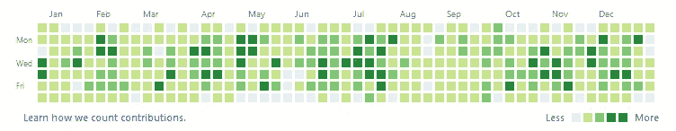
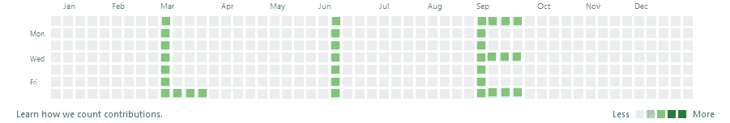

# 为招聘流程的 GitHub 活动图换肤

> 原文：<https://towardsdatascience.com/skinning-the-github-activity-chart-for-the-recruiting-process-9b97728d528?source=collection_archive---------20----------------------->

作为一名软件工程师，对你来说，推销自己和你的工作的最好方式是你的 GitHub 账户。公式很简单——展示令人印象深刻的项目，定期的活动，并在你的知识库中有大量的星星和叉子。

招聘人员的圣杯— Gleb Bahmutov GitHub 活动图

就是这样。这应该足够让你参加很多面试了。

现在，成功通过这些面试的问题本身就是一个大话题，围绕它建立了一个完整的商业生态系统，所以让我们假设你已经把这部分收入囊中了。:)

然而，当招聘人员在 GitHub 上寻找工程师时，有一件重要的事情需要讨论——招聘人员通常是非技术人员。

为什么这很重要？三个原因:

首先，他们无法准确判断你所做的事情是否令人印象深刻。有时，向项目中添加 100 行代码可能意味着系统效率的彻底转变。发现这一点有时需要详细查看代码，并理解哪些内容发生了变化以及以何种方式发生了变化，以便保证所述改进。

其次，最好的程序员是这个星球上最懒的人。他们不在乎努力工作，他们在乎聪明地工作，对于程序员来说，自然的道路是尽可能多地自动化他们的生活。

最后，许多程序员非常清楚我写的第一点(上面的两段)——他们知道他们的工作没有被通常装备不足的招聘人员从外部角度公平地评判。

综合所有这些因素，我们可以得出这篇文章的中心观点:考虑到招聘过程的惊人复杂性，GitHub 为每个用户衡量和展示的生产力和技能的许多不同方面，以及招聘机构在严格的研究、方法和招聘指标上花费的时间，*有没有一种方法可以自动最大化程序员对面试的适应性*？

Pfft 当然有。

永远记住:如果 it *可以*自动化，it *就会*自动化。

GitHub 活动图表的漫画

下面是一个 50 行的 Python 脚本，它更改了一个简单文本文件中的文本，并通过随机提交消息将其推送到一个选定的存储库中。通过这样做，它在常规的基础上做了微小的改变，并确保将你的贡献沐浴在一片葱郁、春意盎然的绿色中。

虽然有许多方法可以实现 GitHub 活动的自动化，但我选择了这一种，因为它简单且有良好的记录。这只会影响你整个 GitHub 活动的一部分，但往往是招聘人员和其他工程师在评估技能时在个人资料中寻找的关键指标。

我想在结束的时候讨论一下这个问题的含义，并给你一个免责声明。

首先，*不要自己用这个脚本*。

我并不特别赞同自动化的使用，也不认为自动化 GitHub 活动的一部分(或全部)本质上是个坏主意。然而，我确实认为这是一个错误的价值展示，任何做最少量挖掘的人都会看到你的“活动”充满了简单的变化，而这些变化对项目没有任何贡献，这肯定会发出危险信号。

甚至可能有人为此编写了一个反脚本——检查用户的活动，并试图判断该活动是真实的还是自动化的产物。这可能会立即让你失去参加更严肃的面试的资格(例如，大型科技公司)。

这种推销自己的方法的广泛后果是，技能/经验不足的人得到的工作要求他们按照他们在 GitHub 账户上错误展示的速度工作，因此经常导致失败和错过投资(招聘人员的错误)，或者精疲力尽、压力和疲劳(程序员的错误)。

总结一下——如果你在招聘，确保你不会上当，确保如果你的生产率指标是 GitHub 活动，你的员工不会这样做，除非你*真的*知道你在做什么，否则不要为你自己的个人资料这样做。