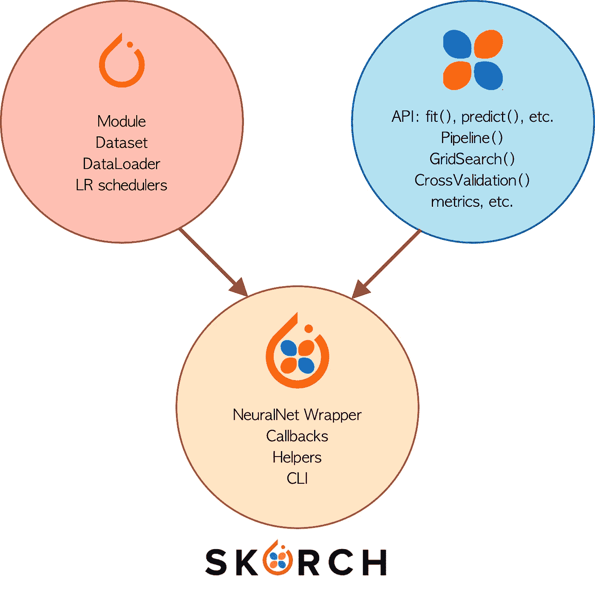

# SKORCH:用 Scikit-Learn 包装器训练的 PyTorch 模型

> 原文：<https://towardsdatascience.com/skorch-pytorch-models-trained-with-a-scikit-learn-wrapper-62b9a154623e?source=collection_archive---------18----------------------->

## 理解使用 SKORCH 训练 PyTorch 模型是多么容易和简单的指南


肯尼斯·贝里奥斯·阿尔瓦雷斯在 [Unsplash](https://unsplash.com?utm_source=medium&utm_medium=referral) 上拍摄的照片

你有没有想过有没有一种工具可以简单方便地训练和评估 **PyTorch** 车型？这个工具确实存在，它就是 **SKORCH** ，一个用于训练 **PyTorch** 模型的 **scikit-learn** 包装器。

在这篇博客中，我们将讨论什么是 **SKORCH** ，它的组成部分，以及包装一个 **PyTorch** 模型来训练和评估它是多么容易。博客将分为以下几个部分:

*   **什么是 SKORCH？**
*   **PyTorch 型号**
*   与斯科奇一起训练

我们开始吧！

# 什么是斯科奇？

**SKORCH** 是 **scikit-learn** 和 **PyTorch** 的并集，换句话说， **SKORCH** 是一个用于训练、调整和优化 **PyTorch** 模型的包装器。 **SKORCH** 是 2017 年推出的开源库【1】， **SKORCH** 的出现是为了将 **PyTorch** 和 **SciKit-learn** 框架的伟大优点结合在一起并加以增强。


图一。PyTorch + SciKit-Learn = SKORCH |作者图片|取自原始来源的徽标

PyTorch 是开发神经网络模型最常用的框架之一，然而，有些阶段需要开发时间，有时它会成为有些不切实际的部分。**斯科奇**试图简化 **PyTorch** 车型培训阶段的各种流程。在一个或多个功能中开发 **PyTorch** 模型的训练模块是很常见的，然而，当需要评估模型或优化以找到最佳参数时，需要开发额外的功能。所有这些过程都被 **SKORCH** 简化了，因为它是基于 **scikit-learn** 的包装，因此扩展了已经执行这些过程的函数。

> 斯科奇宣称他的哲学是:“做一个科学的人——学习 API，学会黑客，不要隐藏 PyTorch，不要重新发明轮子”

在图 2 中，我们可以看到复合了**斯科奇**的 **PyTorch** 和 **scikit-learn** 的能力。正如我们所见，从 **PyTorch** 方面来看，原型化模型和处理数据集的能力被使用了。另一方面，我们观察到 **scikit-learn** 已知的函数被扩展到能够训练、评估、调整和优化机器学习模型，这种组合使 **SKORCH** 成为一个强大的工具。



图二。PyTorch 和 scikit 的优势-了解 SKORCH |作者图片|来自原始来源的徽标

另一方面，我们可以将 **SKORCH** 视为 **Keras API** 的*等价物*，它从 **Tensorflow** 扩展而来，以加速、简化和加快神经网络模型的原型化。在这种情况下， **SKORCH** 将作为 **PyTorch** 模型的训练、调整和优化阶段的原型工具。

太好了，到目前为止我们已经知道了 **SKORCH** 是什么，它的组件是什么，使用它的优势是什么，是时候看看一个例子来更好地了解它的工作原理了，让我们开始吧！

# PyTorch 模型

为了了解 **SKORCH** 在训练 **PyTorch** 模型时是如何工作的，我们将创建一个神经网络来预测众所周知的[葡萄酒数据集](https://archive.ics.uci.edu/ml/datasets/wine)。因此，首先我们将根据上述数据集创建一个简单的葡萄酒分类模型，然后我们有:

> 如果你想访问完整的实现，看看:[https://github.com/FernandoLpz/SKORCH-PyTorch-Wrapper](https://github.com/FernandoLpz/SKORCH-PyTorch-Wrapper)

代码片段 1。PyTorch 模型

正如我们所看到的，有些值是固定的。实际上，我只想强调第 9 行和第 12 行。在第 9 行中，我们定义了 13 个输入特征，这是因为葡萄酒数据集包含 13 个特征。另一方面，在第 12 行中，我们定义了大小为 3 的输出，这是因为我们要分类的类是 3(即 3 种类型的葡萄酒)。

完美， **PyTorch** 模型做好了，是时候看看我们如何用 **SKORCH** 训练这个模型了，让我们进入下一节！

# **与 SKORCH 一起训练**

## 1.基础训练

通过 **SKORCH** 进行的培训可以根据我们的需要简单或复杂，对于实际例子，我们将逐步进行。因此，训练上一节中定义的模型的一个基本而简单的方法就像下面几行代码一样简单:

代码片段 2。简单训练

我们将逐行分析。在第 2 行中，我们导入了 **PyTorch** 模型(在前面的部分中已经定义)。在第 4 行中，我们导入了一个类，它将作为我们的 **PyTorch** 模型的*包装器*。该类接收一系列重要参数(第 7 行),它们是:PyTorch 模型，历元数，学习率，批量，优化器。显然，它们不是我们在这个类中可以定义的唯一参数，然而为了实用，我们将只显示在这个例子中已经提到的那些参数。最后，在第 9 行，我们执行“ *fit* ”方法，它将负责执行整个训练阶段。

您可能想知道，“*那么分解成训练和验证呢？*”，那么 *NeuralNetClassifier* 类也会处理这个问题。默认情况下，该类实现数据的 *StratifiedKFold* 分割，80%用于训练，20%用于验证。好了，一旦上面提到，这将是输出:

```
epoch    train_loss    valid_acc    valid_loss     dur
-------  ------------  -----------  ------------  ------
      1        9.6552       0.4167        9.2997  0.0124
      2        9.6552       0.4167        9.2997  0.0109
      3        9.6552       0.4167        9.2997  0.0107
      4        9.6552       0.4167        9.2997  0.0109
      5        9.6552       0.4167        9.2997  0.0116
      6        9.6552       0.4167        9.2997  0.0119
      7        9.6552       0.4167        9.2997  0.0114
      8        9.6552       0.4167        9.2997  0.0113
      9        9.6552       0.4167        9.2997  0.0115
     10        9.6552       0.4167        9.2997  0.0115
```

输出的结构如前面的代码片段所示。正如我们所看到的，默认情况下它显示了关于*训练*和*验证*集合中*损失*的信息，以及*验证*中*精度*和执行时间的信息。由于我们没有调整模型，结果非常差，但是，我们将在接下来的例子中解决这个问题。

## 2.管道:定标员+培训

在上一点中，我们看到了如何用 **SKORCH** 以一种基本的方式训练模型。然而，数据处理是一个非常重要的阶段，总是在训练阶段之前进行。在这种情况下，我们将执行一个非常简单的预处理，我们将只对数据进行*缩放，然后我们将执行*训练*，为此，我们将利用 *scikit-learn Pipeline* 模块，因此我们将拥有以下内容:*

代码片段 3。涉及扩展和培训的管道

在第 5 行和第 6 行，我们从 **scikit-learn** 导入了流水线和 *StandardScaler* 模块。在第 12 行中，我们可以看到，我们初始化包装器的方式与上一点完全相同(使用固定值)，有趣的事情出现在第 14 行和第 15 行，在那里管道被初始化，它包含 *StandarScaler()* 模块以及 **PyTorch** 模型的包装。运行这个程序，我们得到:

```
epoch    train_loss    valid_acc    valid_loss     dur
-------  ------------  -----------  ------------  ------
      1        0.4663       0.8889        0.3528  0.0124
      2        0.0729       0.8889        0.6507  0.0111
      3        0.0420       0.9167        0.4564  0.0118
      4        0.0101       0.9167        0.3142  0.0116
      5        0.0041       0.9167        0.3321  0.0119
      6        0.0028       0.9167        0.3374  0.0129
      7        0.0022       0.9167        0.3376  0.0111
      8        0.0017       0.9167        0.3384  0.0122
      9        0.0014       0.9167        0.3373  0.0135
     10        0.0012       0.9167        0.3378  0.0118
```

需要强调的是，结果显著改善，这是由于在训练阶段之前对数据进行了缩放。

到目前为止，我们已经看到了如何在执行管道中将 **PyTorch** 模型(具有固定参数)训练为 **scikit-learn** 模块，然而，我们如何将其他评估指标(如*准确性*或*平衡准确性*添加到 **SKORCH** 模块，这就是我们利用回调的地方。

## 3.管道:定标员+培训+回访

**回调**是 SKORCH 的扩展，它允许我们向 *NeuralNetClassifier* 包装器添加其他函数，例如，如果我们希望优化指标是 *balanced_accuracy* 或 *ROC* 或任何其他分类指标，这可以通过**回调**来完成。因此，引入一个**回调**来计算流水线内模型的*精度*和*平衡精度*如下:

代码片段 4。涉及扩展、培训和回访的渠道

因此，正如我们在第 9 行看到的，我们导入了*划时代* *回调*。为了使用*回调*，我们只需通过传递我们想要用作参数的度量的名称来初始化它，在这种情况下，我们为度量初始化“ *balanced_accuracy* 和“ *accuracy* ”。此外，我们必须将参数“ *lower_is_better* ”设置为“ *False* ”，因为我们的问题寻求度量的最大化，而不是最小化。

因此，执行前面的代码片段的结果将类似于:

```
epoch    accuracy    balanced_accuracy    train_loss    valid_acc    
-------  ----------  -------------------  ------------  -----------  
      1      0.9722               0.9762        0.4780       0.9722        
      2      1.0000               1.0000        0.0597       1.0000        
      3      1.0000               1.0000        0.0430       1.0000        
      4      1.0000               1.0000        0.0144       1.0000        
      5      1.0000               1.0000        0.0110       1.0000        
      6      1.0000               1.0000        0.0083       1.0000        
      7      1.0000               1.0000        0.0067       1.0000        
      8      1.0000               1.0000        0.0058       1.0000        
      9      1.0000               1.0000        0.0047       1.0000        
     10      1.0000               1.0000        0.0039       1.0000 
```

最后，我们将看到如何使用 scikit-learn 模块执行网格搜索，让我们开始吧！

## 4.GridSearch:管道+定标器+培训+回调

要执行*网格搜索*，我们只需导入 scikit-learn 模块。执行*网格搜索*与从 **scikit-learn** 中学习机器的经典模型完全相同，唯一的不同点在于网格参数的定义。

代码片段 5。网格搜索定义

正如我们所看到的，参数有一个特殊的方面。我们正在添加前缀“ *nn__* ”和“ *nn__module__* ”。这些前缀将帮助包装器知道参数是属于 PyTorch 模型的定义还是属于训练阶段。正如我们所看到的，当我们提到训练阶段的参数时，我们只使用前缀“ *nn__* ”，当我们提到 PyTorch 模型的参数时，我们只使用前缀“*nn __【模块 _ _】”。重要的是名称“ *nn* ”指的是包装器的实例化(第 19 行)。*

因此，如果我们想知道最佳参数是什么，我们可以很容易地做到:

```
[1] print(gs.best_params_)
{'nn__lr': 0.1, 'nn__max_epochs': 10, 'nn__module__dropout': 0.1, 'nn__module__num_units': 10, 'nn__optimizer': <class 'torch.optim.adam.Adam'>}
```

> 如果你想访问完整的实现，看一看:[https://github.com/FernandoLpz/SKORCH-PyTorch-Wrapper](https://github.com/FernandoLpz/SKORCH-PyTorch-Wrapper)

# 结论

在这篇博客中，我们已经看到了什么是 SKORCH 及其组成部分。我们还看到了如何实现 NeuralNetClassifier 包装器，以非常简单的方式训练 PyTorch 模型。

在我看来，斯科奇会留下来。有时需要快速灵活地构建 PyTorch 模型的原型，SKORCH 在这方面做得非常好。

# 参考

[1][https://skorch.readthedocs.io/en/latest/index.html](https://skorch.readthedocs.io/en/latest/index.html)

[https://www.youtube.com/watch?v=Qbu_DCBjVEk](https://www.youtube.com/watch?v=Qbu_DCBjVEk)