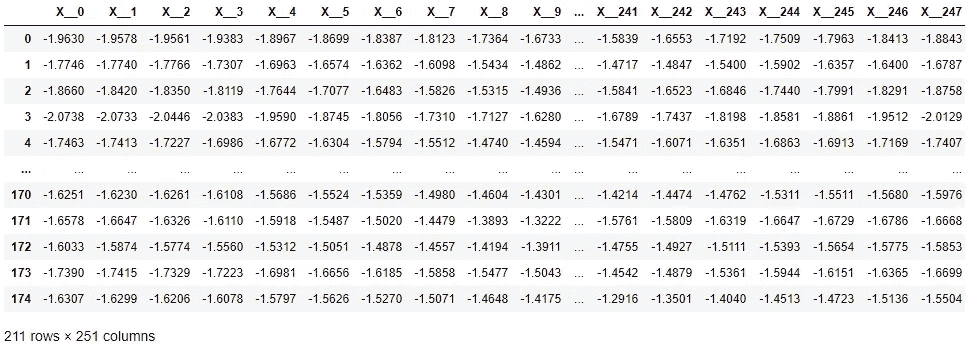
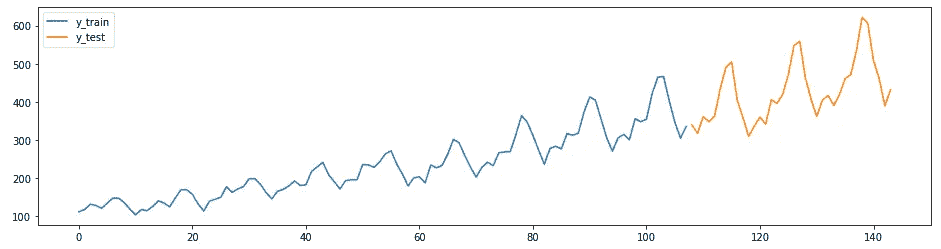
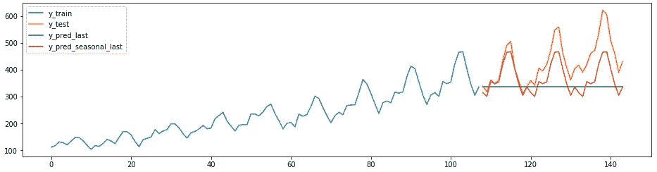
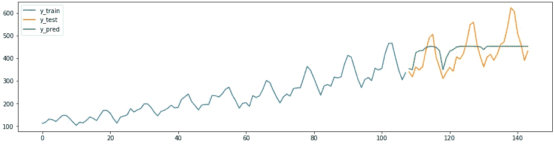
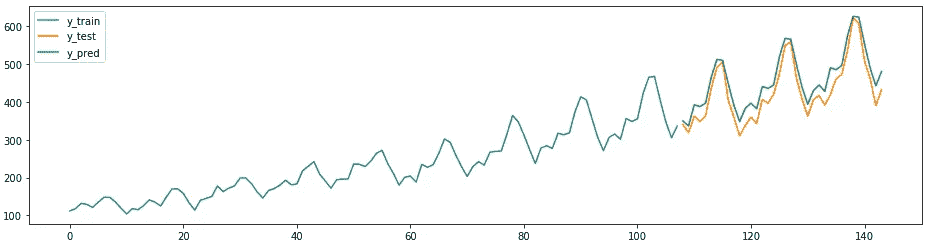
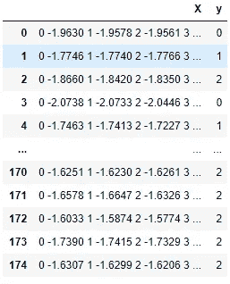

# Sktime:用于时间序列机器学习的统一 Python 库

> 原文：<https://towardsdatascience.com/sktime-a-unified-python-library-for-time-series-machine-learning-3c103c139a55?source=collection_archive---------2----------------------->

## 用于时间序列预测、分类和回归的“sklearn”

图片由 [geralt](https://pixabay.com/users/geralt-9301/) 在 [Pixabay](https://pixabay.com/illustrations/clock-time-gear-gears-grey-102676/) 拍摄

## 用 Python 解决时间序列数据的数据科学问题是一项挑战。

为什么？现有工具不太适合时间序列任务，并且不容易集成在一起。scikit-learn 包中的方法假设数据是以表格格式组织的，并且每一列都是独立的——这些假设不适用于时间序列数据。包含时间序列学习模块的包，比如 [statsmodels](https://www.statsmodels.org/stable/user-guide.html#time-series-analysis) ，不能很好地集成在一起。此外，许多基本的时间序列操作，如将数据分割成不同时间的训练集和测试集，在现有的 python 包中是不可用的。

为了应对这些挑战，sktime 应运而生。

sktime 库的 logo(Github:[https://github.com/alan-turing-institute/sktime](https://github.com/alan-turing-institute/sktime))

sktime 是一个开源的 Python 工具箱，用于时间序列的机器学习。这是一个由社区推动的项目，由英国经济和社会研究委员会、消费者数据研究中心和艾伦图灵研究所资助。

**sktime 将 scikit-learn API 扩展到时间序列任务。**它提供了有效解决时间序列回归、预测和分类任务所需的算法和转换工具。该库包括专用的时间序列学习算法和转换方法，在其他常见库中不容易获得。

**sktime 旨在与 scikit-learn 进行互操作，轻松调整相关时序任务的算法，并构建复合模型。**如何？许多时序任务是相关的。可以解决一个任务的算法通常可以被重用来帮助解决一个相关的任务。这个想法叫做*还原*。例如，时间序列回归模型(使用序列来预测输出值)可以重新用于时间序列预测任务(预测的输出值是未来值)。

> **使命陈述**:“sk time 用时间序列实现可理解、可组合的机器学习。它提供了 [scikit-learn](https://scikit-learn.org/stable/) 兼容的算法和模型合成工具，由学习任务的清晰分类提供支持，具有指导性的文档和友好的社区。”

在本文的其余部分，我将重点介绍 sktime 的一些独特特性。

# 时间序列的适当数据模型

> **Sktime 对熊猫数据框架中的时间序列使用嵌套数据结构。**

典型数据框中的每一行都包含 i.i.d .观测值，每一列代表不同的变量。对于 sktime 方法，Pandas 数据框中的每个像元现在都可以包含一个完整的时间序列。这种格式对于多变量、面板和异质数据是灵活的，并且允许在 Pandas 和 scikit-learn 中重用方法。

在下表中，每一行都是一个观察值，X 列中包含一个时间序列数组，y 列中包含类值。sktime 估算器和转换器可以对此类序列进行操作。

原生时序数据结构，兼容 sktime。

在下一个表格中，按照 scikit-learn 中方法的要求，X 系列中的每个元素都被分成单独的一列。维度相当高— 251 列！此外，表格学习算法会忽略列的时间顺序(但时间序列分类和回归算法会使用)。

scikit-learn 所需的时序数据结构。

对于将多个同现序列建模在一起的问题，与原生序列数据结构兼容的 sktime 显然是最好的。根据 scikit-learn 所期望的表格格式的结构化数据训练的模型会在大量的特性中陷入困境。

# sktime 能做什么？

根据 [Github](https://github.com/alan-turing-institute/sktime) 页面，sktime 目前提供:

*   用于时间序列分类、回归和预测的最新算法(移植自基于 Java 的 [tsml](https://github.com/uea-machine-learning/tsml/) 工具包)，
*   时间序列的转换器:单序列转换(例如，去趋势化或去季节化)、序列作为特征转换(例如，特征提取器)以及组成不同转换器的工具。
*   变压器和模型的流水线作业，
*   模型调整，
*   模型集合——例如，用于时序分类和回归的完全可定制的随机森林；多元问题的集成。

# sktime API

如前所述，sktime 遵循带有 fit、predict 和 transform 类方法的基本 scikit-learn API。

对于估计器(又名模型)类，sktime 提供了一个用于模型训练的**拟合**方法和一个用于生成新预测的**预测**方法。

sktime 中的估计器将 scikit-learn 的回归器和分类器扩展到它们的时间序列对应项。Sktime 还包括专门针对时间序列任务的新估算器。

对于 transformer 类，sktime 提供了 **fit** 和 **transform** 方法来转换系列数据。有几种类型的转换可用:

*   对 i.i.d .实例进行操作的表格数据转换器，如 PCA
*   将每一行中的时间序列转换成基元数(例如特征事务)的序列到基元转换器；
*   串-串变压器将级数转换成不同的级数(例如级数的傅立叶变换)；
*   去趋势转换器返回与输入序列相同域中的去趋势时间序列(例如，季节性去趋势)。

# 代码示例

## 时间数列预测法

以下示例改编自 Github 上的[预测教程。本例中的系列(Box-Jenkins 航空公司数据集)显示了从 1949 年到 1960 年每月的国际航班乘客人数。](https://github.com/alan-turing-institute/sktime/blob/master/examples/01_forecasting.ipynb)

首先，加载数据，并将其分为训练集和测试集，然后进行绘图。sktime 提供了两个方便的函数来轻松做到这一点——`temporal_train_test_split`用于按时间分割数据集，而`plot_ys`用于绘制训练和测试序列值。

在您创建任何复杂的预测之前，将您的预测与一个天真的基线进行比较是有帮助的—一个好的模型必须超过这个值。sktime 提供了`NaiveForecaster`方法，采用不同的“策略”来生成基线预测。

下面的代码和图表展示了两个天真的预测。具有 strategy = "last "的预测器总是预测系列的最后观察值。具有 strategy = "seasonal_last "的预测器预测给定季节中观察到的序列的最后一个值。示例中的季节性被指定为“sp=12”，即 12 个月。

下一个预测片段展示了现有的 sklearn 回归器如何以最小的努力轻松、正确地适应预测任务。下面，sktime `ReducedRegressionForecaster`方法使用 sklearn `RandomForestRegressor`模型来预测序列。在内部，sktime 将训练数据分割成长度为 12 的窗口，以便回归变量进行训练。

sktime 也包含了原生的预测方法，比如`AutoArima`。

要更全面地了解 sktime 的预测功能，请查看 sktime 预测教程。要了解预测的时态交叉验证，请查看以下文章。

 [## 不要对时间序列预测使用 K-fold 验证

### 如何用 python 中的 sktime 执行时态交叉验证

towardsdatascience.com](/dont-use-k-fold-validation-for-time-series-forecasting-30b724aaea64) 

## 时间序列分类

最后，sktime 可用于将时间序列分为不同的序列组。

在下面的代码示例中，单个时间序列的分类与 scikit-learn 中的分类一样简单。唯一的区别是上面讨论的嵌套时间序列数据结构。

从 https://pypi.org/project/sktime/[借用的示例代码](https://pypi.org/project/sktime/)

传递到 TimeSeriesForestClassifier 的数据。

要更全面地了解时间序列分类，请查看下面链接的我关于时间序列分类的文章以及 sktime [单变量](https://github.com/alan-turing-institute/sktime/blob/master/examples/02_classification_univariate.ipynb)和[多变量](https://github.com/alan-turing-institute/sktime/blob/master/examples/03_classification_multivariate.ipynb)分类教程。

 [## 时间序列分类算法综述

### 专门为时间序列分类设计的专用算法

towardsdatascience.com](/a-brief-introduction-to-time-series-classification-algorithms-7b4284d31b97)  [## 微型火箭:快速和准确的时间序列分类

### 使用 Python 实现系列分类的最快的先进算法

towardsdatascience.com](/minirocket-fast-er-and-accurate-time-series-classification-cdacca2dcbfa)  [## ROCKET:快速准确的时间序列分类

### “时间序列分类的任务可以被认为是学习或检测信号或模式…

link.medium.com](https://link.medium.com/qYcaC7lL69)  [## 不要对时间序列预测使用 K-fold 验证

### 如何用 python 中的 sktime 执行时态交叉验证

towardsdatascience.com](/dont-use-k-fold-validation-for-time-series-forecasting-30b724aaea64) 

# 附加 sktime 资源

要了解更多关于 sktime 的信息，请访问下面的链接，获取深入的文档和示例。

*   详细 API 参考:[sktime.org](http://sktime.org/)
*   [sktime github 页面](https://github.com/alan-turing-institute/sktime)(带文档)
*   [示例笔记本](https://github.com/alan-turing-institute/sktime/tree/master/examples)
*   Sktime 论文:[Markus lning，Anthony Bagnall，Sajaysurya Ganesh，Viktor 卡萨科夫，Jason Lines，Franz király(2019):《sk Time:时间序列的机器学习统一接口》](http://learningsys.org/neurips19/assets/papers/sktime_ml_systems_neurips2019.pdf)

# 不是中等会员？今天就加入！

 [## 阅读亚历山德拉·阿米登(以及媒体上成千上万的其他作家)的每一个故事

### 作为一个媒体会员，你的会员费的一部分会给你阅读的作家，你可以完全接触到每一个故事…

alexandra-amidon.medium.com](https://alexandra-amidon.medium.com/membership) 

# 进一步阅读

 [## PyOD:用于异常检测的统一 Python 库

towardsdatascience.com](/pyod-a-unified-python-library-for-anomaly-detection-3608ec1fe321)  [## 如何对时间序列数据应用 K 均值聚类

### 使算法适应时间序列的理论和代码

towardsdatascience.com](/how-to-apply-k-means-clustering-to-time-series-data-28d04a8f7da3)