# 用熊猫切片和索引

> 原文：<https://towardsdatascience.com/slicing-and-indexing-with-pandas-2bff05ec361e?source=collection_archive---------30----------------------->

## [PyTrix 系列](https://towardsdatascience.com/tagged/pytrix-series)

## PyTrix #4:用熊猫访问数据


由 [Marvin Meyer](https://unsplash.com/@marvelous?utm_source=medium&utm_medium=referral) 在 [Unsplash](https://unsplash.com?utm_source=medium&utm_medium=referral) 上拍摄的照片

PyTrix 是一个每周一期的系列文章，我在其中展示了可以用 Python 完成的对数据科学家有用的很酷的东西。在 PyTrix 系列的前几周，我们主要研究了 Numpy 数组，具体来说是索引和切片…

[](/working-with-numpy-arrays-indexing-e4c08595ed57) [## 使用 Numpy 数组:索引

### 访问 Numpy 数组中的元素

towardsdatascience.com](/working-with-numpy-arrays-indexing-e4c08595ed57) [](/working-with-numpy-arrays-slicing-4453ec757ff0) [## 使用 Numpy 数组:切片

### PyTrix #3:访问 Numpy 数组中的序列

towardsdatascience.com](/working-with-numpy-arrays-slicing-4453ec757ff0) 

Pandas 是一个快速、强大、灵活且易于使用的开源框架，它构建在 Python 之上，用于数据操作和分析，就像 Numpy 一样，是数据科学事实上的库之一。很大一部分人很可能是从学习熊猫开始他们的数据科学之旅的，如果你没有，那么我强烈建议你阅读[文档](https://pandas.pydata.org/pandas-docs/version/0.25.3/)——当然是在阅读了这个故事之后。

要访问 Github 中使用的代码，请单击下面的链接。

[](https://github.com/kurtispykes/demo/blob/master/pytrix/pytrix_pandas_indexing-and-slicing.ipynb) [## kurtispykes/演示

### permalink dissolve GitHub 是超过 5000 万开发人员的家园，他们一起工作来托管和审查代码，管理…

github.com](https://github.com/kurtispykes/demo/blob/master/pytrix/pytrix_pandas_indexing-and-slicing.ipynb) 

## 索引的选择

对于许多学习熊猫来说，他们的多轴索引方法很少被实践者理解，这是公平的，因为有许多方法来进行对象选择:

*   `.loc`主要基于标签，这意味着它从索引中选择带有显式标签的行(或列)。因此，如果没有找到项目，将引发一个`KeyError`。
*   `.iloc`主要基于整数位置(从 0 到轴的长度-1 ),这意味着行(或列)是根据其在索引中的位置来选择的——它只接受整数。如果索引器越界，则会引发`IndexError`。
*   `[]`主要用于筛选出低维切片。

> **注意:**Python 和 NumPy 索引操作符`[]`和属性操作符`.`提供了跨越广泛用例的对 pandas 数据结构的快速和简单的访问。这使得交互式工作变得直观，因为如果您已经知道如何处理 Python 字典和 NumPy 数组，就没有什么新东西需要学习了。然而，由于要访问的数据类型事先不知道，直接使用标准操作符有一些优化限制。对于生产代码，我们建议您利用本章中介绍的优化的 pandas 数据访问方法。
> 
> -熊猫的摘录[文档](https://pandas.pydata.org/pandas-docs/version/0.25.3/user_guide/indexing.html)

## 使用[ ]的属性访问

对于那些一直关注 PyTrix 系列的读者，或者如果您对 Python 索引行为有所了解，那么您会知道用于索引低维切片的主要方法是`[]`。

```
import pandas as pd
import numpy as np df= pd.DataFrame(np.random.randn(5, 5), 
             columns=["col_1", "col_2", "col_3", "col_4", "col_5"])df 
```

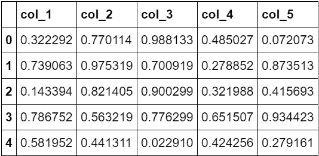

图 1

```
*# access all elements in "col_1"* 
df["col_1"]>>>> 0    0.32
1    0.74
2    0.14
3    0.79
4    0.58
Name: col_1, dtype: float64
```

从上面我们可以看到，使用`[]`来索引 Pandas DataFrame 类会返回一个对应于列名的`series`。如果数据是一个`series`，将返回一个标量，例如我将使用上面返回的序列来显示我们可以像这样返回一个标量:

```
a = df["col_1"]
a[1] >>>> 0.79390631428754759
```

这是最基本的索引形式。我们也可以将一个列列表传递给`[]`来按顺序选择列。

```
df[["col_2", "col_3", "col_4"]]
```

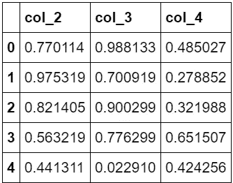

图二。

我不会深入研究这个功能，因为它非常类似于普通 Python 和 Numpy 中的索引和切片，除了开始和结束边界都被返回。

## 按标签选择

Pandas 使用一个严格的基于包含的原则，允许所有用于基于标签的索引的方法正确运行——未能提供一个不在索引中的标签将引发`KeyError`。

对于这一部分，我将创建一个新的熊猫数据框架

```
new_df = pd.DataFrame(np.random.randn(10, 4), index=list("abcdefghij"), columns=list("ABCD"))new_df
```

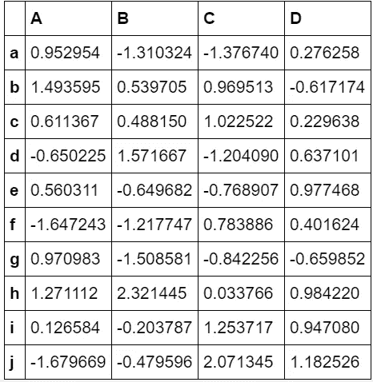

图 3。

按标签选择时，`.loc`属性是主要的访问方法。`.loc`的有效输入如下:

*   单个标签(注意，标签可以是整数，不涉及沿索引的整数位置)

```
# cross-section using a single label
new_df.loc["a"]>>>> A    0.952954
B   -1.310324
C   -1.376740
D    0.276258
Name: a, dtype: float64
```

*   标签的列表或数组

```
# A list or array of labels
new_df.loc[["a", "d ", "i"]]
```

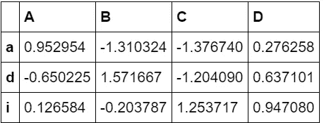

图 4。

*   带标签的切片(注意，与 Python 切片相反，开始和结束边界都包含在切片中)

```
# slice with labels
new_df.loc["a":"d", "B":]
```

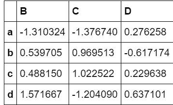

图 5。

*   布尔数组

```
# a boolean array
new_df.loc["j"] > 0.5>>>> A    False
B    False
C     True
D     True
Name: j, dtype: bool # another way to use a boolean array 
new_df.loc[:, new_df.loc["j"] > 0.5]
```

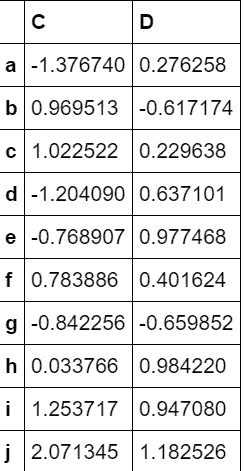

图 6。

## 按位置选择

Pandas 使用符合 Python 和 Numpy 切片语义的`0-based`索引。有多种方法可用于通过使用纯基于整数的索引按位置访问元素。试图使用一个非整数，不管其有效性如何，都会引发一个`IndexError`。

```
*# using same df but new index values* new_df.index = list(range(0, 10))
new_df
```

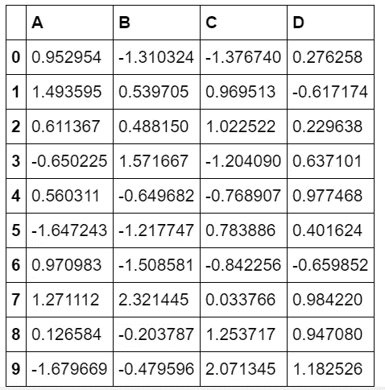

图 7。

按位置选择时，`.iloc`属性是主要的访问方法。`.iloc`的有效输入如下:

*   整数

```
*# cross section using an integer position*
new_df.iloc[3]>>>> A   -0.650225
B    1.571667
C   -1.204090
D    0.637101
Name: 3, dtype: float64
```

*   整数的列表或数组

```
*# list or array of integers*
new_df.iloc[[1, 5, 2, 3]]
```

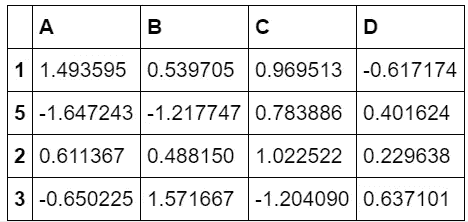

图 8。

```
# another example 
new_df.iloc[[1, 2, 3, 4], [0, 1, 2]]
```

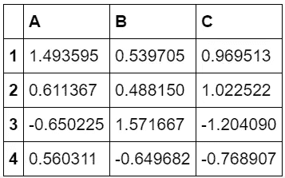

图 9。

*   带有整数的切片对象

```
# integer slicing
new_df.iloc[:3] 
```

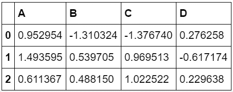

图 10。

```
# integer slicing by column
new_df.iloc[:, :3]
```

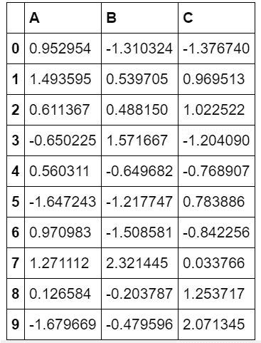

图 11。

*   布尔数组。

```
new_df.iloc[1:] > 0.5
```

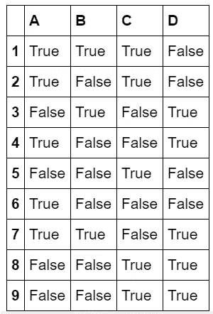

图 12。

当使用超出界限的切片时，这可能导致空轴。

```
new_df.iloc[10:13]
```


图 13。

然而，如果我们试图调用一个越界的索引器，这将引发`IndexError`。此外，如果我们试图调用任何元素越界的索引器列表，那么这也会引发一个`IndexError`。

> **注意:是否为设置操作返回副本或引用，可能取决于上下文。这有时被称为** `**chained assignment**` **，应该避免。参见** [**返回视图与**](https://pandas.pydata.org/pandas-docs/version/0.25.3/user_guide/indexing.html#indexing-view-versus-copy) **复制。**

## 可调用选择

以上所有属性都可以接受一个叫做`callable`的东西作为索引器。对`callable`的要求是，它必须是一个带有一个参数的函数，返回索引的有效输出。

```
# selection by a callable using []
new_df[lambda df: df.columns[3]]>>>> 0    0.276258
1   -0.617174
2    0.229638
3    0.637101
4    0.977468
5    0.401624
6   -0.659852
7    0.984220
8    0.947080
9    1.182526
Name: D, dtype: float64
```

这将返回索引 3 处的一系列列(在此场景中，索引 3 处的列是“D”)。

```
# selection by a callable using .loc 
new_df.loc[:, lambda df: ["A", "B"]] 
```

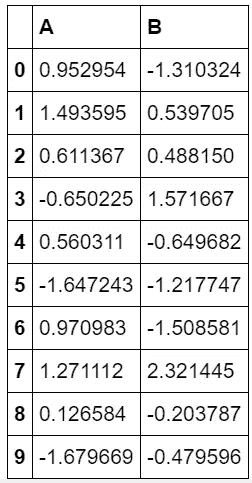

图 14。

在这个例子中，我们使用`.loc`属性返回所有的行和列 A 和 B。下面我们将使用`.iloc`做完全相同的事情。

```
# selection by a callable using .iloc 
new_df.iloc[:, lambda df: [0, 1]]
```


图 15。

## 包裹

Pandas 对于数据科学家来说是一个非常有用的工具。值得通读一下[文档](https://pandas.pydata.org/pandas-docs/version/0.25.3/user_guide/indexing.html)看看这个包里还有什么很酷的东西，因为有太多东西我在这篇文章里没有涉及到，例如如何在`pd.Series`上使用这些操作。

感谢您花时间阅读这个故事。如果你喜欢它，你可以在 PyTrix 系列中找到更多类似的文章。

[](https://towardsdatascience.com/tagged/pytrix-series) [## Pytrix 系列-走向数据科学

### 阅读《走向数据科学》中关于 Pytrix 系列的文章。共享概念、想法和代码的媒体出版物。

towardsdatascience.com](https://towardsdatascience.com/tagged/pytrix-series) 

如果您想亲自联系我，我是 LinkedIn 上最活跃的用户，我会非常乐意与您联系！

[](https://www.linkedin.com/in/kurtispykes/) [## Kurtis Pykes -人工智能博客-走向数据科学| LinkedIn

### 在世界上最大的职业社区 LinkedIn 上查看 Kurtis Pykes 的个人资料。Kurtis 有两个工作列在他们的…

www.linkedin.com](https://www.linkedin.com/in/kurtispykes/)