# Power BI 中的图像数据切片

> 原文：<https://towardsdatascience.com/slicing-data-with-images-in-power-bi-32b210449ccc?source=collection_archive---------27----------------------->

## 您可以用许多不同的方式在 Power BI 中分割数据。但是，你知道你也可以使用图像切片和切块吗？比你想象的简单…

安德鲁·罗伯特·劳科在 Unsplash 上拍摄的照片

你知道我是一个强力 BI 的传播者。关于 Power BI，我最喜欢的一点是，它让您可以灵活地以多种不同的方式讲述数据故事。基本上，您不仅仅局限于[现成的解决方案](/build-pro-slicer-pane-in-power-bi-911248b39348)(尽管如此，这些解决方案通常非常复杂，足以满足您所有的报告需求)。

通过一些创意和一些小调整，你可以为你的用户创造一个难忘的体验。他们会因此而感激你！

## 简单的要求—简单的解决方案！

几周前，我正在为我们的销售部门做一份报告。销售人员对报告设计的要求不是很高——他们希望尽可能快地看到他们的数字，不要太关注视觉效果。

本质上，他们会很感激有这样的东西:

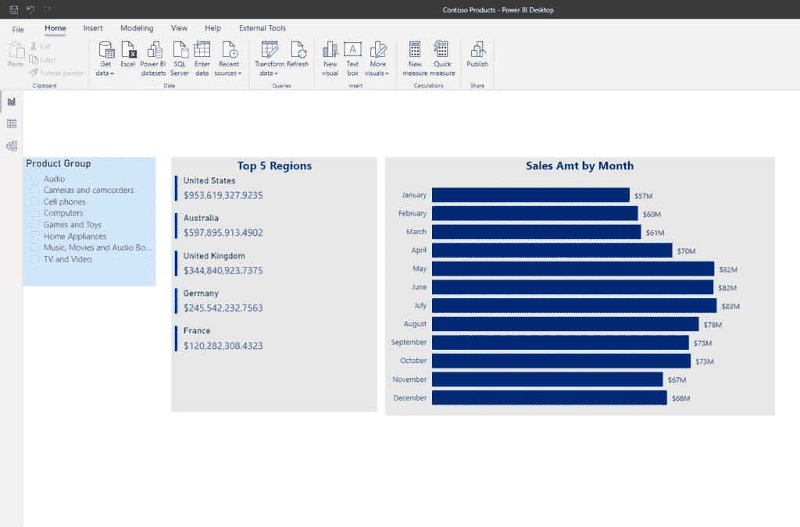

所以，两个简单的视觉效果，和一个切片器用来切片和切割数据。而且没毛病！但是，由于我有一些额外的时间投入到这份报告的开发中，我决定向他们提供一个更吸引眼球的解决方案…

像往常一样，我在所有示例中使用 Contoso 示例数据库。

## 利用 PowerPoint 的优势

当我想创建一个漂亮的报告背景时，我喜欢使用 PowerPoint。这给了我将所有想法、视觉占位符、文本框等分组的可能性。在一个地方。这样做还会[减少我的 Power BI 报告画布](/how-i-speed-up-my-power-bi-report-5x-155255415895)上的视觉效果数量，从而减少报告渲染所需的时间。

使用 PowerPoint，你可以用一个画面代替多个画面！诀窍是——一旦你创建了你想要的背景，只需将其保存为. png 或。jpeg 文件:

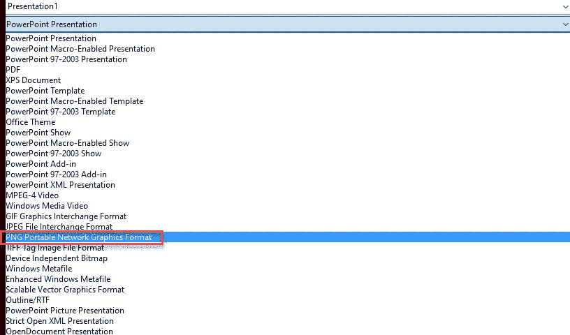

顺便说一下，这是我的报告背景的样子:

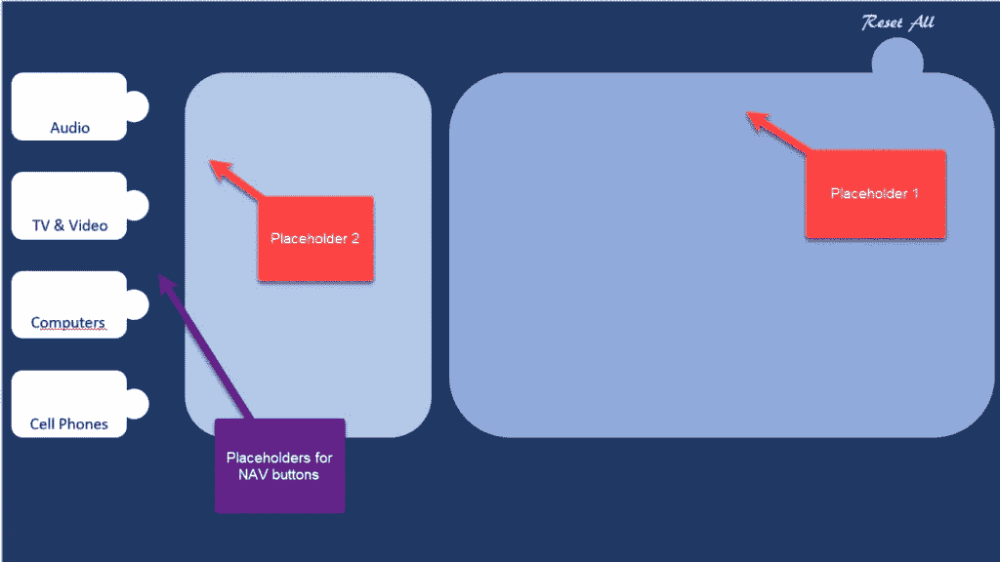

让我简单解释一下新报告外观的想法。画布中间的两个大占位符将包含主要视觉效果。左手边就是神奇发生的地方！

我已经决定把图像和使用它们，而不是简单的切片器视觉。通过这种方式，我的用户将获得类似应用程序的体验，就像他们在浏览网站一样。

## 书签掌握着关键！

书签是 Power BI 中最酷的功能之一！基本上，【Bookmark 所做的是，它捕获报告的当前状态，因此您可以通过按钮、图像、形状将它用作您行动的参考…这将基本上为您的报告创建类似应用程序的体验，并使其看起来具有交互性。

确实有十几个可以应用书签的用例，这是其中之一。

第一步是把我们用 PowerPoint 创建的背景，作为 Power BI 中的背景图片:

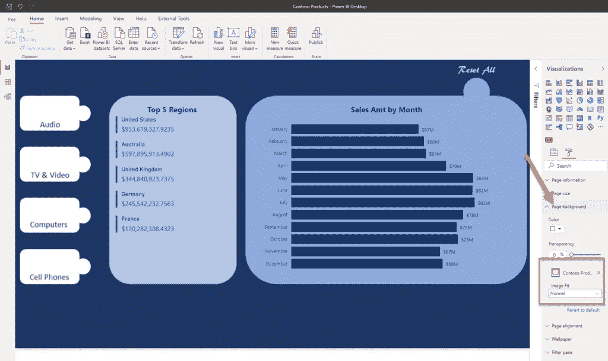

现在，我将在左侧的占位符中插入图标。这些图标将用于在各种书签之间导航用户:

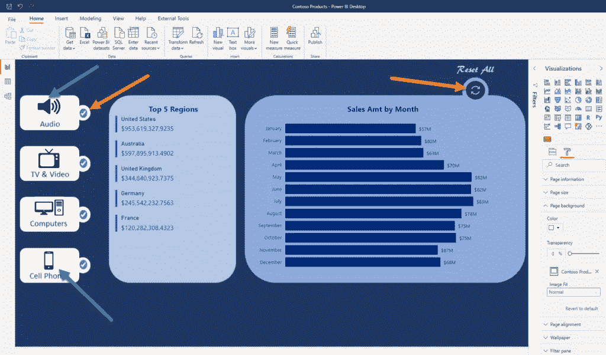

关于报告中使用的图像的简短说明:

*   标有绿色箭头的图像将被用作“切片器”
*   标有红色箭头的图像将用于指示当前应用的“切片器”
*   标有黄色箭头的图像将帮助我们回到起点，查看所有产品类别的数据(未应用切片器)

我创建的第一个书签将捕获报告的默认外观，包括所有产品类别:

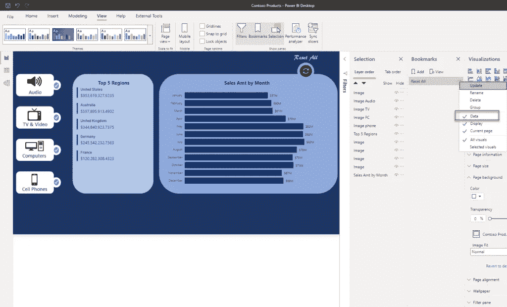

这里最重要的事情是 ***选中*** ，因为这将[捕获页面](/display-selected-slicers-in-power-bi-a99d81500e76)的当前状态，包括所有应用的过滤器(在我们的例子中，没有应用过滤器)！

现在让我们为音频产品类别创建一个视图。我将隐藏除音频以外的所有图像。这里的关键是 ***应用滤镜面板*** 中的滤镜，以便只显示音频产品类别的数据！

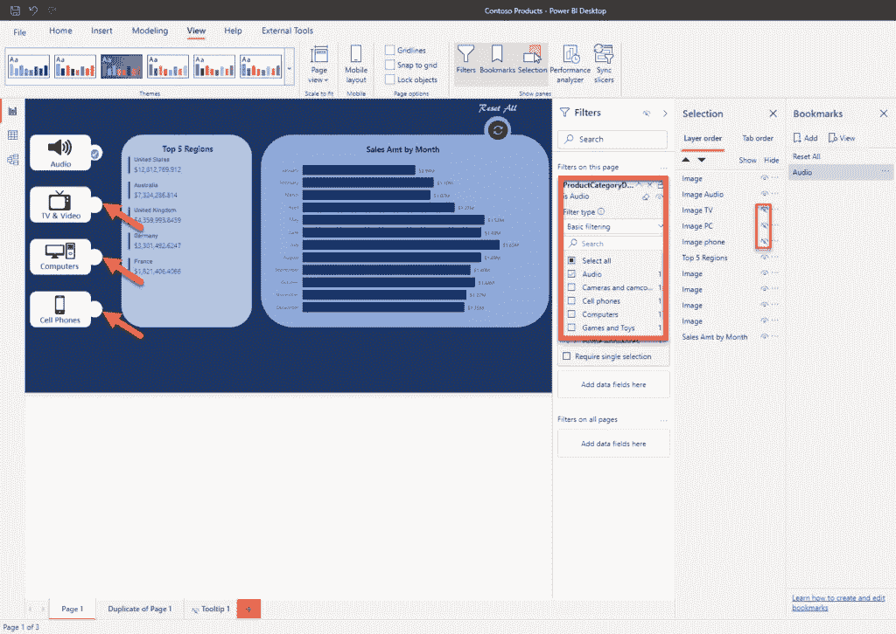

同样，在创建书签时，保持选中数据选项。对其他产品类别重复相同的步骤，这样书签窗格的最终外观将会提醒您:

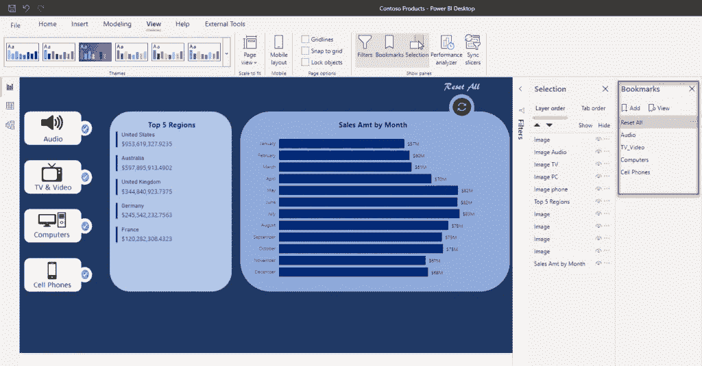

现在，我们需要为我们的图像指定动作，这样它们就可以在不同的书签之间导航。让我向您展示音频产品类别是如何做到这一点的，然后您可以轻松地对其余类别采用相同的模式:

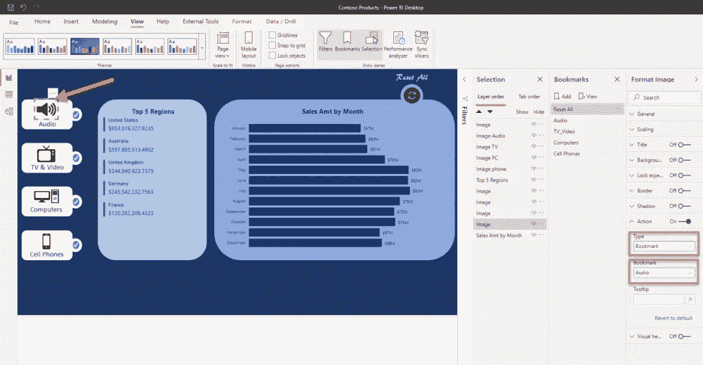

最后一步是对我们的用户隐藏过滤器窗格，因为他们不需要知道报告是如何工作的:

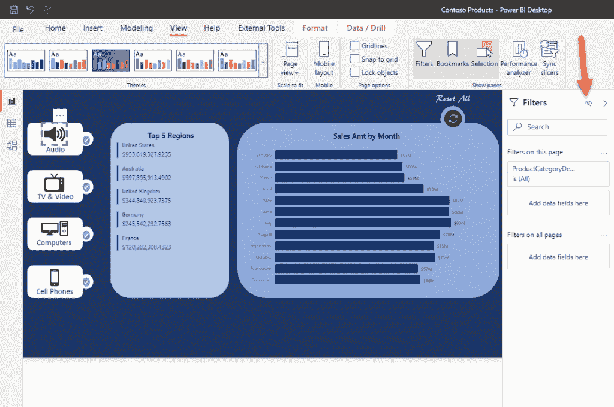

在我向 Power BI Service 发布我的报告后，下面是它的样子:

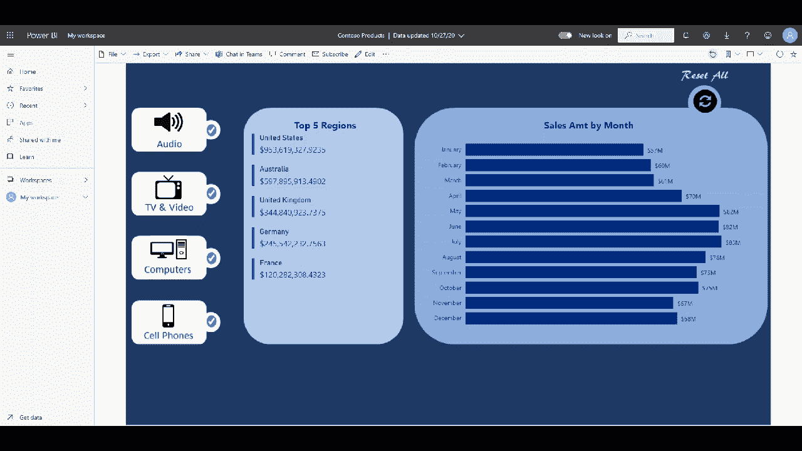

如果你问我，那看起来比我们的起点好多了:)

## 结论

正如我已经多次说过的，Power BI 在灵活性方面非常强大。您已经看到了一些基本的背景格式、书签和图像的巧妙使用如何将您的报表推向一个全新的水平。

不用我说，我的销售团队在得到这份报告后都肃然起敬。这是本文中最重要的一点:**为了让你的用户能够享受使用报告的乐趣，一定要付出额外的努力！**

感谢阅读！

订阅[这里](http://eepurl.com/gOH8iP)获取更多有见地的数据文章！