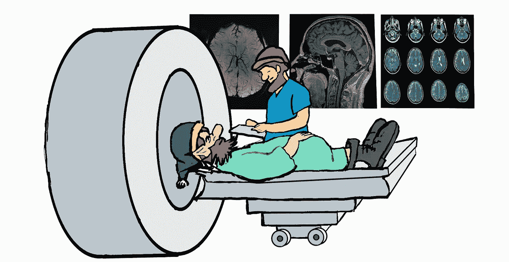
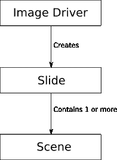
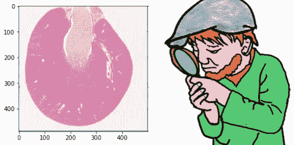
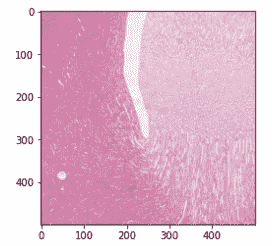
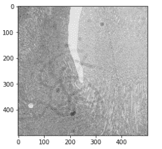

# Slideio:一个用于阅读医学图像的新 python 库。

> 原文：<https://towardsdatascience.com/slideio-a-new-python-library-for-reading-medical-images-11858a522059?source=collection_archive---------16----------------------->



这是一个新的 python 库的介绍，用于医学图像的阅读。更多详细信息可在项目网站上找到:[www.slideio.com](http://www.slideio.com)。源代码可以在 GitLab 的知识库中找到:【https://gitlab.com/bioslide/slideio[。](https://gitlab.com/bioslide/slideio)

# 介绍

医学图像—由生物扫描仪、显微镜等产生的图像。与普通图像不同。其中一个重要的区别是它们的大小。这种图像可能非常大。目前，大小为几十亿字节的幻灯片并不罕见。另一个区别是维度的数量。许多生物图像格式支持 3 维和 4 维(体积和时间序列)。除了传统的尺寸之外，一些格式引入了扫描仪特定的尺寸，如焦距、旋转(对于从各种角度记录的数据)、相位指数等。

不可能用传统的压缩方法来编码数千兆像素的图像。jpeg 或 png 等图像编解码器需要将整个图像保存到计算机内存中，以便在屏幕上显示，甚至读取图像的一小部分。生物格式使用平铺方法和缩放金字塔来解决这些问题。它允许以最小的内存和计算资源读取任意比例的图像的任意区域。缩放金字塔是一组不同比例的图像副本。


Slideio library 旨在使用医学图像的内部结构来读取医学图像，以尽可能提高过程的性能。Slideio 并不是第一个提供这种功能的库。在我的图像分析实践中，我使用了许多不同的库。但到目前为止，我没有找到任何库可以满足我对图像分析的所有要求。所以我决定创建我自己的，它应该聚合我在这方面的经验。

该库有一个驱动程序架构。每个驱动程序支持一种或多种图像格式。slideio 的第一个版本提供了 4 个驱动程序:

*   CZI——读取[蔡司 CZI](https://www.zeiss.com/microscopy/int/products/microscope-software/zen/czi.html) 图像的司机。
*   SVS——读取 [Aperio SVS](https://tmalab.jhmi.edu/imagescope.html) 图像的驱动程序。
*   AFI——读取离子荧光图像的驱动程序。
*   GDAL——读取 jpeg、png、tiff 等通用格式的驱动程序。它使用了流行的 c++图像库 [GDAL](https://gdal.org/) 。

Slideio 库有一个简单的对象结构:



图像驱动程序创建幻灯片对象。Slide 对象代表单个图像文件(或文件夹，取决于图像格式)。幻灯片对象包含至少一个连续光栅区域的场景对象(2D 图像、体积、时间序列等)。一些图像格式支持单个场景，如单个组织扫描。一些格式允许在一个文件中存储多个组织区域。2D 场景的所有图层都具有相同的像素大小和分辨率。如果场景是 3D 体积，则该体积的所有切片具有相同的大小和分辨率。时间序列也是如此。

以下代码片段显示了如何使用“SVS”图像驱动程序打开幻灯片:

# 图像元数据

Slideio 库提供不同级别的图像信息。幻灯片对象具有属性“raw_metadata ”,该属性公开了从图像中提取的未修改的文本信息。文本内容特定于文件格式。在 Aperio SVS 幻灯片的情况下，它是从“图像信息”tiff 标签中提取的字符串。对于蔡司 CZI 文件，它是一个带有完整文件元数据的 XML 文档。以下是从 Aperio SVS 文件中检索元数据的代码片段:

下面是代码示例产生的输出:

```
['Aperio Image Library vFS90 01\r\n20320x19545 [0,100 19919x19445] (240x240) JPEG/RGB Q=70',
 'AppMag = 20',
 'StripeWidth = 2032',
 'ScanScope ID = SS1598',
 'Filename = 24496',
 'Date = 11/09/11',
 'Time = 18:51:40',
 'Time Zone = GMT+09:00',
 'User = e8ddb309-efc1-4a6b-b9b0-7c555f9fa0ef',
 'MPP = 0.4962',
 'Left = 23.939867',
 'Top = 19.531540',
 'LineCameraSkew = 0.000320',
 'LineAreaXOffset = 0.060417',
 'LineAreaYOffset = 0.011084',
 'Focus Offset = -0.000500',
 'DSR ID = ap6101-dsr',
 'ImageID = 24496',
 'Exposure Time = 109',
 'Exposure Scale = 0.000001',
 'DisplayColor = 0',
 'OriginalWidth = 20320',
 'OriginalHeight = 19545',
 'ICC Profile = ScanScope v1']
```

# 光栅存取

场景是访问栅格数据的主要对象。它公开了以下信息:

*   *压缩*:数据压缩的类型；
*   *放大*:扫描仪放大；
*   *名称*:场景名称；
*   *num_t_frames* :时间序列中的时间帧数；
*   *num_z_slices* :卷中的切片数；
*   *rect* :场景矩形的坐标和尺寸；
*   *分辨率*:场景平面内的分辨率(一个元组)；
*   *t_resolution* ， *z_resolution* :场景在时间和 z 方向的分辨率；
*   *通道数*:场景中的通道数；
*   *通道数据类型:*图像通道的数据类型(字节、16 位等。);
*   *通道名称*:图像通道的名称。

以下代码片段检索场景名称、矩形和分辨率。

它产生以下输出:

```
('Image', (0, 0, 19919, 19445), 3, (4.961999999999999e-07, 4.961999999999999e-07))
```

该图像的宽度为 19919 像素，高度为 19445 像素。每个像素在 x 和 y 方向上都是 0.4962 mkm。该图像有 3 个通道。生物图像中通道的含义取决于图像格式。对于亮场图像，它只是红色、绿色和蓝色。这种图像有 3 个 8 位通道。通道属性可通过方法 *get_chanel_data_type* 和 *get_channel_name 访问。*

```
uint8
uint8
uint8
```

方法 *read_block* 检索连续区域的像素值。在没有参数的情况下执行该方法会以原始大小检索整个场景。通常情况下，由于尺寸较大，不可能以原始比例读取整个图像。在这种情况下，程序可以检索图像的一个区域，将其缩小到可接受的大小，或者检索一个缩小的区域。下面是一段代码。检索整个图像并将其缩放为 500 像素宽的图片。请注意，用零代替图片高度表示必须自动计算图片高度，以保持 x 和 y 方向的比例不变。



下面的代码片段从图像中读取一个矩形区域，并将其缩小为 500 像素宽的图片。



可以读取单个通道或通道子集:



附加的元组参数*切片*和*帧*允许读取体积和时间序列；

```
(1000, 1000, 27)
```

# 装置

slideio 库可以与 pip 一起安装:

```
pip install slideio
```

目前，仅支持 Linux 和 Windows 版本。

# 结论

Slideio 是一个用于阅读医学图像的 python 模块。它允许阅读整张幻灯片以及幻灯片的任何区域。大幻灯片可以有效地缩小尺寸。该模块使用图像的内部缩放金字塔来使缩放过程尽可能快。Slideio 支持 2D 幻灯片以及 3D 数据集和时间序列。

该库以 numpy 数组的形式提供栅格，并与许多流行的图像分析库兼容，如 [opencv](http://www.opencv.org) 。

目前，它支持阅读 Aperio SVS 和 AFI 文件，蔡司 CZI 文件和通用格式。以下格式的即将推出的驱动程序:


*   珀金埃尔默图像
*   徕卡 SCN 图像
*   DICOM 数据集
*   徕卡 lif 图像
*   还有更多…

感谢您的阅读。如有任何意见或建议，我们将不胜感激。