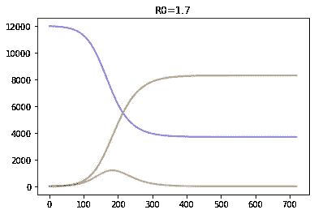

# COVID 疫情期间 Rt 估计的滑动 SIR 模型

> 原文：<https://towardsdatascience.com/sliding-sir-model-for-rt-estimation-during-covid-pandemic-e7458226848f?source=collection_archive---------51----------------------->


[图片](https://unsplash.com/photos/UH2x_pfV4MA)来自 [Unsplash](https://unsplash.com) 由 [Patrick Assalé](https://unsplash.com/@patrickassale) 拍摄

流行病的一个主要特征是有效繁殖数( *Rt* )，它表示每个被感染个体在任何给定时间将进一步感染的人数。能够估计出 *Rt* 是一项重要的任务，因为这个数字定义了疫情是预计会增长(*Rt*1)，还是会开始下降(*Rt*1)。在本帖中，我建议使用滑动 SIR 方法来估计 *Rt* ，该方法基于 SIR 流行病模型与不同国家的感染数据的拟合。

*本文介绍了我们与莫斯科国立罗蒙诺索夫大学* [*的*](https://www.msu.ru/en/) [*塔吉扬娜·佩特洛娃*](https://medium.com/@tatyana.a.petrova) *的联合研究。我们这里描述的代码在 GitHub* *上有* [*，你可以在*](https://github.com/shwars/SlidingSir)[*Azure Codespaces*](http://aka.ms/codespaces)*或* [*Azure 笔记本*](https://soshnikov.com/azure/8-reasons-why-you-absolutely-need-azure-notebooks/) *中轻松运行* [*来做自己的研究。对应的论文是*](https://notebooks.azure.com/import/gh/shwars/SlidingSir) [*可在 preprints.org*](https://www.preprints.org/manuscript/202006.0289/v1)*—如果使用代码的任何部分，请* [*引用它*](https://soshnikov.com/science/sliding-sir-model-for-rt-estimation/#how-to-cite) *。*

# 流行病建模

让我们从任何流行病如何演变的基础开始。描述流行病的最简单模型被称为 [**SIR 模型**](https://en.wikipedia.org/wiki/Compartmental_models_in_epidemiology) ，因为它包含三个变量:

*   *S(t)* — **易感** —有可能被感染的人数
*   *I(t)* — **感染** —感染人数
*   *R(t)*—**—**—不易感染的人数(也包括死亡人数)。

在此模型中，每个变量都是时间的函数，我们可以用公式表示以下描述模型行为的微分方程:


SIR 模型的微分方程

该模型取决于两个参数:

*   *β* 是**接触率**，我们假设在单位时间内每个感染者都会接触到 *βN* 人。从这些人中，易感人群的比例为 *S/N* ，因此新感染发生的速度定义为 *-βSI/N* 。
*   *γ* 是**恢复率**，数字 *1/γ* 定义一个人保持感染的天数。因此， *γI* 这个术语定义了被感染个体从被感染到康复的速度。

为了对流行病进行建模，我们需要用一些初始条件 *S(0)* 、 *I(0)* 和 *R(0)* 对这些微分方程进行数值求解。我们将使用下一本书的本章中的例子:克里斯蒂安·希尔。用 Python 学习科学编程。— *剑桥大学出版社，ISBN: 9781107428225。*

首先，让我们定义微分方程的右边:

```
**def** **deriv**(y, t, N, beta, gamma):
    S, I, R **=** y
    dSdt **=** **-**beta ***** S ***** I **/** N
    dIdt **=** beta ***** S ***** I **/** N **-** gamma ***** I
    dRdt **=** gamma ***** I
    **return** dSdt, dIdt, dRdt
```

假设我们想做 120 天的模型。我们将定义点的**网格**:

```
days **=** 160
t **=** np.linspace(0, days, days)
```

让我们在一个拥有 1200 万人口的大城市建立疫情模型——类似于我居住的城市。让我们从第 0 天的 100 名感染者开始，假设接触率为 0.2，恢复期为 30 天。模型的初始参数将是:

```
N **=** 12000000
I0, R0 **=** 100, 0
S0 **=** N **-** I0 **-** R0
beta, gamma **=** 0.2, 1.**/**30
```

然后，我们将使用初始参数求解方程，以获得时间网格中每个点的 S、I 和 R 向量:

```
from scipy.integrate import odeint
y0 **=** S0, I0, R0
ret **=** odeint(deriv, y0, t, args**=**(N, beta, gamma))
S, I, R **=** ret.T
plt.plot(t,S)
...
```


在 SIR 建模中，常见的是估计流行病 *R₀* = *β/γ* (详见[本文](https://web.stanford.edu/~jhj1/teachingdocs/Jones-on-R0.pdf))。在我们的例子中，我们有 *R₀* =4，这与 COVID 感染的估计数字非常相似。这个模型告诉我们，在没有任何隔离措施的情况下，在像莫斯科这样的城市，我们将在大约 80 天内一下子有大约 500 万人被感染，最终每个人都将经历这种疾病。

下面，我们展示了几个不同 *R₀* 值的图表:



它有效地说明了[使曲线](https://www.nytimes.com/article/flatten-curve-coronavirus.html)变平的想法，因为越低的是*r₀*——同时感染的人数越低，这有助于最小化医疗系统的过载。

# 确定模型的参数

在我们的例子中，我们在某种程度上随意地取了 *β* 和 *γ* 的值。然而，如果我们有一些真实的流行病学数据，我们可以尝试通过拟合 SIR 模型来确定这些值，以最接近真实数据。在这种情况下，我们将解决**优化问题**，并优化参数以最小化度量。

为了获得数据，我们将使用约翰·霍普金斯大学系统科学与工程中心(CSSE)的新冠肺炎数据仓库，可从这里[获得](https://github.com/CSSEGISandData/COVID-19)。从这个数据集中，我们将获得感染、康复和死亡的人数，以及每个国家人口的信息。我们需要做一些繁重的工作来连接这些表并调换日期，直到我们得到一个与每个国家类似的表:


然后，我们通过计算所有列的 3 天滚动平均值来平滑这些数字:

```
**for** x **in** ['Infected','Recovered','Deaths']:
    df[x**+**"_Av"] **=** df[x].rolling(window**=**smooth_window).mean()
df['Removed_Av'] **=** df['Recovered_Av']**+**df['Deaths_Av']
```

我们还计算了包含从易感人群中移除的人数的`Removed`列。

我们将调用结果表 **country dataframe** ，我们的代码包含函数`make_frame`，该函数检索给定名称的国家的数据帧和人口。

现在，为了估计 R₀，我们需要从所有国家的一个共同点开始，比如说，从感染人数超过 1000 的那一天开始。然后，我们将关注几天的时间段，用`ndays`表示。考虑一周似乎是个好主意。

```
start_index **=** df[df['Infected_Av']**>**1000].index[0]
ndays **=** 7
V **=** df['Infected_Av'][start_index:start_index**+**ndays].to_numpy()
R **=** df['Removed_Av'][start_index:start_index**+**ndays].to_numpy()
```

在数组`V`和`R`中，我们保存了连续几天`ndays`被感染和被移除的人数。现在我们需要定义一个函数，用给定的参数 *β* 和 *γ* 计算 SIR 模型，从`start_index`的感染/清除人数开始，返回预测数据和实际数据之间的误差:

```
**def** **model**(V,R,N,beta,gamma):
    t **=** np.linspace(0,len(V),len(V))
    y0 **=** N**-**V[0]**-**R[0],V[0],R[0]
    S,I,R **=** odeint(deriv, y0, t, args**=**(N, beta, gamma)).T
    dV **=** np.diff(V)
    dI **=** np.diff(I**+**R)
    **return** np.linalg.norm(dV**-**dI)
```

我们计算误差的方法如下。因为我们拥有的最准确的数字是特定日期的累计感染总人数(不考虑已移除的人数)，所以最简单的方法是计算每天的新增病例数，`dV`。在 SIR 模型中，与感染总人数相对应的数字将由`I+R`表示，即我们加上当前感染人数(`I`)和已经患病人数(`R`)。因此，SIR 模型中的每日新病例数将由`I+R`的日间差异给出，用`dI`表示。返回的误差值将是`dV-dI`向量的范数。

为了找到参数，我们需要针对参数 *β* 和 *γ* 优化`model`函数。在我们的实验中，我们发现 7 个有噪声的数据点不允许我们有效地优化两个参数，因此我们根据医学研究固定了 *γ* 参数(见[本报道](https://www.who.int/docs/default-source/coronaviruse/who-china-joint-mission-on-covid-19-final-report.pdf)世卫组织)，其表示平均恢复时间为 30 天。然后我们使用 SciKit Learn 中的`minimize`方法找到并返回 *β* 的最优值:

```
the_gamma **=** 1**/**30
**def** **fit**(V,R,N):
    res **=** minimize(**lambda** x:model(V,R,N,x,the_gamma),
                            x0**=**0.5,method**=**'powell')
    **return** res.x
```

下面你可以找到更正式的过程的数学描述。

假设 *t₀* 是感染人数在 1000 以上的第一天:*t₀*= min {*t*|*I(t)*>1000 }。一次考虑一个国家，让我们用以下符号来表示我们拥有的数据:

*   *V(t)* —第 *t* 、 *t* > *t₀* 日累计感染病例数。
*   *E(t)* —第 *t* 天的恢复病例数
*   *D(t)* —第 *t* 天的死亡病例数

对于每个 *β* ，我们将通过 *Sᵦ(t)* 、 *Iᵦ(t)* 和 *Rᵦ(t)* 来表示具有以下初始值的方程(1)的解:

*   *s(t₀)=n-v(t₀)-d(t₀)-e(t₀)*
*   *I(t₀)=V(t₀)*
*   *R(t₀)=D(t₀)+E(t₀)*

这里的 *N* 是所考虑的一个国家/城市的人口。我们认为 *γ* =1/30 的值是固定的。

接下来，我们需要比较预测数字与观测值的对应程度。模型计算的累计总感染人数为 *Iᵦ˟(t) = Iᵦ(t)+Rᵦ(t)* ，每天新增总感染人数等于 *Iᵦ'(t) = Iᵦ˟(t+1)-Iᵦ˟(t)* 。

每日实际新增感染病例数 *V'(t)=V(t+1)-V(t)* 。我们需要找到值 *β** ，该值对应于 7 天期间*v’(t)*和 *Iᵦ'(t)* 之间的最小差异(我们将用 *n=7* 来表示所考虑的天数):


寻找 **argmin** 的过程是复杂的优化过程，每一步我们都需要数值求解一个 ODE (1)。我们没有梯度的显式函数，因此我们需要使用一些不依赖于梯度的优化算法。在我们的例子中，Powell 优化在速度方面提供了一个很好的折衷。

一旦我们知道了 *β** ，我们就可以计算出 *R₀* = *β*/γ* 。

以下是我们在数据集中获得的几个国家的结果:


# *Rt* 的滑动 SIR 估计

在实践中，有趣的是看到模型的参数如何随着时间的推移而变化，以应对不同国家实施的保护措施。类似于**基本生殖数** *R₀* 这是一种疾病的特征，我们可以考虑**有效生殖数** *Rt* ，其含义相同——单个感染者进一步感染的人数——但在疫情期间，考虑到隔离措施和非易感人群的比例。

我们可以按照同样的方法估算 *Rt* :

1.  从有 1000 个感染者开始(`start_index`)
2.  移动一个宽度为 7 天的滑动窗口(由参数`ndays`表示)直到当天。
3.  在每一点上，使用上述`fit`函数，通过最小化实际和预测新感染人数之间的平方差，使用连续 7 天来估计β(以及 Rt)。

为了计算 *Rt* ，我们通过在我们国家的数据框架上组织一个滑动窗口来找到每天的最佳参数 *β* :

```
**def** **compute_params**(df,population, start_index, ndays):
  **for** i **in** range(start_index,len(df)**-**ndays):
      V **=** df['Infected_Av'][i:i**+**ndays].to_numpy()
      R **=** df['Removed_Av'][i:i**+**ndays].to_numpy()
      beta **=** fit(V,R,population)
      df.loc[i,'Beta'] **=** beta
      df.loc[i,'Gamma'] **=** the_gamma
```

一旦我们有了`beta`的值，我们就可以计算国家数据框架中每天的 *Rt* :

```
df['Rt'] **=** df['beta'] **/** df['gamma']
```

一些正式的细节如下。

从数学的角度来看，为了获得当天 *t* 的 *Rt* ，我们需要找到从 *t* 开始的 *β* 的一个最优值，而不是从 *t₀* 开始。所以我们的等式(2)变成了:


这里*【itᵦ'(i】*也取决于 *t* ，因为我们需要考虑解*stᵦ**itᵦ**rtᵦ*的方程(1)从点 *t* 开始，具有以下起始条件:

*   *S(t)=N-V(t)-D(t)-E(t)*
*   *I(t)=V(t)*
*   *R(t)=D(t)+E(t)*

功能 *Itᵦ'* 和 *Itᵦ˟* 的定义方式同上。

一旦我们将 *Rt* 的值放入国家数据框架，我们就可以用图形的形式来研究疫情的行为。这是疫情如何在我们的祖国俄罗斯展开的:


在该图中，我们指出了隔离措施实施的两个日期:

*   4 月 2 日，T42 政府宣布了第二波隔离措施(比刚刚建议的自我隔离更加严格)
*   4 月 15 日，莫斯科和其他几个大城市引入了强制通行证

从图中，我们可以清楚地看到这些措施对 Rt 曲线斜率的影响。

为了将这个图表放入更多的背景中，我们可以在同一个图中添加每日新感染病例的数量:


在这张图上，我们还可以清楚地看到，当计算出的 *Rt* 值低于 1 时，疫情如何同时开始减缓。

为了能够比较国家之间的疫情传播，我们在这个图中做了两件事:

*   在 x 轴上，我们显示了自第一个 1000 例感染病例以来的天数，这使得比较流行病传播的速度成为可能，而不管实际的时间框架
*   新病例的数量是以每百万人中的病例数来衡量的，也就是说，我们按照国家人口来标准化这个数字

# 比较不同国家的疫情

我们正在使用的数据源包含 188 个国家的数据，其中一些国家(如我们)进一步细分为地区。它为不同的研究和比较提供了很大的自由度，这不是本文的主题。

然而，以下是我们发现有趣的几个国家的图表:


你可以点击图片放大看细节。从这个图表中，你可以看到:

*   不同国家的保护措施有多有效，
*   疫情得到控制的速度(即当 *Rt* graph 低于 1 时)，
*   它对总体人口的影响有多严重(通过标准化的新病例数)

有几件事需要注意:

*   新病例的标准化数量在每个图表中以不同的比例显示，因此您不能直接比较它们。这样做是有目的的，使图形的形状更明显，因为在我们的例子中，它似乎比数量级更重要。
*   在所有图表中，我们显示了从 0 到 90 天的时间段，因此对于一些国家，图表结束得更早。
*   一些图表包含每日新增病例的高峰——这对应于统计数据的修正。此外，在某些情况下，这些修正是负的，我们没有在图表上显示出来。理想情况下，我们需要找到一些方法来考虑这种校正，因为它们会在 *Rt* 图中产生尖峰，而这在现实生活中是不会发生的(例如，看看法国在第 30 天左右的图)。

为了更清楚地看到流行病是如何展开的，从“第 0 天”开始，在一个图上绘制所有的 *Rt* 图是有意义的:


从这个图表中，我们可以清楚地看到瑞典的公众意识从一开始就使得 *Rt* 与其他国家相比非常低，但是它仍然不如检疫措施有效。此外，我们可以看到许多国家的检疫对 *Rt* 有非常相似的影响，俄罗斯除外，在那里我们可以看到 4 月 24 日左右的水平平台期(4 月 15 日莫斯科地铁[许可证检查的可能结果](https://meduza.io/en/news/2020/04/15/lines-crowded-moscow-metro-entrances-early-wednesday-due-to-covid-19-travel-permit-checks))。

这里还有一个国家比较多的剧情——看起来太美了，不能省略，但另一方面又几乎不可能搞清楚细节。


# 如何引用

你可以免费使用来自我们的 [GitHub 库](https://github.com/shwars/SlidingSir)的分析代码，只要你链接到我们的帖子，最好是关于 preprints.org 的[论文](https://www.preprints.org/manuscript/202006.0289/v1)。以下是正确的参考:

> 彼得罗娃，t。索什尼科夫博士；全球新冠肺炎病毒爆发的时间相关再生数的估计。预印本 2020，202006 02 89(doi:[10.20944/预印本 202006.0289.v1](https://www.preprints.org/manuscript/202006.0289/v1) )。

[本文](https://www.preprints.org/manuscript/202006.0289/v1)包含对该方法的更详细解释、相关论文的参考、与其他 Rt 估算方法的比较以及对结果的更详细讨论。

*原载于 2020 年 6 月 24 日 https://soshnikov.com*[](https://soshnikov.com/science/sliding-sir-model-for-rt-estimation/)**。**