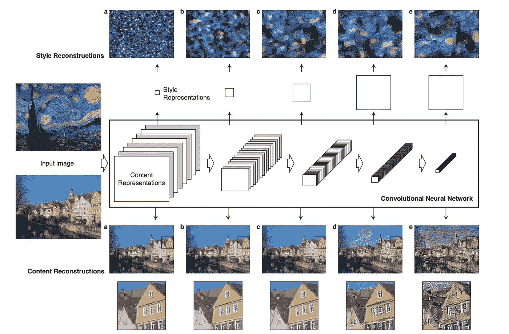
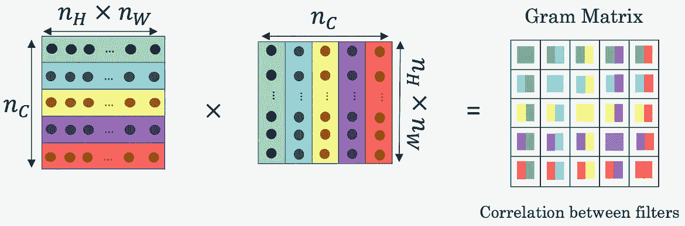
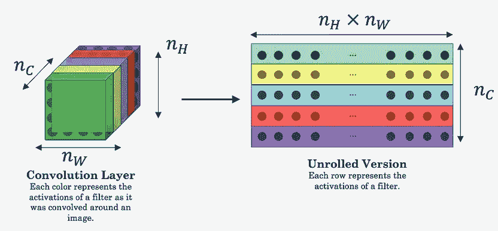
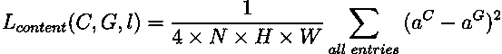
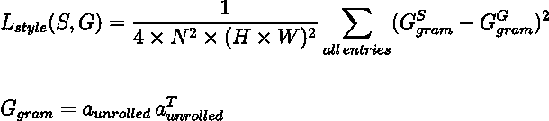
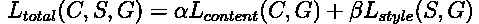

# 缓慢而随意的风格转换

> 原文：<https://towardsdatascience.com/slow-and-arbitrary-style-transfer-3860870c8f0e?source=collection_archive---------45----------------------->

## 神经类型转移，进化

## 使用卷积神经网络的图像风格转换

# 介绍

风格转移是组合两个图像的技术，一个 ***内容*** 图像和一个 ***风格*** 图像，使得 ***生成的*** 图像显示其两个成分的属性。 ***目标*** 是生成在风格(例如，颜色组合、笔触)上与风格图像相似并且在结构上与内容图像相似(例如，边缘、形状)的图像。

在这篇文章中，我们描述了一种基于 ***优化的*** 方法，该方法由 Gatys *等人*在其开创性的工作“使用卷积神经网络 进行 ***图像风格转换”中提出。但是，让我们先来看看导致最终解决方案的一些构件。***

图一。**演示**，图像取自“[R2]实时风格转换和超分辨率的感知损失”

# CNN 在学什么？

一开始，你可以把 ***低级*** 特征想象成在一个 ***放大的*** 图像中可见的特征。相比之下， ***高级*** 特征可以在图像 ***缩小*** 时最佳观看。现在，计算机如何知道如何区分图像的这些细节？CNN，来救援。

预训练卷积神经网络的学习滤波器是优秀的通用图像特征提取器。CNN 的不同层提取不同尺度的特征。 ***浅层*** 中的隐藏单元只看到输入图像相对较小的一部分，它提取 ***低级*** 特征，如边缘、颜色和简单纹理。*更深的层次，然而，具有更广感受野的人倾向于提取**等高级特征，如形状、图案、错综复杂的纹理，甚至是物体。***

***那么，我们如何利用这些特征提取器进行风格转换呢？***

# ***深层图像表示***

***在卷积神经网络中，具有 *N* 个不同滤波器(或， *C* 通道)*的层具有 *N* (或， *C* ) 个大小为 *H* x *W、*的特征映射，其中 *H* 和 *W* 分别是特征激活映射的高度和宽度。该层的特征激活是形状为*N*x*H*x*W*的体积(或者，*C*x*H*x*W*)*。*让我们看看如何使用这些激活从单个图像中分离出 ***内容*** 和 ***样式*** 信息。****

## *内容表示*

*传统上，两幅图像之间的 ***相似度*** 是使用像素空间中的 ***L1/L2*** 损失函数来测量的。虽然这些损失很好地衡量了**的低级相似性，但它们没有捕捉到**图像之间的差别。例如，彼此偏移一个像素的两个相同的图像，尽管在感觉上相似，但是将具有高的每像素损失。*****

***直观上，如果两幅图像的卷积特征激活是相似的，那么它们在感知上应该是相似的。因此，我们将网络的特征响应称为 ***内容表示*** ，两幅图像的特征响应之差称为 ***感知损失。*** 为了找到原始 ***内容*** 图像的 ***内容重构*** ，我们可以对触发相似特征响应的白噪声图像执行梯度下降。***

**通过仅匹配来自特定层的特征响应来生成*内容重构，可以可视化由网络的不同层捕获的特征的规模(参见图 2)。较低层的重建几乎是完美的(a，b，c)。在网络的较高层中，详细的像素信息丢失，而高级内容被保留(d，e)。***

******

***图二。**内容和风格表示**，图像取自“[R1]使用卷积神经网络的图像风格转换”***

## ***风格表现***

***为了获得输入图像风格的表示，在网络的每一层中的滤波器响应之上建立特征空间。它由特征图的空间范围内不同滤波器响应之间的 ***相关性*** 组成。数学上，不同滤波器响应之间的相关性可以计算为两个激活图的 ***点积*** 。形式上，图像的 ***风格表示*** 可以由 ***Gram 矩阵*** (参见图 3)捕获，该矩阵捕获所有特征激活对的相关性。对于一层中的 *N* 个滤镜，克矩阵是一个 *N* x *N* 维矩阵。***

1.  **在 Gram 矩阵的位置 *(i，i)* 处的对角元素测量过滤器**I*如何活动。假设滤波器 *i* 正在检测图像中的垂直边缘，那么 *(i，* *i)* 处的高值意味着图像具有许多垂直边缘。***
2.  **Gram 矩阵的位置 *(i，j)* 处的值测量两个不同滤波器 *i* 和 *j* 的激活的 ***相似度*** 。换句话说，这意味着由两个过滤器 *i* 和 *j.* 捕获的特征的 ***共存*****

**通过捕捉不同类型的特征 *(i，i)* 的流行程度，以及有多少不同的特征一起出现 *(i，j)* ，Gram Matrix 测量图像的风格。本质上，通过丢弃存储在功能激活图中每个位置的空间信息，我们可以成功地提取样式信息。**

********

**图三。 **Gram Matrix** ，图片取自吴恩达的“卷积神经网络”课程**

**类似于内容重建，**风格重建**可以通过最小化随机白色图像和参考风格图像的 Gram 矩阵之间的差异来生成(参见图 2)。这创建了在增加的比例上匹配给定图像的风格的图像，同时丢弃了场景的全局排列的信息。**

**现在我们已经有了定义损失函数的所有关键要素，让我们直接进入它。**

# **损失函数**

**设 ***C，s，*** 和 ***G*** 为原始内容图像，原始风格图像和生成的图像， ***aᶜ，*** 和 ***aᴳ*** 从一个预先训练好的 CNN 的层 ***l*** 中激活它们各自的特征。**

## **内容损失**

**如图 4 所示，内容损失可以定义为 ***内容*** 和 ***生成的*** 图像的特征表示之间的平方误差损失。沿着 CNN 的处理层级，输入图像被转换成对图像的实际 ***内容*** 越来越敏感但对其精确外观相对不变的表示。在实践中，我们可以通过选择网络中间某处的层 ***l*** 来最好地捕捉图像的内容。**

****

**图 4。**内容丢失****

## **风格丧失**

**如图 5 所示，风格损失可以定义为*风格和 ***生成的*** 图像的 Gram 矩阵之间的平方误差损失。我们通常在预先训练的网络的多个层上采用风格损失的加权贡献。***

****

**图五。**款式丢失****

# **将这些点连接起来**

**结合单独的内容和风格损失，最终损失公式在图 6 中定义。我们从随机图像 *G、*开始，迭代地 ***优化*** 该图像，以匹配图像的内容 *C* 和图像的风格 *S、*，同时保持预先训练的特征提取器网络的权重固定。**

****

**图六。**款式转移损耗****

**总之，值得注意的是，尽管优化过程是 ***缓慢的，*** 这种方法允许在任意*对内容和样式图像之间进行样式转换。***

# ***参考***

1.  ***利昂·A·加蒂斯、亚历山大·S·埃克和马蒂亚斯·贝奇。[使用卷积神经网络的图像风格转移](https://www.cv-foundation.org/openaccess/content_cvpr_2016/papers/Gatys_Image_Style_Transfer_CVPR_2016_paper.pdf)。在 *CVPR* ，2016。***
2.  **贾斯廷·约翰逊，亚历山大·阿拉希和李菲菲。[实时风格转换和超分辨率的感知损失](https://arxiv.org/abs/1603.08155)。在 *ECCV* ，2016。**
3.  **[https://www . coursera . org/learn/convolutionary-neural-networks/](https://www.coursera.org/learn/convolutional-neural-networks/)**