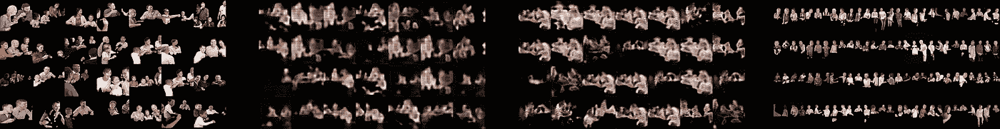
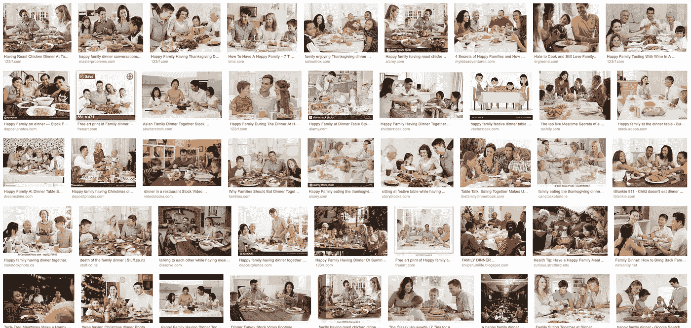
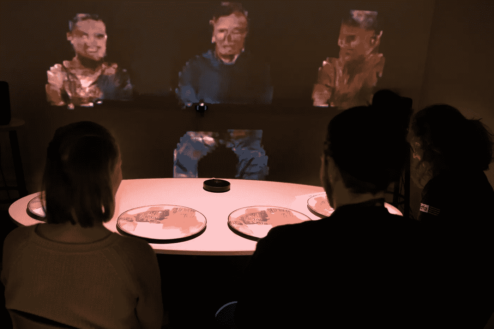
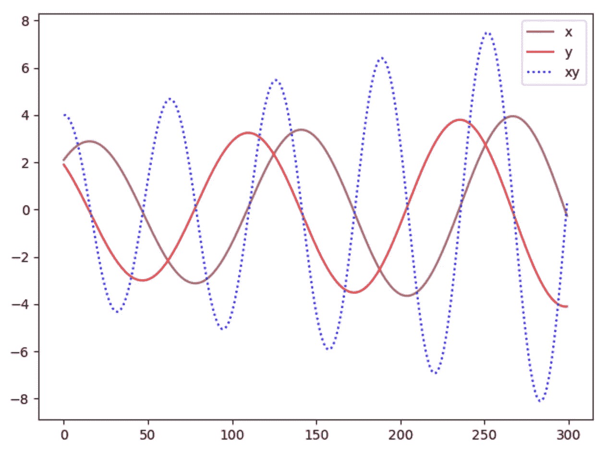
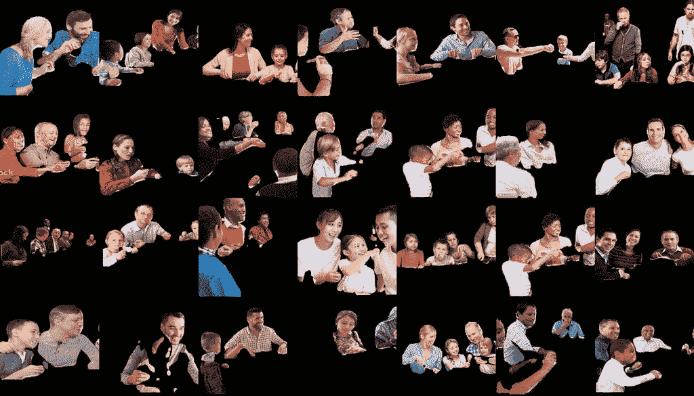
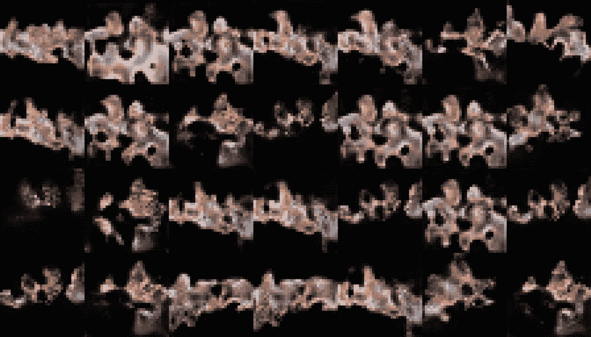
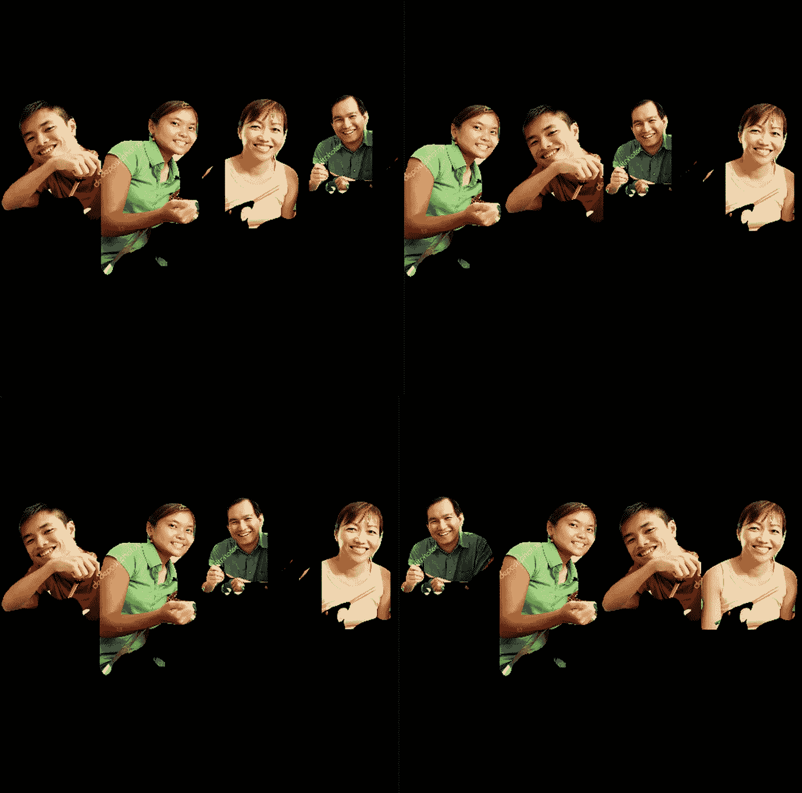
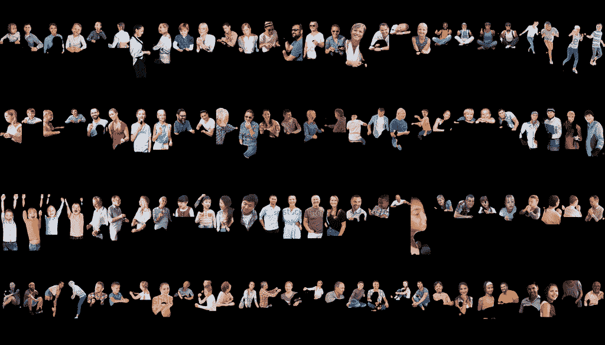
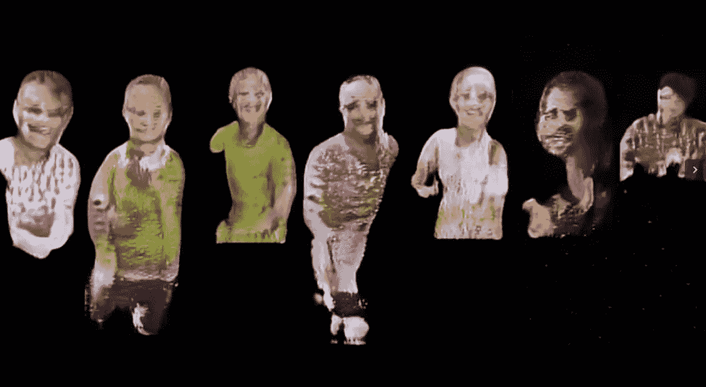
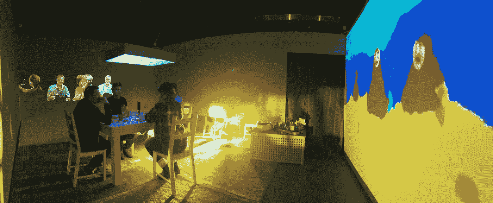

# 小家庭:小数据集

> 原文：<https://towardsdatascience.com/small-family-small-dataset-7f7db708f06d?source=collection_archive---------51----------------------->

## 2020 年 1 月，我们完成了骨髓的开发阶段，在这一系列的文章中，[阿夫纳·佩莱德和我分享了我们在这个过程中所学到的东西。这是该系列的第一篇文章:一个小数据集的扩充。](http://avner.js.org/)

从左到右:原始数据集，失败训练过程 1 号，失败训练过程 2 号，成功训练过程 3 号。

自 2017 年以来，我一直在从事一个名为*骨髓*的过度实践研究项目，该项目旨在推测[机器学习](https://immerse.news/when-machines-look-for-order-in-chaos-198fb222b60a)中精神疾病的可能性。这个项目已经发展成为与 Avner Peled 合作的沉浸式影院体验。去年 3 月，我提出了骨髓家庭晚宴背后的第一个想法，这是体验的主要场景，在 2018 年 IDFA DocLAB[上制作了原型。在中期帖子](https://www.doclab.org/2018/ive-always-been-jealous-of-other-peoples-families/) [Family2Family](https://immerse.news/family2family-first-steps-5f085dc75666) 中，我解释了我们为什么以及如何在“完美家庭晚餐”数据集上训练生成性对抗网络(GAN)机器学习模型。

谷歌搜索到“提督家宴”的截图

骨髓@ IDFA 2018 _ 安妮·范·多恩 2018 NFB。版权所有

当时，我们使用 GAN 的一个特定条件模型— [Pix2Pix](https://phillipi.github.io/pix2pix/) —该模型研究图像对，学习如何在提供源时生成目标图像。它可以处理小数据集，这在时间和预算的限制方面有很大的不同)。当时原型的目标主要集中在物理参与者的交互、设置和整个项目的陈述，而不是模型的训练过程。

2019 年 9 月，在加拿大[国家电影局](https://www.nfb.ca/interactive/marrow/)和 [AtlasV](https://atlasv.io/) 的合拍下，我们开始了开发阶段。这使我们能够重新审视一年前所做的一些决定，并质疑它们是否与项目的目标和行动要求一致。

> ***《髓》强调了在机器学习模型中发现的故障，以反映人工智能中精神障碍的可能性，以及导致这些故障的社会结构，为社会思维提供了新的途径。***

我们需要将选择的 GAN 模型改变为更健壮的模型，该模型试图从零开始生成完美的家族，而不是依赖源输入。这样，我们可以更深入地了解训练过程和数据集分析。我们想突出和可视化的故障和错误发生在培训和国家的艺术甘一代。因此，我们转向了 [StyleGAN](https://arxiv.org/abs/1812.04948) (当时是 V.01):这个生成器以其生成高分辨率图像的能力而闻名，特别是在人脸方面，并识别数据集中的高级特征，如微笑或年龄。

机器学习模型就像渴求数据的孩子，大多数时候数据集的质量和数量决定了模型的性能。有些模特比其他模特更饥渴，StyleGAN 绝对是饥渴的那一个。我们没有预料到 StyleGan 需要比我们之前使用的模型 Pix2Pix 更大的数据集。

“大数据”是人工智能领域的热门词汇之一。它指的是数以百万计的数据点，这些数据点可以为学习模型提供有价值的见解。然而，在现实世界中，只有少数人能够获得这些资源，这些资源正在成为我们这个时代最昂贵的资源；数字区域的石油被经济学家命名为。我们中的大多数人不是大公司的一部分，他们需要找到处理相对较小的数据的方法。这就是为什么小型独立项目倾向于使用那些公司预先训练好的模型的一个原因。根据少量观察值训练的模型往往会表现出[过度拟合](https://en.wikipedia.org/wiki/Overfitting)，并产生不准确的结果。在现实环境中，这可能会产生不平等和偏见的危险社会影响。

在我们的独特案例中，我们实际上并没有瞄准您通常从 StyleGAN 期望的完美高清结果，您可能会说我们*希望*训练失败，因此我们可以展示算法和有偏数据集的约束所固有的错误。我们的目的是教机器关于亲密的人类概念，如“家庭晚餐”，但当你浏览网页时，你会发现扭曲的图像与真正的家庭相去甚远。使用“家庭晚餐”的标语产生了大部分年轻、闪亮、快乐和富裕的白人家庭。一堆图像只能引导机器得出我们自己的虚假图像。在那种情况下，机器的输出将是我们自己感知的扭曲的镜子。

从 [GAN 看 GAN 中鉴别器与生成器的“不收敛”——为什么生成性对抗网络这么难训练！](https://medium.com/@jonathan_hui/gan-why-it-is-so-hard-to-train-generative-advisory-networks-819a86b3750b)

GAN 中的一个常见故障是振荡“[不收敛](https://medium.com/@jonathan_hui/gan-why-it-is-so-hard-to-train-generative-advisory-networks-819a86b3750b)”:一种无休止的状态，其中鉴别器和生成器轮流愚弄他们的对手，而实际上他们在愚弄自己。在人脑和其他生物的神经网络中，神经元总是处于振荡状态。随着环境的变化，神经元协调它们从一个波频率到另一个波频率的平衡。然而，在机器智能中，神经网络渴望专注并收敛于单个值——一个最优结果。具有讽刺意味的是，在人工神经网络的训练过程中的振荡状态通常表示出了问题，系统失去了平衡。当我们在推测机器学习中精神疾病的可能性时，GAN 的振荡案例是一个典型的案例，说明一种障碍如何在这样的模型中表现出来。

然而，我们不能有一个完全的失败，我们需要一个足够清晰的结果让用户理解这个模型，但也要足够扭曲以反映精神障碍。数据集必须足够大和多样化，以使训练取得一些进展，但不足以使训练收敛于高质量的图像。在我们的例子中，找不到足够大的数据集。我们旨在根据家庭晚餐的概念训练一个机器学习模型。不仅仅是这样——一顿完美的家庭晚餐。一个标签行是如此具体**以至于它只能将数百张高质量的图像塑造成一个或多或少一致的数据集。**

由于我们确实成功地用数百张图像训练了 Pix2Pix，我们首先与 StyleGAN 合作了类似数量的图像(约 700 张)，这些图像是从“完美家庭晚餐”标语中刮出来的，然后使用“ [DensePose](http://densepose.org/) ”神经网络从它们的背景中剥离出来，用于人类姿势检测。这是一个失败，在 72 小时的培训后，我们停止了这个过程，因为我们注意到输出变得越来越不稳定，并且由创造者定义的[指标](https://github.com/NVlabs/stylegan#evaluating-quality-and-disentanglement)输出了非常糟糕的数字。我们目睹了极端的过度拟合，这是由模型对来自小数据集的非常特殊的图像样式的依赖引起的。此外，由于图像没有很好地对齐(即，具有不同的角度和视角)，机器捕捉到了这些偏差，并将它们作为主要特征处理-我们的数据非常脏，我们需要清理它。

培训流程 1

尽管我们只有大约 700 张图片，但我们假设，如果我们能更仔细地管理它们，可能会改进我们的模型。我们决定采用一种更精确的方法——角度和视角对齐并居中，图片中的数字数量相似。这进一步减少了我们的数据集，但清理了我们的数据，并减少了模型中的噪声。

只有大约 200 张图像，我们可以看到比更大、更多样化的数据集略有改善。然而，一个小的数据集不仅使模式的检测变得更加困难，也阻碍了创造力和产生新图像的能力。因此，使用如此小的数据集几乎不可能呈现准确的结果。和前面的例子一样，这个训练过程在大约 90 小时后中断。

培训流程 2

我们开始感受到成本和时间的压力。骨髓是一个实验项目，资源有限。培训和数据收集是一个昂贵的过程；在金钱、人力、计算资源和时间方面。在不确定下一个实验是否正确的情况下，我们无法承担越来越多的实验。我们设法联系到了《StyleGAN》的创作者之一[贾科莱提宁](https://www.aalto.fi/en/people/jaakko-lehtinen)，并在执行最后一轮之前得到了他的建议。他告诉我们，毫无疑问，我们需要大约 5-10k 张图像才能获得令人满意的结果，即使这样也不能保证我们达到“解开纠缠”:GAN 可以辨别图像的质量不同和有意义的属性的理想状态(相比之下，StyleGAN 的高质量人脸数据集有 70k 张图像)。

我们知道我们需要一种混合的方法:首先，选择数量而不是质量，收集尽可能多的图像，然后，使用[定制技术](https://github.com/Raycasters/Marrow/tree/master/gan/dense_prepare)增加我们的数据，使我们的模型更容易处理图像。现在，我们正亲眼目睹偏见的产生:为了让我们的模型更好地把握现实，我们需要用一个被篡改的图像来呈现它。

在我们的例子中——在抓取了“晚餐”和“完美”同义词的图像，并添加了“完美家庭餐”、“快乐家庭餐”和“四人完美家庭餐”之后，我们通过处理管道运行它们:

1)通过“[查找图像副本](https://gitlab.com/opennota/findimagedupes)实用程序运行所有图像，删除所有副本。

2)利用前面提到的 DensePose 分析，明目张胆地从图片中切掉 4 个人(如果多，我们随机选择 4 个人)。

3)手动调整尺寸，将族紧挨着放置，并锚定在图像的中心。

4)通过将图形的顺序打乱四次，从一个图像中产生四个图像，来创造更多的家庭多样性。

**这以大约 20，000 张图片结束。**

混乱的家庭

然后，我们对图像应用了另一个过滤过程:对生成的图像再次运行 DensePose 分析，丢弃任何没有四个人的图像(主要是一些设法通过第一次运行的破碎的身体部分)。

我们只剩下大约 6.5k 的图像。

这减少了模型分类器中的过度拟合，并产生了更加一致的结果。尽管如此，质量在过程进行到一半时达到顶峰，之后工件开始出现。

培训流程 3

这种方法使我们获得了令人满意的结果；一个完美家庭的完美但扭曲的形象。

放大 3 号训练的“假家庭”输出

对于那些大公司之外的大多数人来说，收集和分配数据的斗争是一场真正的斗争。这对我们的生活有着真正的意义。骨髓是由我们的动机推动的，我们谈论通过交互式讲故事等替代媒体可获得的数据和信息，并设想信息技术的可能未来。这是艺术和独立的社会实验的时代，可以挑战和破坏常见的做法，并建立一个共享知识的新社区。

Marie-Pier Gauthier 设计的骨髓@NFB 互动 2020 NFB

在骨髓开发阶段，我们的目标是了解如何处理扭曲家庭的结果，增加与用户的实时交互，并使用 GAN 模型创建更多干预。我们寻找将 StyleGAN 与故事联系起来的方法，以及其他模型和视觉效果，希望引发一场关于失真输出的对话，以及当一个人的表达意识消失时，它们如何突出混乱。

在下一篇文章中，我们将描述如何开发一个工具来帮助我们探索 StyleGAN 的潜在状态，并在团队成员之间进行实时交流。

## **数据集准备和过滤开源代码:**[**Github 上的骨髓**](https://github.com/Raycasters/Marrow/tree/master/gan/dense_prepare) **。**

> 特别感谢 [Osman Zeki](https://www.linkedin.com/in/osmanzeki/?originalSubdomain=ca) 做了大量的搜集工作，并在培训的构思阶段提供了有益的反馈和建议。
> 这项体验是与声音艺术家 [Philippe Lambert](https://www.facebook.com/philippel/) 合作开发的。