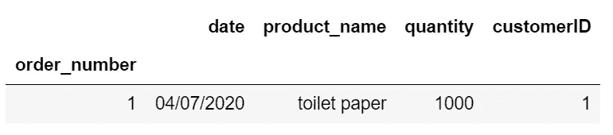
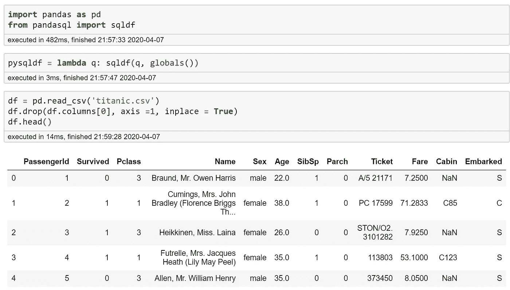
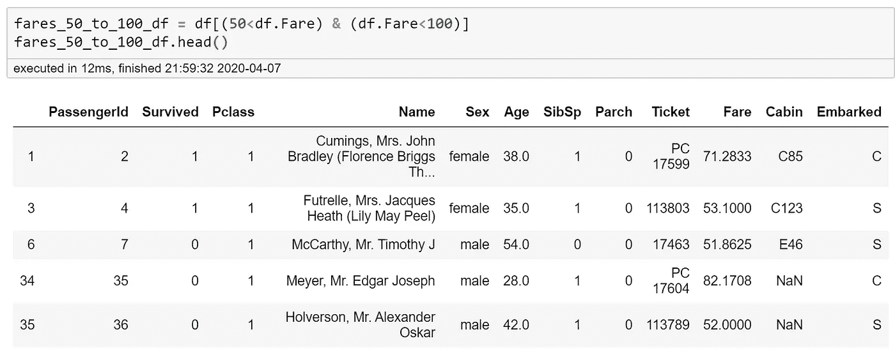
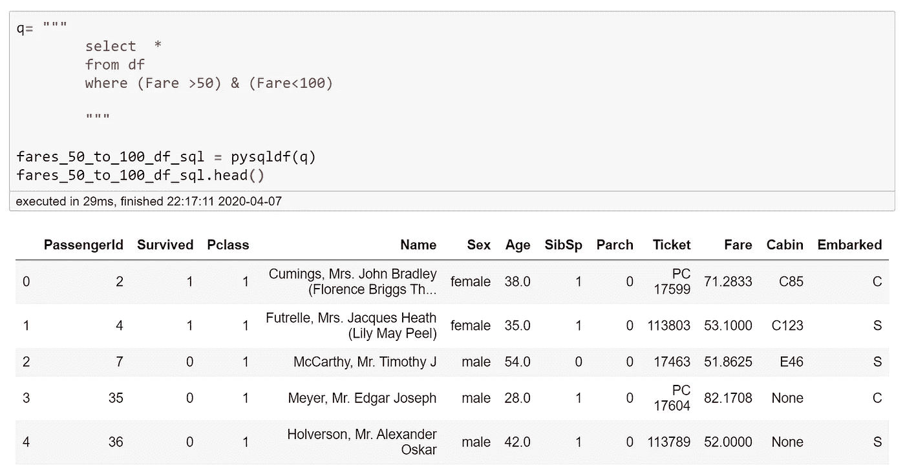
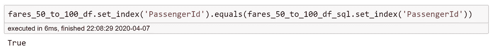
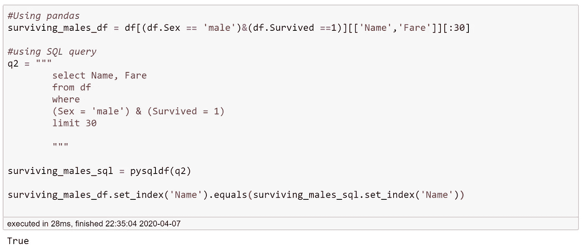
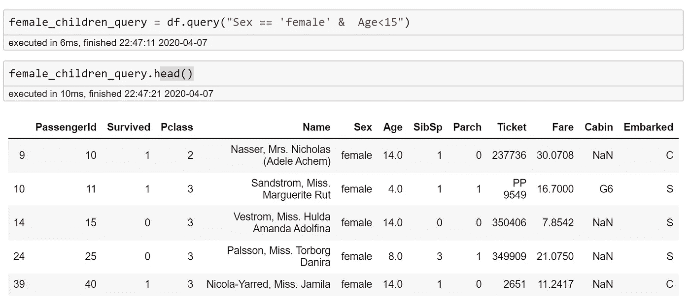
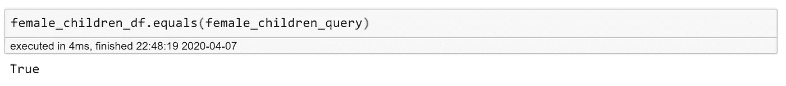

# 使用 Pandas 和 pandasql 学习 SQL 的小动机和简单入门

> 原文：<https://towardsdatascience.com/small-motivation-and-easy-start-to-learn-sql-using-pandas-and-pandasql-c0a67166749b?source=collection_archive---------23----------------------->

[来自 giphy.com](https://giphy.com/gifs/easy-jcqqXMvmbTzHi)(上图)我脑中的数据科学家形象(下图)我努力成为一名数据科学家

## 不是因为你必须这么做，而是因为这让你的生活更轻松

当我开始独自学习数据科学时，有太多的东西需要我去学习。我从 Python 编码开始，我相信这是大多数人的起点，除非你已经知道如何使用 R 或 Python 编程。然后我们听到机器学习算法和大数据等等。在我加入数据科学沉浸式项目(也称为数据科学训练营)之前，我没有考虑过数据库管理系统(DBMS ),因为我只考虑过如何处理数据，而没有考虑过如何访问数据。**数据库**是组织存储不同类型数据的地方，根据数据的种类(关系或非关系)决定数据库的类型。关系数据库通过包含特定信息的行和列的表格来存储数据。例如，在企业中，数据库可能存储一个包含客户 ID、姓名、地址、电话号码的客户信息表，以及一个包含订单号、日期、产品名称、金额、客户 ID 的订单表。

然后这两个表通过客户 ID 连接起来。数据库中的每个表可能都有主键，例如客户 ID 和订单号，在本例中，这是表的唯一标识符。



SQL 代表结构化查询语言，是一种与关系数据库管理系统(RDBMS)一起工作的语言。尽管有不同的 RDBMSs，如 PostgreSQL、MySQL 和 SQLite，但 SQL 是所有人的通用语言。

当我学习任何一门新的编程语言时，我都试图找到最简单的方法来接触这门语言，并将其与我已经知道的语言进行比较。所以今天我想分享我是如何用熊猫数据框架来练习 SQL 的。这种方式降低了学习的障碍，让你的心从恐惧中平静下来。此外，您可以更经常地练习，因为您不需要寻找 SQL 示例数据库来练习。最后，编写查询通常更容易操作表。(相信我)

第一种方法是使用`pandasql`。您可能需要首先使用 bash 命令`pip install pandasql`安装它。

```
from pandasql import sqldf
```

然后我们编写一个 lambda 函数，它将使编写查询变得更快。

```
pysqldf = lambda q: sqldf(q, globals())
```

让我们以泰坦尼克号数据集为例。我使用了链接中的火车设置，并保存为`titanic.csv`。



现在让我们尝试一些简单的东西。

让我们通过 50 到 100 之间的`Fare`范围来分割数据帧。

对于用我们通常的方式使用熊猫:



对于使用 SQL 查询:



我们可以通过使用`.equals()`来检查这两个结果是否相同。但是请注意，当我们使用 SQL 查询时，索引被重置。所以我们用`PassengerId`设置索引，然后使用`.equal()`。



第二个例子是获取幸存男性乘客的前 30 个名字。



它表明，当应用的条件越多，SQL 查询就越容易使用！因此，不仅为了实践，也为了方便，我喜欢使用 SQL 查询来一次应用多个条件。

第二种方法是使用`.query()`

真的很简单！让我们直接看一个例子。

我们想要 15 岁以下的女性乘客。

使用熊猫:


使用查询:



请注意，没有使用`.query()`重置索引。

所以我们可以直接对比这两个。



我希望这些简单的例子能激发您查找更多的 SQL 推荐，并尝试自己使用它们。如果您有任何问题或意见，请告诉我！我会把 Jupyter 笔记本和我在这里使用的例子放在我的 GitHub 库中，我会用更多的例子更新它！