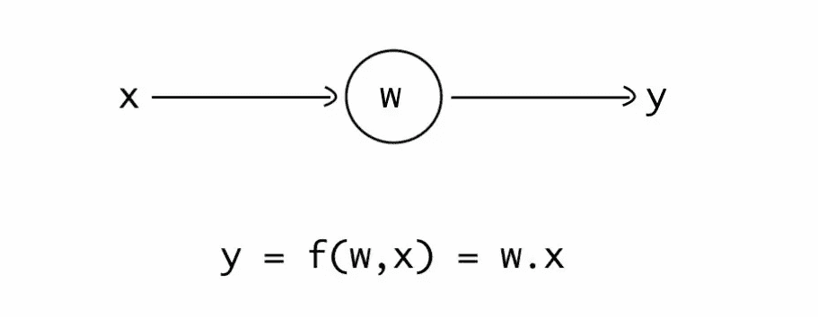
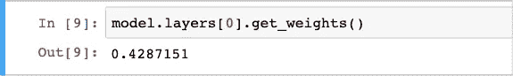
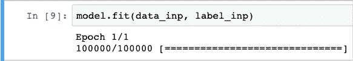
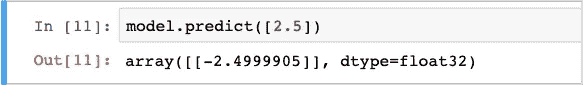

# 最小神经网络

> 原文：<https://towardsdatascience.com/smallest-neural-network-for-complete-beginners-in-4-mins-5a398b574053?source=collection_archive---------12----------------------->

在 [Unsplash](https://unsplash.com/s/photos/boy-on-bicycle?utm_source=unsplash&utm_medium=referral&utm_content=creditCopyText) 上由 [Steijn](https://unsplash.com/@steijn_leijzer?utm_source=unsplash&utm_medium=referral&utm_content=creditCopyText) 拍摄的照片

我不打算写关于**神经网络**背后的复杂数学和算法。相反，我将把你的直觉建立在神经网络如何工作的基础上。我将通过创建最小的神经网络来做到这一点，并训练它完成一项简单的任务。

> 直觉是不容忽视的，约翰。它们代表的数据处理速度太快，意识无法理解- **夏洛克·福尔摩斯**

## 神经网络背后的想法

神经网络是权重的集合。我们可以在一组输入和输出(目标或标签)上训练神经网络。神经网络内部的权重与输入交互并产生输出。随着网络被训练，权重被更新，使得它试图将输出与目标值相匹配。简而言之，神经网络学习输入和输出之间的映射。现在让我们看看我说的这些是什么意思。

## 最小神经网络

下面是只有一个权重(w)的最小神经网络。我们给它一个输入(x ),乘以权重，结果就是网络的输出。

由于这个神经网络非常小，我们将在一个非常简单的任务上训练它。我们的任务是给它输入任何数字，网络应该改变这个数字的符号。比如我们给 3 作为输入，那么网络应该输出-3。

## 在 Keras 中创建神经网络

现在我要在 [**Keras**](https://keras.io/) 中构建并训练最小的神经网络，这是一个深度学习库。现在没有必要深入语法，这只是为了建立你的直觉。

创建一个神经网络

太好了！我们创造了只有一个权重的神经网络。现在让我们创建训练数据，我们将在此基础上训练我们的神经网络。

## 创建数据

创建培训数据

我们也创建了训练数据。数据包含 100K 个随机数，标签是该数的负数。让我们根据刚刚创建的数据来训练网络。

## 训练网络

开始时，神经网络的权值是随机初始化的。随着我们不断训练网络，权重也在更新。在我们开始训练之前，让我们检查一下重量。

训练前的体重

现在让我们来拟合网络中的数据。试衣不过是训练的别称。

训练网络

我们训练了网络。正如您在进度条中看到的，网络是在 100K 个样本上训练的。现在让我们给网络输入一个值，并检查响应。

检查响应

网络几乎完成了任务。输出非常接近输入数，符号相反。随着我们对更多数据进行训练，输出将越来越接近目标值。还有，现在让我们检查一下重量的值。

训练后的体重

当我们根据数据训练网络时，权重从 0.42 变化到-1 左右。这是显而易见的，因为一个数必须乘以-1 才能改变它的符号。

# 摘要

因此，基本上神经网络可以学习任何输入和输出之间的映射，并作为函数逼近器工作。一旦它学会了映射，它可以为你给它的任何输入产生一个近似的输出。