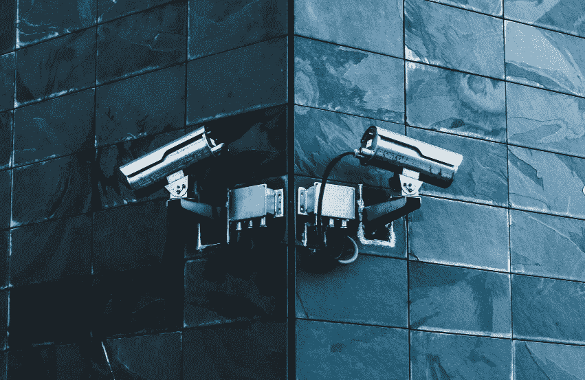
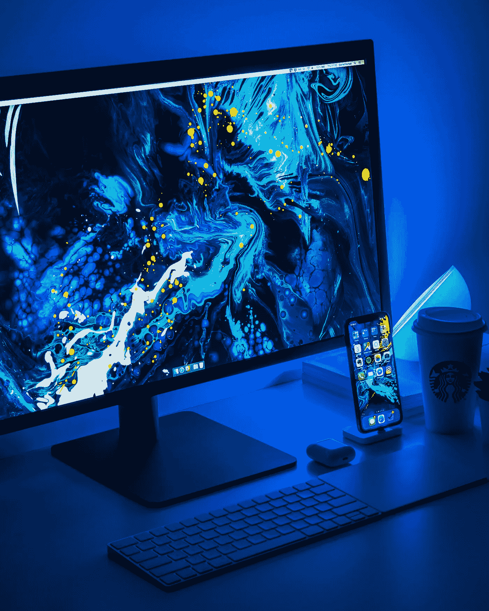
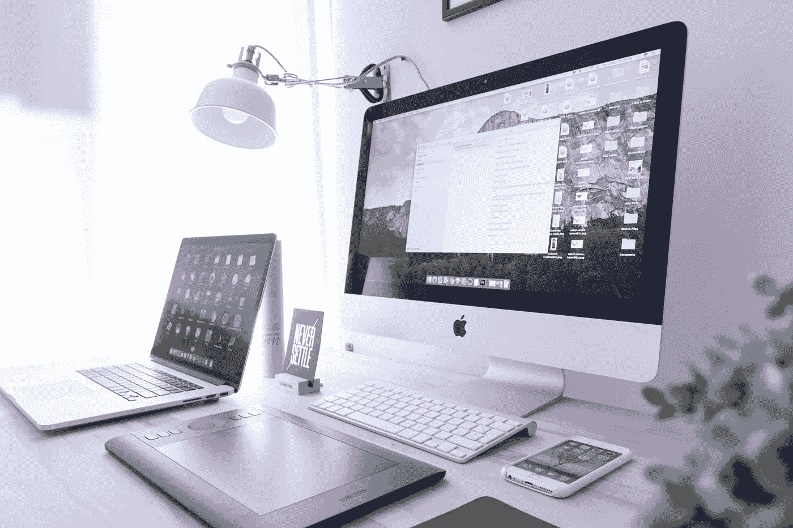
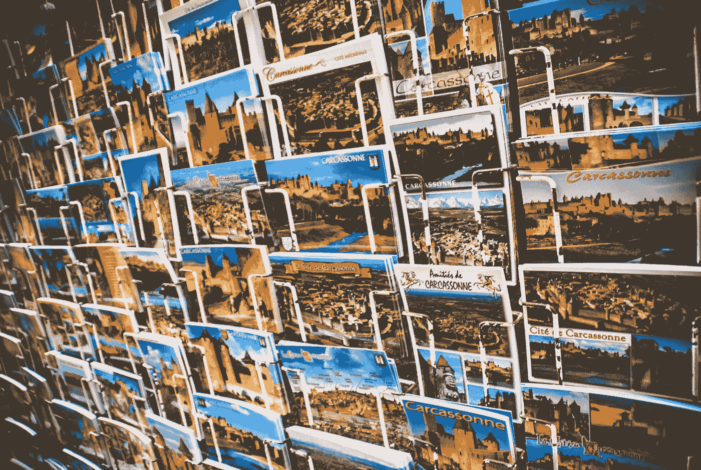
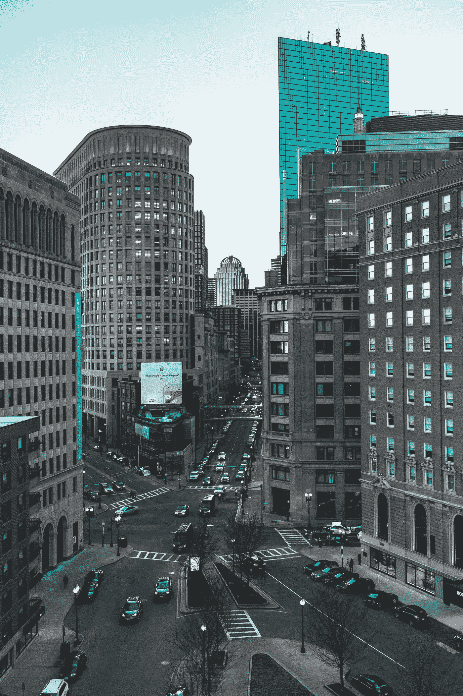
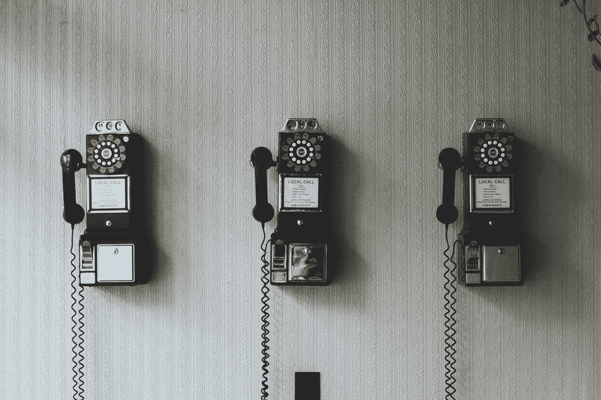
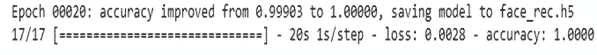
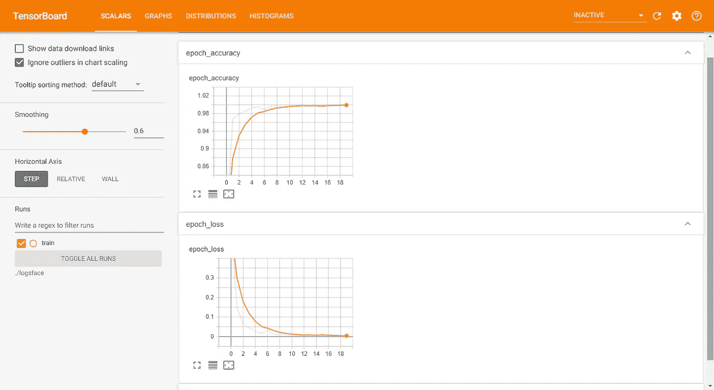
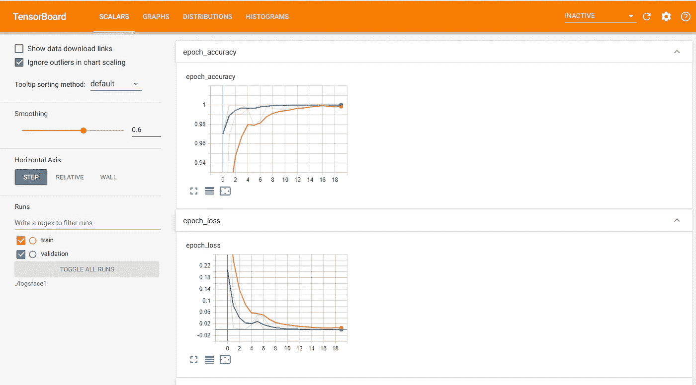

# 智能面部锁定系统

> 原文：<https://towardsdatascience.com/smart-face-lock-system-6c5a77aa5d30?source=collection_archive---------26----------------------->

## [虚拟助理项目](https://towardsdatascience.com/tagged/virtual-assistant-project)

## 建立高精度人脸识别模型

[来源:](https://unsplash.com/photos/p9f6sjMglRE)照片由弗洛里安·奥利沃在 unsplash 上拍摄，并由作者编辑

安全是当今最令人担忧的问题之一。确保只有正确的人有权访问设备变得极其重要。这是我们的智能手机通常没有两步安全系统的主要原因之一。这是为了确保我们的隐私得到维护，只有真正的所有者才能访问他们的设备。基于人脸识别的智能人脸锁定技术就是这样一种安全措施，我们将研究如何构建我们自己的人脸识别系统，该系统使用深度学习和 VGG-16 的转移学习，从头开始以最高的准确度执行。

> ***注:*** *这是虚拟助手系列的 part-1。同一主题将有更多即将到来的部分，我们将介绍如何使用深度学习技术和 python 构建自己的虚拟助手。*

# 简介:

这一部分将涵盖所构建的模型将确切执行的内容。我们正在建立的人脸识别模型将能够检测到授权所有者的人脸，并将拒绝任何其他人脸。如果面部被准许进入或拒绝进入，该模型将提供声音响应。用户将有 3 次验证相同的尝试。第三次尝试失败时，整个系统将关闭，从而保持安全。如果识别出正确的面部，则准许访问，并且用户可以继续控制设备。完整的代码将在文章的最后提供，并带有一个到 GitHub 库的链接。

# 方法:

首先，我们将研究如何收集合法所有者的图像，人脸识别模型将授予许可。然后，如果我们想添加更多可以访问我们系统的人，我们将创建一个额外的文件夹。我们的下一步将是调整图像大小为(224，224，3)的形状，这样我们就可以通过 VGG-16 架构传递它。注意，VGG-16 架构是在具有上述形状的图像净重上预先训练的。然后，我们将通过对数据集执行图像数据扩充来创建图像的变体。在此之后，我们可以通过排除顶层来自由地在 VGG-16 架构之上创建我们的定制模型。接下来是编译、训练，并相应地用必要的回调来调整模型。最后，我们将得出一个最终模型，它可以加载模型的权重，并执行基于人脸识别的智能人脸锁定。

> ***注:*** *在本文中，我只用一个火车目录就执行了整个任务。您可以自由地将程序分成训练和验证目录。我还对一个训练和验证目录执行了同样的操作，我将在最后包括一个图表。*

来源:丹尼尔·科尔派在 unsplash 上拍摄的照片

# 图像集合:

在这一步中，我们将编写一个简单的 python 代码，通过单击空格键按钮来收集图像。我们可以单击“q”按钮退出图形窗口。图像收集是一个重要的步骤，我们将只为您希望授权访问您的选择性设备的人收集图像。让我们看看我们将用来执行以下操作的代码。

我们正在导入所需的库，并在上面的代码块中相应地初始化变量。

导入用于计算机视觉和捕获图像的 **opencv** 模块。

导入 **os** 模块访问本地系统。

我们将“打开”我们的默认网络摄像头，然后继续捕捉数据集所需的面部图像。这是通过 VideoCapture 命令完成的。然后，我们将创建一个特定目录的路径，并将 count 初始化为 0。这个计数变量将用于标记我们的图像，从 0 到我们点击的照片总数。

> ***注意:*** *我已经创建了我的文件夹，如果你想通过程序直接创建你的目录你可以使用 os.mkdir 命令或者以通常的方式创建一个文件夹。创建另一个文件夹也很重要，该文件夹可以包含不被授予访问权限的其他图像。*

最后，我们可以看看执行图像收集的整个过程所需的代码。

我们确保代码仅在摄像头被捕获并激活时运行。然后，我们将捕获视频并返回帧。然后，我们将分配变量“key”来执行按钮按下命令。这个按键给了我们两个选择。为此，我们将参考 ASCII 表—

点击[此处](http://www.asciitable.com/)查阅特定等待键的 ASCII 表。现在让我们来看看图像捕捉功能的两个选项。

1.  当我们按下键盘上的空格键时，单击一张图片。
2.  按下“q”时退出程序

在我们退出程序后，我们将从我们的网络摄像头释放视频捕捉，并破坏 cv2 图形窗口。

来源:多梅尼科·洛亚在 unsplash 上拍摄的照片

# 调整图像大小:

在下一个代码块中，我们将相应地调整图像的大小。我们希望将我们收集的图像重新调整为适合通过 VGG-16 架构的大小，该架构预先训练了 imagenet 权重。让我们看看执行这个任务的代码。

导入用于计算机视觉和捕获图像的 **opencv** 模块。

导入 **os** 模块访问本地系统。

我们正在将我们捕获的所有图像从默认帧大小重新缩放到(224，224)像素，因为如果我们想尝试像 VGG-16 这样的迁移学习模型，这是最好的。我们已经捕获了 RGB 格式的图像。因此，我们已经有 3 个通道，我们不需要指定。VGG-16 所需的信道数量是 3，并且该架构的理想形状是(224，224，3)。

调整大小步骤完成后，我们可以将所有者的目录转移到 images 文件夹中。

> ***注意:*** *如果您试图创建单独的训练和验证数据集，那么以 80:20 的格式分割图像，并将其相应地放置在各自的目录中。*

来源:赫克托·J·里瓦斯在 unsplash 上拍摄的照片

# 图像数据增强:

我们收集并重塑了我们的形象。下一步是对数据集执行图像数据扩充，以复制副本并增加数据集的大小。我们可以用下面的代码块做到这一点。

ImageDataGenerator 用于图像的数据扩充。
我们将复制和制作
原始图像转换的副本。Keras 数据生成器将使用副本和
而不是原件。这对每个时期的训练都很有用。

我们将重新缩放图像，并更新所有参数，以适应我们的模型。参数如下:
1。**重新缩放** =按 1 重新缩放。/255 来归一化每个像素值
2。**旋转 _ 范围** =指定旋转的随机范围
3。 **shear_range** =指定逆时针范围内每个角度的强度。
4。 **zoom_range** =指定缩放范围。
5。 **width_shift_range** =指定扩展的宽度。
6。**高度 _ 移位 _ 范围** =指定延伸的高度。
7。**水平 _ 翻转** =水平翻转图像。
8。 **fill_mode** =根据最近的边界填充。

train _ data gen . flow _ from _ directory 获取到一个目录的路径，并生成批量的扩充数据。可调用属性如下:
1。 **train dir** =指定我们存储图像数据的目录。
2。 **color_mode** =我们需要指定图像分类方式的重要功能，即灰度或 RGB 格式。默认值为 RGB。
3。 **target_size** =图像的尺寸。
4。 **batch_size** =流程操作的数据批次数。
5。 **class_mode** =确定返回的标签数组的类型。
“分类”将是 2D 一键式编码标签。
6。**无序播放** =无序播放:是否无序播放数据(默认值:True)
如果设置为 False，则按字母数字顺序对数据进行排序。

来源:Alex Iby 在 unsplash 上的照片

# 构建模型:

在下一个代码块中，我们在变量 VGG16_MODEL 中导入 VGG-16 模型，并确保我们输入的模型没有顶层。
使用没有顶层的 VGG-16 架构，我们现在可以添加自定义层。为了避免训练 VGG-16 层，我们给出下面的命令:
**。**

我们还将打印出这些层，并确保它们的训练设置为假。

现在让我们继续在 VGG-16 架构之上构建我们的定制模型。这将类似于我的另一篇文章中的手指手势模型，你可以在这里查看。

我们正在构建的人脸识别模型，将使用
迁移学习进行训练。我们将使用没有顶层的 VGG-16 模型。
我们将在 VGG-16 模型
的顶层添加自定义层，然后我们将使用这个转移学习模型来预测它是否是授权所有者的脸。
定制层由输入层组成，基本上是 VGG-16 模型的
输出。我们添加一个具有 32 个滤波器的卷积层，
内核大小为(3，3)，默认步长为(1，1)，我们使用激活
作为 relu，he_normal 作为初始化器。
我们将使用池层从
卷积层向下采样。
在样品通过展平
层后，两个完全连接的层作为 relu 激活使用，即
密集结构。
输出层具有 num_classes 为 2 的 softmax 激活，其
预测 num_classes 的概率，即授权所有者或额外参与者或被拒绝的面部。
最终模型将输入作为 VGG-16 模型
的起点，输出作为最终输出层。

[来源:](https://unsplash.com/photos/71CjSSB83Wo)照片由 Pavan Trikutam 在 unsplash 上拍摄

# 回访:

在下一个代码块中，我们将查看人脸识别任务所需的回调。

我们将导入培训我们的模型所需的 3 个回调。3 个重要的回调是 ModelCheckpoint、ReduceLROnPlateau 和 Tensorboard。让我们看看每个回调函数执行什么任务。

1.  **ModelCheckpoint** —这个回调用于存储我们的模型在训练后的权重。通过指定 save_best_only=True，我们只保存模型的最佳权重。我们将使用准确性指标来监控我们的培训。
2.  **ReduceLROnPlateau** —这个回调用于在指定的次数后降低优化器的学习率。这里，我们将耐心指定为 10。如果准确度在 10 个时期后没有提高，那么我们的学习率相应地降低 0.2 倍。这里用于监控的指标也是准确性。
3.  **tensor board**—tensor board 回调用于绘制图形的可视化，即绘制精度和损耗的图形。

# 编译并拟合模型:

我们正在最后一步编译和装配我们的模型。这里，我们正在训练模型并将最佳权重保存到 face_rec.h5，这样我们就不必重复地重新训练模型，并且可以在需要时使用我们保存的模型。这里我只根据训练数据进行了训练。但是，您可以选择同时使用训练数据和验证数据进行训练。我们使用的损失是 categorical _ crossentropy，它计算标签和预测之间的交叉熵损失。我们将使用的优化器是 Adam，学习率为 0.001，我们将根据指标准确性编译我们的模型。我们将在增强的训练图像上拟合数据。在拟合步骤之后，这些是我们能够实现的关于列车损失和准确性的结果。

# 图表:

## 列车数据图表—

## 训练和验证数据图表—

# 观察:

> 我们能够开发基于迁移学习的 VGG-16 人脸架构，这给了我们极高的准确性和非常低的损失。总的来说，我们开发的模型非常有效，效果非常好。在这些图的帮助下，我们可以观察到只有训练图，以及具有训练和验证图的图表现良好。

这就结束了我们的人脸识别模型。如果您想自己运行和测试模型，那么 GitHub 存储库中会提供代码。你可以在这里查看整个代码的链接以及加载重量和最终运行模型的代码[。这将需要一个额外的 Haar cascode _ frontal face _ default . XML 文件，用于检测人脸。甚至这个也会在](https://github.com/Bharath-K3/Smart-Face-Lock-System) [GitHub](https://github.com/Bharath-K3/Smart-Face-Lock-System) 链接中提供。我希望你们都喜欢阅读这篇文章。这是虚拟助理项目的第一部分。请继续关注虚拟助手项目即将到来的部分，我祝大家有美好的一天！