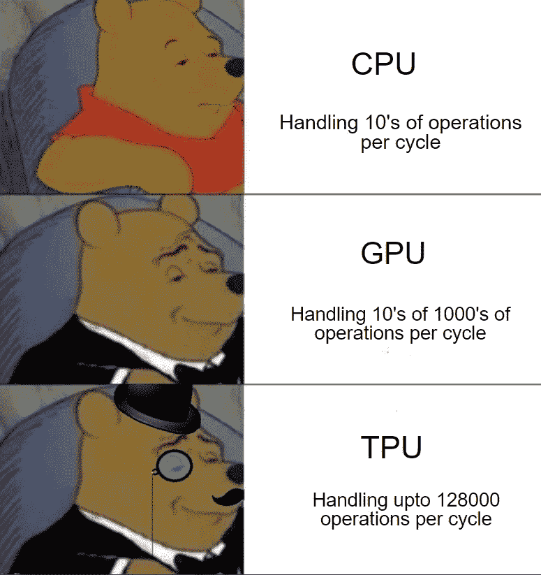
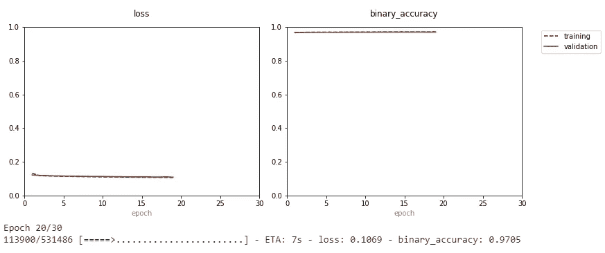

# 使用 TPU 和塔罗斯对任何深度学习模型进行智能超参数优化

> 原文：<https://towardsdatascience.com/smart-hyperparameter-optimization-of-any-deep-learning-model-using-tpu-and-talos-9eb48d09d637?source=collection_archive---------22----------------------->

## Keras API + Colab 张量处理单元+ Talos

什么是 TPU？

张量处理单元(tensor processing unit，TPU)是谷歌专门为神经网络机器学习开发的 AI 加速器专用集成电路(application-specific integrated circuit，ASIC)。TPU 专门针对执行快速、庞大的矩阵乘法进行了优化。谷歌称，TPUs 比 GPU 和 CPU 快 15 到 30 倍- [来源](https://techcrunch.com/2017/04/05/google-says-its-custom-machine-learning-chips-are-often-15-30x-faster-than-gpus-and-cpus/)。



[**来源-OpenGenus**](https://iq.opengenus.org/cpu-vs-gpu-vs-tpu/)

**Colab 中 TPU 环境的准备:**

在[**Google Colab**](https://colab.research.google.com/)**，**中创建一个新的 Python 笔记本，确保将运行时更改为 TPU，您将分配到大约 12.72 GB RAM，然后您可以通过运行以下命令将内存分配增加到大约 35.35 GB RAM。

```
d=[]
while(1):
  d.append('1')
```

上面的命令试图扩展(由于‘append’命令)RAM，并在此过程中崩溃。在上次内存分配崩溃后，点击“获取更多内存”。想要更多这样的建议，请随意参考我之前的博客。

# **TPU +塔罗斯管道:**

我正在考虑 [Kaggle IEEE-CIS 欺诈检测竞赛](https://www.kaggle.com/c/ieee-fraud-detection)，我现在将使用 TPU 在 colab 中一步一步地分解超参数优化深度学习管道的快速方法。

## 1–3.建模数据的准备:

我已经使用了我之前的博客[中类似的前三个步骤，在 Google Colab](/automate-kaggle-competition-with-the-help-of-google-colab-4c43a6960115) 的帮助下自动化 Kaggle 竞赛，即:

1.  从 API 调用下载数据集。
2.  预处理和数据争论。
3.  特征工程和特征选择。

**4。数据缩放:**

除此之外，我们还将对数据进行缩放，以将数据集中数值列的值更改为通用的比例。由于特征具有不同的范围，因此在输入到深度神经网络之前缩放数据是非常重要的。

**5。TPU 初始化:**

为了有效地使用 TPU，并使用由 TPU 实验室提供的所有工人和核心，我们需要通过使用以下代码来初始化 TPU 系统，以初始化 TPU 策略对象，该对象将在模型构建中进一步使用。

**6。模型构建:**

要做 Talos 超参数优化，首先需要初始化一个深度学习模型。我用过 Keras，因为它使用高级 API 和 tensorflow 作为后端。我将使用 Keras 序列模型的两个隐藏层和输出层与 sigmoid 作为激活函数。

**7。参数网格:**

选择的参数网格可以取决于各种因素，如数据、建模时间等。我为超参数优化考虑了以下网格。

**8。距骨超参数扫描:**

然后，我们根据在参数网格中初始化的度量和损耗，沿着参数网格扫描。我们使用以下代码扫描参数网格，其中:

我们使用 ieee_fraud_model 作为要扫描的模型，我们已经用 strategy.scope()初始化了该模型，其中它使用所有 TPU 工作器来构建该模型。这将模型的构建速度提高了 15-20 倍。



Talos 扫描实时绘图进度

如果你感兴趣的话，我还包括了没有 TPU 的 Talos 的代码，或者如果我的 colab 笔记本中没有 TPU 的话。

**9。预测:**

然后，从扫描的所有模型中，我们根据度量标准(在本例中为“binary_accuracy ”)选择最佳模型，使用下面的代码对提交文件进行预测。

**10。保存并恢复提交文件的模型:**

此外，您还可以根据指标将模型部署为 zip 文件，您可以在其中恢复预测模型，并通过使用这些预测来创建提交文件。

请从这个 [**colab**](https://colab.research.google.com/drive/1a59Y-6Pz0wC3S90AsOaJRLsIMleeOb0q) 查看详细的 Kaggle 管道，我在提交文件上得到了大约 0.91 的分数。我们可以进一步使用其他 Keras 自动编码器，添加层和增加网格或任何其他 Keras DNN 定义的模型建设。

**结论:**

构建深度神经网络是一个耗时的过程。此外，对于这样的大数据集(约 600，000 个观察值和 394 个特征)，定义的神经网络的超参数调整甚至可能需要几天时间。充分利用张量处理单元，我们可以极大地减少建立任何深度学习模型的时间，并获得更好的结果。

# 参考资料:

*   [XGBoost](https://arxiv.org/abs/1603.02754)
*   [Kaggle IEEE-CIS 欺诈检测竞赛](https://www.kaggle.com/c/ieee-fraud-detection)
*   塔罗斯