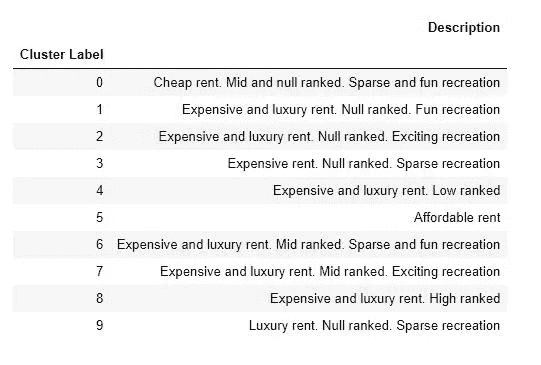
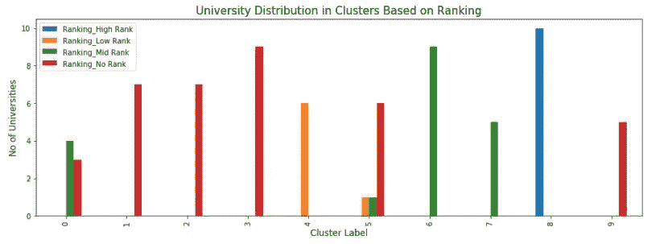
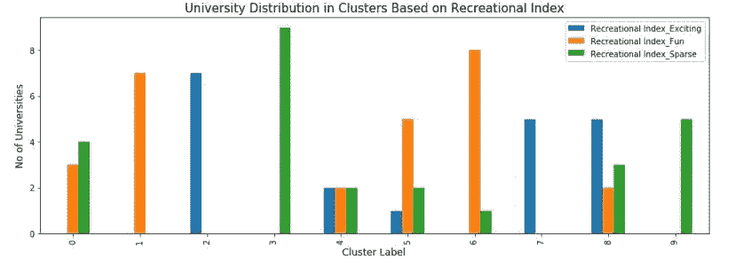

# 无监督机器学习的简单实现

> 原文：<https://towardsdatascience.com/smart-search-canadian-university-clusters-ebe3d6462acf?source=collection_archive---------42----------------------->

## 加拿大大学集群

照片由 [Unsplash](https://unsplash.com/?utm_source=unsplash&utm_medium=referral&utm_content=creditCopyText) 上的[agency followeb](https://unsplash.com/@olloweb?utm_source=unsplash&utm_medium=referral&utm_content=creditCopyText)拍摄

与参照目标标签将模型拟合到数据集的有监督机器学习不同，无监督机器学习算法被允许在不求助于目标标签的情况下确定数据集中的模式。标签可以指客户是否拖欠银行贷款，或者哪种药物对许多患者的特定疾病有效。聚类和异常检测是无监督机器学习的常见应用。我的目的是通过一个简单的实现和一个相关的用例来描述集群令人兴奋的能力。

# 介绍

每年都有成千上万的外国人涌入加拿大寻求大学教育。这主要是由于加拿大的亲移民政策、高质量的教育、相对较低的学费以及整体生活质量的持续高排名。未来的学生面临着大量的选择，因为加拿大各省和各地区都有很多著名的大学。

为了优化潜在学生的搜索体验，加拿大的大学被组织成基于预先选择的特征(或属性)的集群。这些聚类是从 Python 的 scikit-learn 库中的 k-means 聚类机器学习算法在定义的特征集上的实现中派生出来的。每个聚类包括具有独特特征组合的大学，这些特征反过来描述聚类。然后，未来的学生可以根据附带的聚类描述来确定他们要集中搜索的聚类。因此，搜索体验是精炼的、有效的，并且耗时更少。

# 数据

用于这项研究的数据集是从零开始组装的。最终数据集组成部分的来源如下:

*   **加拿大大学列表**:使用 BeautifulSoup Python 库从[加拿大大学列表](https://en.wikipedia.org/wiki/List_of_universities_in_Canada%23mw-head) [1】中废弃。
*   **加拿大大学排名**:使用 BeautifulSoup Python 库从[加拿大大学排名](https://en.wikipedia.org/wiki/Rankings_of_universities_in_Canada%20)【2】中报废。
*   **省租金**:来源于 rentals.ca [省租金中位数](https://rentals.ca/national-rent-report%23provincial-rental-rates)【3】。
*   **大学地理坐标**:geo py Python 库被占用。大学名称作为参数传递，并返回各自的坐标。
*   **位置数据(娱乐指数)**:利用 Foursquare API 获得各大学 500 米范围内的场馆数据作为位置数据。每所大学的娱乐指数是从独特的场馆类别中得出的。

# 方法学

## 数据采集

如前一节所述，本项目中使用的数据集是从不同来源收集到一起的，以实现目标。BeautifulSoup Python 库用于抓取加拿大大学列表和排名[1][2]。各省租金数据来源于 Rentals.ca May 2020 年 5 月租金报告[3]。大学坐标由 geopy 库生成。最后，娱乐指数是一个衡量机构 500 米范围内“娱乐”点可用性的指标，它是使用 Foursquare API 作为位置数据获得的。构建最终数据集涉及一系列清理、合并和连接操作。

下面给出了用于抓取加拿大大学列表的代码:

使用以下代码清理生成的数据帧:

下面的一系列代码描述了娱乐指数的公式，从 Foursquare API 的位置数据开始。首先，在一个数据框架中获得了大学 500 米范围内的前 20 个场馆:

接下来，获得独特的场地类别并进行“计数”以给出娱乐指数。

## 特征集分类

特征集的选择先于机器学习算法的实现。该功能集包括以下几列:“排名”、“租金”和“娱乐指数”。这些特征然后被转换成分类变量，随后基于分类变量执行一键编码，以便于机器学习算法输出的分析。

使用以下代码实现了分类:

功能类别

上述分类是通过对特征集进行探索性数据分析得出的:

特征集直方图

## 衍生大学集群

在组装数据集之后，在特征集上实现一个热编码。这确保了数据被转换成更适合实现机器学习算法的结构。接下来，在编码数据集上实现 k-means 聚类机器学习算法。

k-means 聚类是用以下代码实现的:

## 假设/限制

这项研究只考虑了公立大学。为了便于数字数据处理，在没有官方排名的情况下，给大学分配了一个任意的排名 **50** 。所采用的省租金[3]代表了指定省份内的月租金中位数。因此，省内各城市的实际租金可能与规定的有所不同。

# 结果和讨论

检查聚类算法的输出。然后为每个聚类分配唯一的描述。这些描述基于每个聚类中普遍存在的特征组合，并作为未来学生的标记，以“明智地选择”哪个聚类进行进一步探索。

下表显示了集群及其各自的描述:

独特的分类和描述

对这些集群的进一步检查揭示了以下情况:

*   租金中值较低的省份的大学没有“令人兴奋”的娱乐活动(即娱乐指数要么“有趣”，要么“稀疏”)。
*   租金中值为“昂贵”和“奢侈”的省份的大学有各种排名和娱乐选择。
*   没有一所排名较低或未排名的大学有“令人兴奋”的娱乐活动。
*   每所排名靠前的大学都位于租金中位数“昂贵”或“奢侈”的省份。

下面的图表提供了对集群的更多了解。首先，给出为生成每个图表而定义的函数:

基于排名特征的大学集群分布

从上面的图表中可以看出，希望在一流大学学习的学生可以直接探索第 8 组中的选项。

基于租费特征的大学集群分布

根据上面的图表，主要考虑“便宜”租金的潜在学生将很容易探索集群 0 中的大学。

此外，下图显示，对于那些认为娱乐是绝对必要的潜在学生来说，集群 2 和 7 提供了专门的“令人兴奋”的大学。第 4、5 和 8 组也提出了进一步的选择。

基于游憩指数特征的大学集群分布

然而，应该注意的是，没有一个图表是孤立有效的，因为未来的学生通常会有至少两个他们认为对他们的大学教育经历必不可少的特征。因此，应该结合使用这些图表以获得最佳结果。在此回顾集群及其各自的构成[。点击](https://drive.google.com/file/d/1ivqh7nA_8-EUfb24iVnc3Y1QUIiJCEhf/view?usp=sharing)[这里](https://github.com/adejokun/Coursera_Capstone/blob/master/Smart%20Search_Canadian%20University%20Clustering.ipynb)查看 GitHub 上的代码。

# 结论

加拿大的大学已经根据定义的特征进行了分类:大学排名、省租金和娱乐指数。聚类是使用流行的 k-means 机器学习聚类算法获得的，而新娱乐指数所基于的位置数据是通过 Foursquare API 生成的。这些集群具有独特的特征，每个集群都清楚地包括具有所定义特征组合的大学。未来的学生现在可以自信地依靠集群来简化他们对梦想中的加拿大大学的搜索。

# 参考

[1]加拿大大学列表(2020 年 5 月 12 日)。维基百科，免费的百科全书。检索于 2020 年 5 月 18 日，来自[https://en . Wikipedia . org/wiki/List _ of _ universities _ in _ Canada # MW-head](https://en.wikipedia.org/wiki/List_of_universities_in_Canada#mw-head)

[2]加拿大最佳全球大学(2019 年 10 月 21 日)。美国新闻和世界报道 LP

[3]2020 年 5 月租金报告(n.p .)。rentals . ca . 2020 年 5 月 18 日检索自[https://rentals . ca/national-rent-report # provincial-rental-rates](https://rentals.ca/national-rent-report#provincial-rental-rates)