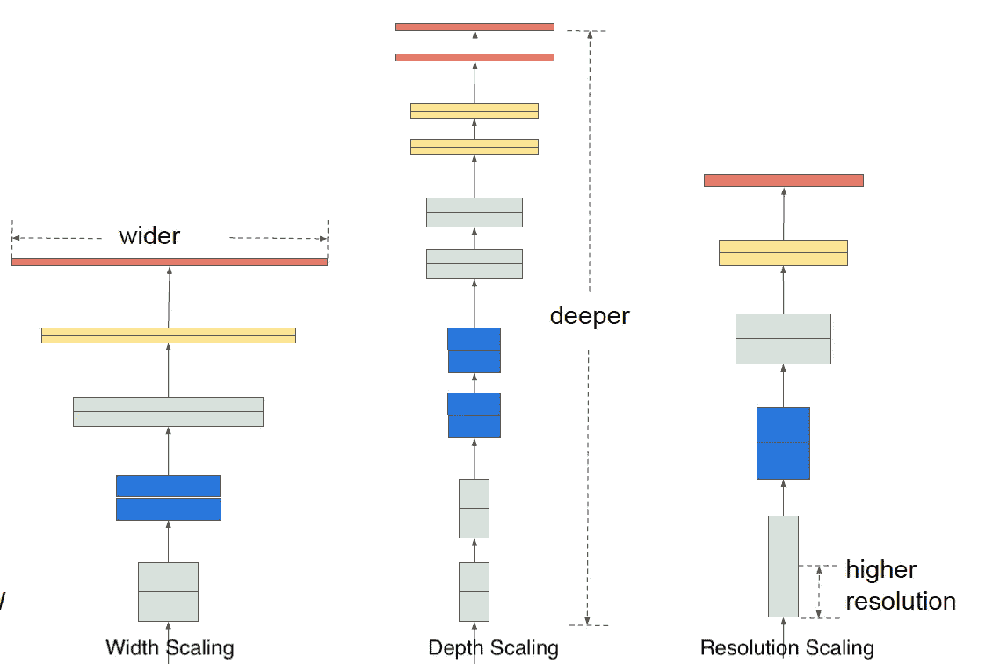
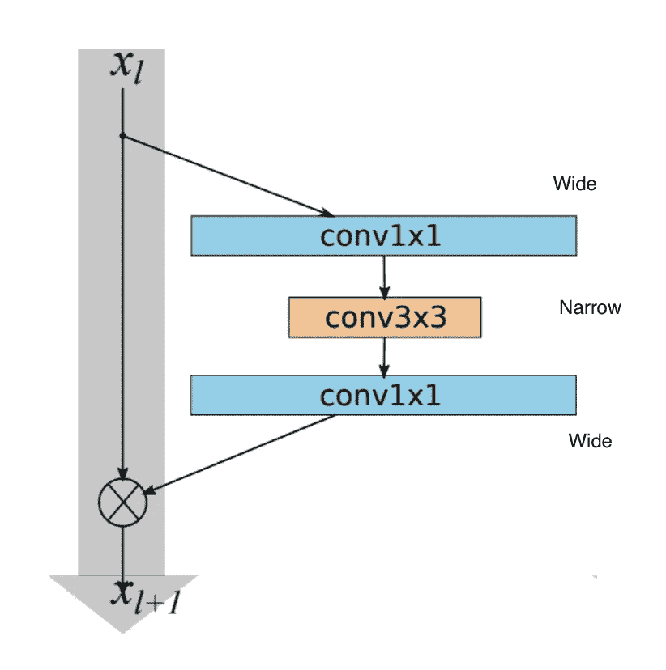
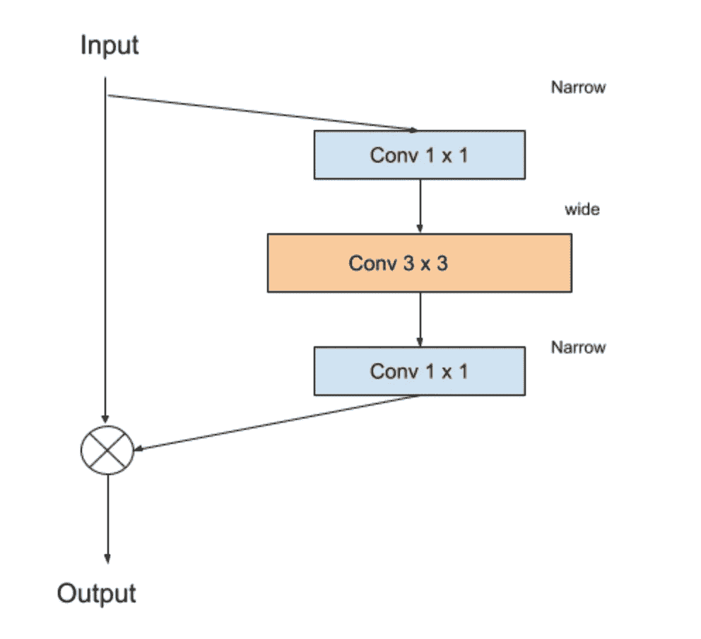
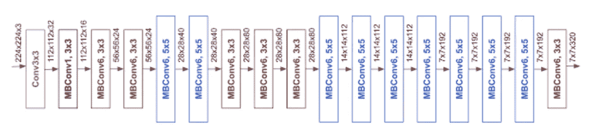

# 提升卷积神经网络性能的聪明方法:EfficientNet Google AI

> 原文：<https://towardsdatascience.com/smart-way-to-levitate-convolutional-neural-networks-performance-efficientnet-google-ai-c87a1f67b084?source=collection_archive---------41----------------------->

照片由 [Alicia Quan](https://unsplash.com/@alicia2joy?utm_source=unsplash&utm_medium=referral&utm_content=creditCopyText) 在 [Unsplash](https://unsplash.com/s/photos/marvel-black-panther?utm_source=unsplash&utm_medium=referral&utm_content=creditCopyText) 上拍摄

卷积神经网络(CNN)已经成为图像分类、目标检测和许多其他应用的首选模型。但是就像来自黑豹的 T4·首里建议的那样，CNN 必须被改进以提供更好的准确性来解决正在研究的问题

> "仅仅因为某些东西有效，并不意味着它不能被改进."—首里([黑豹](https://www.theedgesusu.co.uk/film/cinema/2018/02/15/review-black-panther/)，2018)

# 传统方法

提高 CNN 性能的传统方式是通过增加**深度学习模型**的**深度**。这里的深度意味着在已经可用的深度卷积模型之间或之上添加额外的层。深度的增加可能会适得其反，因为它需要更多的计算能力和资源。此外，在一定深度之后，系统中的 [**权重**](https://docs.paperspace.com/machine-learning/wiki/weights-and-biases) 趋向于**饱和**，而没有任何进一步的改进。

# 聪明的方法

为了解决上述问题，谷歌大脑团队提出了一个名为 **EfficientNet** 的解决方案，该方案通过**在所有方向**上高效缩放来提高模型精度和计算需求，不仅包括**深度**，还包括**宽度**和**分辨率**。它理想地导致每个维度相对于另一个维度的最佳平衡。通过这种方式，EfficientNet 不需要像 CNN 那样多的计算需求，从而获得更好的准确性

现在，让我们尝试围绕 EfficientNet 做一些因果分析，并理解普遍性的问题——为什么、在哪里以及这些深度神经网络是什么。

# 为什么选择高效网络？

为了理解为什么我们在构建深度模型时要保持高效率，首先，让我们了解不同类型的 ***缩放方法*** 和 ***复合缩放*** 的实际含义

## 传统缩放方法:

**宽度缩放:**图像的宽度一般是指通道，就像彩色图像中的 R、G、B。在这种缩放方法中，随着网络的增长，CNN 模型会尝试添加更多的频道，使网络变宽。这些广域网络(例如 WideResNet 和 MobileNets)在捕获高级特征方面存在困难

**深度缩放:**CNN 由几层组成，理解输入图像。增加层数在某个点上是有利的，在该点之后，模型由于[消失梯度问题](https://en.wikipedia.org/wiki/Vanishing_gradient_problem)和复杂性而无法学习。

**分辨率缩放:**图像的分辨率就是图像的高度 x 宽度。与尺寸为 256 x 256 的图像相比，尺寸为 512 x 512 的图像包含更多信息。然而，采用高分辨率输入总是倾向于增加计算需求的负荷，并且在某个阈值之后将不会对模型的性能提供显著的增益。

模型缩放:a)宽度缩放 b)深度缩放 c)分辨率缩放。图片来自高效网论文:[https://arxiv.org/abs/1905.11946](https://arxiv.org/abs/1905.11946)

## 复合缩放

使用固定缩放系数的复合缩放方法可以解决单个缩放的痛点。在这种方法中，基于具有固定比例系数集的可用计算资源，网络在深度、宽度和分辨率上被均匀地**缩放。**

应该在不改变底层函数 F(x)(我们试图匹配的模式)的情况下确定最佳的层架构模型。因为有多个参数必须改变(深度、宽度、分辨率、资源)，所以设计空间考虑相当大。为了减少这种设计空间，使用恒定比率来缩放参数。复合缩放的目标是在给定的约束条件下找到一个最佳比率—内存&[*FLOPS*](https://en.wikipedia.org/wiki/FLOPS)*并获得最大精度*

*[原始论文](https://arxiv.org/abs/1905.11946)建议借助[网格搜索](https://en.wikipedia.org/wiki/Hyperparameter_optimization#Grid_search)尝试不同的缩放组合以找到最佳的缩放系数。后来，在流行数据集 [ImageNet](http://www.image-net.org) 上的现有模型如 [MobileNet](https://arxiv.org/abs/1704.04861) 和 [ResNet](https://arxiv.org/abs/1512.03385) 上实现了这种系数缩放，分别提高了 1.4%和 0.7%的精度。*

*准确性的提高并不仅限于上述两个模型，而是在几个模型上给出了显著的结果，如下图所示*

**

*图片来自原论文:[https://arxiv.org/abs/1905.11946](https://arxiv.org/abs/1905.11946)*

*因此，从上面的参考资料来看，在我们的模型开发阶段，EfficientNet 确实值得考虑。*

# *什么是效率网？*

*一个好的基线模型对于在它的基础上进一步构建具有更好性能的模型是必要的。在 EfficientNet 中，使用类似于 [MobileNetV2](https://arxiv.org/abs/1801.04381) 和 [MnasNet](https://arxiv.org/abs/1807.11626) 的移动反向瓶颈卷积(MBConv)构建基准模型 EfficientNet-B0。稍后对基线模型进行改进，以获得*效率网*系列*

*让我简单介绍一下什么是 MBConv 以及 EfficientNet 的其他构建模块。MBConv 块只不过是最初在 MobineNetV2 CNN 架构中提出的*反向残差块*。*

*在正常的 [*剩余块*](https://en.wikipedia.org/wiki/Residual_neural_network)*中，网络流量通常从*宽到窄再到宽*的结构相对于信道数量而言。最后一层恢复到要添加的输入的形状(剩余块的目的是防止渐变消失)**

****

**残留块。图片来自 papers with code:[https://paperswithcode.com/method/bottleneck-residual-block](https://paperswithcode.com/method/bottleneck-residual-block)免费**

**在*反转残差块中，*图层从*窄到宽再到与残差块相反的*。因此，它最初采用低维输入，并使用 1×1 卷积层对其进行扩展，随后是 3×3 深度方向卷积，并使用 1×1 卷积层返回到输入形状。**

****

**反向剩余块。作者图片**

**采用反向残差块的原因是，在原始残差块中，中间的扩展层仅仅是实现细节。该信息仍然可以在低维上相关，导致较少的计算需求和运行时间。**

**如图所示，baseline EfficientNet 的架构由深层的 *MBConv* 模块组成**

****

**图片来自谷歌人工智能博客— [来源](https://ai.googleblog.com/2019/05/efficientnet-improving-accuracy-and.html)**

**使用不同的比例系数获得效率网 B1 到 B7。下面给出了[原始文件](https://arxiv.org/abs/1905.11946)中所述的整体模型和性能比较**

****

**图片来自高效网纸—[https://arxiv.org/abs/1905.11946](https://arxiv.org/abs/1905.11946)**

# **哪里可以使用高效网络？**

**由于用于计算的参数数量很少，EfficientNet 可以很好地用于快速处理，尤其是在 **MobileAI** 中。随后可以引入多维度进行缩放，并在 CNN 上开辟了全新的研究领域。**

# **外卖**

**EfficientNet 开辟了一个广阔的研究领域，以改善一些计算机视觉任务的结果。它可能有助于在选择模型的深度、宽度和分辨率方面提供一个好的解决方案，以从中获得最大的结果。**

**在谷歌人工智能团队公布这个模型之后，已经有一些研究将 EfficientNet 视为主干，如优化分辨率差异的 [FixEfficientNet](https://arxiv.org/pdf/2003.08237v3.pdf) ，可以广泛用于对象检测任务的 [EfficientDet](https://arxiv.org/abs/1911.09070) 。**

**太好了！感谢您阅读这篇文章，希望对您有所帮助🙌**

# **参考📙**

****原文:**[https://arxiv.org/abs/1905.11946](https://arxiv.org/abs/1905.11946)**

****谷歌 AI 博客:**[https://AI . Google Blog . com/2019/05/efficient net-improving-accuracy-and . html](https://ai.googleblog.com/2019/05/efficientnet-improving-accuracy-and.html)**

****倒转残块:**【https://paperswithcode.com/method/inverted-residual-block】T2**