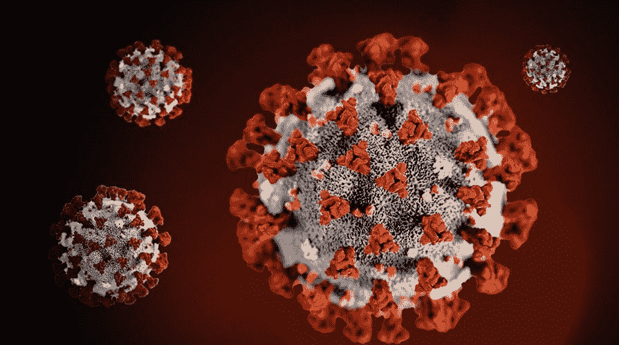
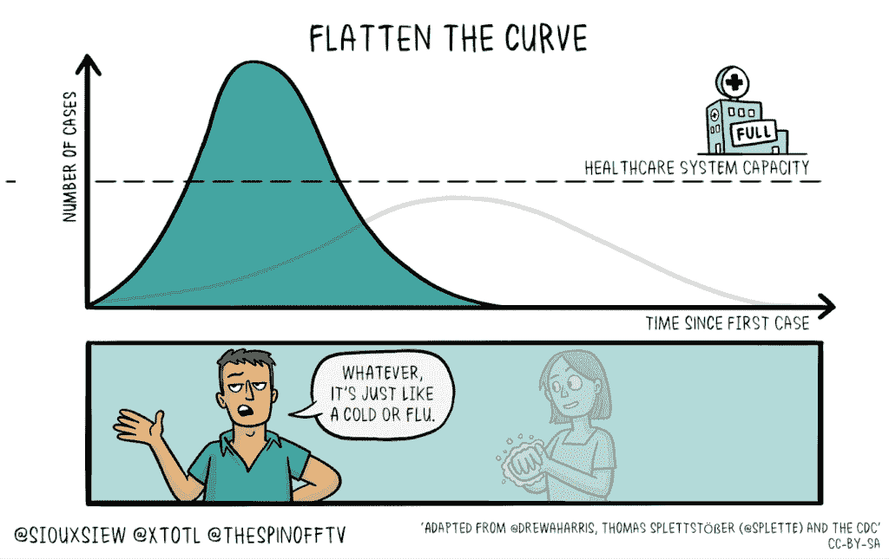

# 更明智的新冠肺炎决策

> 原文：<https://towardsdatascience.com/smarter-covid-19-decision-making-39dbff2ab2ba?source=collection_archive---------1----------------------->

## 如何将决策科学的合理原则应用到自己的生活中

如果你没有意识到[新冠肺炎](https://www.cdc.gov/coronavirus/2019-ncov/about/index.html)，你可能已经在过去的几个星期里躲在石头下面了(很好，呆在那里)。你们其余的人可能会问自己，*“我应该做什么，如果有的话？”*

*【本文也有:* [*阿拉伯语*](http://bit.ly/arabic_covid) *，* [*印地语*](http://bit.ly/hindi_covid) *，* [*意大利语*](http://bit.ly/italian_covid) *，* [*俄语*](https://medium.com/p/6f7b46a46c1a/edit) *，* [*西班牙语*](http://bit.ly/spanish_covid)*。】*

图片:[来源](https://www.oxy.edu/sites/default/files/styles/article_main_image/public/landing-page/main-images/coronavirus_895x500.jpg?itok=mAVhejJ6)。

首先，以下是不要做的事情。不要形成一个不了解情况的观点，然后去寻找证实你观点的媒体。你会找到它，也许你会感觉好一点，但你也可以跳过整个练习——这是浪费时间。你已经知道你只会[确认](http://bit.ly/quaesita_inspired)你想相信的任何事情。如果这是你正在做的，这个指南可以帮助你！

**处理事情的更好方法是:**

*   把你的思想集中在你可能采取的行动上。
*   在你看数据之前选择你的决策标准[。](http://bit.ly/quaesita_default)

***免责声明:*** *我的专长是数据和决策——而不是流行病学——所以这是一个循序渐进的决策指南，帮助你在向对疾病略知一二的科学家寻求新冠肺炎建议时，构建你的思维。*

# 第 0 步:面对你的非理性

如果你的主要目标是感觉更好，也许你会发现阅读两种令人讨厌的心理影响会让人感到安慰，这两种心理影响可能会破坏你有效应对所获得信息的能力:

*   [**暧昧厌恶**](http://bit.ly/quaesita_ellsberg)
*   [**确认偏差**](http://bit.ly/quaesita_confirmation)

如果你有兴趣了解他们在疫情期间是如何扰乱你的大脑的，请查看我在上面链接中关于这些主题的文章。也许这将是行为经济学的一种治疗时刻。(说从来没有人？)

# 第一步:了解自己，设定目标

从仔细思考你的道德和价值观开始。在这个阶段，试着从比最近的疫情更普遍的角度去思考。问自己一些尖锐的问题，你认为你对你的世界、社区、朋友、家庭和自己的责任是什么。

如果你没有调查自己道德的习惯，现在是一个成熟的时刻，面对令人不快的一般问题，如*“在什么情况下，如果有的话，我愿意把一个陌生人的生命置于危险之中？风险有多大？”*(如果你曾经在感冒的时候开车绕过别人或者出门，我很抱歉地告诉你，你已经在拿陌生人的生命冒险了。)

一旦你理解了你的优先事项和你认为的对与错，你将开始形成对你的各种目标以及它们对你有多重要的看法。例如，在餐馆吃饭的能力对你来说重要吗？对你来说比家人的健康更重要吗？

这种分析假设你的典型行为是为现有目标服务的(例如，去你最喜欢的餐馆可能会给你带来效用)，只要不与你更重视的不同目标发生冲突(例如，保持健康可能会给你带来更多效用)，这种行为对你来说是有意义的。在接下来的几个步骤中，我们将围绕你的旧行为不再符合你所陈述的优先事项的信号来构建你的决策。

注意，在决策过程的这个阶段，你应该避免考虑在外面吃饭是否安全。您将在步骤 5 中解决这个问题。目前，请坚持在当前特定病毒的背景之外衡量事情对您的重要性。

***免责声明:*** *我应该指出，既然我已经为自己做了这个练习，我显然对什么是道德的有自己的看法，但我在这里不是要把我的任何看法强加给你。这篇文章不是要告诉你做一个多好的人(我是什么？你的政府？)，只是如何在你自己的道德框架内明智地做出决定…尽管我希望你选择善良。*

# 第二步:考虑可能的行动

一旦你知道你的立场，头脑风暴一下你可能考虑在不久的将来采取的一系列潜在行动，这些行动与如果没有新冠肺炎你会做的有所不同。从多洗手到在家工作到完全自我隔离，再到阅读如何徒手猎熊的手册。

从技术上来说，潜在行动的列表是无限的，所以每当一个行动突然出现在你的脑海中，你可以通过问自己来节省时间:

*   “对我来说，做出一个慎重的决定很重要吗？”
*   *“有什么能说服我去做吗？”*

回答*“不”*中的任何一个都意味着你可以通过彻底消除它来节省精力，这样决策过程就不会花费太长时间。

**例子 1——不重要:**多洗手的决定对我来说并不重要，因为这并不会花我多少钱。即使结果证明是浪费时间，我也不会难过。我不介意只是做它。我会做的。不需要更多的思考或研究。酷，那很简单。

**例子 2——不是一个真正的决定:**没有什么(除了一个完全疯狂的科幻场景)能让我徒手猎杀一只熊。非常好。不用做决定。我不用再想这件事了。

一旦你完成了头脑风暴，试着按照重要性的顺序来处理你的清单，这样你就可以在你累了和去看电视之前完成那些大的。或者，更好的是，为你愿意投入到第 2-4 步的时间量设置一个计时器。对于每个动作，下面的每个步骤都应该单独完成(并行，除非它们是依赖关系)。

# 步骤 3:选择动作触发器

对于每一个潜在的行动，请仔细考虑您将接受哪些信息作为该行动的触发因素。适当的触发器(或*“决策标准”*如果你喜欢附加音节)是足够强烈的信号，表明遵循你的旧行动路线与你声明的目标和优先事项不一致(从而触发你切换到正在考虑的新行动)。

让我们试一个例子。也许你已经买到了明晚的戏票，并且正在考虑不去看演出。

***默认动作:*** *按计划去看戏。* ***替代动作:*** *改变你的行为，不要走。*

默认情况下，你会去看演出，如果你的某个触发条件发生，你就承诺不去。(明智地选择它们——如果你允许自己以后打退堂鼓，你就失去了构建决策的全部意义。这就是为什么重要的是要想象你确实收到了这个信息，并检查你是否满足于用你的新行动来回应。)

在本节中，您需要考虑您的优先事项—如果您只关心自己的短期健康，那么您的触发因素将主要与感染病毒的个人风险及其在您的人口统计群体中的严重性有关。如果你关心其他人的健康和/或在未来几个月内获得医疗资源，你还需要考虑与"[拉平曲线](https://www.nytimes.com/2020/03/11/science/coronavirus-curve-mitigation-infection.html)"相关的触发因素，以及关于疾病传播风险的信息(因为让因你而患病的人挤满最近的医院会损害你所声明的优先事项)。令人欣慰的是，您在第一步中花时间权衡了这些优先级，否则您将如何找到合适的触发器呢？

如果你不熟悉“拉平曲线”这个术语，你可以在这里了解更多。

您可以为每个操作选择多个触发器。这些触发因素都应该被理解为你收到的信息。这些信息可能是关于:

*   法律，例如*“我的政府禁止大于 x 的集会”。*
*   事件，例如*“在我居住的 10 英里范围内检测为阳性的人数超过 x”。*
*   一份研究出版物，例如*“科学家说无症状的人可以传播病毒。”*
*   一种社会规范，例如*“现在好人都不去看戏了。”*
*   建议，例如*“最好避免呆在每平方英尺超过 x 人的密闭空间里。”*
*   费用的明确变化，例如*“所有门票将根据要求退款。”*
*   风险估计的变化，例如*“如果我在人群中闲逛，在接下来的两周内生病的概率至少是 x”。*
*   一个我没有放在这个列表中的类别，例如*“如果我出去，我最好的朋友会和我断绝关系。”*

数据书呆子们，听好了——如果你们习惯于从统计假设检验的角度来思考，事情可能会变得很奇怪，因为我跳过了一些步骤，以使事情对普通读者变得简单。我建议查看下面的附录，在那里我通过您可能已经习惯的框架解释了正在发生的事情——带有 [*默认动作*](http://bit.ly/quaesita_damnedlies) *和* [*无效假设*](http://bit.ly/quaesita_fisher) *的框架。】*

# 步骤 4:选择最低质量的来源

选择可以作为有效触发器的最低质量的信息源。如果一个质量较低的来源给你信息，你会试图用你选择的来源来验证它，除非质量足够好，否则你不会采取行动。继续我们的例子，每个触发器的最低质量来源可能是:

*   法律:你们政府的官方网站。当纽约市昨天禁止超过 500 人的集会时，我在合法的纽约市网站上查看了一下。其他人可能会从一家声誉良好的报纸上接受同样的信息，而不会进一步核实。你的最低信息源质量是你的个人选择。
*   *事件:一份声誉卓著的报纸(符合你的口味)。就我个人而言，我喜欢那些享有恰当核实事实声誉的网站。*
*   *研究:一个有资格的流行病学家可以获得足够的数据来做出目前的推断，并以中到高的可信度发表他们的结论。作为一名科学家，在信任科学出版物时，我可能会更加谨慎。虽然有些人选择相信任何科学家说的任何话，但赢得我的信任需要综合经验/证书、相关数据的访问以及假设的力度与断言的力度。*
*   *社会规范:推特上有人？你会接受哪些关于社会规范的线索来源，这是非常私人的事情，我无法给你任何建议。对一些人来说，随便一个人在听得见的范围内说出来就足够了。其他人可能会等到《哈佛商业评论》的礼仪版。*
*   *建议:你的医生或贵国相当于* [*的疾病控制中心*](https://www.cdc.gov/coronavirus/2019-ncov/index.html) *。我不会告诉你从哪里得到医疗建议，但我希望你有标准。*
*   *费用:* *剧院网站。*如果剧院说他们会给我退票，我会比我的邻居说她听到谣言说票可能会被退票更有说服力。
*   *风险估计:**[*疾控中心*](https://www.cdc.gov/coronavirus/2019-ncov/index.html) *再次，一个见多识广的* [*统计学家*](http://bit.ly/quaesita_statistics) *正在处理相关数据，或者也许是你自己的模拟。*是的，我们中的许多人[数据科学家](http://bit.ly/quaesita_datasci)正在[编写模拟](http://bit.ly/quaesita_statistics)(世界的玩具模型，看看事情如何在不同的假设下发生)。当我们根据我们信任的科学家的出版物更新假设时(或者在我们的代码中发现错误)，我们的模拟会改变。*
*   **其他:其他。*对于所有类别，我建议你要有一些质量标准(多严格由你决定)并意识到你的标准。不要惊慌失措地回应那些不符合你个人品质标准的人的喋喋不休。举个例子，如果我爸告诉我，如果我去外面，我最好的朋友会和我断绝关系，我不会惊慌失措——我会打电话给我最好的朋友核实。*

*记住，这些例子(模糊地基于我的品味)不是建议。我不会冒昧地告诉你如何生活，也许除了鼓励你走向自我意识。我们每个人都必须在如何构建决策的问题上达成共识。*

# *第五步:收集信息*

*现在你已经想出了宇宙需要发送给你的触发各种行动的最小信号，你将从你的高质量来源收集信息(并继续收集)。如果决定很重要，彻底做好功课。*

*请注意，我要求您在查看信息之前先思考一下。这就是为什么数据收集位一直保存到第 5 步。如果你考虑人类动物的典型习惯，你会注意到大多数人不这样做。那我为什么要你去做呢？*

*在寻找信息前思考并设定标准有助于你避免确认偏见。要了解更多，请查看我关于数据驱动决策的文章。当然，你忘记考虑的事情可能会出现，所以你需要做出基于现实的决定(点击了解更多[)。即使在这种情况下，稍微考虑一下你将接受的作为行动触发因素的信息的最低强度和质量也是非常有价值的。](http://bit.ly/quaesita_di)*

# *第六步:行动(或者不行动)*

*如果没有相关信息，继续做你计划要做的事情。当不同的动作被触发时，执行它。(也许你会注意到有些动作应该已经被触发了，这个练习帮助你赶上了。)*

# *这个故事的寓意*

*现在花点时间思考一下，这样当信息出现时，你会更加明智和冷静。*

*如果你一直读到这里，并且你知道有人可能会觉得这很有用，请与他们分享。与此同时，我会忍住不开一个关于如何让建议像病毒一样传播的玩笑。不过说真的，除非你(还有你和你还有你……)分享一下，否则几乎没人会看到这个。*允许任何人免费查看本文的链接版本为:*[*http://bit.ly/quaesita_covid*](http://bit.ly/quaesita_covid)*

*如果你想了解更多关于结构化决策的知识，我的 [*决策智能简介*](http://bit.ly/quaesita_di) 是一个很好的起点。*

# *假设检验者的附录*

*如果你习惯于经典的统计推断，你想知道零假设到底是怎么回事，我把附录[放在这里](http://bit.ly/quaesita_covidappendix)。*

# *接下来读什么*

* [## 一位决策科学家给新冠肺炎的十大禁忌

### 在疫情期间，照顾好你的大脑，聪明对待数据，做出更明智的决定

towardsdatascience.com](/a-decision-scientists-10-dos-don-ts-for-covid-19-805577bccd67) 

# 喜欢作者？与凯西·科兹尔科夫联系

让我们做朋友吧！你可以在 [Twitter](https://twitter.com/quaesita) 、 [YouTube](https://www.youtube.com/channel/UCbOX--VOebPe-MMRkatFRxw) 、 [Substack](http://decision.substack.com) 和 [LinkedIn](https://www.linkedin.com/in/kozyrkov/) 上找到我。有兴趣让我在你的活动上发言吗？使用此表格取得联系。

# 现在是完全不同的东西…

感谢阅读！如果你在这里玩得开心，并且对人工智能感兴趣，这里有一个初学者友好的介绍供你娱乐:

在这里欣赏整个课程播放列表:[bit.ly/machinefriend](http://bit.ly/machinefriend)*