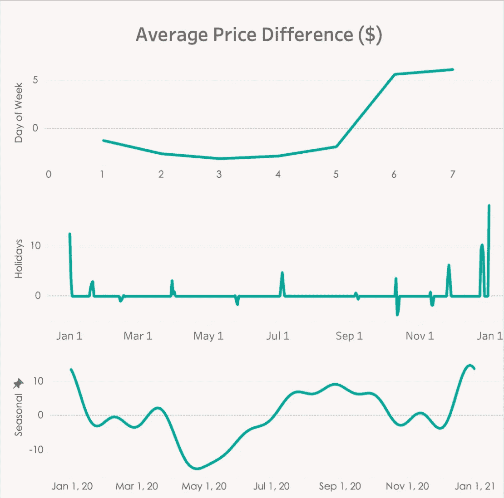
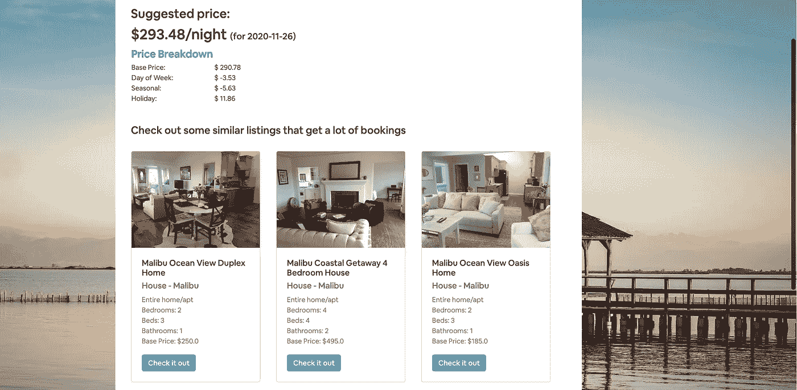

# 使用机器学习为 Airbnb 更智能地定价

> 原文：<https://towardsdatascience.com/smarter-pricing-for-airbnb-using-machine-learning-413053a48793?source=collection_archive---------23----------------------->

## 通过回归和时间序列分析增加主机收入

这个项目是名为 Metis 的沉浸式数据科学项目的一部分。你可以在我的 [*GitHub*](https://github.com/alisonglazer/metis_project_5_airbnb_pricing) *和幻灯片* [*这里*](https://www.slideshare.net/AlisonGlazer/smarter-pricing-for-airbnb) *找到这个项目的文件。最终项目可在* [*此处*](http://airbnb-pricing.herokuapp.com/) *(交互式 web app)访问。】*

我最近设计了一种新的方法，使用 Airbnb 数据集中的[为 Airbnb 房源自动定价。我使用线性回归建立了一个基础价格和时间序列分析，以预测由于日期的价格波动。我使用无监督学习建立了一个推荐系统，这样主机可以将他们的列表与其他类似的流行列表进行比较。](http://insideairbnb.com/get-the-data.html)

## **一些背景**

Airbnb 在几年前推出了智能定价工具，但问题是价格建议太低，主机用户在使用该工具时注意到他们的收入减少了。像 Hosty 和 Beyond Pricing 这样的第三方解决方案试图通过增加主机收入的模式来解决这个问题；然而，这些是不灵活的和不可解释的。用户输入被限制为在 Airbnb 房源上输入的数据(防止用户轻易调整输入)，主机无法了解他们是如何获得某个价格建议的。

对于那些还没有上市或者甚至还没有购买房产出租的新主机用户来说，这让他们对预期的收入感到困惑。所以我的目标是为新老主机建立一个工具，在不把价格降得太低的情况下最大化预订。

## 该过程

对于这个最初的概念，我专注于洛杉矶价格合理、入住率非常高的 Airbnb 房源，以训练模型，剔除定价过低和不受欢迎的房源。一个重要的假设是，因为实际的预订数据是不可用的，评论可以作为预订的代理。

我对每个列表的名称和描述使用了自然语言处理，以了解其中讨论的主题如何影响定价。然后我建立了几个回归模型来预测每处房产的基价。对于最终的模型，我使用了线性回归，因为它易于解释，这很重要，因为最终用户 Airbnb 主机将受益于了解他们的价格是如何最好地确定的。由于一年中的时间在度假价格中起着如此重要的作用，我做了时间序列分析来预测价格如何随着日期的变化而波动。然后我使用无监督学习建立了一个基于内容的推荐系统，供主机将其列表与类似的列表进行比较。最后，我将这个模型部署在一个 web 应用程序中，看看它如何工作。

清理完数据后，我设置了许多潜在的重要特性。除了上面提到的基于文本的特性之外，这个特性集还包括高级信息，如资产类型、房间类型和位置。它还包含更多的细节，如客人数量、浴室、他们拥有的便利设施等等。

## 结果

在训练初始模型并使用弹性网络正则化后，我挑选了最有效的模型，并调整超参数以找到最具预测能力的模型。我使用平均绝对误差来衡量回归模型的成功，最终结果是大约 18 美元，这意味着使用该工具的主机在为它们找到准确的价格时可以预计大约有这么大的回旋余地。

为了更好地理解该模型的工作原理，让我们深入研究一下它的特性。下图显示了每个特性的相对重要性，那些使价格上升的特性向右延伸，而那些向左延伸的特性使价格下降。

线性回归系数

最强的积极预测因素是房产类型是否是整个住宅，是否在洛杉矶西边的社区，酒店房间，以及它能容纳的人数——越多越好。虽然我最终从部署的模型中排除了基于文本的功能，但值得注意的是，价格上涨最多的主题是那些涉及良好室外景观和最近装修的主题。

那些对价格有最大负面影响的人需要长期居住，大多数非房产类型，东区社区，以及不出所料的合租房间。对价格产生负面影响的基于文本的特征涉及被描述为“舒适的”或“舒适的”以及“家庭友好的”房屋。

这似乎是相当直观的，价格应该更高或更低，取决于是哪一天。下图显示了基于一周中的某一天、一年中的某个时间以及特定节假日的细分。

价格在一周内下降，在周三达到最低，在周末飙升。许多节日也会抬高价格，尤其是感恩节、圣诞节和新年前夕。从季节变化来看，价格与洛杉矶夏末和寒假期间的旅游旺季相关。

基价与基于时间的波动相结合，建立一个建议价格，如下所示。

更智能的定价演示

用于价格预测的特征也被用作基于内容的推荐系统的输入，以找到与该输入相似的受欢迎的列表，这允许主持人将他们的列表与已经在市场上的其他列表进行比较。

如果你想亲自尝试一下，请访问我通过 Heroku [这里](http://airbnb-pricing.herokuapp.com/)部署的应用程序。有任何问题，请随时联系[和](mailto:alisonglazer@gmail.com)。