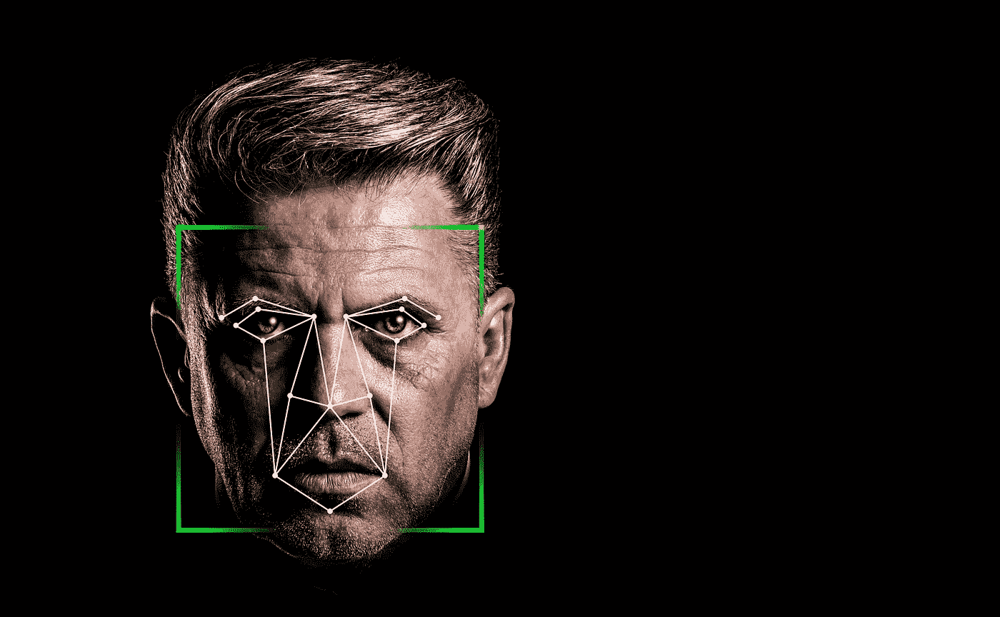
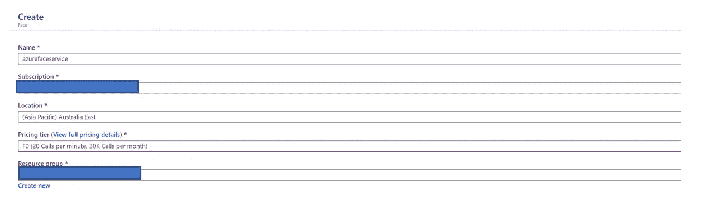
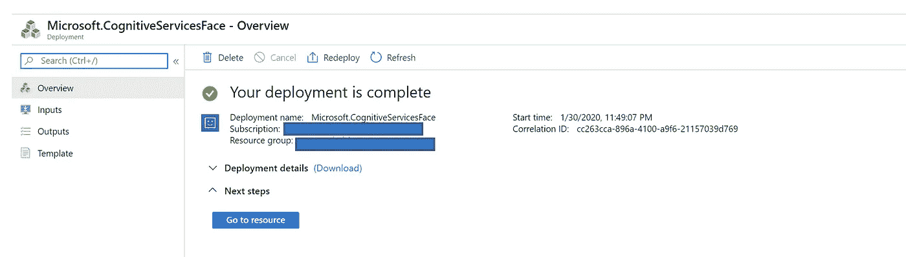
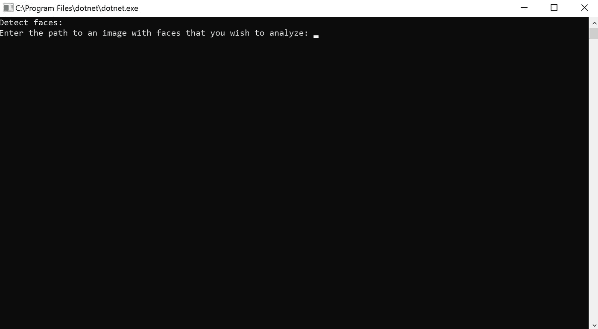
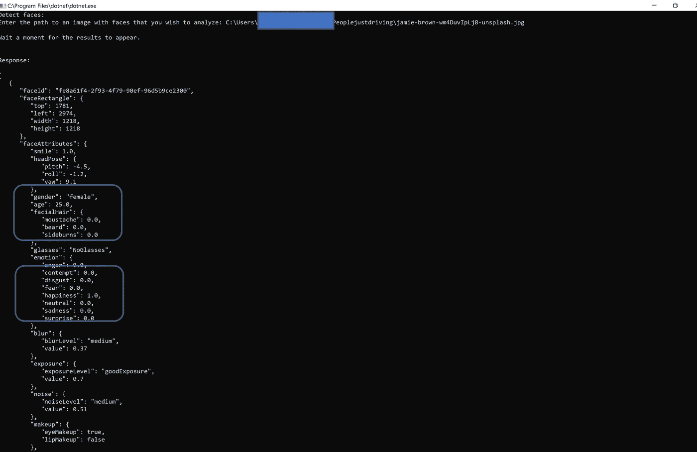
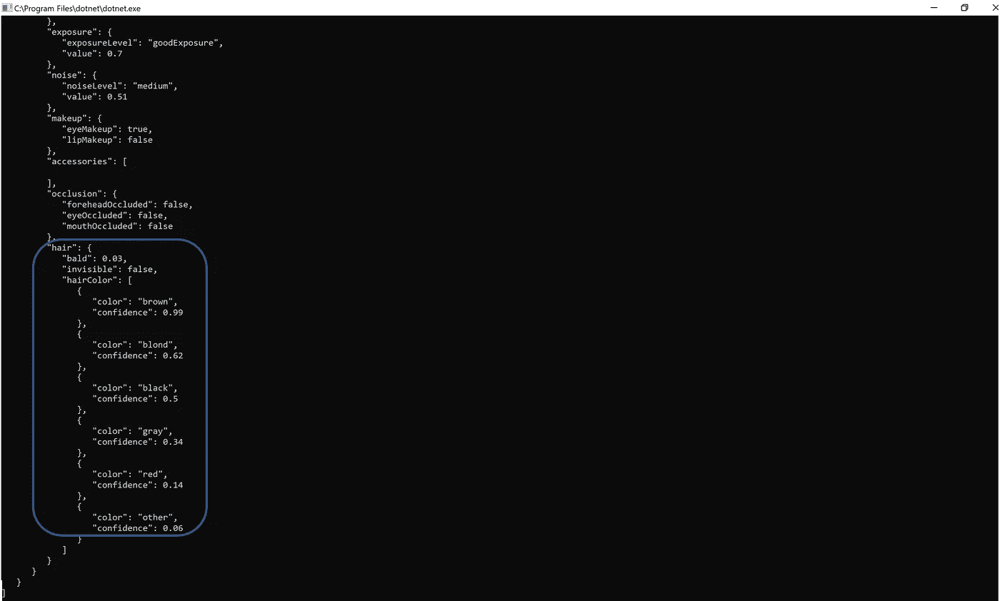

# 请微笑，你在镜头前！

> 原文：<https://towardsdatascience.com/smile-please-you-are-on-camera-584989a0418a?source=collection_archive---------36----------------------->

使用许可[知识共享零— CC0](https://creativecommons.org/publicdomain/zero/1.0/deed.en)

> 你可以使用微软 Azure 的 Face API 将面部识别软件嵌入到你的应用中。相同的 API 可以用于零售分析(人们对产品展示的反应)、人群分析和商店中的客户行为等。

在一些客户那里使用过之后，我喜欢[微软](https://medium.com/u/940e606ec51a?source=post_page-----584989a0418a--------------------------------)赋予[公民数据科学家](https://go.forrester.com/blogs/who-who-who-are-you-citizen-data-scientist/)权力的方式。

我不是统计学家，但对数据科学的潜力有所了解。它总是让我大吃一惊！我今天想写关于认知服务，因为我喜欢探索它的潜力以及它所迎合的用例。

今天，我将探索 Azure Face 服务。它提供了用于检测、识别和分析图像中人脸的算法。处理人脸信息的能力在许多不同的软件场景中都很重要。示例场景包括安全性、自然用户界面、图像内容分析和管理、移动应用和机器人。

在 Azure 中创建面部服务

第一步是在 azure 中创建一个 face 服务。现在已经创建了资源，请转到您的资源，复制端点和密钥，它们将用于根据 face API 进行身份验证。

点击“转到资源”

# 现在让我们创建一个简单的控制台应用程序来调用和使用 API。

# 创建应用程序

1.  在 Visual Studio 中，创建新的 C#控制台应用程序。
2.  使用以下代码作为 facedetection.cs 文件的主体。

1.  *将<订阅密钥>替换为您的面部服务*的订阅密钥
2.  *2。用在您的端点 URL* 中找到的字符串替换< myresourcename >

# 现在运行代码，您应该会看到下面的内容

我用的是从 Unsplash 得到的图片。

杰米·布朗在 [Unsplash](https://unsplash.com/s/photos/laughing?utm_source=unsplash&utm_medium=referral&utm_content=creditCopyText) 上拍摄的照片

来自面部服务 API 的输出

上面的截图显示了面部服务 API 的输出

*1。性别是女*

*2。确定没有胡须*

*3。确定画面中有幸福*

来自面部服务 API 的输出

第二个屏幕截图显示了面部服务 API 的输出

*她头发的颜色为棕色，有 99%的把握*

# 结论

有关于“老大哥综合症”的比较，每一个动作都被公司分析。虽然像面部识别这样强大的技术有其缺陷，但如果小心使用，它是非常强大的。在这篇文章中，我们介绍了如何通过 C#使用微软的 face API 实现面部识别系统的基本步骤。我喜欢如何进行面部分析(我创造了一个新词吗？！)使用 C#每个人都可以迈出成为数据科学家的第一步。

*注:本文所表达的观点仅是我个人的观点，并不代表我的雇主的观点。*