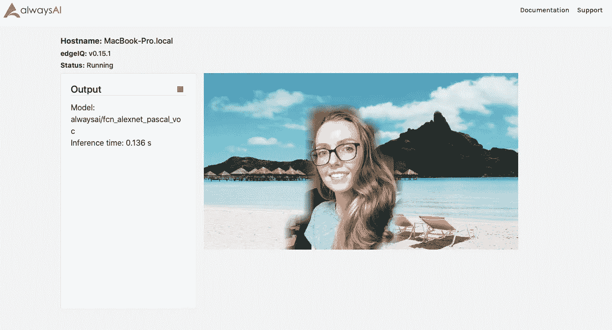

# 平滑语义分割边缘

> 原文：<https://towardsdatascience.com/smoothing-semantic-segmentation-edges-8b9240052904?source=collection_archive---------30----------------------->


玛利亚·沙妮娜在 [Unsplash](https://unsplash.com/s/photos/blur?utm_source=unsplash&utm_medium=referral&utm_content=creditCopyText) 上拍摄的照片

*埃里克·范布勒贡献了叠加图像和掩模扩张的代码。*

在之前的[帖子](https://medium.com/@lilamullany/create-your-own-virtual-green-screen-ced00b66373f)中，我展示了如何从视频流中分离出一个人并改变背景，创建一个虚拟的绿色屏幕。在那篇文章中，表现最好的模型是一个粗粒度的语义分割模型，它产生了大的块状分割边缘。更细粒度的分割模型不能准确地跟踪视频流中的人，并且在更粗粒度的模型上使用高斯平滑会模糊整个图像。**在本教程中，我们将介绍如何平滑由粗粒度语义分割模型生成的边缘，而不会模糊所需的目标对象。**

本教程的所有代码都可以在 GitHub 上获得。要运行最终代码，首先注册一个 [alwaysAI 账号](https://alwaysai.co/auth?register=true?&utm_campaign=Open%20Beta&utm_source=medium&utm_content=semantic_smoothing)(免费！)并在您的机器上设置它[(也是免费的)。但是，您可以在任何 Python 计算机视觉应用程序中使用平滑代码！](https://alwaysai.co/docs/getting_started/development_computer_setup.html?register=true?&utm_campaign=Open%20Beta&utm_source=medium&utm_content=semantic_smoothing)

本教程基于 [OpenCV](https://opencv-python-tutroals.readthedocs.io/en/latest/py_tutorials/py_setup/py_intro/py_intro.html#intro) 和[虚拟绿屏博客文章](https://medium.com/@lilamullany/create-your-own-virtual-green-screen-ced00b66373f)。如果你想跟着做，先克隆这个回购。

让我们开始吧！

1.  首先，我们将建立一个检测帧中人物的遮罩。为了构建颜色遮罩，我们首先将语义分割对象中的所有颜色都改为黑色。然后，我们将只把对应于我们想要识别的标签的索引改变为白色。复制以下代码，并将其粘贴到将模型时间附加到文本变量的行下面:

```
# build the color mask, making all colors the same except for background
semantic_segmentation.colors = [ (0,0,0) for i in semantic_segmentation.colors]# iterate over all the desired items to identify, labeling those white
for label in labels_to_mask:
    index = semantic_segmentation.labels.index(label)
semantic_segmentation.colors[index] = (255,255,255)# build the color mask
mask = semantic_segmentation.build_image_mask(results.class_map)
```

2.接下来，我们通过扩大掩模来扩大对应于检测到的人的区域。我们这样做是因为被检测的人的边界边缘通常倾向于在人的内部。通过放大这个区域，我们不会在后续步骤中切断任何被检测的人。我们使用 OpenCV 库来扩展遮罩，使用十字形扩展类型。复制以下代码，并将其粘贴到上一步所做更改的下方:

```
# Enlarge the mask
dilatation_size = 15# Options: cv.MORPH_RECT, cv.MORPH_CROSS, cv.MORPH_ELLIPSE
dilatation_type = cv.MORPH_CROSSelement = cv.getStructuringElement(dilatation_type,(2*dilatation_size + 1, 2*dilatation_size+1),(dilatation_size, dilatation_size))mask = cv.dilate(mask, element)
```

***注*** *:您可以改变膨胀的大小来定制在被检测的人周围留下多少空间。有关 OpenCV 方法的更多详细信息，请参见文档中的*[*CVT color*](https://docs.opencv.org/2.4/modules/imgproc/doc/miscellaneous_transformations.html)*，*[*getStructuringElement*](https://opencv-python-tutroals.readthedocs.io/en/latest/py_tutorials/py_imgproc/py_morphological_ops/py_morphological_ops.html#structuring-element)*，以及*[*expand*](https://opencv-python-tutroals.readthedocs.io/en/latest/py_tutorials/py_imgproc/py_morphological_ops/py_morphological_ops.html#dilation)*。*

3.然后，我们使用 OpenCV 库中的“模糊”方法对整个蒙版进行平滑处理。复制以下代码，并将其粘贴到上一步代码的正下方:

```
# apply smoothing to the mask
mask = cv.blur(mask, (blur_level, blur_level))
```

4.生成背景的那部分代码与原始示例应用程序中的代码基本相同。我们要做的唯一区别直接出现在“else”语句的末尾。用下面两行替换“else”块后更新“background”并将数据发送到 streamer 的两行:

```
frame = overlay_image(frame, background, mask)
streamer.send_data(frame, text)
```

5.最后，我们将为背景生成一个倒易蒙版，然后将原始蒙版和倒易背景蒙版合并成一个新图像。在上一步中，我们调用了一个名为“overlay_image”的方法。我们的代码中还不存在此方法，因此复制以下代码，并将其放在 app.py 顶部的“main()”声明的上方:

```
def overlay_image(foreground_image, background_image, foreground_mask):
    background_mask = cv.cvtColor(255 — cv.cvtColor(foreground_mask, cv.COLOR_BGR2GRAY), cv.COLOR_GRAY2BGR) masked_fg = (foreground_image * (1 / 255.0)) * (foreground_mask * (1 / 255.0))
    masked_bg = (background_image * (1 / 255.0)) * (background_mask * (1 / 255.0)) return np.uint8(cv.addWeighted(masked_fg, 255.0, masked_bg, 255.0, 0.0))
```

该函数基于原始遮罩生成背景遮罩，该遮罩检测到白色的人(以及添加到 labels_to_mask 的任何其他标签)和黑色的所有其他字段。原始蒙版和新的背景蒙版然后被适当地缩放。最后，使用相等的权重组合两个掩模以形成最终图像。

**就是这样！**

要查看完成的应用程序，首先按照这里的所述配置一个新项目，选择从头开始。然后，只需[构建并启动](https://alwaysai.co/blog/building-and-deploying-apps-on-alwaysai?&utm_campaign=Open%20Beta&utm_source=medium&utm_content=semantic_smoothing)该应用，打开任何浏览器“localhost:5000”即可看到你的虚拟绿屏在运行，现在检测到的个人周围有了更平滑的定义。



你也可以看到与[以前版本](https://medium.com/@lilamullany/create-your-own-virtual-green-screen-ced00b66373f)的不同

