# 深度强化学习代理扮演的 Snake

> 原文：<https://towardsdatascience.com/snake-played-by-a-deep-reinforcement-learning-agent-53f2c4331d36?source=collection_archive---------6----------------------->

## 犯了大错

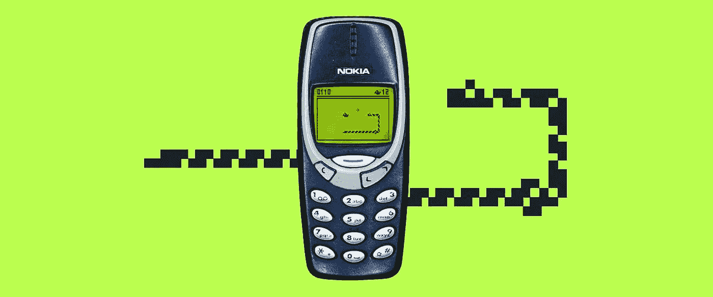

图片来自 melmagazine.com

自从我看了网飞纪录片《AlphaGo 》,我就对强化学习着迷了。强化学习与现实生活中的学习是相似的:你看到一些东西，你做一些事情，你的行为会产生积极或消极的后果。你从后果中学习，并相应地调整你的行动。强化学习有很多应用，比如自动驾驶、机器人、交易和游戏。在这篇文章中，我将展示计算机如何使用深度强化学习来学习玩游戏蛇。

# 基础知识

如果你熟悉深度强化学习，可以跳过下面两节。

## 强化学习

强化学习(RL)背后的概念很容易理解。代理通过与环境交互来学习。代理选择一个动作，并以状态(或观察)和奖励的形式接收来自环境的反馈。这个循环会一直持续下去，或者直到代理以终止状态结束。然后新一集的学习就开始了。示意性地看起来是这样的:

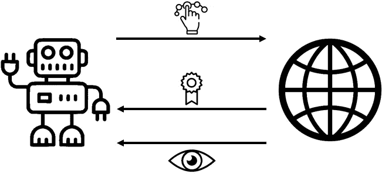

强化学习:代理通过选择动作和接收观察(或状态)和奖励来与环境交互。

代理的目标是在一集里最大化总的回报。在学习阶段的开始，代理探索了很多:它在相同的状态下尝试不同的动作。它需要这些信息来为各州找到可能的最佳行动。当学习继续时，探索就会减少。相反，代理人会利用他的行动:这意味着他会根据自己的经验选择最大化回报的行动。

## 深度强化学习

深度学习使用人工神经网络将输入映射到输出。深度学习是强大的，因为它只需要一个隐藏层就可以逼近任何函数。它是如何工作的？网络是由具有节点的层构成的。第一层是输入层。然后隐藏层用权重和激活函数来变换数据。最后一层是输出层，对目标进行预测。通过调整权重，网络可以学习模式并改进其预测。

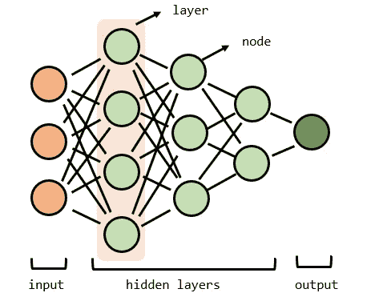

顾名思义，深度强化学习是深度学习和强化学习的结合。通过使用状态作为输入，行为的值作为输出，以及在正确方向上调整权重的奖励，代理学习预测给定状态的最佳行为。

# 行动中的深度强化学习

让我们将这些技术应用到著名的游戏《贪吃蛇》中。我打赌你知道这个游戏，目标是在不撞到墙或蛇的身体的情况下尽可能多地抓住苹果。我用 Python 和海龟库构建了这个游戏。

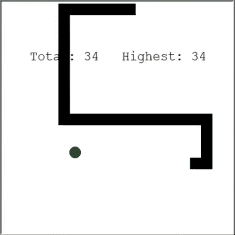

我在玩蛇。

## 定义行动、奖励和状态

为了给一个 RL 代理准备游戏，让我们形式化这个问题。定义动作很容易。代理可以选择向上、向右、向下或向左。奖励和状态空间有点难。有多种解决方案，其中一种会比另一种更好。现在，让我们试试下面的方法。如果蛇抢了一个苹果，奖励 10。如果蛇死了，奖励是-100。为了帮助代理，如果蛇靠近苹果，奖励 1，如果蛇远离苹果，奖励-1。

这个状态有很多选项:你可以选择给出蛇和苹果的坐标或者给出苹果的位置。要做的一件重要的事情是添加障碍物的位置(墙和身体),以便代理学会避免死亡。下面是行动、状态和奖励的总结。在本文的后面，您可以看到对状态的调整如何影响性能。

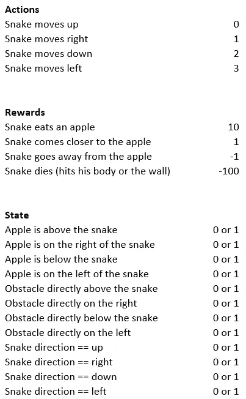

行动、奖励和状态

## 创建环境和代理

通过向 Snake 程序添加一些方法，可以创建一个强化学习环境。增加的方法有:`reset(self)`、`step(self, action)`、`get_state(self)`。除此之外，每次代理迈出一步，都需要计算奖励(查看`run_game(self)`)。

代理使用深度 Q 网络来寻找最佳动作。这些参数是:

```
# epsilon sets the level of exploration and decreases over time
param[‘epsilon’] = 1 
param[‘epsilon_min’] = .01
param[‘epsilon_decay’] = .995# gamma: value immediate (gamma=0) or future (gamma=1) rewards
param[‘gamma’] = .95# the batch size is needed for replaying previous experiences
param[‘batch_size’] = 500# neural network parameters
param[‘learning_rate’] = 0.00025
param[‘layer_sizes’] = [128, 128, 128]
```

如果你对代码感兴趣，你可以在[我的 GitHub](https://github.com/henniedeharder/snake) 上找到。

## 代理人扮演的蛇

现在是关键问题的时候了！代理学习玩游戏吗？让我们通过观察代理如何与环境交互来找出答案。

第一场比赛，经纪人毫无头绪:

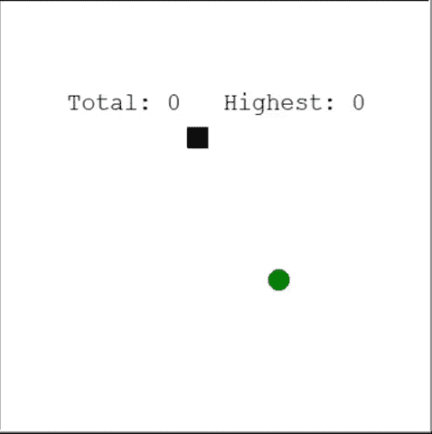

第一届奥运会。

第一个苹果！代理似乎仍然不知道自己在做什么…

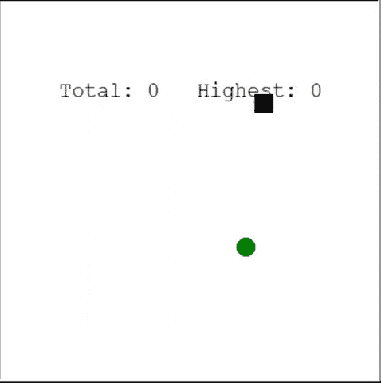

找到第一个苹果…然后撞墙。

第 13 场比赛结束，第 14 场比赛开始:

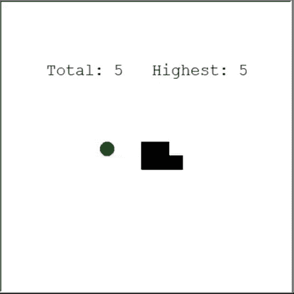

正在改进！

代理学习:它不采取最短的路径，但找到他的苹果。

第 30 场:

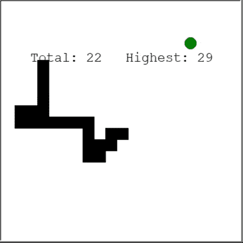

干得好！新高分！

哇，代理人避免了蛇的身体，并找到了一个快速的方法，苹果，只玩了 30 个游戏！

## 玩弄状态空间

代理学习玩蛇(有经验重放)，但也许有可能改变状态空间，实现类似或更好的性能。让我们尝试以下四种状态空间:

1.  状态空间‘没有方向’:不要给代理蛇前进的方向。
2.  状态空间“坐标”:用苹果(x，y)和蛇(x，y)的坐标替换苹果的位置(上、右、下和/或左)。坐标在 0 和 1 之间缩放。
3.  状态空间“方向 0 或 1”:原始状态空间。
4.  状态空间“只有墙”:不要告诉代理人身体是向上、向右、向下还是向左，只告诉它是否有墙。

能否猜一猜，在玩了 50 局之后，把他们从最好的状态空间排到最差的状态空间？

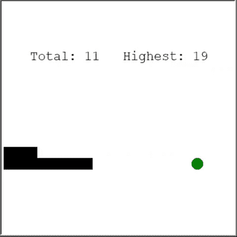

一个玩蛇的代理阻止看到答案:)

你猜对了吗？

下面是使用不同状态空间的性能图:

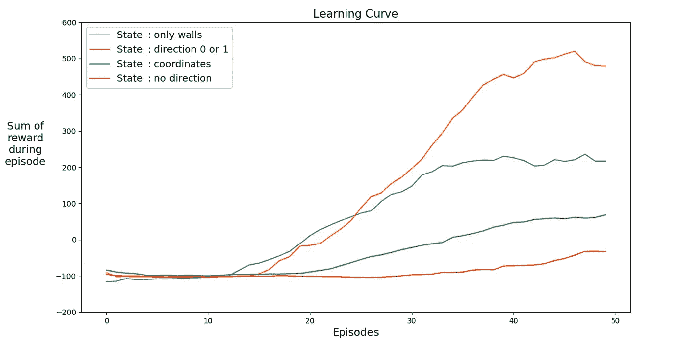

定义正确的状态加速学习！该图显示了不同状态空间下最近二十场游戏的平均收益。

很明显，使用具有方向的状态空间(原始状态空间)学习得很快，并获得最高回报。但是使用坐标的状态空间正在改进，也许当它训练更长时间时，它可以达到同样的性能。学习缓慢的一个原因可能是可能的状态的数量:20⁴*2⁴*4 = 1，024，000 个不同的状态是可能的(蛇形画布是 20*20 步，有用于障碍的 2⁴选项，以及用于当前方向的 4 个选项)。对于原始状态空间，可能状态的数量等于:3 *2⁴*4 = 576(上/下和左/右各 3 个选项)。576 比 1，024，000 小 1，700 多倍。这影响了学习过程。

## 玩弄奖励

奖励呢？有没有更好的方法给它们编程？

回想一下，我们的奖励是这样的:

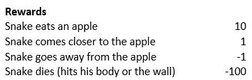

**大错#1:转圈** 如果我们把奖励-1 改成 1 呢？通过这样做，代理每存活一个时间步长将获得 1 的奖励。这可能会在开始时减慢学习速度，但最终代理不会死，这是游戏中相当重要的一部分！

嗯，有用吗？特工很快学会了如何避免死亡:

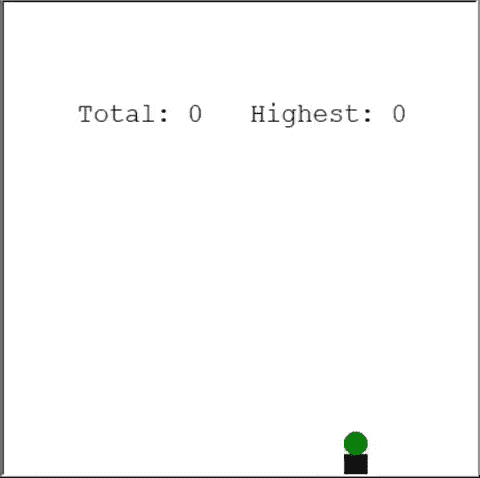

代理人每幸存一个时间步长将获得 1 的奖励。

-1，请回来！

**大失败#2:撞墙** 下一个尝试:把靠近苹果的奖励改成-1，抢一个苹果的奖励改成 100，会怎么样？你可能会想:代理每一个时间步都会收到一个-1，所以它会尽可能快地跑向苹果！这可能是事实，但还有一件事可能会发生…

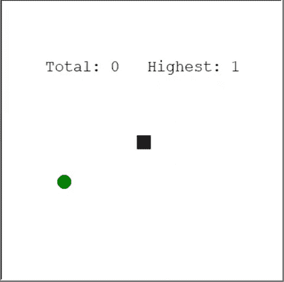

代理运行到最近的墙，以尽量减少负回报。

## 体验回放

代理快速学习(只需要 30 局)背后的一个秘密是经验回放。在经验重放中，代理存储以前的经验，并使用这些经验来更快地学习。在每个正常步骤中，执行多个重放步骤(`batch_size`参数)。这对 Snake 非常有效，因为给定相同的状态动作对，奖励和下一个状态的差异很小。

**大失败#3:没有经验重演** 经验重演真的那么重要吗？我们把它去掉吧！在这个实验中，吃一个苹果的奖励是 100 英镑。

这是代理在玩了 2500 个游戏后没有使用经验重放:

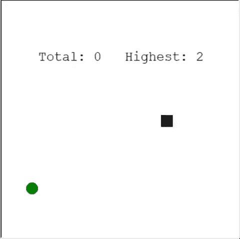

没有经验回放的训练。即使代理打了 2500(！)游戏，代理不能玩贪吃蛇。玩得快，否则要过几天才能达到 10000 场。

3000 局之后，一局抓到的苹果最高是 2 个。

经过 10000 场比赛，最高数字是 3…这 3 是学习还是运气？

看起来经验回放确实很有帮助，至少对于这些参数、奖励和这个状态空间。每个步骤需要多少个重放步骤？答案可能会让你大吃一惊。为了回答这个问题，我们可以使用`batch_size`参数(在**创建环境和代理**一节中提到)。在最初的实验中，`batch_size`的值是 500。

不同经验的退货概述重放批次大小:

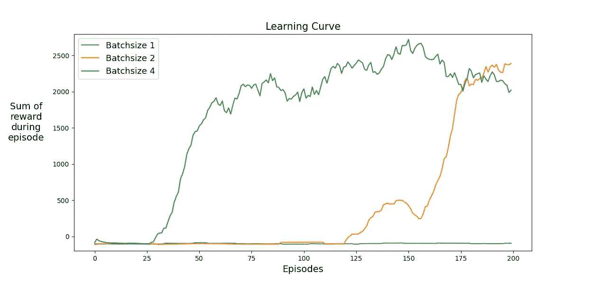

用 3 个不同的批量训练 200 个游戏:1(无经验重放)，2 和 4。前 20 集的平均回报。

即使批量大小为 2，代理也要学会玩这个游戏。在图表中，您可以看到增加批量大小的影响，如果使用批量大小 4 而不是批量大小 2，则可以提前 100 多场比赛达到相同的性能。

# 结论

本文给出的解决方案给出了结果。代理学习玩蛇，在玩了 50 个游戏后获得 40 到 60 之间的高分(吃掉的苹果数)。这比随机特工强多了。

细心的读者会说:“这个游戏的最高分是 399 分。为什么代理没有达到接近 399 的分数？60 和 399 之间有巨大的差别！
没错！这篇文章的解决方案有一个问题:代理没有学会避免封闭。代理学习避开直接围绕蛇头的障碍物，但它看不到整个游戏。所以代理会把自己围起来死掉，尤其是蛇比较长的时候。

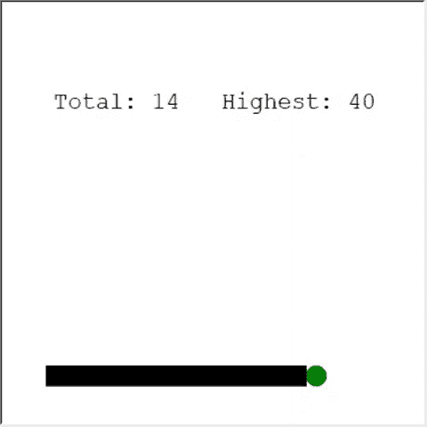

封闭的。

解决这个问题的一个有趣的方法是在状态空间中使用像素和卷积神经网络。那么代理人就有可能“看到”整个游戏，而不仅仅是附近的障碍物。它可以学习识别应该去的地方，避免圈地，获得最高分。

## **相关**

[](/how-i-learned-my-computer-to-play-spot-it-using-opencv-and-deep-learning-ad1f017a3ec3) [## 我是如何教我的电脑玩 Spot it 的！使用 OpenCV 和深度学习

### 一些有趣的计算机视觉和 CNN 的小数据集。

towardsdatascience.com](/how-i-learned-my-computer-to-play-spot-it-using-opencv-and-deep-learning-ad1f017a3ec3) [](/solving-nonograms-with-120-lines-of-code-a7c6e0f627e4) [## 用 120 行代码求解诺诺姆图

### 拼图，组合和解决方案 gif。

towardsdatascience.com](/solving-nonograms-with-120-lines-of-code-a7c6e0f627e4) 

[1] K. Hornik，M. Stinchcombe，H. White，[多层前馈网络是通用逼近器](https://www.cs.cmu.edu/~bhiksha/courses/deeplearning/Fall.2016/notes/Sonia_Hornik.pdf) (1989)，神经网络 2.5:359–366

[2] Mnih 等人，[用深度强化学习玩雅达利](https://arxiv.org/pdf/1312.5602.pdf) (2013)

*别忘了* [*订阅*](https://hennie-de-harder.medium.com/subscribe) *如果你想在我发表新文章时收到电子邮件。* ❤