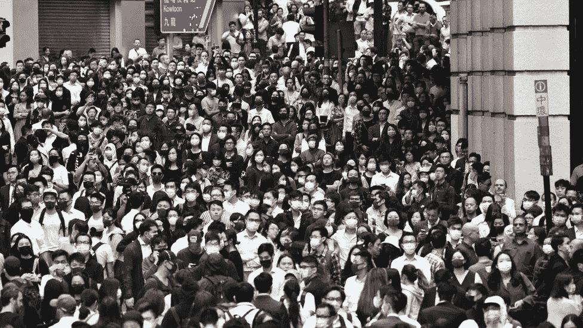
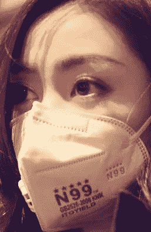
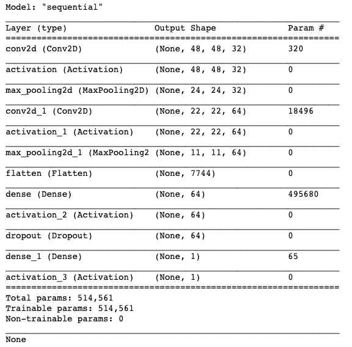
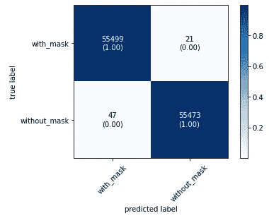
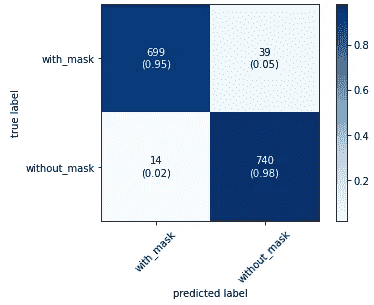

# 我看到你没有戴面具…

> 原文：<https://towardsdatascience.com/so-i-see-that-youre-not-wearing-a-mask-6631746c7559?source=collection_archive---------42----------------------->

## 我如何使用 Keras 制作我的第一个图像分类模型

照片由盖蒂图片社提供

图像分类是机器学习中的一个领域，其中使用神经网络对图像数据进行分析。给神经网络一个图像作为输入，并产生图像的分类作为输出。这种分类是用来识别图像的。图像分类在各种各样的领域中使用，其中一些领域包括面部识别和医学成像。

在我们目前经历的艰难时期，我们必须尽一切努力抗击新冠肺炎危机。正是出于这种动机，以及我想了解更多数据科学知识的愿望，我决定尽我所能提供帮助，不管帮助有多小。因此，我决定创建一个图像分类模型，它可以区分戴面具的人和不戴面具的人，希望它可以用来查看人们在人群中的安全程度。这个项目的完整代码可以在我的 Github 上找到。

# 数据收集和处理

这些数据包括 4962 张戴或没戴面具的人的照片。这些图像被分成训练和测试目录，每个目录都有一个“带掩码”和“不带掩码”子目录。train 子目录每个都包含 1，735 个图像，在 train 文件夹中总共有 3，470 个图像，而 test 子目录在“with mask”子目录中有 738 个图像，在“with mask”子目录中有 754 个图像，在 test 文件夹中总共有 1，492 个图像。

一个戴着面具的人的示例训练图像

这些图像被灰度化并重新调整大小，这样在模型分析它们之前，每个图像的大小都是一样的。在这种情况下，图像的大小被调整为 50 乘 50。每张图片都有一个标签，这取决于它们来自哪个目录。

从这里开始，训练数据被扩充，以便创建更多的数据来训练模型。增强在图像分类中是重要的，因为它通过轻微的修改从原始数据创建新的图像。这允许我们指数地增加训练数据的大小，而不必为每个新生成的图像存储新的图像文件。对于这个项目，增强包括水平翻转图像，然后上下左右移动图像。通过将这些增强也应用于已经增强的图像，训练图像的数量增加了 32 倍，给我们总共 111，040 个训练图像。

# 建模

所用模型概述

卷积神经网络(CNN)用于对数据建模。CNN 通常在处理图像数据时使用，因为它们的第一层是扫描仪层，该扫描仪层将一组输入(在这种情况下是像素)压缩成池，然后在第一卷积层中用作输入。虽然每个神经网络的结构不同，但在这种情况下，在第一个卷积层之后还有第二个卷积层，接下来是平坦层、密集层，最后是密集层。由于该模型是二元分类器，所以输出是 0 和 1 之间的单个值，这与模型在确定图像中的人是否戴着面具时的置信度有关。然后，这些预测被四舍五入为 0 或 1，以匹配“带屏蔽”和“不带屏蔽”标签的值。神经网络是使用 Tensorflow 的 Keras API 创建的。L2 正则化子用于每个隐层，学习速率为 1e-5。二进制交叉熵被设置为损失度量，Adam 被选择为优化器，而准确性被设置为期望的度量。

# 结果

在批次大小为 16 且验证拆分为 20%的模型上执行 5 个时期后，模型预测的结果如下:

## 培训用数据

训练数据的混淆矩阵

在 111，040 幅原始和增强图像上，训练数据的总精度性能为 99.94%。然而，我们真正感兴趣的是模型如何在它从未见过的图像上执行。为此，我们来看看测试数据结果。

## 测试数据

测试数据的混淆矩阵

在 1492 幅原始图像上测试数据的总准确率为 96.45%。在这里我们可以看到，该模型能够以 95%的准确率正确预测戴口罩的人的图像，同时以 98%的准确率预测不戴口罩的人的图像。这种度量是模型在生产中表现如何的更好的度量，因为来自真实世界的图像也是模型以前从未见过的。

# 未来的工作

未来的工作将包括创建第三类所谓的“不正确的面具”。这些图像将包括不正确佩戴面具的人，或者露出鼻子，面具在下巴周围，或者挂在耳朵上。这将需要收集足够的图像供模型学习。

# 特别感谢

感谢 [Balaji Srinivasan](https://github.com/balajisrinivas/Face-Mask-Detection/tree/master/dataset) 和 [Ashish Jangra](https://www.kaggle.com/ashishjangra27/face-mask-12k-images-dataset) 收集本项目使用的图像数据。也可参考[sendex](https://www.youtube.com/user/sentdex)了解如何处理图像数据。