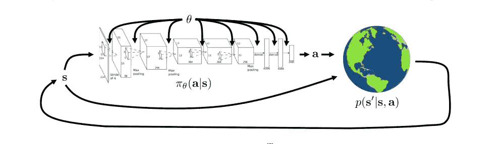
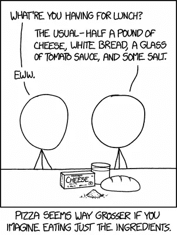
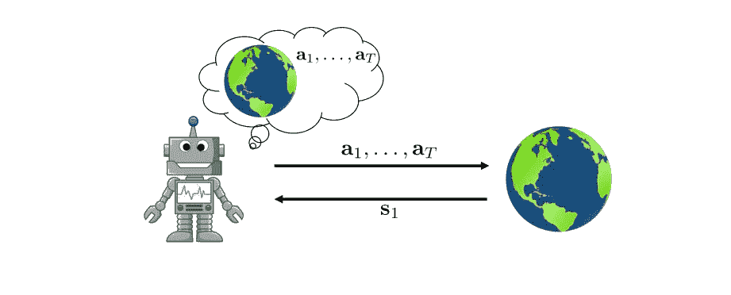
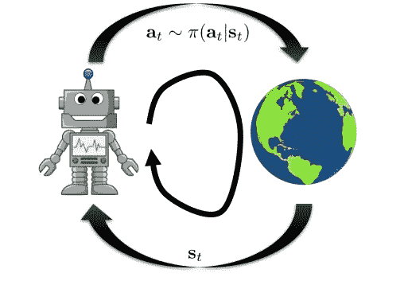
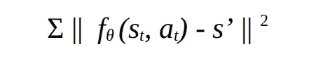
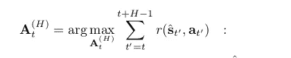

# 那么模型预测控制对基于模型的强化学习有吸引力吗？

> 原文：<https://towardsdatascience.com/so-model-predictive-control-is-this-enticing-for-model-based-rl-e69bb5255ce9?source=collection_archive---------30----------------------->

## 模型预测控制如何完成任何基于模型的强化学习图片的彩色视图

图片由 [Sasint](https://pixabay.com/users/sasint-3639875/) 在 [Pixabay](https://pixabay.com/photos/children-river-water-the-bath-1822704/) 上拍摄

**在基于模型的强化学习中，控制有什么好大惊小怪的？**

在基于模型的强化学习中，我们并不试图学习告诉我们立即采取行动的技巧。我们没有一个状态到一个愉快动作的映射。通常，我们会推迟这一步，然后再想办法选择最佳行动。

我们后来如何决定要采取的行动，也取决于我们有多大的雄心，这就是计划和控制吸引人的地方。这就是模型预测控制(MPC)如此有用的原因。让我们看看结果如何。

**RL 目标**

强化学习(RL)的目标看起来是这样的:一个处于状态 *s* ₜ的代理选择一个动作 *aₜ* ，收到一个奖励*rₜ*，并转移到下一个状态 *s* ₜ₊₁.很简单。这发生在每一个时间步——因此在一些未知的动态下, *t —* ,意味着代理不知道影响它转换到哪个状态的所有因素。强化学习的简单目标是采取行动，最大化未来回报的总和。

使用基于模型的 RL，我们尝试学习转换动力学。我们马上就会明白这意味着什么。

**但是首先，让我们为无模型 RL** 中的比较设置一点基础

在无模型 RL 中，我们不试图学习转换动力学。取而代之的是，我们学习一个复杂的函数*π(at，st)* ，称为策略，在每个时间步给出最优的行动。

*无模型 RL 的图像表示(*[*cs 285*](http://rail.eecs.berkeley.edu/deeprlcourse/)*)*

如上图所示，参数为θ的神经网络代表我们的策略。我们给它一个状态 *s* ，它输出一个动作 *a* 。
网络*将状态映射到动作*。代理在世界中执行这个动作，世界从以当前状态 s 和采取的动作 a 为条件的分布中输出下一个状态 s’。这个[条件分布](https://en.wikipedia.org/wiki/Conditional_probability_distribution)就是所谓的转换或系统动态 *p(s'| s，a)* 。它表示影响代理转换到的状态的环境因素。

**然而，在基于模型的强化学习**中，我们学习过渡动态 *p(s* ₜ₊₁ *| s* ₜ *，a* ₜ *)* ，然后弄清楚如何选择动作。由 *θ参数化的函数 *fθ* 代表这些动态*。(*这可以是一个深度神经网络，权重 *θ)* 。因此，我们学习函数 *fθ (s* ₜ *，a* ₜ *)，*，该函数将采用状态 *s* ₜ 和动作 *a* ₜ，并预测在时间*t+δt .* 的下一个状态。该函数输出我称之为*的灰姑娘状态*。请注意我们如何表示这种状态的时间的变化。现在是*t+δt*代替了 *t + 1。有这个必要吗？*

*(*在 RL 中，我们将神经网络称为函数，而不是模型，* [*以避免歧义*](https://ai.stackexchange.com/a/6733) *。在这种情况下，动态函数是一个深度神经网络。)*

**动力学功能**

让我们的函数取当前状态*s*ₜ*和动作*a*ₜ*t54】并预测下一个状态 *sₜ+₁* 会不会是个坏主意？不完全是。灰姑娘国家更可爱。好的，这里有一个警告——想象一下美国的ₜ和ₜ₊₁看起来很相似。这将意味着我们在ₜ采取的行动对ₜ的产量几乎没有影响。这对我们的动力学函数来说是个坏消息，因为它会发现很难从两个状态之间的差异来推断潜在的系统动力学。当状态之间的时间差*δt*小时，这更明显。**

为了解决这个问题，我们的动态函数是这样做的:

*ŝ*ₜ₊₁*= s*ₜ*+fθ(s*ₜ*，a* ₜ *)*

它估计当前状态 *s* ₜ.将发生的变化
*ŝt* ₊ *1* 是我们的灰姑娘状态，预期的下一个状态，现在表示为当前状态和这个估计变化的总和。很棒吧。

因此，通过预测状态*s*ₜ*随时间步长持续时间*δt，*的变化，我们使药丸更容易吞下。*

## **进入模型预测控制**

这个术语乍一看似乎很复杂，但简化后，它只是这三个简单的概念精心粘合在一起:

[XKCD 午餐](https://xkcd.com/1616/)

*   **控制**:在基于模型的 RL 中，控制就是约束代理在我们认为可接受的行为范围内行动。例如，如果你的家庭机器人正在学习制作玉米片，一个可以接受的行为可能是让它们特别脆。
*   **预测**:动态函数估计灰姑娘状态。这些灰姑娘的估计有助于改善当前的控制策略。这是关键——我们将看到为什么以及如何完成。
*   **模型**:没有系统的模型就没有控制。MPC 是基于模型的。控制策略需要*规划*通过模型 *fθ (s* ₜ *，a* ₜ *)* 。

基于模型的 RL 中的规划发生在开放循环中。开环规划到底是什么？

*基于模型的 RL 中开环规划的说明。(***)**

*看看上面那个微笑的机器人。它访问世界的第一个状态 *s* ₁ ，使用该状态来描绘世界的其余部分是什么样子，并*计划*采取哪些行动。它只在*s*₁*t33】与世界交互一次，然后生成一系列动作*【a*₁*，a2，…at】*直到有限时间步 *T* 。，它承诺这些行动。假设它对世界的想象是完美的，(即一个正确的模型)，那么我们可以期待它表现良好。**

**

**无模型 RL 中闭环规划的图解。对于每个状态，代理必须选择一个动作，然后查询下一个状态。(*[*cs 285*](http://rail.eecs.berkeley.edu/deeprlcourse/)*)**

*但这也是我们照片的问题所在。我相信你也看到了。如果我们对模型的描述是不正确的——并且我们计划在看不见的状态下采取行动，那该怎么办？*

## *这里有一个很傻的故事可以帮助我们直观地理解这一点。*

**

*一些鸡蛋即将成为美食…照片由[腾雅特](https://unsplash.com/@tengyart?utm_source=medium&utm_medium=referral)在 [Unsplash](https://unsplash.com?utm_source=medium&utm_medium=referral) 上拍摄*

*艾莎是一个喜欢厨房游戏的朋友。她邀请我们参加她的一个巧妙的娱乐活动。我们要做 *mahamri* ( *斯瓦希里*甜甜圈)。她会提前告诉我们，我们会想出一些食谱，并且很有信心能够完成。但游戏是这样的——在她的厨房里，我们要用的原料都装在同样的不锈钢容器里，上面有大大的字母标签。没有人知道容器中的成分。*

*所以我们的任务是写下一份食谱，用我们预测的容器标签来标识每种成分，并坚持按照食谱来做。例如，我们认为面粉在容器 b 中。在配方的某个步骤中，我们注意到:*

> *“要两杯 B，加一勺 S”。*

*我们希望 S 有盐。*

*我们不允许查看容器内部，不管配方是什么，我们都要坚持到底。但是想象一下，如果 B 不是面粉，而是黑胡椒。还说艾莎有点狠心，扔了一些我们不需要的成分的容器，那 S 就是婴儿粉。*

**

*一些烘烤的美味佳肴。图片由[拉封丹](https://pixabay.com/users/la-fontaine-22289/)在 [Pixabay](https://pixabay.com/photos/cream-puffs-delicious-427181/) 拍摄*

*哎呀。美味的 mahamri 到此为止。*

*这是一个在看不见的状态下计划行动的例子。我们的食谱步骤就是行动。容器中的成分以及混合它们的结果就是状态，而模型就是我们解释的每个标签所包含的东西。如果我们的模型不正确，无论计划(配方)有多好，我们都不会有 *mahamri* 。*

*我们现在可以理解开环图的完整草图了。看起来是这样的:*

1.  *收集数据(s，a，s’)。我们不担心这些数据来自哪里，因为代理了解到[不符合政策](https://stats.stackexchange.com/q/184657)。*
2.  *学习模型 *fθ (s* ₜ *，a* ₜ *)。*这是通过最小化灰姑娘状态预测和观察到的状态*s’*之间的成本。*

**

*模型成本函数。这是函数估计和观察到的状态变化之间的差异*

> *在 Aisha 的游戏中，灰姑娘状态是指每当你在你的食谱中采取一个步骤时，你期望你的配料混合物发生的变化。“s”是观察到的实际变化。*

*3.通过学习到的模型进行规划，选择一系列行动。*

> *记得注意“*我们把“*动作选择推迟到以后——所以模型是先学的。*

*大多数基于模型的 RL 算法只是为了让上面的草图更有范儿。*

*您可能会注意到，我们用来训练模型 *fθ* 的数据和模型运行的实际策略之间存在分布不匹配。这是一个奇怪的问题，因为我们刚刚看到，从哪里获得训练数据并不重要。*

*我们现在不得不面对的问题是:*

1.  *隐形状态下的规划*
2.  *状态分布不匹配。*

## *解决 MPC 的问题*

*为了减少状态[分布的差异](https://en.wikipedia.org/wiki/Kullback%E2%80%93Leibler_divergence)，我们将从执行 a’中观察到的状态 s’附加到从初始策略收集的数据中。代理然后在收集真实世界的观察和重新训练动态函数之间交替。*

*闭环计划不会在看不见的状态下进行计划。但它们需要数百万个样本来训练——在 RL 中收集训练数据可能是一件痛苦的事情。基于模型的 RL 的好处是采样效率。因此，我们希望保留这一点，减少规划问题。我们通过在有限的时间范围内优化行动来解决这个问题*ₜ*…at】。我们用 MPC 来做这件事。***

**我们在优化中解决了什么？很可能，我们的模型在第一次拍摄时不会是完美的。当事实证明是这样时，我们希望选择更好的行动。我们优化动作序列，同时使用学习模型 *fθ (st，at)* 来预测灰姑娘状态。我们可以把这个优化问题描述为:**

****

***优化功能[*[*4*](https://arxiv.org/abs/1708.02596)*]***

**我们几乎被这个等式吓到了。这意味着我们正在选择能产生最佳累积回报的行动顺序。 **A** ⁽ᴴ⁾ₜ 代表一系列动作(aₜ，aₜ₊₁ …，aₜ₊H₋₁)。**

**代理不是绑定到最初计划的动作，而是采取序列中的第一个动作*a*ₜ**a*ₜ*…at*。它根据更新的状态信息生成另一个序列[*a*ₜ*+1…at*。该序列表示大小为 *T — t* 的向量，包括从步骤 *t* 到*T*的有限时间范围内为状态规划的动作。该序列在每一步被更新并变得更小。***

**为了得到上述函数的最优序列，我们可以随机选择 *K 个*序列，选择期望报酬最高的一个。这叫乱射。有[更好的](https://arxiv.org/pdf/1909.11652.pdf) [方式](https://www.aaai.org/Papers/ICML/2003/ICML03-068.pdf)的动作选择，但这是一个简单的方法。**

> ****这在艾莎的游戏里会有用吗？****
> 
> ***是的。我们通过生成新的配方步骤来优化我们的行动。对于当前食谱中的每一条指令，我们都知道所选容器中的实际成分。然后我们用这些更新的信息改进食谱。但这很难算是一场游戏，不是吗？***

****总之**，MPC 是可取的，因为它通过在有限的时间范围内规划未来来防止模型误差的累积。更重要的是，这确保了每个计划不需要完美，因为重新规划保证了改进。**

**来源**

**[1] A. Nagabandi，G. Kahn，R. S. Fearing，S. Levine，[无模型微调的基于模型的深度强化学习的神经网络动力学](https://arxiv.org/abs/1708.02596) (2018)， *ICRA 2018 IEEE 机器人与自动化国际会议*。**

**[2] [深 RL 决策与控制 cs 285](http://rail.eecs.berkeley.edu/deeprlcourse/)(2019)*伯克利*。**

**[3] " [预测与模型预测控制的区别](https://www.researchgate.net/post/what_is_the_difference_between_predictive_model_predictive_control) " (2018)，研究门。**

**[4] MPC 滚动时域控制(2002)， [*控制工程中的工业 ee392*](https://web.stanford.edu/class/archive/ee/ee392m/ee392m.1034/) *，斯坦福。***