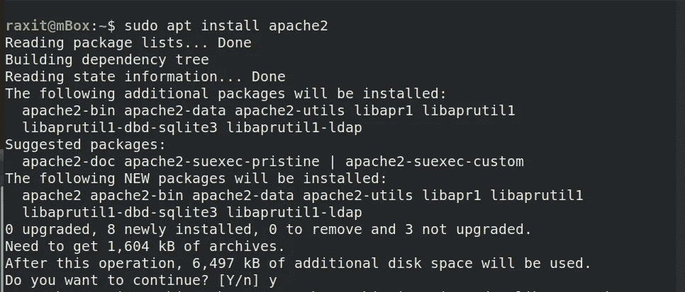
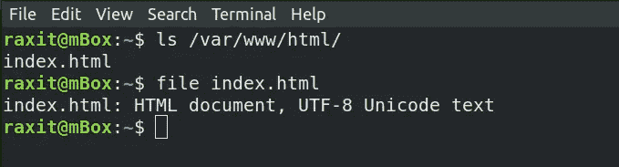
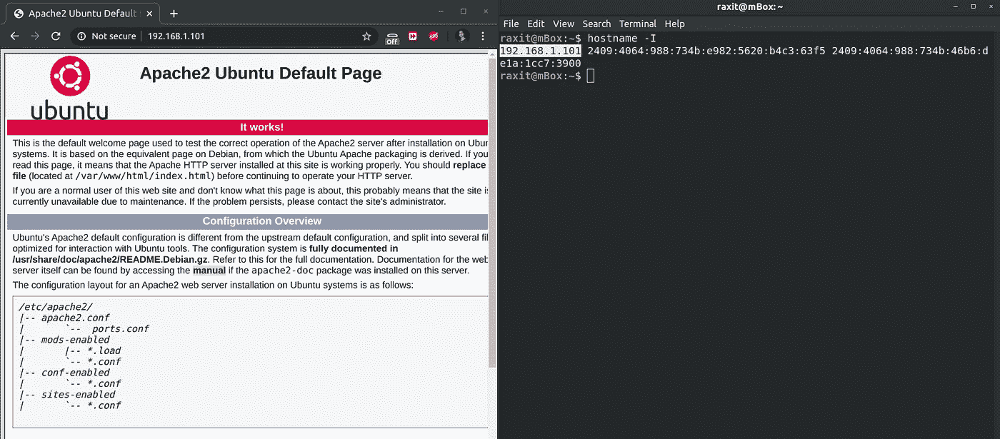
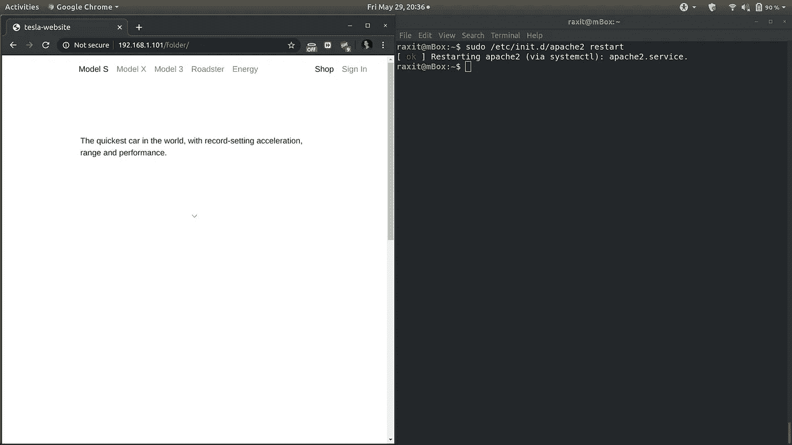

# 所以这就是阿帕奇做的！

> 原文：<https://towardsdatascience.com/so-thats-what-apache-does-20e2d648179c?source=collection_archive---------71----------------------->

## 试试 Apache2 最简单的应用，是我偶然学到的。


Apache 服务器项目徽标

2019 年 11 月，我参加了一个关于'*人工智能和机器学习*'的研讨会。与其他人不同，这是一个关于构成机器学习的算法背后的数学的高级研讨会。作为一名本科生，我并不惊讶大部分的数学知识都超出了我的理解范围。

我很感谢工作坊让我接触到了我还没学会的高级数学概念，但直到动手练习的时候，我才发现一些我可以理解的东西。

我对 Apache 的了解纯属偶然。在动手练习期间，我们的 RC 想与我们分享他的 Jupyter 笔记本。由于没有人可以访问学院的云，而且所有其他数据传输方式都不够吸引人，无法与所有人分享，他问是否有人在使用 Linux。我是。


“阿帕奇。那好像是游戏！”

是阿帕奇服务器拯救了我们。我们把文件放在我电脑上运行的 Apache 服务器上，这样每个人都可以访问它们。这是我在那次研讨会中学到的，我将在这里向您展示如何做类似的事情。

# 认识 Apache2 Web 服务器

**Apache** 是 Linux 系统上最常用的 Web 服务器。Web 服务器用于为客户端计算机请求的网页提供服务。客户端通常使用 Web 浏览器应用程序(如 Firefox、Opera、Chromium 或 Internet Explorer)来请求和查看网页。

在本文中，我们将使用 Apache 服务器托管一个包含 HTML 文件的文件夹。我将展示如何在 ubuntu 机器上实现这一点。

```
$ tree folder
folder
└── index.html
0 directories, 1 file
```

让我们开始吧。

# 步骤 1:安装 Apache2

我们首先在系统上安装 Apache2。

```
$ sudo apt-get update
$ sudo apt-get install apache2
```



按 Enter 或键入 y 继续

安装`apache2`会在`/etc/init.d/apache2`中创建一个可执行文件。我可以通过调用这个文件来管理服务器。

```
$ sudo /etc/init.d/apache.d
[sudo] password for raxit: 
Usage: apache2 {start|stop|graceful-stop|restart|reload|force-reload}
```

调用不带参数的文件也很有用，因为它会产生用法信息，告知我们各种可用的选项。

# 第二步:试驾

运行`apache2`服务器默认加载`var/www/html/`文件夹中的`index.html`页面。为此，只需启动服务器，并在任何浏览器中输入您的 IP 地址。



默认情况下，Apache2 加载这个文件。

以下是方法。

## 启动您的 Apache 服务器

安装后，Apache2 服务器应该默认运行。使用以下方法检查:

```
$ /etc/init.d/apache2 status
```

如果服务器正在运行，您将看到如下消息。

```
● apache2.service - The Apache HTTP Server
   Loaded: loaded (/lib/systemd/system/apache2.service; enabled; vendor preset: enabled)
  Drop-In: /lib/systemd/system/apache2.service.d
           └─apache2-systemd.conf
   **Active: active (running)** since Mon 2020-06-01 18:13:59 IST; 3s ago
  Process: 5144 ExecStop=/usr/sbin/apachectl stop (code=exited, status=0/SUCCESS)
  Process: 17239 ExecStart=/usr/sbin/apachectl start (code=exited, status=0/SUCCESS)
 Main PID: 17243 (apache2)
    Tasks: 55 (limit: 4915)
   CGroup: /system.slice/apache2.service
           ├─17243 /usr/sbin/apache2 -k start
           ├─17244 /usr/sbin/apache2 -k start
           └─17245 /usr/sbin/apache2 -k start
```

如果服务器关闭，就像我展示的那样，您会在`Active:`消息中看到不同。

```
Active: **inactive (dead)** since Fri 2020-05-29 20:38:07 IST
```

使用`start`命令启动`apache2`服务器。

```
$ sudo /etc/init.d/apache2 start
```

除了在`/etc/init.d/apache2`使用可执行文件，你也可以使用`systemctl`命令。

```
$ systemctl {start|stop|graceful-stop|restart|reload|force-reload} apache2
```

## 找出你的 IP 地址

```
$ hostname -I
```

这将显示您的 IP 地址。如果您正在运行网络服务，您将看到多个输出值，如下所示。在这种情况下，我更喜欢使用 IPv4 地址和 IP 的第一个值。



Apache2 Ubuntu 默认页面和在终端上查找 IP 的截图。

你会看到 Apache2 Ubuntu 的默认页面。这意味着 Apache 服务器是活动的并且正在运行。

# 步骤 3:要托管的文件

既然我们已经测试了 Apache 服务器的工作情况，那么让我们将想要托管的文件复制到合适的位置。在我们的例子中，我们想要托管一个名为`folder`的文件夹，其中包含一个名为`index.html`的文件。我已经把这个文件夹放在了我们的主目录下。

```
$ sudo cp -r ~/folder /var/www/html/
```

我们必须使用 sudo，因为`root`拥有`/var`，而除了`root`之外的用户没有对`/`目录的写权限。

# 第四步:改变所有权

为了托管位于`/var/www/html/`中的文件，我们需要改变它们的所有权。因为我们使用`sudo`复制了`folder`，所以文件属于组`root.`的用户`root`

```
$ ls -l /var/www/htmltotal 16
**drwxr-xr-x 2 root root  4096 May 29 20:29 folder**
-rw-r--r-- 1 **root root** 10918 May 29 20:22 index.html
```

我将把`/var/www/html/`文件夹的所有权和组更改为`www-data`

```
$ sudo chown -hR www-data:www-data /var/www/html
```

您可以使用查看更改

```
$ ls -l /var/www/htmltotal 16
drwxr-xr-x 2 **www-data www-data** 4096 May 29 20:29 folder
-rw-r--r-- 1 **www-data www-data** 10918 May 29 20:22 index.html
```

# 步骤 5:重启 Apache 服务器

每当我更改托管的文件或服务器的属性时，我都需要重启 apache 服务器(如果它已经在运行的话)。

```
$ sudo /etc/init.d/apache2 restart
```

或者你也可以这样做:

```
$ sudo systemctl restart apache2
```

# 第六步:让我们看看我们做了什么。

打开浏览器并转到您的托管文件，即名为`folder`的文件夹。由于`folder`包含一个`index.html`，我们将看到一个网页正在被加载。好了，几乎加载完毕，因为我们没有包括任何样式表和资源。

```
http://<your-ip-address>/folder/
```



在那里！

如果您在`folder`中放置了一个`.zip`文件，您可以很容易地下载它。我在车间就是这么做的。

# 当你完成的时候。

现在我已经完成了服务器，是时候关闭它了。我们可以很容易地使用

```
$ sudo /etc/init.d/apache2 stop
```

或者

```
$ sudo systemctl stop apache2
```

如果您经常使用 apache2，并且希望它在您启动设备时运行，那么您可以使用

```
$ sudo systemctl enable apache2
```

禁用相同的用途

```
$ sudo systemctl disable apache2
```

# 进一步阅读

要了解关于 apache2 的更多信息，您可以阅读系统上的手册页。

```
$ man apache2
```

我推荐查看一下 [*Apache HTTPD 服务器项目*](https://httpd.apache.org/) 的官方页面。关于 Ubuntu 服务器的更多帮助，请查看 Canonical 的 *Ubuntu 服务器指南。*

在我的 [*Github*](https://github.com/rakshitraj/) *个人资料上查看更多我的作品。*

*我建议你自己尝试一下代码。实现本文中提到的 Apache 服务器所花费的时间比您阅读它所花费的时间要少！*

感谢阅读！