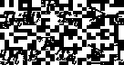

# 那么，为什么他们被称为支持向量机呢？

> 原文：<https://towardsdatascience.com/so-why-the-heck-are-they-called-support-vector-machines-52fc72c990a1?source=collection_archive---------23----------------------->

我的第一次有监督的机器学习很快就通过了:我对课程做了一些研究，并精心挑选了我想学习的主题。然后，我阅读了一些关于它们的文章，直到我理解了一般概念(或者我认为我理解了)，使用现成的 Scikit-Learn 版本的算法对它们进行了实验，然后继续前进。最近，我开始获得这些监督学习算法的正式、深入的知识(如果你愿意，可以说是“它们为什么工作”)。自然，支持向量机是基础的一部分，就在那时，我有了一个令人不安的发现:我不知道“支持向量机”是什么意思！我完全忽略了这样一个事实:这个花哨的名字可能有更深的含义。在这篇文章中，我总结了我的发现，并试图解释这个“复杂”名字背后的数学推理。

# 感知器算法的缺点

感知器算法是用于二进制分类的监督学习算法。形式上，它允许我们学习一个称为**阈值函数**的二进制分类器，它允许我们将 *n-* 维空间中的一些 *x* 映射到一个输出值 *f(x)* ***，*** ，这是一个二进制值:

用分段函数表示的二元分类器。

请注意， *f(x)* 为 1 的条件表达式包含点积 *w ⋅ x* 形式的**加权**求和以及添加到其中的**偏差**。更仔细的观察告诉我们，我们可以重写条件，使得偏差代表我们的二元分类器的阈值:

二进制分类器有条件重写以强调作为上述阈值的偏差。

请注意，感知器是一个**线性分类器**，这意味着如果训练集 *D* 不是线性可分的，那么使用学习算法将不会得到“近似”解决方案。然而，如果 *D* 是线性可分的，那么算法保证找到线性分隔符。

然而，每个可线性分离的数据集允许*无限数量的可能线性决策边界*达到 0 的错误分类率。感知器肯定能找到其中的一个，但不能保证这个决策边界有多“好”。

> 每个可线性分离的数据集允许*无限个* *可能的线性判定边界*达到 0 的错误分类率。感知器肯定能找到其中的一个，但不能保证这个决策边界有多“好”。

2D 空间中的二进制分类问题，具有无限个分隔类别的决策边界。感知器算法可以产生这些决策边界中的任何一个。

# 最大空白分隔符:支持向量机的情况

这促使我们想出另一个算法，即**最大化两个类之间的差距**。边距被定义为数据实例和决策边界之间的*最小距离。*

让决策边界由等式 *w ⋅ x + b = 0 定义。*在这种情况下， *w* 是超平面的 *n-* 维法向量。我们将 *w* 归一化，也就是说，如果它不是一个单位向量，就用它的长度来除它。

边界与正类中最接近它的训练点之间的距离，后跟边界与负类中最接近它的训练点之间的距离。

设 T 是给定的 n 个训练实例的集合。我们需要找到一个向量 *w* 来最大化裕量，它由下式给出:

用数学方法表示的最大利润。请注意，方括号内的等式表示该点和边距之间的距离(存在“y”是为了区分正负类)。我们根据每个类中最接近它的点来定义边距，这就是为什么我们最小化所有训练示例的原因。

# 将此公式化为约束优化问题

考虑向量组 *w* 使得以下约束成立:

这些向量产生一个线性分隔符，该分隔符以非零边距完美地分隔数据**。这有助于将一些等式引入到上述约束和比例 *w* 中，以得到以下解集 *S* :**

如果 *D* =1，则

反之，如果*D>1，则*

请注意，如果最近点距离分离器超过 1 / || *w* ||的距离，我们可以随时调整 *w* 以确保距离减小。因此，数量 1 / || *w* ||就是余量，我们需要最小化|| *w* ||以便最大化余量。我们有以下优化问题:

受以下限制:

现在我们有了一个数学框架来解决这个问题，有一个警告我们需要解决:我们一直在假设我们拥有的数据是线性可分的。但如果不是呢？在这种情况下， *S* 将会是空的，我们将会得到一个不可行的解。我们可以通过放宽以下限制来解决这个问题:

当然，我们保持松弛常数ϵ > 0，但是足够小，以便不会过冲并获得非最优解。我们将最小化问题改写为:

参数 *C* 代表最小化误差和最大化余量之间的折衷。通过[二次规划](https://en.wikipedia.org/wiki/Quadratic_programming)解决这个问题。

# 输入支持向量

支持向量是满足约束的训练实例:

训练实例成为支持向量所需满足的约束。

如果我们移除除了支持向量之外的所有训练实例，我们的问题的解决方案，即最优(最大间隔)超平面保持不变。这就是它们被命名为“支持向量”的原因。这些训练实例可以被认为是“支持”或“支撑”最优超平面。

> 这就是它们被命名为“支持向量”的原因。这些训练实例可以被认为是“支持”或“支撑”最优超平面。

# 支持向量机的目标

那么，支持向量机如何处理我们提供给它们的数据呢？目标如下:

> 假设每个数据点是 ***n*** *-* 维的，支持向量机试图找到最大间隔的**-*(n-1)*-**维超平面**。**

直观地，这被证明在提高分类器/回归器的性能方面非常有效，因为裕度越大，分类器/回归器的泛化误差越低。

# 参考

"大页边距分隔符":[http://cs . brown . edu/people/pfelzens/engn 2520/cs 1420 _ Lecture _ 10 . pdf](http://cs.brown.edu/people/pfelzens/engn2520/CS1420_Lecture_10.pdf)

“支持向量机”:[https://en.wikipedia.org/wiki/Support-vector_machine](https://en.wikipedia.org/wiki/Support-vector_machine)