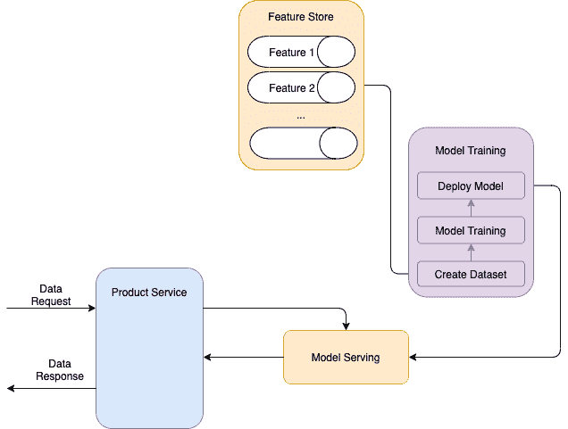

# 你已经建立了数据模型，下一步是什么？

> 原文：<https://towardsdatascience.com/so-you-have-built-the-data-model-whats-next-b88ee5ff5d2c?source=collection_archive---------56----------------------->

阿德里安·达斯卡尔在 [Unsplash](https://unsplash.com?utm_source=medium&utm_medium=referral) 上拍摄的照片

## 发布模型培训和测试任务清单，将模型投入生产

如果你读过[我之前关于分析](/is-analytics-your-next-career-move-8e03747ad2a6)的文章，你可能已经意识到我是一名产品分析师，来自非分析背景。随着我越来越深入这个角色，我接触到了更多与数据建模相关的项目，以及洞察生成分析项目。这是一个令人兴奋的过程，从特性选择到微调模型参数，直到我们得到一个好的、工作的模型。

然后挑战罢工。我不知道下一步该怎么做才能让我的模型投入生产。我花了几周时间询问和研究下一步该做什么，并总结出以下几点。

# 完成模型训练和测试后要做的步骤有哪些？

## 1.估价

我很确定你已经知道一个模型需要的评估参数。无论是基于回归模型的 MAE、MAPE、RMSE，还是基于分类器模型的 precision、recall、AUCPR。了解您的模型执行得有多好是非常标准的做法。点击阅读有关评估指标[的更多信息。](https://www.analyticsvidhya.com/blog/2019/08/11-important-model-evaluation-error-metrics/)

更深入地观察评估，您可以查看其他衡量标准，以了解模型在不同条件下的表现**以及使用模型的最佳方式**。****

********

****克里斯·利维拉尼在 [Unsplash](https://unsplash.com?utm_source=medium&utm_medium=referral) 上拍摄的照片****

1.  ******鲁棒性测试**，捕捉*模型对输入变化的敏感度*。当模型在数据集中被赋予更多的方差，但仍然能够很好地执行时，我们可以称之为健壮的模型。我们可以针对来自训练数据集的不同时期或区域的数据运行模型，并将其与早期测试进行比较。如果模型性能没有下降太多，那么它足够健壮。****
2.  ******定性措施**，即极端情况。我们还可以运行一个定性分析来理解*当模型表现很差，导致极端错误的时候是否存在模式*。这可能是由输入参数中的问题(缺失/异常值数据)或过度拟合引起的。理解这一点将有助于您确定何时实现或不实现您的模型，甚至有助于您找到一种启发式方法来提供模型的有条件使用。****
3.  ******车型对比**:哪种情况下哪个效果更好。如果您有几个模型选项或组合，运行上面的评估可以帮助您在*中决定部署哪一个*。****

## ****2.操作化****

****现在，让数据模型活起来是更具“挑战性”的部分。你需要开始考虑技术栈:这个模型将在哪里生产，需要哪些不同的数据管道组件。****

****您可以从创建**架构设计开始。**这解释了**您的模型中的组件将如何协同工作**，从数据输入、模型触发、模型服务到模型输出和消费。这里有一个例子来说明事情可能是如何解决的。****

********

****部署管道****

****首先，当模型需要运行时，您有一个接收请求的后端服务器/服务。然后，它将作业推入队列，并在处理作业时响应用户等待。最终，工人将选择作业，将其从队列中移除，并对其进行处理。它从注册的特征库(或内部数据库)中获取所有需要的数据，并在模型中进行转换。当转换完成并生成模型输出时，工作人员将把它显示给服务器，服务器再把它转发给用户。****

****在建立架构之后，您可以开始部署工作，并测试端到端管道。****

> ****它是否产生了预期的输出？延迟时间可以接受吗？****

****确保您与数据工程师一起探索可能的数据架构，并与您组织中的产品工程师讨论产品模型集成的方法。****

****具体到部署框架，可以去[这个帖子](/there-are-two-very-different-ways-to-deploy-ml-models-heres-both-ce2e97c7b9b1)和[这个帖子](https://christophergs.com/machine%20learning/2019/03/17/how-to-deploy-machine-learning-models/)我觉得有用。****

## ****3.监控和警报****

****当您的模型投入生产时，通常意味着您的组织将有一些服务依赖于它。根据您的模型或产品的重要程度，您可能需要为组织中不同的人员或团队设置不同的警报。****

****为模型设置监控和/或警报时要考虑的一些因素:****

*   ******定义指标** —需要预警的异常情况有哪些？考虑与模型相关的因素(即空数据点的百分比、值的范围等)和与作业相关的因素(即故障率、内存使用、CPU 使用、X 秒/分钟后的处理延迟等)****
*   ******将正确的信息发送给正确的人**——谁应该收到警报？您可以根据需要为不同的人/团队设置不同的提醒。与模型相关的警报可以发送给分析师/数据仓库团队，与作业相关的警报可以发送给数据工程/产品工程。但是要确保你有一个**委员会/团队作为管道和工作的主要所有者**，能够在事情没有按预期发展的情况下迅速做出反应，进行合作调查。****
*   ******选择平台** —在哪里进行监控？为此，您可以创建一个**通用仪表板**(即在 Grafana/Prometheus 中，取决于您的组织使用情况)来提供上面定义的指标的概述。然后，您可以选择**并设置警报**。此外，根据您的组织，您需要选择一个平台，让人们能够快速了解和调查，无论是即时消息形式(Slack)还是电子邮件。****

## ****4.证明文件****

****文档是模型**可维护性**和**再现性**的重要组成部分。有了好的文档，您可以帮助人们更快地进入项目，无论是问题调查，还是项目的进一步工作。当这些工作由不参与开发或部署过程的人来完成时，这尤其有用。****

********

****照片由[印尼 UX](https://unsplash.com/@uxindo?utm_source=medium&utm_medium=referral)在 [Unsplash](https://unsplash.com?utm_source=medium&utm_medium=referral) 上拍摄****

****以下是模型文件中显示的组件(参见 [Kaggle 模型文件指南](https://www.kaggle.com/WinningModelDocumentationGuidelines))****

*   ****概要/目标****
*   ****特征选择/工程****
*   ****方法(使用的算法)****
*   ****评估结果****
*   ****流水线架构****
*   ****功能存储/数据存储****
*   ****处理服务器/工作者的服务****
*   ****监控机制****
*   ****链接到项目资源库(*不要忘记那里的 readme.md 文件！*)****

# ****最后的想法****

****当您完成微调和保存模型时，您作为分析师的工作并不一定停止。仍然有许多 ***的事情要考虑，并在*** 上工作，以使这个模型在你的产品上运行。如果您可以直接将模型移交给数据工程团队并让他们完成剩下的工作，这是很好的，但是了解如何完成这项工作在您与他们的合作中也会很有用。****

****祝您将模型投入生产好运！****

> ****感谢 Gojek 数据工程团队、数据科学家和数据科学平台团队帮助我理解我之前项目中的这些概念:)****